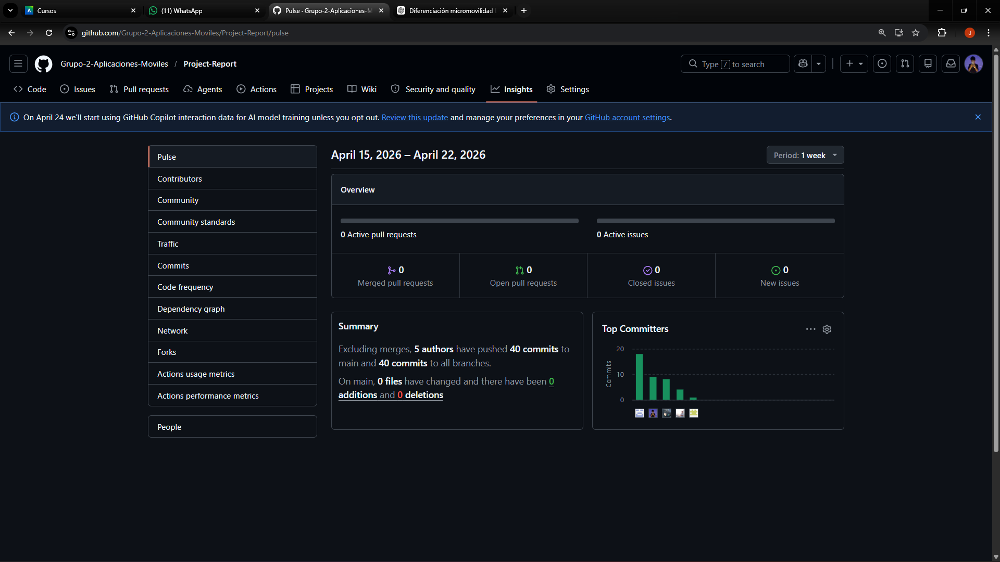
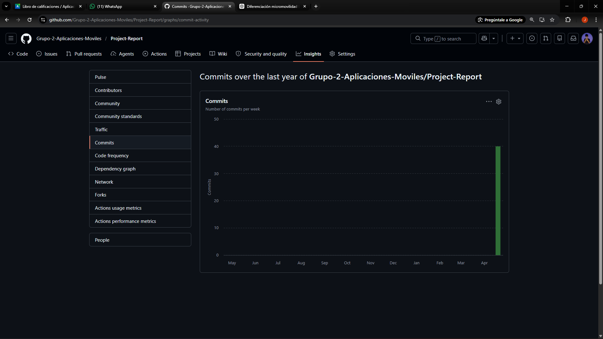
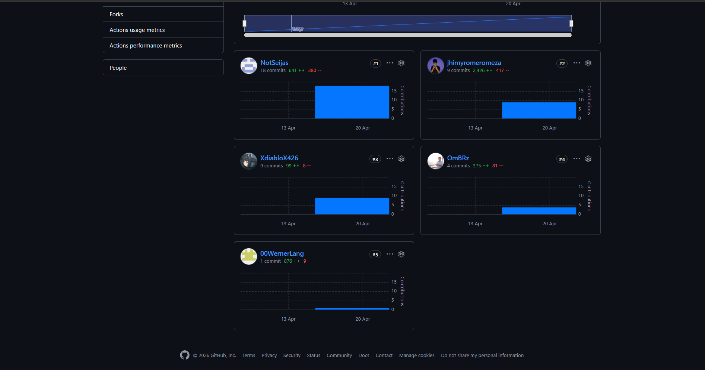

  

  

## **
<strong>Universidad Peruana de Ciencias Aplicadas</strong>
**

<strong>Ingeniería de Software</strong> 
Periodo: 202601  
1ACC0238 - Aplicaciones para dispositivos moviles  
NRC: 3248
 
<strong>Docente: David Gerardo Quevedo Velasco</strong> 

## <h2 align="center">Informe del Trabajo Final</h2>

<h3 align="center">Startup: WeTech</h3>

<strong>Producto: WeRide</strong>

<h3 align="center">Team Members:</h3>

Gonzales Castillo Angel Martin- U202319724     
Berrocal Ramirez Omar - U20201B529    
Lang Nassi Werner Khalil - U202310003  
Jhimy Pool Romero Meza - U202321510  
Seijas Vásquez Diego Antonio - U202210167 

<strong>Abril 2026</strong>

<!-- salto de hoja-->

# Registro de Versiones del Informe

El objetivo de esta sección es resumir las modificaciones relevantes que se realizan al informe durante el ciclo de vida del proyecto.  

<table style="border-collapse: collapse; width: 85%; text-align: left; font-family: Arial, sans-serif;">
  <caption style="caption-side: top; text-align: left; font-weight: bold; margin-bottom: 8px;">Tabla: Registro de versiones</caption>
  <thead>
    <tr>
      <th style="background-color: #222; color: #fff; padding: 10px; border: 1px solid #444; width: 12%;">Versión</th>
      <th style="background-color: #222; color: #fff; padding: 10px; border: 1px solid #444; width: 18%;">Fecha</th>
      <th style="background-color: #222; color: #fff; padding: 10px; border: 1px solid #444; width: 20%;">Autor</th>
      <th style="background-color: #222; color: #fff; padding: 10px; border: 1px solid #444;">Descripción de modificación</th>
    </tr>
  </thead>
  <tbody>
    <tr>
      <td style="padding: 10px; border: 1px solid #ccc; font-weight: bold;">V1.0</td>
      <td style="padding: 10px; border: 1px solid #ccc;">22 de Abril 2025</td>
      <td style="padding: 10px; border: 1px solid #ccc;">G2 WeTech</td>
      <td style="padding: 10px; border: 1px solid #ccc;">Versión inicial del informe: se completaron los 2 primeros capítulos.</td>
    </tr>
  </tbody>
</table>

# Project Report Collaboration Insights

Para la elaboración del informe del proyecto utilizamos GitHub como herramienta principal para la organización, control de versiones y colaboración del equipo.  
A través del repositorio del informe registramos cambios, realizamos revisiones continuas y mantenemos el historial de actualizaciones alineado con cada entrega del curso.

### Repositorios relevantes
- https://github.com/Grupo-2-Aplicaciones-Moviles/Project-Report

---

## Entrega TB1: V1.0

En esta primera entrega se redactó el informe del proyecto hasta el punto 2.6.3.6.2 (Bounded Context Domain Layer Class Diagrams). Durante este proceso se realizaron diversas actividades, siendo las más relevantes: la definición de los antecedentes y problematicas identificados, la implementación del Lean UX Canvas, analisis de competidores, creación de artefactos (User Personas, Task Matrix, etc), redacción de User Stories, Event Storming, diseño de los diagramas C4 Model (Contexto y Contenedores) y diagramas de los Bounded Context.

Para evidenciar nuestros avances y la colaboración en el proyecto, se utilizó GitHub como plataforma principal de gestión de versiones y control de cambios. A continuación, se presentan algunos insights relevantes sobre la colaboración en el desarrollo del informe:

### Evidencias

---

## Contenido

### Tabla de contenidos

- [Student Outcome](#student-outcome-ver-anexo-a)
- [Objetivos SMART](#objetivos-smart)
- [Capítulo I: Presentación](#capítulo-i-presentación)

    - [1.1. Startup Profile](#11-startup-profile)
        - [1.1.1. Descripción de la Startup](#111-descripción-de-la-startup)
        - [1.1.2. Perfiles de integrantes del equipo](#112-perfiles-de-integrantes-del-equipo)
    - [1.2. Solution Profile](#12-solution-profile)
        - [1.2.1. Antecedentes y problemática](#121-antecedentes-y-problemática)
        - [1.2.2. Lean UX Process](#122-lean-ux-process)
            - [1.2.2.1. Lean UX Problem Statements](#1221-lean-ux-problem-statements)
            - [1.2.2.2. Lean UX Assumptions](#1222-lean-ux-assumptions)
            - [1.2.2.3. Lean UX Hypothesis Statements](#1223-lean-ux-hypothesis-statements)
            - [1.2.2.4. Lean UX Canvas](#1224-lean-ux-canvas)
    - [1.3. Segmentos objetivo](#13-segmentos-objetivo)

- [Capítulo II: Requirements Development and Software Solution Design](#capítulo-ii-requirements-development-and-software-solution-design)
    - [2.1. Competidores](#21-competidores)
        - [2.1.1. Análisis competitivo](#211-análisis-competitivo)
        - [2.1.2. Estrategias y tácticas frente a competidores](#212-estrategias-y-tácticas-frente-a-competidores)
    - [2.2. Entrevistas](#22-entrevistas)
        - [2.2.1. Diseño de entrevistas](#221-diseño-de-entrevistas)
        - [2.2.2. Registro de entrevistas](#222-registro-de-entrevistas)
        - [2.2.3. Análisis de entrevistas](#223-análisis-de-entrevistas)
    - [2.3. Needfinding](#23-needfinding)
        - [2.3.1. User Personas](#231-user-personas)
        - [2.3.2. User Task Matrix](#232-user-task-matrix)
        - [2.3.3. User Journey Mapping](#233-user-journey-mapping)
        - [2.3.4. Empathy Mapping](#234-empathy-mapping)
        - [2.3.5. Ubiquitous Language](#235-ubiquitous-language)
    - [2.4. Requirements specification](#24-requirements-specification)
        - [2.4.1. User Stories](#241-user-stories)
        - [2.4.2. Impact Mapping](#242-impact-mapping)
        - [2.4.3. Product Backlog](#243-product-backlog)
    - [2.5. Strategic-Level Domain-Driven Design](#25-strategic-level-domain-driven-design)
        - [2.5.1. EventStorming](#251-eventstorming)
            - [2.5.1.1. Candidate Context Discovery](#2511-candidate-context-discovery)
            - [2.5.1.2. Domain Message Flows Modeling](#2512-domain-message-flows-modeling)
            - [2.5.1.3. Bounded Context Canvases](#2513-bounded-context-canvases)
        - [2.5.2. Context Mapping](#252-context-mapping)
        - [2.5.3. Software Architecture](#253-software-architecture)
            - [2.5.3.1. Software Architecture Context Level Diagrams](#2531-software-architecture-context-level-diagrams)
            - [2.5.3.2. Software Architecture Container Level Diagrams](#2532-software-architecture-container-level-diagrams)
            - [2.5.3.3. Software Architecture Deployment Diagrams](#2533-software-architecture-deployment-diagrams)
    - [2.6. Tactical-Level Domain-Driven Design](#26-tactical-level-domain-driven-design)
        - [2.6.x. Bounded Context: <Bounded Context Name>](#26x-bounded-context-bounded-context-name)
            - [2.6.x.1. Domain Layer](#26x1-domain-layer)
            - [2.6.x.2. Interface Layer](#26x2-interface-layer)
            - [2.6.x.3. Application Layer](#26x3-application-layer)
            - [2.6.x.4. Infrastructure Layer](#26x4-infrastructure-layer)
            - [2.6.x.5. Bounded Context Software Architecture Component Level Diagrams](#26x5-bounded-context-software-architecture-component-level-diagrams)
            - [2.6.x.6. Bounded Context Software Architecture Code Level Diagrams](#26x6-bounded-context-software-architecture-code-level-diagrams)
                - [2.6.x.6.1. Bounded Context Domain Layer Class Diagrams](#26x61-bounded-context-domain-layer-class-diagrams)
                - [2.6.x.6.2. Bounded Context Database Design Diagram](#26x62-bounded-context-database-design-diagram)

---  

# Student Outcome

### ABET - EAC - Student Outcome 7

Criterio: La capacidad de adquirir y aplicar nuevos conocimientos según sea
necesario, utilizando estrategias de aprendizaje apropiadas.

En el siguiente cuadro se describe las acciones realizadas y enunciados de conclusiones
por parte del grupo, que permiten sustentar el haber alcanzado el logro del ABET –
EAC - Student Outcome 7.

<table style="width:100%; border-collapse:collapse; text-align:left; font-size:14px;">
  <thead>
    <tr style="background:#f2f2f2;">
      <th style="border:1px solid #999; padding:8px; font-weight:bold; text-align:center;">Criterio Específico</th>
      <th style="border:1px solid #999; padding:8px; font-weight:bold; text-align:center;">Acciones Realizadas</th>
      <th style="border:1px solid #999; padding:8px; font-weight:bold; text-align:center;">Conclusiones</th>
    </tr>
  </thead>

  <tbody>
    <!-- CRITERIO 1 -->
    <tr>
      <td style="border:1px solid #999; padding:8px; vertical-align:top; font-weight:bold;">
        Actualiza conceptos y conocimientos necesarios para su desarrollo profesional y en especial para su proyecto en soluciones de software.
      </td>
      <td style="border:1px solid #999; padding:8px; vertical-align:top;">
        <strong>Seijas Vásquez Diego Antonio</strong>
        <ul style="margin:4px 0 10px; padding-left:20px;">
          <li><b>TB1:</b> Repasé mis conceptos de Event Storming y como hacer los moledos de message flows y bounded context canvases.</li>
        </ul>
        <strong>Romero Meza Jhimy Pool</strong>
        <ul style="margin:4px 0 10px; padding-left:20px;">
          <li><b>TB1:</b> Utilicé entrevistas y herramientas de needfinding (user personas, task matrix, journey mapping y empathy mapping) que me permitieron tener un mejor panorama de los usuarios para detectar oportunidades y afianzar la importancia de seguir aprendiendo.</li>
        </ul>
        <strong>Lang Nassi Werner Khalil</strong>
        <ul style="margin:4px 0 10px; padding-left:20px;">
          <li><b>TB1:</b> Repasé conceptos de las capas del desarrollo con Bounded context para poder documentar su implementación en nuestro proyecto.</li>
        </ul>
        <strong>Berrocal Ramirez Omar Christian</strong>
        <ul style="margin:4px 0 10px; padding-left:20px;">
          <li><b>TB1:</b> Repasé mis conceptos de la capa de infraestrutuca y diagramas c4, diagramas de clase y diagramas de base de datos, con la finalidad de realizarlos por cada bounded context identificado para el proyecto.</li>
        </ul>
        <strong>Gonzales Castillo Angel Martin</strong>
        <ul style="margin:4px 0 10px; padding-left:20px;">
          <li><b>TB1:</b> Utilicé mis conocimientos en diagramas de C4 para hacer los diagramas de nivel contexto.</li>
        </ul>
      </td>
      <td style="border:1px solid #999; padding:8px; vertical-align:top;">
        <ul style="margin:4px 0 10px; padding-left:20px;">
            
Como equipo repasamos conceptos vistos anteriormente, como Event Storming de Scrum, patrones de diseño de software, Domain Driven Design, diagramas y métodos ágiles, demostrando así la necesidad de poner en práctica constantemente lo aprendido para su uso en proyectos de software.

        </ul>
      </td>
    </tr>
    <!-- CRITERIO 2 -->
    <tr>
      <td style="border:1px solid #999; padding:8px; vertical-align:top; font-weight:bold;">
        Reconoce la necesidad del aprendizaje permanente para el desempeño profesional y el desarrollo de proyectos en soluciones de software.
      </td>
      <td style="border:1px solid #999; padding:8px; vertical-align:top;">
        <strong>Seijas Vásquez Diego Antonio</strong>
        <ul style="margin:4px 0 10px; padding-left:20px;">
          <li><b>TB1:</b> Realizar los messages flows y bounded context canvases me dió un mejor panorama y comprensión del proyecto. Gracias a ello podré absorlver cualquier duda y apoyar a mis compañeros.</li>
        </ul>
        <strong>Romero Meza Jhimy Pool</strong>
        <ul style="margin:4px 0 10px; padding-left:20px;">
          <li><b>TB1:</b> Documentar de manera detallada las necesidades de los usuario y las historias de usuario me permitió compender que es lo que se necesita para que nuestro proyecto tenga éxito.</li>
        </ul>
        <strong>Lang Nassi Werner Khalil</strong>
        <ul style="margin:4px 0 10px; padding-left:20px;">
          <li><b>TB1:</b> Comprender el funcionamiento de cada capa y como estas se comunican entre sí en el desarrollo de software me ayuda a tener una mejor comprensión del flujo de nuestro producto de software.</li>
        </ul>
        <strong>Berrocal Ramirez Omar Christian</strong>
        <ul style="margin:4px 0 10px; padding-left:20px;">
          <li><b>TB1:</b> Volver a realizar diagramas me ayudó a comprender lo importante que es la planificación en un proyecto para seguir estandares de calidad y realizar un buen producto de software.</li>
        </ul>
        <strong>Gonzales Castillo Angel Martin</strong>
        <ul style="margin:4px 0 10px; padding-left:20px;">
          <li><b>TB1:</b> Revisar que nuevos conceptos surgieron en los ultimos años es importante para poder plantear una infraestructura que siga los estándares y sea seguro.</li>
        </ul>
      </td>
      <td style="border:1px solid #999; padding:8px; vertical-align:top;">
        <ul style="margin:4px 0 10px; padding-left:20px;">
          
Como equipo reconocemos que el aprendizaje permanente es fundamental para estar siempre a la vanguardia y mantener la calidad de nuestro producto. Identificar las nuevas tendencias de tecnologías y metodologías nos ayudará a elegir las mejores alternativas de desarrollo a lo largo del proyecto.

        </ul>
      </td>
    </tr>

  </tbody>
</table>

---

# Objsetivos SMART

**Berrocal Ramirez Omar Christian:**

- **Objetivo 1:** Obtener la certificación ISTQB Foundation Level dentro de los próximos 3 meses de egresado, estudiando almenos 6 horas semanales para potenciar mi perfil profesional y aumentar mis opotunidades laborales en el campo de pruebas de software.
- **Objetivo 2:** Mejorar mis habilidades de comunicación en inglés técnico, alcanzando un nivel C1 en el examen Linguaskill dentro de los próximos 2 meses, mediante la práctica diaria de lectura y escritura de documentos técnicos y la participación en foros especializados.

**Gonzales Castillo Angel Martin:**

- **Objetivo 1:**
- **Objetivo 2:** 

**Lang Nassi Werner Khalil:**

- **Objetivo 1:** 
- **Objetivo 2:** 

**Jhimy Pool Romero Meza:**

- **Objetivo 1:** 
- **Objetivo 2:** 

**Seijas Vásquez Diego Antonio:**

- **Objetivo 1:**
- **Objetivo 2:**

---