## 2.1. Competidores
### 2.1.1. Análisis competitivo

<table>
    <tr>
      <th colspan="22">Competitive Analysis Landscape</th>
    </tr>
    <tr>
      <td colspan="1">¿Por qué llevar a cabo el análisis?</td>
      <td colspan="17">El análisis competitivo es esencial para entender el mercado, identificar oportunidades que nos diferencien y anticipar amenazas. Permite ajustar la estrategia para ganar ventaja sobre la competencia y asegurar el éxito del producto.</td>
    </tr>
    <tr>
      <td colspan="2"></td>
      <td>WeRide </td>
      <td>Lime </td>
      <td>CityBikeLima </td>
      <td>Whoosh </td>
  </tr>
    <tr>
      <td rowspan="2">Perfil</td>
      <td>Overview</td>
      <td>Plataforma diseñada para optimizar la  micromovilidad eléctrica enfocada en motos, scooters y bicis inteligentes con IoT, mejorando la experiencia de usuarios y solucionando problemas como la alta tasa de tránsito vehícular.</td>
      <td>Multinacional líder en scooters y bicicletas eléctricas compartidas, presente en múltiples ciudades globales.</td>
      <td>Programa público de bicicletas compartidas en Lima, operado con soporte municipa</td>
      <td>Plataforma internacional de scooters eléctricos compartidos con foco en Europa y Latinoamérica</td>
  </tr>
    <tr>
    <td>Ventaja competitiva ¿Qué valor ofrece a los clientes?</td>
      <td>Enfoque local: integra pagos peruanos (Yape/Plin), tarifas accesibles y flotas adaptadas al contexto nacional.</td>
      <td>Amplia cobertura internacional, marca reconocida y gran inversión en tecnología.</td>
      <td>Accesibilidad y precios bajos, integración con transporte público.</td>
      <td>Experiencia de usuario optimizada, flota moderna y rápida expansión.</td>
      </tr>
  <tr>
      <td rowspan="2">Perfil de Marketing</td>
      <td>Mercado Objetivo</td>
      <td>Jóvenes, estudiantes, profesionales urbanos, turistas en Lima y otras ciudades peruanas.</td>
      <td>Usuarios urbanos globales que buscan movilidad rápida y sostenible.</td>
      <td>Ciudadanos limeños que necesitan transporte económico y ecológico en zonas céntricas.</td>
      <td>Usuarios de centros urbanos en expansión que buscan transporte práctico.</td>
    </tr>
    <tr>
    <td>Estrategias de Marketing</td>
      <td>Campañas digitales locales, alianzas con universidades y municipalidades, enfoque en sostenibilidad.</td>
      <td>Publicidad global, branding fuerte, promociones en apps y eventos verdes.</td>
      <td>Marketing institucional con apoyo municipal, señalética en estaciones.</td>
      <td>Marketing digital, descuentos por uso recurrente, gamificación en la app.</td>
      </tr>
  <tr>
      <td rowspan="3">Perfil de Producto</td>
      <td>Productos y Servicios</td>
      <td>Scooters, motos eléctricas y bicicletas compartidas con IoT, app para reserva y pago.</td>
      <td>Scooters y bicicletas eléctricas compartidas con geolocalización.</td>
      <td>Bicicletas mecánicas y eléctricas en estaciones físicas.</td>
      <td>Scooters eléctricos con desbloqueo vía app.</td>
    </tr>
    <tr>
    <td>Precios y Costos</td>
      <td>Planes de suscripción escalonados según el número de usuarios y servicios adicionales.</td>
      <td>Tarifas más altas, variables según ciudad; paquetes promocionales.</td>
      <td>Bajos costos de alquiler por tiempo (subvencionados)</td>
      <td>Planes semanales con opciones de servicios premium.</td>
      </tr>
  <td>Canales de distribución (Web y/o Móvil)</td>
      <td>Sitio Web</td>
      <td>Sitio Web</td>
      <td>Sitio Web</td>
      <td>Sitio Web y móvil.</td>
  <tr>
      <td rowspan="4">Análisis SWOT</td>
      <td>Fortalezas</td>
      <td>Conocimiento local, integración con pagos peruanos, tarifas accesibles.</td>
      <td>Escala internacional, financiamiento robusto, marca reconocida.</td>
      <td>Respaldo municipal, precios muy bajos, simpleza.</td>
      <td>Flota moderna, app fácil de usar, expansión ágil.</td>
    </tr>
    <tr>
    <td>Debilidades</td>
      <td>Escala inicial limitada, menor financiamiento comparado a multinacionales.</td>
      <td>Altos precios en algunos mercados, críticas por sostenibilidad real.</td>
      <td>Limitada cobertura, infraestructura básica, tecnología rezagada.</td>
      <td>Menor reconocimiento global que Lime, cobertura desigual.</td>
      </tr>
    <tr>
  <td>Oportunidades</td>
      <td>Expandir a más ciudades peruanas, integrar con transporte público y turismo.</td>
      <td>Crecer en mercados emergentes, integrar más tipos de vehículos.</td>
      <td>Modernizar flota con bicicletas eléctricas, mejorar app.</td>
      <td>Expandirse en LATAM con asociaciones estratégicas.</td>
  </tr>
    <tr>
  <td>Amenazas</td>
      <td>Competencia internacional (Lime, Whoosh), trabas regulatorias locales.</td>
      <td>Regulaciones urbanas, vandalismo y saturación de mercado.
  </td>
      <td>Dependencia de apoyo municipal y presupuesto público.</td>
      <td>Competencia fuerte (Lime, WeRide), regulaciones urbanas.</td>
  </tr>
  </table>

  ---
### 2.1.2. Estrategias y tácticas frente a competidores

Para fortalecer nuestra posición en el mercado peruano de micromovilidad eléctrica, WeRide priorizará una estrategia basada en el aprovechamiento de sus principales ventajas competitivas. Nuestra propuesta se centra en la integración de pagos locales (Yape y Plin), tarifas accesibles y un ecosistema integral de micromovilidad compuesto por scooters, bicicletas y motos eléctricas con tecnología IoT. Estas capacidades nos permiten diferenciarnos de competidores globales como Lime o Whoosh, cuya oferta no está adaptada al comportamiento, necesidades y hábitos de movilidad del usuario urbano peruano. Al ofrecer una experiencia más local, flexible y alineada a la realidad nacional, WeRide se posicionará como la alternativa más conveniente, cercana y sostenible.

En relación con nuestras debilidades, como la disponibilidad inicial limitada de flota y recursos, implementaremos una estrategia gradual de despliegue. Comenzaremos con pilotos focalizados en zonas de alto flujo, como áreas universitarias y polos empresariales, lo que permitirá validar hipótesis de uso, optimizar la operación y construir confianza en el servicio. Esta fase inicial reducirá riesgos, facilitará una asignación eficiente del capital y generará tracción para escalamiento posterior.

Para mitigar amenazas como la competencia emergente en el ámbito nacional, el ingreso potencial de actores internacionales y las barreras regulatorias de los gobiernos locales, adoptaremos un enfoque proactivo mediante alianzas estratégicas con municipalidades y empresas privadas. Estas alianzas no solo facilitarán la operación y el acceso al espacio público, sino que reforzarán la percepción de WeRide como un aliado en la movilidad urbana sostenible. Asimismo, complementaremos esta línea de acción con campañas educativas enfocadas en el uso responsable de vehículos eléctricos y en los beneficios medioambientales, fortaleciendo nuestro posicionamiento y diferenciación frente a alternativas ya existentes.

## 2.2. Entrevistas
### 2.2.1. Diseño de entrevista
# Guía de Entrevistas – WeRide (Micromovilidad Eléctrica e IoT)

## Objetivo
Obtener información cualitativa que permita validar supuestos, mapear necesidades reales, priorizar funcionalidades y construir arquetipos (personas) para WeRide.

---

## Buenas prácticas para entrevistas
- Realizar entrevistas semiestructuradas (guía de preguntas flexible).
- Duración recomendada: 30 a 45 minutos (máximo 1 hora).
- Iniciar con consentimiento informado: explicar propósito, uso de datos y pedir permiso para grabar.
- Evitar preguntas cerradas al inicio; priorizar preguntas abiertas.
- Utilizar preguntas de seguimiento (*probes*):  
  - “¿Puedes contarme más?”  
  - “¿Qué pasó luego?”  
  - “¿Por qué fue importante?”
- No inducir respuestas ni sugerir soluciones.
- Tomar notas durante la entrevista y, de ser posible, grabar y transcribir.
- Seleccionar entrevistados diversos (edad, distrito, uso de tecnología).
- Validar hipótesis al final mediante preguntas cerradas.

---

## Estructura de cada entrevista
1. **Introducción (3–5 minutos):** presentación, objetivo, consentimiento.  
2. **Contexto del usuario (5–8 minutos):** rutina, desplazamientos, dispositivos.  
3. **Experiencia actual con movilidad (10–15 minutos):** rutas, problemas y soluciones actuales.  
4. **Reacción a la propuesta (10–12 minutos):** interés en WeRide, disposición a pagar y condiciones.  
5. **Cierre (3–5 minutos):** resumen, agradecimiento y preguntas finales.

---

## Campos a registrar por entrevista (plantilla mínima)
- ID de la entrevista / Fecha / Entrevistador  
- Segmento (B2C o B2B)  
- Nombre (opcional) o alias  
- Edad / Género  
- Distrito de residencia, trabajo o estudio  
- Ocupación / Institución / Rol dentro de la empresa (para B2B)  
- Teléfono o correo electrónico (opcional)  
- Uso de smartphone (sí/no) y modelo  
- Aplicaciones utilizadas (transporte, pagos)  
- Notas principales / Insights / Comentarios textuales relevantes  
- Enlace o archivo de la grabación  
- Nivel de interés (escala 1–5)  
- Comentarios finales  

---

# Segmento 1: Universitarios y Jóvenes Profesionales (B2C)

## Propósito
Entender la movilidad diaria, los puntos de fricción, el uso de aplicaciones y la disposición a utilizar WeRide, incluyendo precio, desbloqueo y métodos de pago.

---

## Guía de preguntas principales

### 1. Transporte actual
- ¿Cómo te movilizas actualmente en tu día a día?  
  *Probe:* combinación de transporte público y otros medios; proporciones.

### 2. Rutas y tiempos
- ¿Qué rutas realizas con frecuencia y cuánto tiempo pierdes en el tráfico?  
  *Probe:* ejemplos concretos (casa a universidad/oficina).

### 3. Problemas en la movilidad
- ¿Qué problemas enfrentas habitualmente? (costo, inseguridad, congestión, cobertura).  
  *Probe:* experiencias en horas punta o situaciones de riesgo.

### 4. Uso de aplicaciones
- ¿Qué aplicaciones utilizas para moverte o pagar transporte?  
  *Probe:* frecuencia de uso, aspectos que te agradan o desagradan.

### 5. Pagos digitales
- ¿Usas Yape, Plin u otros? ¿Cómo ha sido tu experiencia con estas aplicaciones?

### 6. Experiencia con micromovilidad eléctrica
- ¿Has utilizado scooters, bicicletas o motos eléctricas? Describe tu experiencia.  
  *Probe:* elementos positivos y negativos.

### 7. Motivadores y frenos
- ¿Qué te motivaría o impediría usarlas regularmente?  
  *Probe:* precio, seguridad, batería, cobertura, comodidad.

### 8. Planes de suscripción
- ¿Pagarías un plan mensual? ¿Por qué?  
  *Probe:* monto estimado, beneficios esperados.

### 9. Funcionalidades de la aplicación
- ¿Qué funcionalidades debería tener la aplicación para que la utilices?  
  *Probe:* mapa en tiempo real, estado de batería, reserva, soporte.

### 10. Factores de decisión
- ¿Qué consideras más importante: precio, conveniencia o sostenibilidad? ¿Por qué?

### 11. Descubrimiento de nuevos servicios
- ¿Cómo te enteras de nuevas aplicaciones o servicios?  
- ¿Qué te motiva a probar una nueva aplicación?

---

## Preguntas complementarias (demográficas)
- Edad, ciclo académico o año profesional  
- Distrito de residencia  
- Distancia aproximada hacia el campus o el trabajo  
- Frecuencia de desplazamientos semanales  
- Uso de tarjetas y aplicaciones bancarias  
- Participación en grupos sociales que puedan viralizar el servicio  

---

# Segmento 2: Empresas y Planes Corporativos (B2B)

## Propósito
Explorar necesidades operativas, casos de uso, disposición de pago por suscripción y requisitos de control e integración para una flota de micromovilidad eléctrica compartida.

---

## Guía de preguntas principales

### 1. Movilidad actual
- ¿Cómo gestionan actualmente la movilidad de sus colaboradores o procesos internos?  
  *Probe:* transporte corporativo, reembolsos por taxi, vehículos propios.

### 2. Problemas actuales
- ¿Qué dificultades presentan? (costos, tiempos, coordinación, mantenimiento).

### 3. Interés en micromovilidad eléctrica
- ¿Considerarían el uso de vehículos eléctricos compartidos? ¿Por qué?  
  *Probe:* traslados dentro del campus, entre sedes, entregas rápidas.

### 4. Casos de uso
- ¿Para qué situaciones específicas consideran útil la solución?

### 5. Integraciones
- ¿Requerirían integrarse con sistemas internos (RRHH, control de accesos, reservas)?  
  *Probe:* tipo de datos esperados (CSV, API), frecuencia de reportes.

### 6. Seguridad y control
- ¿Qué medidas consideran necesarias? (seguimiento, bloqueo remoto, geocercas).

### 7. Modelos de pago
- ¿Prefieren alquiler de flota, planes corporativos o pago por uso? ¿Por qué?  
  *Probe:* aceptación de un uso mínimo mensual garantizado.

### 8. Información necesaria para aprobar un piloto
- ¿Qué necesitan conocer? (costos, métricas clave, SLA, mantenimiento).

### 9. Métricas de evaluación
- ¿Cómo miden el retorno de inversión en movilidad?  
  (tiempos reducidos, costos por traslado, satisfacción del personal)

### 10. Iniciativas previas
- ¿Han implementado soluciones verdes o de movilidad anteriormente? ¿Cuáles fueron los resultados?

---

## Preguntas institucionales
- Tamaño de la organización (número de empleados)  
- Número de sedes  
- Responsable de movilidad (cargo y contacto)  
- Políticas internas de sostenibilidad  
- Horarios pico o patrones de desplazamiento  
- Restricciones internas o normativas (zonas, horarios)  

### 2.2.2. Registro de entrevistas  

**Segmento 1: Universitarios y Jóvenes Profesionales (B2C)**

  

    <strong>Entrevista N°1</strong>
  

  

    

      <strong>Vista Previa:</strong> 
       
      Entrevista con el Sr.	Patrick Correa (Entrevistado) y Morales Sosa, Arnold Gabriel (Entrevistador).
    

  

  <table style="width:100%; border-collapse:collapse; margin-bottom:14px; font-size:14px;">
    <tr>
      <td style="border:1px solid #111; padding:10px; vertical-align:top; width:50%;">
        <strong>Entrevistado/a:</strong> Luis Gutierrez (Estudiante)
      </td>
      <td style="border:1px solid #111; padding:10px; vertical-align:top; width:50%;">
        <strong>Entrevistador:</strong> Morales Sosa, Arnold Gabriel 
      </td>
    </tr>
    <tr>
      <td colspan="2" style="border:1px solid #111; padding:10px; vertical-align:top;">
        <strong>Información del entrevistado:</strong> 
        Sexo: Masculino &nbsp;/&nbsp; Edad: 18 &nbsp;/&nbsp; Residencia: San Martin de porres
      </td>
    </tr>
    <tr>
      <td colspan="2" style="border:1px solid #111; padding:10px; vertical-align:top;">
        <strong>Enlace Entrevista:</strong> 
        <a href="" target="_blank" rel="noopener">
          https://drive.google.com/drive/u/0/folders/1XgBIMeQNKaud0Rkuwpz37M8oWlCvsBls
        </a>
      </td>
    </tr>
    <tr>
      <td style="border:1px solid #111; padding:10px; vertical-align:top;">
        <strong>Inicio:</strong> 0:00
      </td>
      <td style="border:1px solid #111; padding:10px; vertical-align:top;">
        <strong>Duración:</strong> 13:25
      </td>
    </tr>
    <tr>
      <td colspan="2" style="border:1px solid #111; padding:14px; vertical-align:top; min-height:120px;">
        <strong>Resumen de Entrevista:</strong>
        

          Se moviliza diariamente desde SMP. Problemas de congestión y transporte costoso.
        

      </td>
    </tr>
  </table>

  

    <strong>Entrevista N°2</strong>
  

  

    

      <strong>Vista Previa:</strong> 
       
      Entrevista con el Sr. Nelson Gutierrez (Entrevistado) y Jefferson Castro (Entrevistador).
    

  

  <table style="width:100%; border-collapse:collapse; margin-bottom:14px; font-size:14px;">
    <tr>
      <td style="border:1px solid #111; padding:10px; vertical-align:top; width:50%;">
        <strong>Entrevistado/a:</strong> Nelson Gutierrez
      </td>
      <td style="border:1px solid #111; padding:10px; vertical-align:top; width:50%;">
        <strong>Entrevistador:</strong> Castro Pariona, Jefferson
      </td>
    </tr>
    <tr>
      <td colspan="2" style="border:1px solid #111; padding:10px; vertical-align:top;">
        <strong>Información del entrevistado:</strong> 
        Sexo: Masculino &nbsp;/&nbsp; Edad: 25 &nbsp;/&nbsp; Residencia: Lima
      </td>
    </tr>
    <tr>
      <td colspan="2" style="border:1px solid #111; padding:10px; vertical-align:top;">
        <strong>Enlace Entrevista:</strong> 
        <a href="" target="_blank" rel="noopener">
          https://drive.google.com/drive/folders/1IhoIIoGrqAko63d2aeLAtHhRbXSkmOFy
        </a>
      </td>
    </tr>
    <tr>
      <td style="border:1px solid #111; padding:10px; vertical-align:top;">
        <strong>Inicio:</strong> 0:00
      </td>
      <td style="border:1px solid #111; padding:10px; vertical-align:top;">
        <strong>Duración:</strong> 07:37
      </td>
    </tr>
    <tr>
      <td colspan="2" style="border:1px solid #111; padding:14px; vertical-align:top; min-height:120px;">
        <strong>Resumen de Entrevista:</strong>
        

          El estudiante universitario promedio depende en un 80% del transporte público para            sus traslados diarios, enfrentando como principales problemas la pérdida de hasta             tres horas por el tráfico, la inseguridad en los paraderos y la incomodidad de                viajar aglomerado. Es un usuario nativo digital que depende de aplicaciones como              Yape y Google Maps, por lo que le frustra el uso de efectivo en los buses y valora            la micromovilidad eléctrica como una solución rápida y divertida, aunque su                   adopción regular se ve frenada por la percepción de peligro vial y, sobre todo, por           el costo. Su decisión final siempre prioriza el precio sobre la sostenibilidad,               mostrando disposición a pagar una suscripción mensual accesible (aprox. 60-70                 soles) y descubriendo nuevos servicios casi exclusivamente a través de TikTok y               códigos promocionales.
        

      </td>
    </tr>
  </table>

---

  

    <strong>Entrevista N°3</strong>
  

  

    

      <strong>Vista Previa:</strong> 
      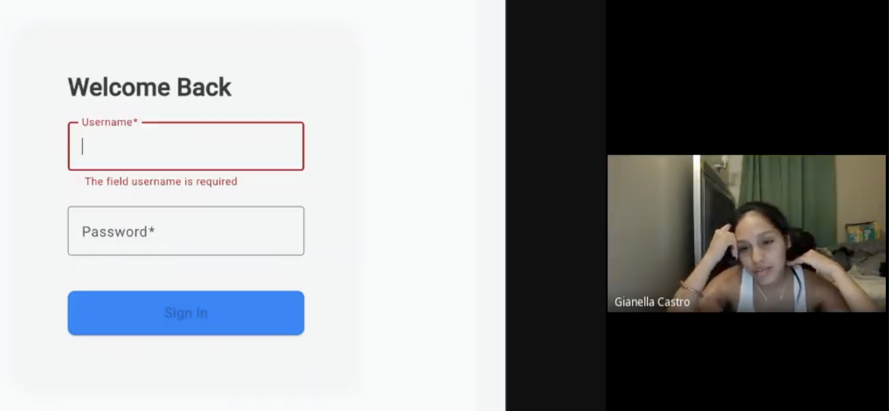 
      Entrevista con Gianella Castro (Entrevistada) y Jefferson Castro (Entrevistador).
    

  

  <table style="width:100%; border-collapse:collapse; margin-bottom:14px; font-size:14px;">
    <tr>
      <td style="border:1px solid #111; padding:10px; vertical-align:top; width:50%;">
        <strong>Entrevistado/a:</strong> Castro Tello, Gianella
      </td>
      <td style="border:1px solid #111; padding:10px; vertical-align:top; width:50%;">
        <strong>Entrevistador:</strong> Castro Pariona, Jefferson
      </td>
    </tr>
    <tr>
      <td colspan="2" style="border:1px solid #111; padding:10px; vertical-align:top;">
        <strong>Información del entrevistado:</strong> 
        Sexo: Femenino &nbsp;/&nbsp; Edad: 29 &nbsp;/&nbsp; Residencia: Miraflores
      </td>
    </tr>
    <tr>
      <td colspan="2" style="border:1px solid #111; padding:10px; vertical-align:top;">
        <strong>Enlace Entrevista:</strong> 
        <a href="" target="_blank" rel="noopener">
          https://drive.google.com/file/d/1mHCqNOhn-29ejmFIuWm-jjzBFYX-SWkX/view?usp=sharing
        </a>
      </td>
    </tr>
    <tr>
      <td style="border:1px solid #111; padding:10px; vertical-align:top;">
        <strong>Inicio:</strong> 0:00
      </td>
      <td style="border:1px solid #111; padding:10px; vertical-align:top;">
        <strong>Duración:</strong> 09:41
      </td>
    </tr>
    <tr>
      <td colspan="2" style="border:1px solid #111; padding:14px; vertical-align:top; min-height:120px;">
        <strong>Resumen de Entrevista:</strong>
        

          Gianella valida el potencial de WeRide para sus viajes cortos por el bajo costo, pero su experiencia de uso actual es frustrante. En la prueba, criticó severamente la interfaz: se sintió perdida por botones inactivos y llamadas a la acción (CTAs) que no se veían. Su desconfianza aumentó al no encontrar información clara sobre cancelaciones ni precios visibles de inmediato. Su conclusión fue tajante: para que ella adopte la app, la "conveniencia" debe ser real, lo que implica integrar pagos inmediatos con Yape/Plin y simplificar todo el proceso de registro y reserva.
        

      </td>
    </tr>
  </table>

---

**Segmento 2: Empresas y Planes Corporativos (B2B)**

  

    <strong>Entrevista N°1</strong>
  

  

    

      <strong>Vista Previa:</strong> 
      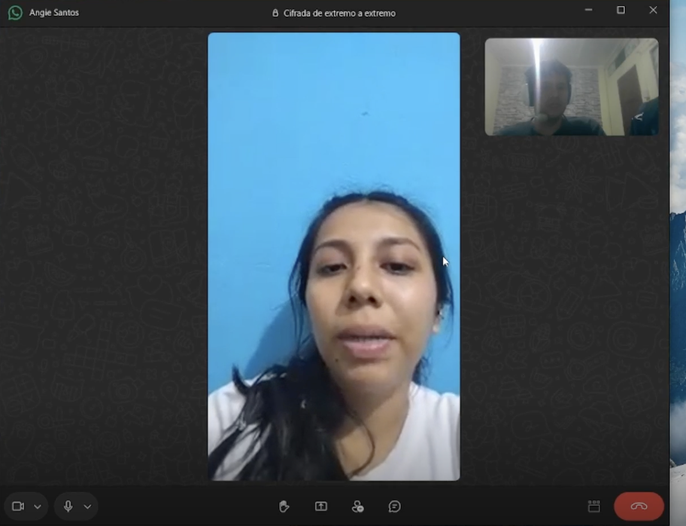 
      Entrevista con el Sr. Angie Santos (Entrevistado) y Jefferson Castro (Entrevistador).
    

  

  <table style="width:100%; border-collapse:collapse; margin-bottom:14px; font-size:14px;">
    <tr>
      <td style="border:1px solid #111; padding:10px; vertical-align:top; width:50%;">
        <strong>Entrevistado/a:</strong> Angie Santos (Jefe de TI)
      </td>
      <td style="border:1px solid #111; padding:10px; vertical-align:top; width:50%;">
        <strong>Entrevistador:</strong> Castro Pariona, Jefferson
      </td>
    </tr>
    <tr>
      <td colspan="2" style="border:1px solid #111; padding:10px; vertical-align:top;">
        <strong>Información del entrevistado:</strong> 
        Sexo: Masculino &nbsp;/&nbsp; Edad: 46 años &nbsp;/&nbsp; Residencia: Lima - San Isidro
      </td>
    </tr>
    <tr>
      <td colspan="2" style="border:1px solid #111; padding:10px; vertical-align:top;">
        <strong>Enlace Entrevista:</strong> 
        <a href="" target="_blank" rel="noopener">
          https://upcedupe-my.sharepoint.com/personal/u201822516_upc_edu_pe/_layouts/15/stream.aspx?id=%2Fpersonal%2Fu201822516%5Fupc%5Fedu%5Fpe%2FDocuments%2FEntrevistas%2FEntrevista%5FAngieSantos%5FSegmento2%2Emp4
        </a>
      </td>
    </tr>
    <tr>
      <td style="border:1px solid #111; padding:10px; vertical-align:top;">
        <strong>Inicio:</strong> 0:00
      </td>
      <td style="border:1px solid #111; padding:10px; vertical-align:top;">
        <strong>Duración:</strong> 5:22
      </td>
    </tr>
    <tr>
      <td colspan="2" style="border:1px solid #111; padding:14px; vertical-align:top; min-height:120px;">
        <strong>Resumen de Entrevista:</strong>
        

          Consultora 150+ empleados. Impuntualidad y alto gasto en subsidios. Viable: scooters y motos eléctricas.
        

      </td>
    </tr>
  </table>

  

    <strong>Entrevista N°2</strong>
  

  

    

      <strong>Vista Previa:</strong> 
       
      Entrevista con el Sr. Bedith Lozano (Entrevistado) y Jefferson Castro (Entrevistador).
    

  

  <table style="width:100%; border-collapse:collapse; margin-bottom:14px; font-size:14px;">
    <tr>
      <td style="border:1px solid #111; padding:10px; vertical-align:top; width:50%;">
        <strong>Entrevistado/a:</strong> Bedith Lozano (Gerente Op.)
      </td>
      <td style="border:1px solid #111; padding:10px; vertical-align:top; width:50%;">
        <strong>Entrevistador:</strong> Jhimy pool romero meza
      </td>
    </tr>
    <tr>
      <td colspan="2" style="border:1px solid #111; padding:10px; vertical-align:top;">
        <strong>Información del entrevistado:</strong> 
        Sexo: Femenino &nbsp;/&nbsp; Edad: 35 &nbsp;/&nbsp; Residencia: Lima
      </td>
    </tr>
    <tr>
      <td colspan="2" style="border:1px solid #111; padding:10px; vertical-align:top;">
        <strong>Enlace Entrevista:</strong> 
        <a href="" target="_blank" rel="noopener">
          https://drive.google.com/drive/folders/1l6s8kK4PLq3Z56Flyd6ds6cXaVTdkyk4?usp=sharing
        </a>
      </td>
    </tr>
    <tr>
      <td style="border:1px solid #111; padding:10px; vertical-align:top;">
        <strong>Inicio:</strong> 0:00
      </td>
      <td style="border:1px solid #111; padding:10px; vertical-align:top;">
        <strong>Duración:</strong> 6:20
      </td>
    </tr>
    <tr>
      <td colspan="2" style="border:1px solid #111; padding:14px; vertical-align:top; min-height:120px;">
        <strong>Resumen de Entrevista:</strong>
        

          Mensajería 25 motos gasolina. Costos, mantenimiento, retrasos. Abierta a eléctrica con GPS.
        

      </td>
    </tr>
  </table>

<!-- Falta-->

  

    <strong>Entrevista N°3</strong>
  

  

    

      <strong>Vista Previa:</strong> 
      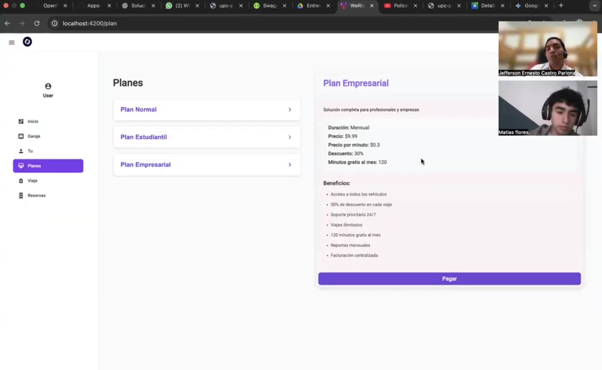 
      Entrevista con el Sr. Matias Flores Flores (Entrevistado) y Jefferson Castro (Entrevistador).
    

  

  <table style="width:100%; border-collapse:collapse; margin-bottom:14px; font-size:14px;">
    <tr>
      <td style="border:1px solid #111; padding:10px; vertical-align:top; width:50%;">
        <strong>Entrevistado/a:</strong> Flores Flores, Matias
      </td>
      <td style="border:1px solid #111; padding:10px; vertical-align:top; width:50%;">
        <strong>Entrevistador:</strong> Castro Pariona, Jefferson
      </td>
    </tr>
    <tr>
      <td colspan="2" style="border:1px solid #111; padding:10px; vertical-align:top;">
        <strong>Información del entrevistado:</strong> 
        Sexo: Masculino &nbsp;/&nbsp; Edad: 25 &nbsp;/&nbsp; Residencia: Lima
      </td>
    </tr>
    <tr>
      <td colspan="2" style="border:1px solid #111; padding:10px; vertical-align:top;">
        <strong>Enlace Entrevista:</strong> 
        <a href="" target="_blank" rel="noopener">
          https://drive.google.com/drive/folders/1UKbCq7bH5Y9_RQoZWcmjvXqT5jydmitV
        </a>
      </td>
    </tr>
    <tr>
      <td style="border:1px solid #111; padding:10px; vertical-align:top;">
        <strong>Inicio:</strong> 0:00
      </td>
      <td style="border:1px solid #111; padding:10px; vertical-align:top;">
        <strong>Duración:</strong> 09:41
      </td>
    </tr>
    <tr>
      <td colspan="2" style="border:1px solid #111; padding:14px; vertical-align:top; min-height:120px;">
        <strong>Resumen de Entrevista:</strong>
        

          Matias valora la conveniencia, bajo costo y rapidez. Percibe WeRide como una opción práctica para desplazamientos cortos si la propuesta es clara y el proceso de
          registro/pago es sencillo. Confían más si ven precios visibles, testimonios y
          métodos de pago locales (Yape/Plin). Reportaron dudas por falta de información
          (políticas de uso, cancelaciones) y encontraron áreas de la interfaz poco
          intuitivas (CTA poco visibles, botones inactivos).
        

      </td>
    </tr>
  </table>

### 2.2.3. Análisis de entrevistas

falta  

## 2.3. Needfinding
### 2.3.1. User Personas

  **1er segmento:  Universitarios y Jóvenes Profesionales (B2C)**

  

  **2do segmento:  Empresas y Planes Corporativos (B2B)**

  

  ---
### 2.3.2. User Task Matrix

    **Camila Torres (Joven universitaria)**

  | **Tareas / Tasks**                             | **Frecuencia** | **Importancia** |
  |-------------------------------------------------|---------------|----------------|
  | Buscar información para trabajos                | Alta          | Alta           |
  | Coordinar con compañeros de grupo               | Alta          | Alta           |
  | Acceder a material de estudio (libros, PDFs, videos) | Alta      | Alta           |
  | Planificar tiempo para estudiar                 | Alta          | Alta           |
  | Asistir a clases / capacitaciones               | Alta          | Alta           |
  | Comunicar avances de proyecto                   | Media         | Alta           |
  | Resolver dudas con expertos                     | Media         | Alta           |
  | Evaluar proveedores de herramientas/servicios   | Baja          | Media          |
  | Preparar reportes de resultados                 | Baja          | Media          |

  ---

  **Luis Salazar (Gerente de Operaciones)**

  | **Tareas / Tasks**                              | **Frecuencia** | **Importancia** |
  |-------------------------------------------------|---------------|----------------|
  | Buscar información para proyectos               | Media         | Media          |
  | Planificar tiempo de trabajo                    | Media         | Alta           |
  | Asistir a reuniones/capacitaciones              | Media         | Alta           |
  | Comunicar avances de proyecto                   | Alta          | Alta           |
  | Resolver dudas con expertos                     | Alta          | Alta           |
  | Evaluar proveedores de herramientas/servicios   | Alta          | Alta           |
  | Supervisar cumplimiento de estándares o KPIs    | Alta          | Alta           |
  | Preparar reportes de resultados                 | Alta          | Alta           |  

### 2.3.3. User Journey Mapping

    El User Journey Mapping se desarrolló para comprender la experiencia de los usuarios al interactuar con nuestra plataforma. Este mapeo detalla cada paso que el usuario realiza, los obstáculos que puede encontrar, y las emociones que surgen en el proceso. Así, nos ayuda a identificar oportunidades para mejorar la usabilidad y satisfacción del usuario.

  ### Segmento 1: Jovenes Universitarios. 
  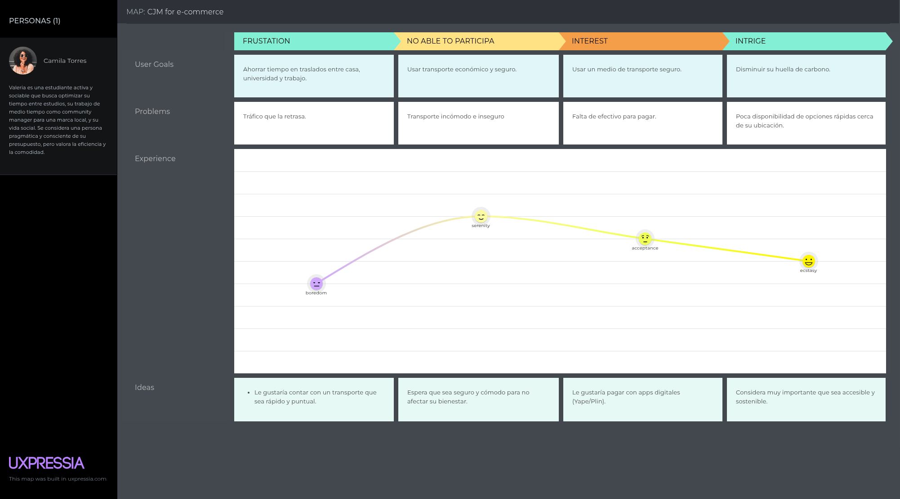

  ### Segmento 2: Empresas y Planes Corporativos (B2B)

  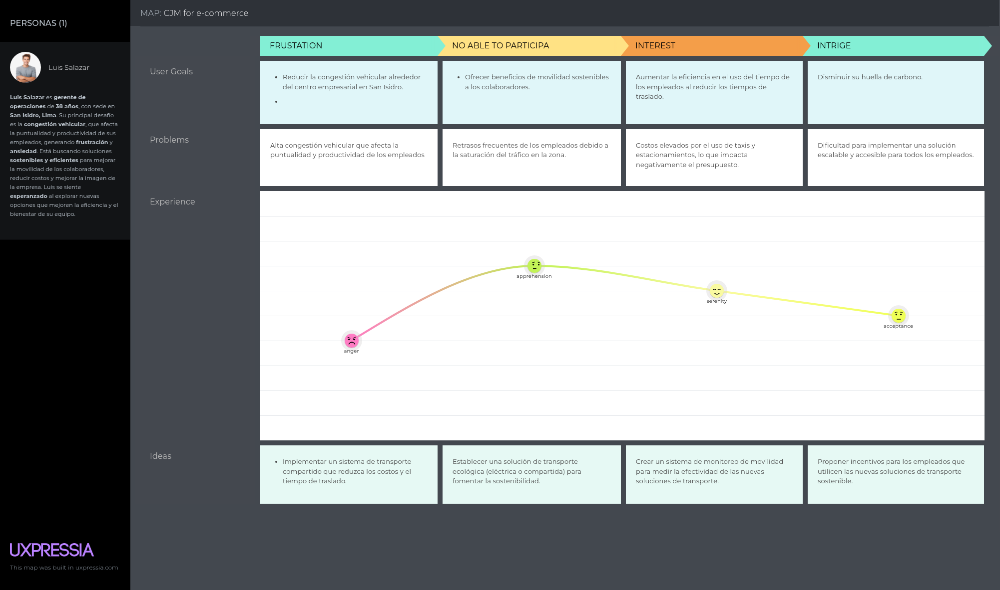 

### 2.3.4. Empathy Mapping  

- Camila Torres:  

  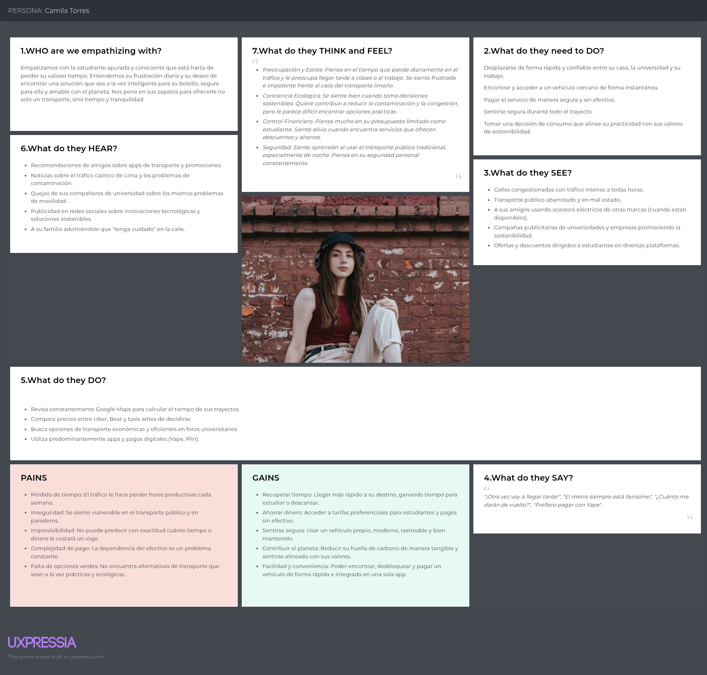  

  - Luis Salazar:  

  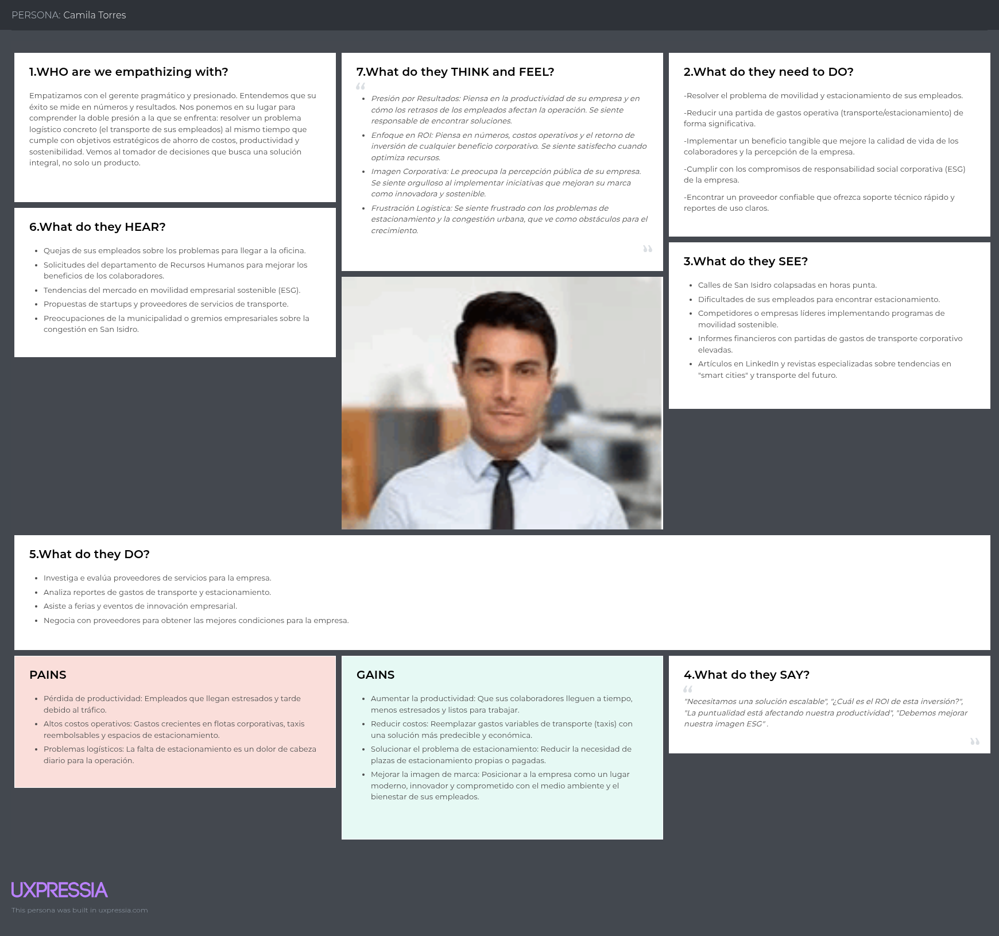  

### 2.3.5. Big Picture EventStorming  

El **Event Storming** modela de forma secuencial el ciclo completo de uso de la plataforma de micromovilidad eléctrica. Se identifican las interacciones entre usuarios, administradores, sistemas externos ***(IoT, GPS, pasarela de pagos)*** y el sistema de negocio.
  Se muestra cómo la plataforma conecta en un mismo flujo las necesidades de movilidad del usuario, los procesos de pago y seguridad, asegurando un ecosistema completo de micromovilidad urbana.

  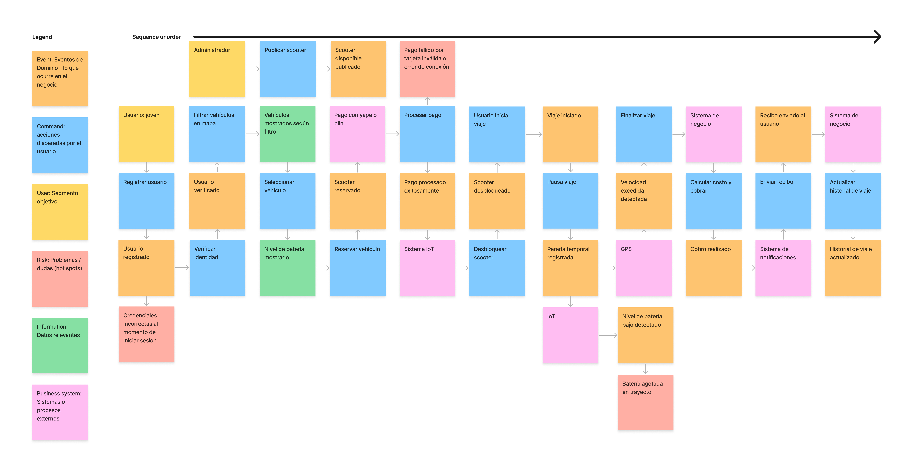

### 2.3.6. Ubiquitous Language  

| Término                 | Tipo               | Definición                                                                 |
  |--------------------------|--------------------|-----------------------------------------------------------------------------|
  | Usuario                 | Actor              | Persona registrada que utiliza la app para alquilar scooters.              |
  | Administrador           | Actor              | Responsable de gestionar flota, usuarios y soporte desde el sistema.       |
  | Scooter                 | Entidad            | Vehículo eléctrico disponible para alquiler dentro de la plataforma.       |
  | Estación Virtual        | Entidad            | Punto geográfico donde los scooters pueden ser recogidos o dejados.        |
  | Reserva                 | Evento/Entidad     | Acción de apartar un scooter disponible antes de iniciar el alquiler.      |
  | Alquiler                | Evento/Entidad     | Proceso activo en el que el usuario usa un scooter y se mide en tiempo/distancia. |
  | Pago                    | Evento             | Transacción realizada por el usuario para completar un alquiler.           |
  | Tarifa                  | Entidad            | Costo asociado al alquiler, calculado según tiempo y distancia.            |
  | Desbloqueo              | Comando/Evento     | Acción de habilitar el scooter tras confirmar la reserva y el pago inicial. |
  | Devolución              | Evento             | Acción de finalizar el uso y dejar el scooter en una estación virtual.     |
  | Mantenimiento           | Proceso            | Revisión y reparación de scooters por parte del personal técnico.          |
  | Penalización            | Evento/Entidad     | Cargo adicional aplicado por mal uso, retraso o devolución fuera de zona.  |
  | Historial de Viajes     | Vista              | Registro de reservas, alquileres y pagos asociados a cada usuario.         |
  | Soporte                 | Servicio           | Canal de ayuda en la app para resolver incidencias de los usuarios.        |
  | Flota                   | Entidad/Conjunto   | Conjunto de scooters activos disponibles en la ciudad.                     |
  | Ubicación en Tiempo Real| Información        | Datos GPS que muestran dónde se encuentra cada scooter.                     |
  | Sesión de Usuario       | Entidad            | Periodo en que el usuario está logueado y utilizando la app.               |

### 2.4. Requirements specification
### 2.4.1. User Stories

### Lista de Épicas

<table>
  <thead>
    <tr>
      <th>ID</th>
      <th>Título</th>
      <th>Descripción</th>
      <th>Criterios de aceptación</th>
      <th>EpicID</th>
    </tr>
  </thead>
  <tbody>
    <tr>
      <td>EP01</td>
      <td>Acceso a la aplicación</td>
      <td>
        <ul style="margin:0; padding-left:18px;">
          <li>Como usuario de la aplicación, quiero acceder con mi información para hacer uso de las características disponibles.</li>
        </ul>
      </td>
      <td>No corresponde</td>
      <td>No corresponde</td>
    </tr>
    <tr>
      <td>EP02</td>
      <td>Funcionalidades de la app</td>
      <td>
        <ul style="margin:0; padding-left:18px;">
          <li>Como usuario de la aplicación, quiero que las funcionalidades principales que me ofrece el servicio sean funcionales.</li>
        </ul>
      </td>
      <td>No corresponde</td>
      <td>No corresponde</td>
    </tr>
    <tr>
      <td>EP03</td>
      <td>Gestión de pagos y suscripciones</td>
      <td>
        <ul style="margin:0; padding-left:18px;">
          <li>Como usuario, quiero gestionar mis métodos de pago y suscripciones para acceder a los servicios y planes de la aplicación.</li>
        </ul>
      </td>
      <td>No corresponde</td>
      <td>No corresponde</td>
    </tr>
    <tr>
      <td>EP04</td>
      <td>Uso del mapa</td>
      <td>
        <ul style="margin:0; padding-left:18px;">
          <li>Como usuario de la aplicación, quiero acceder al mapa de la aplicación para realizar la reserva de vehículos y seguimiento de rutas.</li>
        </ul>
      </td>
      <td>No corresponde</td>
      <td>No corresponde</td>
    </tr>
    <tr>
      <td>EP05</td>
      <td>Gestión de viajes</td>
      <td>
        <ul style="margin:0; padding-left:18px;">
          <li>Como usuario, quiero visualizar y gestionar mis trayectos en el mapa, incluyendo detalles del vehículo, ruta y estado del viaje.</li>
        </ul>
      </td>
      <td>No corresponde</td>
      <td>No corresponde</td>
    </tr>
    <tr>
      <td>EP06</td>
      <td>Gestión de reservas</td>
      <td>
        <ul style="margin:0; padding-left:18px;">
          <li>Como usuario, quiero reservar vehículos y recibir notificaciones sobre el estado y fin de mi reserva para asegurar disponibilidad.</li>
        </ul>
      </td>
      <td>No corresponde</td>
      <td>No corresponde</td>
    </tr>
    <tr>
      <td>EP07</td>
      <td>Desbloqueo y acceso rápido a vehículos</td>
      <td>
        <ul style="margin:0; padding-left:18px;">
          <li>Como usuario, quiero desbloquear y acceder a los vehículos de forma ágil mediante tecnologías como QR para mejorar la experiencia de inicio de viaje.</li>
        </ul>
      </td>
      <td>No corresponde</td>
      <td>No corresponde</td>
    </tr>
  </tbody>
</table>

### Lista de Historias de Usuario

<table>
  <tbody>
    <tr>
      <th>ID (HU)</th>
      <th>Título</th>
      <th>Descripción</th>
      <th>Criterios de aceptación</th>
      <th>Epic-ID</th>
    </tr>
    <!-- US-01 -->
    <tr>
      <td>US-01</td>
      <td>Inicio de sesión y registro</td>
      <td>
        <ul style="margin:0; padding-left:18px;">
          <li>Como usuario quiero poder iniciar sesión o registrarme en la app para usarla diariamente.</li>
        </ul>
      </td>
      <td>
        <ul style="margin:0; padding-left:18px;">
          <li><b>Escenario 1:</b> Inicio de sesión exitoso <b>Given</b> que el usuario tiene una cuenta registrada <b>When</b> ingresa sus credenciales correctas <b>Then</b> el sistema permite el acceso a la app.</li>
          <li><b>Escenario 2:</b> Registro exitoso <b>Given</b> que el usuario no tiene una cuenta <b>When</b> completa el formulario de registro con sus datos válidos <b>Then</b> el sistema crea la cuenta y permite el acceso.</li>
          <li><b>Escenario 3:</b> Fallo de autenticación <b>Given</b> que el usuario ingresa credenciales incorrectas <b>When</b> intenta iniciar sesión <b>Then</b> el sistema muestra un mensaje de error.</li>
        </ul>
      </td>
      <td>EP-01</td>
    </tr>
    <!-- US-02 -->
    <tr>
      <td>US-02</td>
      <td>Introducir Número de Celular</td>
      <td>
        <ul style="margin:0; padding-left:18px;">
          <li>Como usuario, quiero introducir mi número de celular para validar mi identidad y recibir notificaciones importantes.</li>
        </ul>
      </td>
      <td>
        <ul style="margin:0; padding-left:18px;">
          <li><b>Escenario 1:</b> Introducción exitosa <b>Given</b> que el usuario accede al formulario de perfil <b>When</b> ingresa un número de celular válido y lo guarda <b>Then</b> el sistema valida el número y lo asocia al perfil del usuario.</li>
          <li><b>Escenario 2:</b> Número inválido <b>Given</b> que el usuario intenta guardar su número <b>When</b> el número ingresado no cumple con el formato requerido <b>Then</b> el sistema muestra un mensaje de error y solicita corregir el dato.</li>
          <li><b>Escenario 3:</b> Error de conexión <b>Given</b> que el usuario ingresa su número <b>When</b> hay problemas de conexión al guardar el dato <b>Then</b> el sistema informa el error y permite reintentar la acción.</li>
        </ul>
      </td>
      <td>EP-01</td>
    </tr>
    <!-- US-03 -->
    <tr>
      <td>US-03</td>
      <td>Introducir código de verificación</td>
      <td>
        <ul style="margin:0; padding-left:18px;">
          <li>Como usuario, quiero introducir un código de verificación para validar mi identidad en la aplicación.</li>
        </ul>
      </td>
      <td>
        <ul style="margin:0; padding-left:18px;">
          <li><b>Escenario 1:</b> Verificación exitosa <b>Given</b> que el usuario ha recibido un código de verificación en su celular <b>When</b> ingresa el código correctamente en el formulario de la app <b>Then</b> el sistema valida el código y confirma la verificación de identidad.</li>
          <li><b>Escenario 2:</b> Código incorrecto <b>Given</b> que el usuario intenta verificar su identidad <b>When</b> ingresa un código inválido o expirado <b>Then</b> el sistema muestra un mensaje de error y permite reintentar la verificación.</li>
          <li><b>Escenario 3:</b> Error de conexión <b>Given</b> que el usuario ingresa el código de verificación <b>When</b> ocurre un problema de conexión al validar el código <b>Then</b> el sistema informa el error y permite al usuario reintentar la acción cuando se restablezca la conexión.</li>
        </ul>
      </td>
      <td>EP-01</td>
    </tr>
    <!-- US-04 -->
    <tr>
      <td>US-04</td>
      <td>Datos de usuario</td>
      <td>
        <ul style="margin:0; padding-left:18px;">
          <li>Como usuario quiero poder crear un perfil para colocar mis datos.</li>
        </ul>
      </td>
      <td>
        <ul style="margin:0; padding-left:18px;">
          <li><b>Escenario 1:</b> Creación exitosa <b>Given</b> que el usuario accede a su cuenta <b>When</b> ingresa sus datos (nombre, correo, foto, etc.) y los guarda <b>Then</b> el sistema actualiza el perfil con éxito.</li>
          <li><b>Escenario 2:</b> Error en la creación <b>Given</b> que el usuario intenta guardar sus datos <b>When</b> alguno es inválido o falta completar un campo obligatorio <b>Then</b> el sistema muestra un mensaje indicando el error.</li>
        </ul>
      </td>
      <td>EP-01</td>
    </tr>
    <!-- US-05 -->
    <tr>
      <td>US-05</td>
      <td>Página Principal</td>
      <td>
        <ul style="margin:0; padding-left:18px;">
          <li>Como usuario quiero poder ver una pantalla principal estética que me atraiga a usar el servicio.</li>
        </ul>
      </td>
      <td>
        <ul style="margin:0; padding-left:18px;">
          <li><b>Escenario 1:</b> Visualización exitosa <b>Given</b> que el usuario ha iniciado sesión en la aplicación <b>When</b> accede a la pantalla principal <b>Then</b> el sistema muestra una interfaz atractiva, con acceso rápido a las funciones principales y elementos visuales bien organizados.</li>
          <li><b>Escenario 2:</b> Elementos no cargados <b>Given</b> que el usuario accede a la pantalla principal <b>When</b> algunos elementos visuales o funcionalidades no se cargan correctamente por problemas de conexión o error interno <b>Then</b> el sistema muestra un mensaje de error y permite reintentar la carga.</li>
          <li><b>Escenario 3:</b> Personalización <b>Given</b> que el usuario accede a la pantalla principal <b>When</b> personaliza la vista (por ejemplo, elige tema claro/oscuro o reordena accesos rápidos) <b>Then</b> el sistema guarda las preferencias y actualiza la interfaz según la selección del usuario.</li>
        </ul>
      </td>
      <td>EP-02</td>
    </tr>
    <!-- US-06 -->
    <tr>
      <td>US-06</td>
      <td>Gestión y personalización de perfil</td>
      <td>
        <ul style="margin:0; padding-left:18px;">
          <li>Como usuario quiero acceder a mi perfil para administrar mi cuenta.</li>
        </ul>
      </td>
      <td>
        <ul style="margin:0; padding-left:18px;">
          <li><b>Escenario 1:</b> Acceso exitoso al perfil <b>Given</b> que el usuario ha iniciado sesión en la aplicación <b>When</b> accede a la sección "Tu" desde el menú lateral <b>Then</b> el sistema muestra las opciones de administrar cuenta, personalizar perfil, cartera, historial, centro de seguridad, ayuda y ajustes.</li>
          <li><b>Escenario 2:</b> Personalización de perfil <b>Given</b> que el usuario accede a la opción de personalizar perfil <b>When</b> modifica su información personal (nombre, foto, etc.) <b>Then</b> el sistema guarda los cambios y actualiza la información mostrada.</li>
          <li><b>Escenario 3:</b> Acceso a funcionalidades adicionales <b>Given</b> que el usuario accede a las opciones de cartera, historial, centro de seguridad, ayuda o ajustes <b>When</b> selecciona alguna de estas opciones <b>Then</b> el sistema muestra la información o funcionalidad correspondiente (por ejemplo, ver historial de trayectos, administrar métodos de pago, acceder a soporte, modificar ajustes de la cuenta, etc.).</li>
        </ul>
      </td>
      <td>EP-02</td>
    </tr>
    <!-- US-07 -->
    <tr>
      <td>US-07</td>
      <td>Gestión y visualización de vehículos en Garaje</td>
      <td>
        <ul style="margin:0; padding-left:18px;">
          <li>Como usuario quiero acceder al Garaje para gestionar los vehículos disponibles.</li>
        </ul>
      </td>
      <td>
        <ul style="margin:0; padding-left:18px;">
          <li><b>Escenario 1:</b> Visualización exitosa de vehículos <b>Given</b> que el usuario accede a la sección Garaje desde el menú lateral <b>When</b> se muestran los vehículos disponibles con imagen, nombre, disponibilidad, marca y valoración <b>Then</b> el sistema permite ver todos los vehículos y sus detalles.</li>
          <li><b>Escenario 2:</b> Filtrado de vehículos <b>Given</b> que el usuario está en la sección Garaje <b>When</b> utiliza los filtros para mostrar solo e-scooters, motos o bicicletas <b>Then</b> el sistema actualiza la lista mostrando únicamente los vehículos del tipo seleccionado.</li>
          <li><b>Escenario 3:</b> Gestión de favoritos <b>Given</b> que el usuario visualiza los vehículos en el Garaje <b>When</b> marca un vehículo como favorito usando el ícono de corazón <b>Then</b> el sistema guarda la preferencia y permite acceder rápidamente a los vehículos favoritos.</li>
        </ul>
      </td>
      <td>EP-02</td>
    </tr>
    <!-- US-08 -->
    <tr>
      <td>US-08</td>
      <td>Filtrado de vehículos en Garaje</td>
      <td>
        <ul style="margin:0; padding-left:18px;">
          <li>Como usuario quiero filtrar los vehículos disponibles en el Garaje por tipo.</li>
        </ul>
      </td>
      <td>
        <ul style="margin:0; padding-left:18px;">
          <li><b>Escenario 1:</b> Filtrado exitoso <b>Given</b> que el usuario accede a la sección Garaje <b>When</b> utiliza el menú de filtros para seleccionar tipo de vehículo, precio, disponibilidad, calificación o marca <b>Then</b> el sistema muestra únicamente los vehículos que cumplen con los criterios seleccionados.</li>
          <li><b>Escenario 2:</b> Sin resultados <b>Given</b> que el usuario aplica filtros en el Garaje <b>When</b> no existen vehículos que cumplan con los criterios seleccionados <b>Then</b> el sistema muestra un mensaje indicando que no hay vehículos disponibles según el filtro.</li>
          <li><b>Escenario 3:</b> Error de conexión <b>Given</b> que el usuario intenta filtrar vehículos <b>When</b> ocurre un problema de conexión <b>Then</b> el sistema muestra un mensaje de error y permite reintentar la acción.</li>
        </ul>
      </td>
      <td>EP-02</td>
    </tr>
    <!-- US-09 -->
    <tr>
      <td>US-09</td>
      <td>Selección y pago de planes</td>
      <td>
        <ul style="margin:0; padding-left:18px;">
          <li>Como usuario quiero visualizar los diferentes planes disponibles.</li>
        </ul>
      </td>
      <td>
        <ul style="margin:0; padding-left:18px;">
          <li><b>Escenario 1:</b> Visualización de planes <b>Given</b> que el usuario accede a la sección "Planes" desde el menú lateral <b>When</b> se muestran los diferentes tipos de planes con sus nombres y detalles <b>Then</b> el sistema permite al usuario comparar y seleccionar el plan deseado.</li>
          <li><b>Escenario 2:</b> Pago exitoso de plan <b>Given</b> que el usuario ha seleccionado un plan <b>When</b> presiona el botón "Pagar" y realiza el proceso de pago <b>Then</b> el sistema activa el plan y lo asocia a la cuenta del usuario.</li>
          <li><b>Escenario 3:</b> Error en el pago <b>Given</b> que el usuario intenta pagar un plan <b>When</b> ocurre un problema con el método de pago o la conexión <b>Then</b> el sistema muestra un mensaje de error y permite reintentar la acción.</li>
        </ul>
      </td>
      <td>EP-03</td>
    </tr>
    <!-- US-10 -->
    <tr>
      <td>US-10</td>
      <td>Proceso de pago de planes</td>
      <td>
        <ul style="margin:0; padding-left:18px;">
          <li>Como usuario quiero ingresar los datos de mi tarjeta para activar el plan seleccionado.</li>
        </ul>
      </td>
      <td>
        <ul style="margin:0; padding-left:18px;">
          <li><b>Escenario 1:</b> Ingreso exitoso de datos de pago <b>Given</b> que el usuario ha seleccionado un plan <b>When</b> ingresa el número de tarjeta, fecha de vencimiento, CVV y dirección de facturación <b>Then</b> el sistema valida los datos y permite avanzar al resumen de pago.</li>
          <li><b>Escenario 2:</b> Confirmación y finalización de pago <b>Given</b> que el usuario ha ingresado correctamente todos los datos <b>When</b> presiona el botón "Finalizar Pago" <b>Then</b> el sistema procesa el pago, muestra el total y activa el plan en la cuenta del usuario.</li>
          <li><b>Escenario 3:</b> Error en el proceso de pago <b>Given</b> que el usuario intenta finalizar el pago <b>When</b> hay un error en los datos ingresados o problemas de conexión <b>Then</b> el sistema muestra un mensaje de error y permite corregir los datos o reintentar la acción.</li>
        </ul>
      </td>
      <td>EP-03</td>
    </tr>
    <!-- US-11 -->
    <tr>
      <td>US-11</td>
      <td>Seleccionar ubicación para ver vehículos cercanos disponibles</td>
      <td>
        <ul style="margin:0; padding-left:18px;">
          <li>Como usuario, al seleccionar una ubicación del mapa quiero ver los vehículos cercanos disponibles.</li>
        </ul>
      </td>
      <td>
        <ul style="margin:0; padding-left:18px;">
          <li><b>Escenario 1:</b> Visualización exitosa <b>Given</b> que el usuario accede al mapa de la aplicación <b>When</b> selecciona una ubicación específica en el mapa <b>Then</b> el sistema muestra en tiempo real los vehículos disponibles cerca de esa ubicación.</li>
          <li><b>Escenario 2:</b> Ubicación sin vehículos <b>Given</b> que el usuario selecciona una ubicación en el mapa <b>When</b> no hay vehículos disponibles cerca de esa ubicación <b>Then</b> el sistema informa que no hay vehículos disponibles y sugiere ubicaciones alternativas.</li>
          <li><b>Escenario 3:</b> Error de conexión <b>Given</b> que el usuario selecciona una ubicación en el mapa <b>When</b> ocurre un problema de conexión al cargar los vehículos <b>Then</b> el sistema muestra un mensaje de error y permite reintentar la acción.</li>
        </ul>
      </td>
      <td>EP-04</td>
    </tr>
    <!-- US-12 -->
    <tr>
      <td>US-12</td>
      <td>Visualización de viaje en mapa</td>
      <td>
        <ul style="margin:0; padding-left:18px;">
          <li>Como usuario quiero ver mi trayecto actual en el mapa, junto con información relevante del vehículo.</li>
        </ul>
      </td>
      <td>
        <ul style="margin:0; padding-left:18px;">
          <li><b>Escenario 1:</b> Visualización exitosa del viaje <b>Given</b> que el usuario accede a la sección "Viaje" desde el menú lateral <b>When</b> se muestra el mapa con la ruta actual, puntos de inicio y destino, y detalles del vehículo <b>Then</b> el sistema presenta la información de ubicación, batería, tiempo restante y estado del viaje en tiempo real.</li>
          <li><b>Escenario 2:</b> Actualización de información <b>Given</b> que el usuario está visualizando el viaje <b>When</b> cambia la ruta, el vehículo o el estado del trayecto <b>Then</b> el sistema actualiza la información mostrada en el mapa y en el panel de detalles.</li>
          <li><b>Escenario 3:</b> Error de conexión <b>Given</b> que el usuario intenta visualizar o actualizar el viaje <b>When</b> ocurre un problema de conexión <b>Then</b> el sistema muestra un mensaje de error y permite reintentar la acción.</li>
        </ul>
      </td>
      <td>EP-05</td>
    </tr>
    <!-- US-13 -->
    <tr>
      <td>US-13</td>
      <td>Historial de viajes</td>
      <td>
        <ul style="margin:0; padding-left:18px;">
          <li>Como usuario, quiero ver el historial de mis viajes para trackear gastos y rutas.</li>
        </ul>
      </td>
      <td>
        <ul style="margin:0; padding-left:18px;">
          <li><b>Escenario 1:</b> Visualización exitosa Given que el usuario inicia sesión When accede a la sección "Mis Viajes" Then el sistema muestra una lista con fecha, costo y distancia de cada viaje.</li>
          <li><b>Escenario 2:</b> Error de carga Given que el usuario accede al historial When no hay conexión a internet Then el sistema muestra un mensaje de error y opción para reintentar.</li>
        </ul>
      </td>
      <td>EP-05</td>
    </tr>
    <!-- US-14 -->
    <tr>
      <td>US-14</td>
      <td>Calificación de viaje</td>
      <td>
        <ul style="margin:0; padding-left:18px;">
          <li>Como usuario, quiero calificar mi experiencia después del viaje para feedback y mejora del servicio.</li>
        </ul>
      </td>
      <td>
        <ul style="margin:0; padding-left:18px;">
          <li><b>Escenario 1:</b> Calificación exitosa Given que el usuario finaliza un viaje When selecciona una puntuación (1-5 estrellas) y envía Then el sistema guarda la calificación y muestra agradecimiento.</li>
          <li><b>Escenario 2:</b> Calificación fallida Given que el usuario intenta calificar When no hay conexión a internet Then el sistema guarda la calificación localmente y la envía después.</li>
        </ul>
      </td>
      <td>EP-05</td>
    </tr>
    <!-- US-15 -->
    <tr>
      <td>US-15</td>
      <td>Reportar problema con vehículo</td>
      <td>
        <ul style="margin:0; padding-left:18px;">
          <li>Como usuario, quiero reportar un problema con el vehículo para alertar a soporte y obtener ayuda rápida.</li>
        </ul>
      </td>
      <td>
        <ul style="margin:0; padding-left:18px;">
          <li><b>Escenario 1:</b> Reporte exitoso Given que el usuario está usando el vehículo When selecciona "Reportar problema" y elige una categoría (ej.: falla mecánica) Then el sistema envía el reporte a soporte y muestra confirmación.</li>
          <li><b>Escenario 2:</b> Reporte fallido Given que el usuario intenta reportar un problema When no hay conexión a internet Then el sistema guarda el reporte localmente y lo envía al recuperar la conexión.</li>
        </ul>
      </td>
      <td>EP-05</td>
    </tr>
    <!-- US-16 -->
    <tr>
      <td>US-16</td>
      <td>Notificación de fin de reserva</td>
      <td>
        <ul style="margin:0; padding-left:18px;">
          <li>Como usuario, quiero recibir una notificación antes de que finalice mi reserva.</li>
        </ul>
      </td>
      <td>
        <ul style="margin:0; padding-left:18px;">
          <li><b>Escenario 1:</b> Notificación exitosa Given que el usuario tiene una reserva activa When faltan 5 minutos para el fin de la reserva Then el sistema envía una notificación push con opción para extender el tiempo.</li>
          <li><b>Escenario 2:</b> Notificación fallida Given que la reserva está por finalizar When no hay conexión a internet Then el sistema registra el intento y reintenta enviar la notificación al recuperar la conexión.</li>
        </ul>
      </td>
      <td>EP-06</td>
    </tr>
    <!-- US-17 -->
    <tr>
      <td>US-17</td>
      <td>Crear una reserva</td>
      <td>
        <ul style="margin:0; padding-left:18px;">
          <li>Como usuario, quiero reservar un vehículo desde la app.</li>
        </ul>
      </td>
      <td>
        <ul style="margin:0; padding-left:18px;">
          <li><b>Escenario 1:</b> Reserva exitosa <b>Given</b> que el usuario visualiza los vehículos disponibles <b>When</b> selecciona un vehículo y confirma la reserva <b>Then</b> el sistema bloquea el vehículo y muestra un temporizador de la reserva.</li>
          <li><b>Escenario 2:</b> Vehículo no disponible <b>Given</b> que el usuario intenta reservar un vehículo <b>When</b> otro usuario ya lo reservó antes <b>Then</b> el sistema muestra un mensaje de error indicando que debe seleccionar otro vehículo.</li>
          <li><b>Escenario 3:</b> Error de conexión <b>Given</b> que el usuario confirma una reserva <b>When</b> no hay conexión a internet <b>Then</b> el sistema informa que no se pudo completar la acción y permite reintentar cuando se restablezca la conexión.</li>
        </ul>
      </td>
      <td>EP-06</td>
    </tr>
    <!-- US-18 -->
    <tr>
      <td>US-18</td>
      <td>Notificación de inicio y vencimiento</td>
      <td>
        <ul style="margin:0; padding-left:18px;">
          <li>Como usuario, quiero recibir notificaciones cuando mi reserva esté activa y cuando esté por expirar.</li>
        </ul>
      </td>
      <td>
        <ul style="margin:0; padding-left:18px;">
          <li><b>Escenario 1:</b> Notificación de inicio <b>Given</b> que el usuario tiene una reserva activa <b>When</b> la reserva comienza <b>Then</b> el sistema envía una notificación push confirmando el inicio.</li>
          <li><b>Escenario 2:</b> Notificación de vencimiento <b>Given</b> que el usuario tiene una reserva próxima a expirar <b>When</b> faltan pocos minutos para que finalice <b>Then</b> el sistema envía una notificación recordatoria.</li>
          <li><b>Escenario 3:</b> Expiración de reserva <b>Given</b> que el usuario no inicia el viaje <b>When</b> la reserva llega a su fin <b>Then</b> el sistema libera automáticamente el vehículo y notifica al usuario.</li>
        </ul>
      </td>
      <td>EP-06</td>
    </tr>
    <!-- US-19 -->
    <tr>
      <td>US-19</td>
      <td>Desbloqueo de vehículo con QR</td>
      <td>
        <ul style="margin:0; padding-left:18px;">
          <li>Como usuario, quiero desbloquear el vehículo escaneando un QR.</li>
        </ul>
      </td>
      <td>
        <ul style="margin:0; padding-left:18px;">
          <li><b>Escenario 1:</b> Desbloqueo exitoso Given que el usuario reserva un vehículo When escanea el QR del vehículo Then el sistema desbloquea el vehículo y inicia el viaje.</li>
          <li><b>Escenario 2:</b> Desbloqueo fallido Given que el usuario escanea el QR When el QR no es válido o el vehículo ya está en uso Then el sistema muestra un mensaje de error.</li>
        </ul>
      </td>
      <td>EP-07</td>
    </tr>
    <!-- US-20 -->
    <tr>
      <td>US-20</td>
      <td>Desbloqueo de vehículo desde la app</td>
      <td>
        <ul style="margin:0; padding-left:18px;">
          <li>Como usuario, quiero desbloquear el vehículo directamente desde la aplicación.</li>
        </ul>
      </td>
      <td>
        <ul style="margin:0; padding-left:18px;">
          <li><b>Escenario 1:</b> Desbloqueo exitoso <b>Given</b> que el usuario tiene una reserva activa <b>When</b> presiona el botón "Desbloquear" en la app <b>Then</b> el sistema desbloquea el vehículo y muestra la información del viaje.</li>
          <li><b>Escenario 2:</b> Desbloqueo fallido <b>Given</b> que el usuario intenta desbloquear desde la app <b>When</b> hay problemas de conexión o el vehículo está ocupado <b>Then</b> el sistema muestra un mensaje de error y permite reintentar.</li>
        </ul>
      </td>
      <td>EP-07</td>
    </tr>
    <!-- US-21 -->
    <tr>
      <td>US-21</td>
      <td>Ver estado de desbloqueo</td>
      <td>
        <ul style="margin:0; padding-left:18px;">
          <li>Como usuario, quiero ver el estado de desbloqueo del vehículo en tiempo real.</li>
        </ul>
      </td>
      <td>
        <ul style="margin:0; padding-left:18px;">
          <li><b>Escenario 1:</b> Visualización exitosa <b>Given</b> que el usuario ha solicitado el desbloqueo <b>When</b> el sistema procesa la solicitud <b>Then</b> el sistema muestra el estado actualizado (desbloqueado, en proceso, error) en la app.</li>
          <li><b>Escenario 2:</b> Error de actualización <b>Given</b> que el usuario espera la confirmación de desbloqueo <b>When</b> hay problemas de conexión <b>Then</b> el sistema muestra un mensaje de error y permite reintentar la consulta.</li>
        </ul>
      </td>
      <td>EP-07</td>
    </tr>
    <!-- US-22 -->
    <tr>
      <td>US-22</td>
      <td>Desbloqueo programado</td>
      <td>
        <ul style="margin:0; padding-left:18px;">
          <li>Como usuario, quiero programar el desbloqueo de un vehículo para una hora específica y asegurar su disponibilidad.</li>
        </ul>
      </td>
      <td>
        <ul style="margin:0; padding-left:18px;">
          <li><b>Escenario 1:</b> Programación exitosa <b>Given</b> que el usuario selecciona un vehículo y una hora futura <b>When</b> confirma la programación de desbloqueo <b>Then</b> el sistema reserva el vehículo y lo desbloquea automáticamente en la hora indicada.</li>
          <li><b>Escenario 2:</b> Programación fallida <b>Given</b> que el usuario intenta programar el desbloqueo <b>When</b> el vehículo no está disponible en la hora seleccionada <b>Then</b> el sistema muestra un mensaje de error y sugiere otras opciones.</li>
        </ul>
      </td>
      <td>EP07</td>
    </tr>
  </tbody>
</table>  

### 2.4.2. Impact Mapping  

Un mapa de impacto es una técnica colaborativa y visual de planificación estratégica que alinea los objetivos de un proyecto con las acciones necesarias para alcanzarlos. En esta sección , el equipo presenta los mapas de impacto realizados.

.png)  

### 2.4.3. Product Backlog  

| N° Orden | User Story ID | Título                                   | Descripción                                                                                                    | Story points |
|----------|---------------|------------------------------------------|----------------------------------------------------------------------------------------------------------------|--------------|
| 1        | US-01         | Inicio de sesión y registro              | Como usuario quiero poder iniciar sesión o registrarme en la app para usarla diariamente.                      | 5            |
| 2        | US-02         | Introducir Número de Celular             | Como usuario, quiero introducir mi número de celular para validar mi identidad y recibir notificaciones importantes. | 2            |
| 3        | US-03         | Introducir código de verificación        | Como usuario, quiero introducir un código de verificación para validar mi identidad en la aplicación.          | 2            |
| 4        | US-04         | Datos de usuario                         | Como usuario quiero poder crear un perfil para colocar mis datos.                                              | 3            |
| 5        | US-05         | Página Principal                         | Como usuario quiero poder ver una pantalla principal estética que me atraiga a usar el servicio.               | 3            |
| 6        | US-06         | Gestión y personalización de perfil      | Como usuario quiero acceder a mi perfil para administrar mi cuenta.                                            | 5            |
| 7        | US-07         | Gestión y visualización de vehículos en Garaje | Como usuario quiero acceder al Garaje para gestionar los vehículos disponibles.                          | 5            |
| 8        | US-08         | Filtrado de vehículos en Garaje          | Como usuario quiero filtrar los vehículos disponibles en el Garaje por tipo.                                   | 3            |
| 9        | US-09         | Selección y pago de planes               | Como usuario quiero visualizar los diferentes planes disponibles.                                              | 5            |
| 10       | US-10         | Proceso de pago de planes                | Como usuario quiero ingresar los datos de mi tarjeta para activar el plan seleccionado.                        | 5            |
| 11       | US-11         | Seleccionar ubicación para ver vehículos cercanos disponibles | Como usuario, al seleccionar una ubicación del mapa quiero ver los vehículos cercanos disponibles. | 5            |
| 12       | US-12         | Visualización de viaje en mapa           | Como usuario quiero ver mi trayecto actual en el mapa, junto con información relevante del vehículo.           | 5            |
| 13       | US-13         | Historial de viajes                      | Como usuario, quiero ver el historial de mis viajes para trackear gastos y rutas.                              | 3            |
| 14       | US-14         | Calificación de viaje                    | Como usuario, quiero calificar mi experiencia después del viaje para feedback y mejora del servicio.           | 2            |
| 15       | US-15         | Reportar problema con vehículo           | Como usuario, quiero reportar un problema con el vehículo para alertar a soporte y obtener ayuda rápida.       | 3            |
| 16       | US-16         | Notificación de fin de reserva           | Como usuario, quiero recibir una notificación antes de que finalice mi reserva.                                | 3            |
| 17       | US-17         | Crear una reserva                        | Como usuario, quiero reservar un vehículo desde la app.                                                        | 5            |
| 18       | US-18         | Notificación de inicio y vencimiento     | Como usuario, quiero recibir notificaciones cuando mi reserva esté activa y cuando esté por expirar.           | 3            |
| 19       | US-19         | Desbloqueo de vehículo con QR            | Como usuario, quiero desbloquear el vehículo escaneando un QR.                                                 | 3            |
| 20       | US-20         | Desbloqueo de vehículo desde la app      | Como usuario, quiero desbloquear el vehículo directamente desde la aplicación.                                 | 3            |
| 21       | US-21         | Ver estado de desbloqueo                 | Como usuario, quiero ver el estado de desbloqueo del vehículo en tiempo real.                                  | 2            |
| 22       | US-22         | Desbloqueo programado                    | Como usuario, quiero programar el desbloqueo de un vehículo para una hora específica y asegurar su disponibilidad. | 5            |

## 2.5. Strategic-Level Domain-Driven Design

### 2.5.1. EventStorming

El EventStorming es una técnica colaborativa de modelado de dominio que permite descubrir, explorar y compartir el conocimiento del negocio entre los stakeholders y el equipo técnico mediante la identificación de Eventos de Dominio, Comandos, Actores, Políticas, Agregados y Sistemas Externos. Para el proyecto **WeRide**, plataforma de micromovilidad eléctrica en Lima, el EventStorming parte del Big Picture presentado en la sección 2.3.5 y se profundiza en tres niveles:

1. **Candidate Context Discovery:** identificación de los Bounded Contexts candidatos a partir de los eventos y agregados descubiertos.
2. **Domain Message Flows Modeling:** modelado de los flujos de mensajes (comandos, eventos y queries) que se intercambian entre los contextos.
3. **Bounded Context Canvases:** especificación detallada de cada Bounded Context mediante el Canvas de Nick Tune.

#### 2.5.1.1. Candidate Context Discovery

El *Candidate Context Discovery* es la fase del EventStorming en la que, tras haber identificado los eventos de dominio, comandos, actores y agregados en el Big Picture, se agrupan los elementos relacionados semánticamente con el fin de descubrir **fronteras naturales del dominio**, es decir, los *candidatos a Bounded Context*. Cada agrupación representa una unidad de responsabilidad con su propio lenguaje ubicuo y sus propias reglas de negocio.

A partir del análisis de los eventos identificados en el Big Picture de WeRide (registro de usuarios, verificación de identidad, gestión de flota, reserva, desbloqueo, seguimiento del viaje, pagos, notificaciones, calificaciones y soporte) se agruparon los elementos por cohesión semántica y operacional. Como resultado, se identificaron **siete (7) Bounded Contexts candidatos**:

<table>
  <thead>
    <tr>
      <th>#</th>
      <th>Bounded Context Candidato</th>
      <th>Responsabilidad Principal</th>
      <th>Eventos de Dominio Clave</th>
      <th>Agregados Principales</th>
    </tr>
  </thead>
  <tbody>
    <tr>
      <td>1</td>
      <td><b>Identity and Access Management (IAM)</b></td>
      <td>Gestionar el registro, autenticación, verificación de identidad y gestión de sesiones de los usuarios de la plataforma.</td>
      <td>UserRegistered, PhoneNumberValidated, VerificationCodeSent, UserAuthenticated, SessionExpired, ProfileUpdated.</td>
      <td>User, Session, VerificationCode.</td>
    </tr>
    <tr>
      <td>2</td>
      <td><b>Fleet Management</b></td>
      <td>Administrar la flota de vehículos eléctricos (scooters, motos, bicicletas), su disponibilidad, ubicación en tiempo real, nivel de batería y estado operativo.</td>
      <td>VehicleRegistered, VehicleLocationUpdated, VehicleStatusChanged, MaintenanceScheduled, BatteryLevelReported, VehicleOutOfService.</td>
      <td>Vehicle, VirtualStation, Fleet.</td>
    </tr>
    <tr>
      <td>3</td>
      <td><b>Reservations and Trips</b></td>
      <td>Gestionar el ciclo de vida de la reserva, el desbloqueo del vehículo, el trayecto activo, la devolución y el historial de viajes del usuario.</td>
      <td>ReservationCreated, ReservationConfirmed, VehicleUnlocked, TripStarted, TripInProgress, TripEnded, VehicleReturned, ReservationExpired.</td>
      <td>Reservation, Trip, UnlockRequest.</td>
    </tr>
    <tr>
      <td>4</td>
      <td><b>Billing and Subscriptions</b></td>
      <td>Gestionar planes de suscripción, tarifas, cálculo de costos de viaje, procesamiento de pagos (Yape, Plin, tarjeta) y penalizaciones.</td>
      <td>PlanSelected, PaymentMethodRegistered, PaymentProcessed, PaymentFailed, InvoiceGenerated, PenaltyApplied, SubscriptionRenewed.</td>
      <td>Plan, Subscription, Payment, Invoice.</td>
    </tr>
    <tr>
      <td>5</td>
      <td><b>Geolocation and Map</b></td>
      <td>Proporcionar servicios de mapa, búsqueda de vehículos cercanos, visualización de trayectos en tiempo real y gestión de estaciones virtuales.</td>
      <td>LocationSelected, NearbyVehiclesRequested, RouteCalculated, TripRouteUpdated.</td>
      <td>MapView, GeoLocation, Route.</td>
    </tr>
    <tr>
      <td>6</td>
      <td><b>Notifications</b></td>
      <td>Enviar notificaciones push y por SMS sobre estado de reservas, inicio/fin de viajes, vencimientos, promociones y alertas de seguridad.</td>
      <td>ReservationReminderSent, TripStartNotificationSent, ReservationExpirationWarned, PaymentReceiptSent.</td>
      <td>Notification, NotificationTemplate.</td>
    </tr>
    <tr>
      <td>7</td>
      <td><b>Customer Support and Feedback</b></td>
      <td>Gestionar el reporte de incidentes con vehículos, canalizar el soporte al usuario y registrar calificaciones y feedback post-viaje.</td>
      <td>IssueReported, SupportTicketOpened, TripRated, FeedbackSubmitted, TicketResolved.</td>
      <td>SupportTicket, Rating, Issue.</td>
    </tr>
  </tbody>
</table>

**Justificación de la agrupación:**

Cada Bounded Context se definió respetando los principios de **alta cohesión interna y bajo acoplamiento externo**. Por ejemplo, *IAM* concentra todo lo referente a la identidad del usuario (registro, validación del celular, código de verificación, gestión de perfil — cubriendo las US-01 a US-06), mientras que *Billing and Subscriptions* encapsula toda la lógica de pagos y planes (US-09 y US-10), evitando que esta lógica se mezcle con la de reservas. *Fleet Management* se separó de *Reservations and Trips* porque el ciclo de vida del vehículo (mantenimiento, batería, estado operativo) tiene una cadencia y unos responsables (personal técnico, IoT) completamente distintos del ciclo de vida de una reserva de usuario. *Geolocation and Map* se aisló como contexto de soporte porque sus reglas dependen de proveedores externos (Google Maps, GPS) y puede evolucionar de forma independiente. Finalmente, *Notifications* y *Customer Support and Feedback* se modelaron como contextos genéricos/de soporte transversales al resto del sistema.

**Mapa visual del Candidate Context Discovery:**

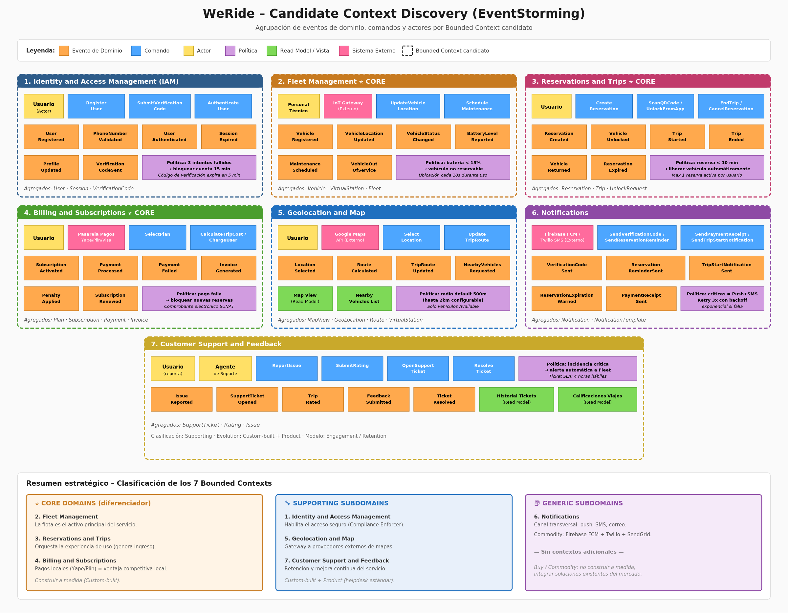

---

#### 2.5.1.2. Domain Message Flows Modeling

El *Domain Message Flows Modeling* consiste en identificar y documentar los **mensajes** (comandos, eventos de dominio y queries) que se intercambian entre los Bounded Contexts cuando ocurre un escenario de negocio relevante. Esto permite visualizar las dependencias entre contextos y preparar la siguiente fase: el Context Mapping.

A continuación se modelan los **cinco (5) flujos de mensajes más representativos** del dominio de WeRide, cada uno correspondiente a un escenario crítico del producto.

---

##### Flujo 1: Registro e inicio de sesión del usuario (US-01, US-02, US-03)

**Escenario:** Un nuevo usuario se registra en la aplicación WeRide, valida su número de celular mediante un código de verificación y accede a la aplicación.

| # | Emisor | Tipo | Mensaje | Receptor |
|---|--------|------|---------|----------|
| 1 | Usuario (Actor) | Comando | `RegisterUser(phoneNumber, email)` | IAM |
| 2 | IAM | Evento | `UserRegistered(userId, phoneNumber)` | (broadcast) |
| 3 | IAM | Comando | `SendVerificationCode(phoneNumber)` | Notifications |
| 4 | Notifications | Evento | `VerificationCodeSent(userId, channel)` | IAM |
| 5 | Usuario (Actor) | Comando | `SubmitVerificationCode(code)` | IAM |
| 6 | IAM | Evento | `PhoneNumberValidated(userId)` | (broadcast) |
| 7 | IAM | Evento | `UserAuthenticated(userId, sessionId)` | (broadcast) |

**Contextos involucrados:** IAM (principal), Notifications (soporte).

---

##### Flujo 2: Contratación de un plan y registro de método de pago (US-09, US-10)

**Escenario:** Un usuario autenticado selecciona un plan de suscripción y lo paga con tarjeta, Yape o Plin.

| # | Emisor | Tipo | Mensaje | Receptor |
|---|--------|------|---------|----------|
| 1 | Usuario (Actor) | Query | `GetAvailablePlans()` | Billing and Subscriptions |
| 2 | Billing | — | (respuesta con lista de planes) | Usuario |
| 3 | Usuario (Actor) | Comando | `SelectPlan(planId, paymentMethod)` | Billing and Subscriptions |
| 4 | Billing | Comando | `ProcessPayment(amount, method)` | Pasarela de Pagos (Sistema Externo) |
| 5 | Pasarela de Pagos | Evento | `PaymentProcessed(paymentId, status)` | Billing |
| 6 | Billing | Evento | `SubscriptionActivated(userId, planId)` | (broadcast) |
| 7 | Billing | Comando | `SendPaymentReceipt(userId, invoice)` | Notifications |
| 8 | Notifications | Evento | `PaymentReceiptSent(userId)` | Billing |

**Contextos involucrados:** Billing and Subscriptions (principal), IAM (contexto de identidad), Notifications, Pasarela de Pagos (externo).

---

##### Flujo 3: Búsqueda de vehículos cercanos y creación de reserva (US-11, US-17)

**Escenario:** El usuario selecciona una ubicación en el mapa, visualiza los vehículos cercanos disponibles y reserva uno.

| # | Emisor | Tipo | Mensaje | Receptor |
|---|--------|------|---------|----------|
| 1 | Usuario (Actor) | Comando | `SelectLocation(lat, lng)` | Geolocation and Map |
| 2 | Geolocation | Query | `FindNearbyVehicles(lat, lng, radius)` | Fleet Management |
| 3 | Fleet | — | (respuesta con vehículos disponibles) | Geolocation |
| 4 | Geolocation | Evento | `NearbyVehiclesDisplayed(userId, vehicles)` | Usuario |
| 5 | Usuario (Actor) | Comando | `CreateReservation(vehicleId, userId)` | Reservations and Trips |
| 6 | Reservations | Query | `CheckVehicleAvailability(vehicleId)` | Fleet Management |
| 7 | Fleet | Evento | `VehicleReserved(vehicleId, userId)` | Reservations |
| 8 | Reservations | Evento | `ReservationCreated(reservationId, userId, vehicleId)` | (broadcast) |
| 9 | Reservations | Comando | `NotifyReservationStart(userId, reservationId)` | Notifications |
| 10 | Notifications | Evento | `TripStartNotificationSent(userId)` | Reservations |

**Contextos involucrados:** Geolocation and Map, Fleet Management, Reservations and Trips, Notifications.

---

##### Flujo 4: Desbloqueo del vehículo e inicio del viaje (US-19, US-20, US-21)

**Escenario:** El usuario con reserva activa escanea el QR (o usa la app) y el sistema desbloquea el vehículo, iniciando el viaje.

| # | Emisor | Tipo | Mensaje | Receptor |
|---|--------|------|---------|----------|
| 1 | Usuario (Actor) | Comando | `ScanQRCode(qrToken, reservationId)` | Reservations and Trips |
| 2 | Reservations | Query | `ValidateReservation(reservationId, userId)` | Reservations |
| 3 | Reservations | Comando | `UnlockVehicle(vehicleId)` | Fleet Management |
| 4 | Fleet | Comando | `SendUnlockSignal(vehicleId)` | IoT Gateway (Sistema Externo) |
| 5 | IoT Gateway | Evento | `VehicleUnlocked(vehicleId, timestamp)` | Fleet |
| 6 | Fleet | Evento | `VehicleStatusChanged(vehicleId, IN_USE)` | (broadcast) |
| 7 | Reservations | Evento | `TripStarted(tripId, userId, vehicleId, startTime)` | (broadcast) |
| 8 | Reservations | Query | `GetTripRoute(tripId)` | Geolocation and Map |

**Contextos involucrados:** Reservations and Trips, Fleet Management, Geolocation and Map, IoT Gateway (externo).

---

##### Flujo 5: Finalización del viaje, facturación y calificación (US-12, US-13, US-14)

**Escenario:** El usuario devuelve el vehículo en una estación virtual, el sistema calcula el costo, lo cobra y solicita la calificación del viaje.

| # | Emisor | Tipo | Mensaje | Receptor |
|---|--------|------|---------|----------|
| 1 | Usuario (Actor) | Comando | `EndTrip(tripId)` | Reservations and Trips |
| 2 | Reservations | Comando | `LockVehicle(vehicleId)` | Fleet Management |
| 3 | Fleet | Evento | `VehicleReturned(vehicleId, location)` | (broadcast) |
| 4 | Reservations | Evento | `TripEnded(tripId, duration, distance)` | (broadcast) |
| 5 | Reservations | Comando | `CalculateTripCost(tripId, duration, distance)` | Billing and Subscriptions |
| 6 | Billing | Evento | `InvoiceGenerated(invoiceId, tripId, amount)` | (broadcast) |
| 7 | Billing | Comando | `ChargeUser(userId, amount)` | Pasarela de Pagos (externo) |
| 8 | Pasarela | Evento | `PaymentProcessed(paymentId)` | Billing |
| 9 | Billing | Comando | `SendInvoiceNotification(userId, invoice)` | Notifications |
| 10 | Reservations | Comando | `RequestTripRating(userId, tripId)` | Customer Support and Feedback |
| 11 | Usuario (Actor) | Comando | `SubmitRating(tripId, score, comment)` | Customer Support and Feedback |
| 12 | Customer Support | Evento | `TripRated(tripId, userId, score)` | (broadcast) |

**Contextos involucrados:** Reservations and Trips, Fleet Management, Billing and Subscriptions, Customer Support and Feedback, Notifications, Pasarela de Pagos (externo).

---

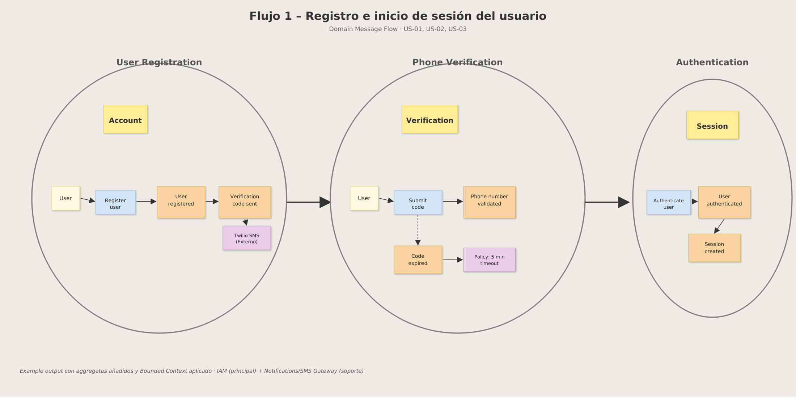
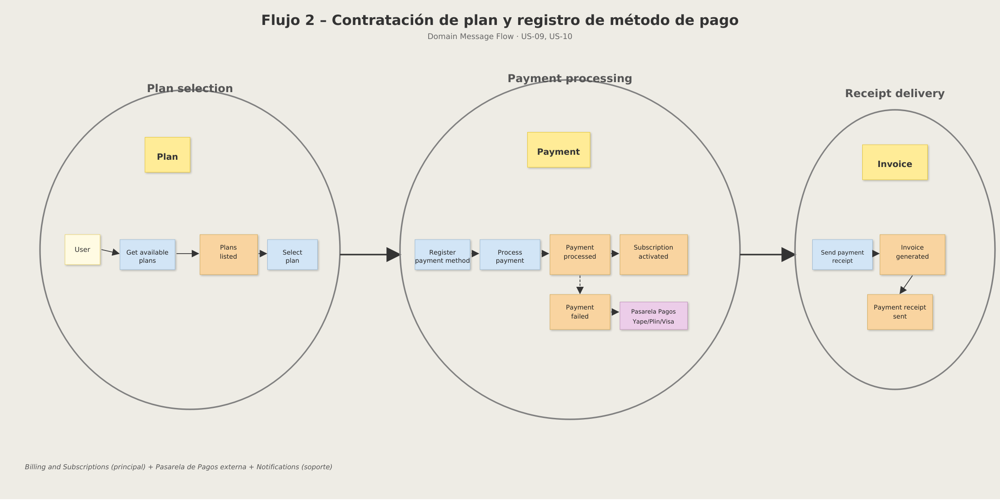
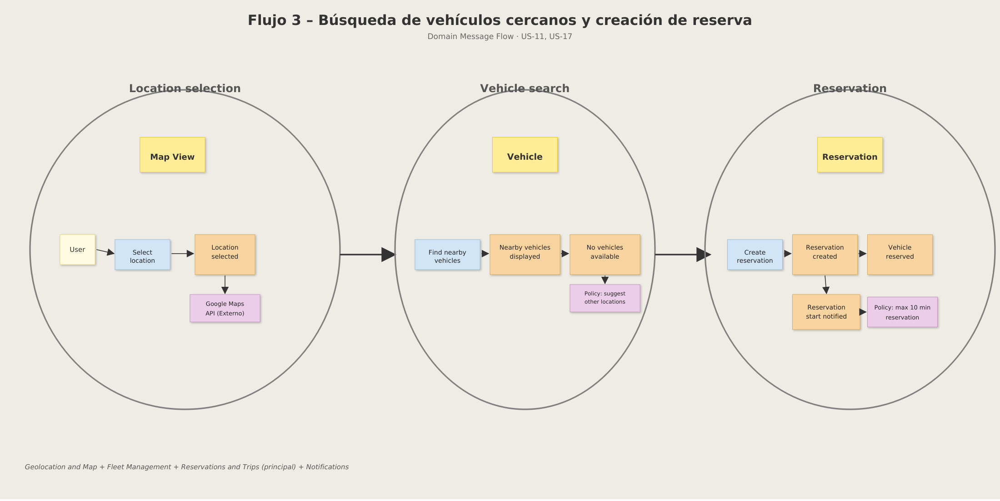
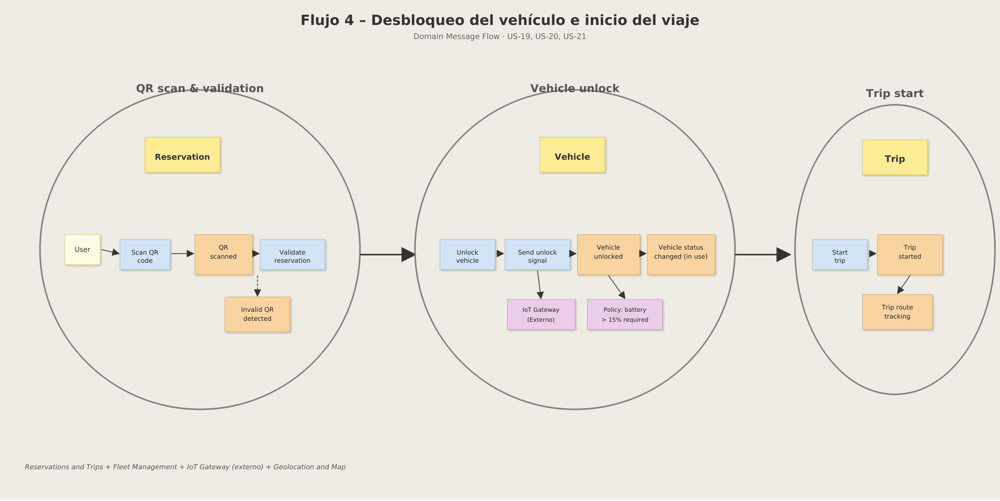
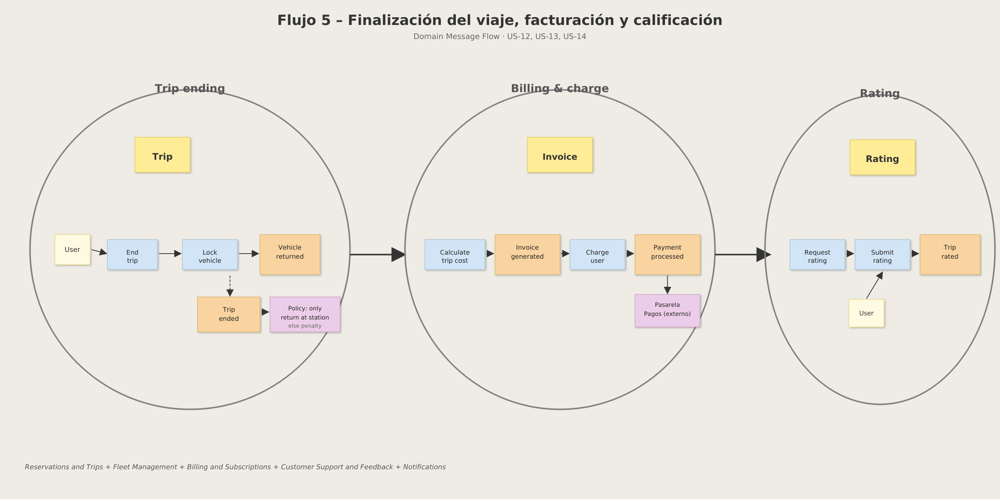

---

#### 2.5.1.3. Bounded Context Canvases

El *Bounded Context Canvas* es una plantilla creada por Nick Tune (DDD Crew) que permite describir, de forma estandarizada y colaborativa, las responsabilidades, el modelo de dominio, las comunicaciones entrantes y salientes, y los supuestos de cada Bounded Context. A continuación se presenta el canvas completo para cada uno de los siete Bounded Contexts identificados en WeRide.

Cada canvas está estructurado en las siguientes secciones estándar:

- **Name & Purpose:** nombre y propósito del contexto.
- **Strategic Classification:** clasificación como Core/Supporting/Generic, Business Model (Revenue Generator, Compliance Enforcer, Engagement) y Evolution Stage (Genesis, Custom-built, Product, Commodity).
- **Domain Roles:** roles que juega el contexto (Specification, Execution, Gateway, Audit, Analysis).
- **Inbound Communication:** comandos y queries recibidos, colaboradores y relaciones con otros BCs.
- **Ubiquitous Language & Business Decisions:** términos del dominio, reglas de negocio, eventos publicados y agregados.
- **Outbound Communication:** comandos enviados, eventos emitidos, queries invocadas, consumers y sistemas externos integrados.
- **Assumptions & Open Questions:** supuestos y preguntas abiertas a resolver con stakeholders.

---

##### Canvas 1: Identity and Access Management (IAM)

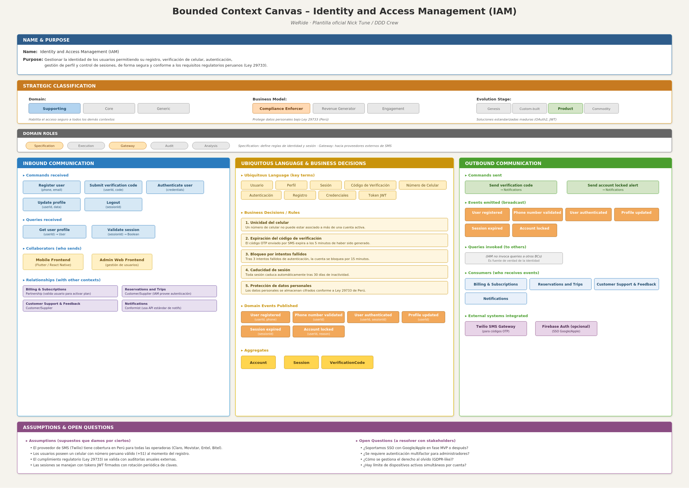

---

##### Canvas 2: Fleet Management ⭐

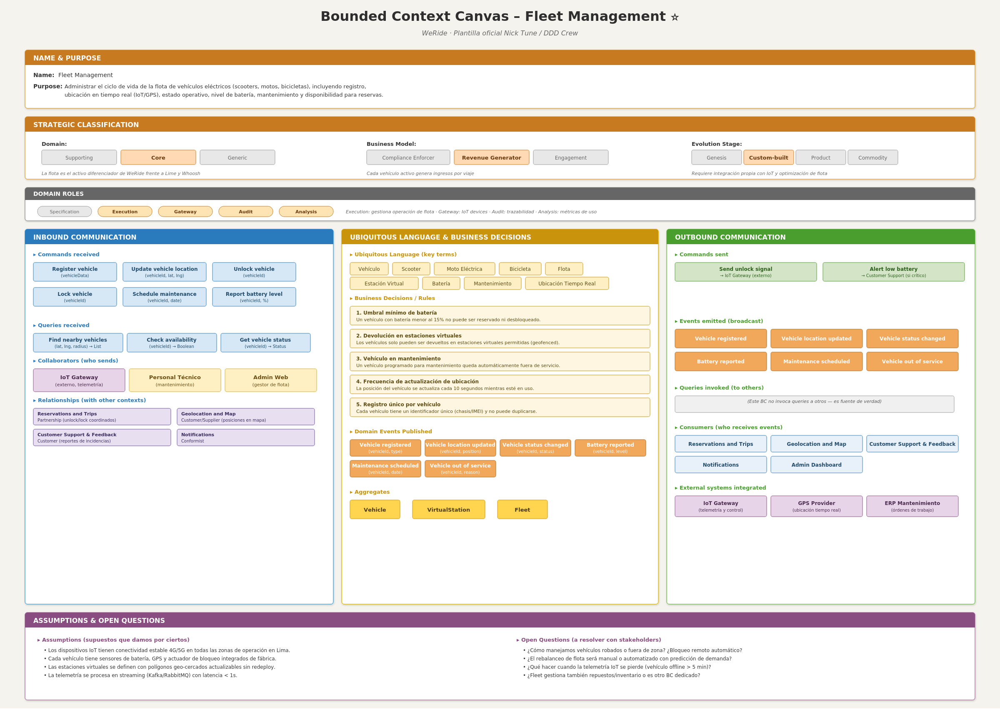

---

##### Canvas 3: Reservations and Trips ⭐

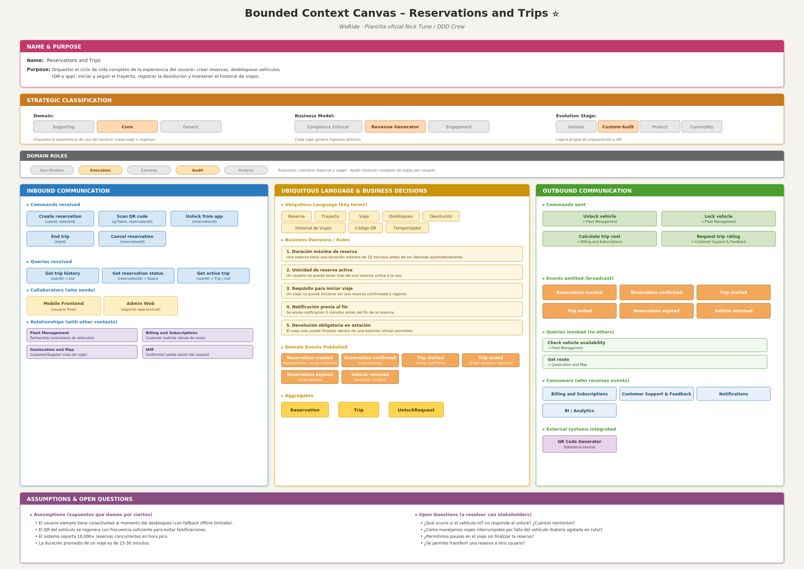

---

##### Canvas 4: Billing and Subscriptions ⭐

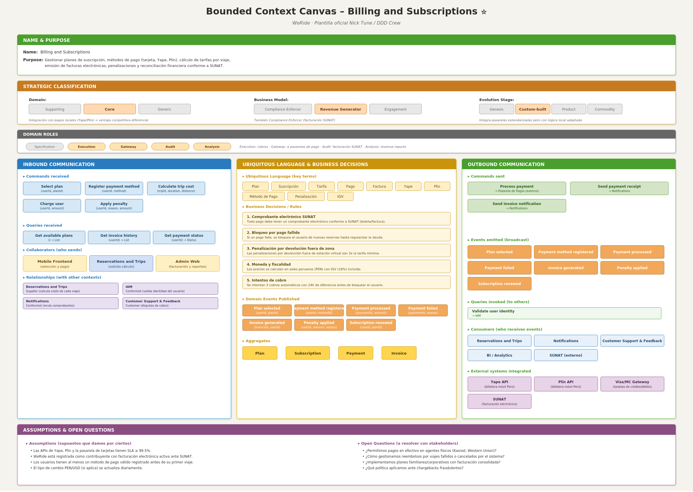

---

##### Canvas 5: Geolocation and Map

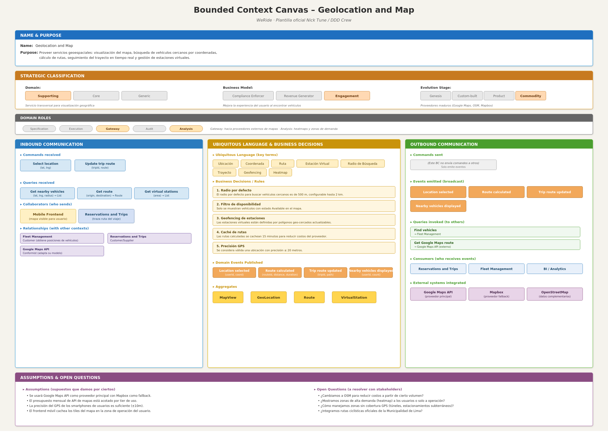

---

##### Canvas 6: Notifications

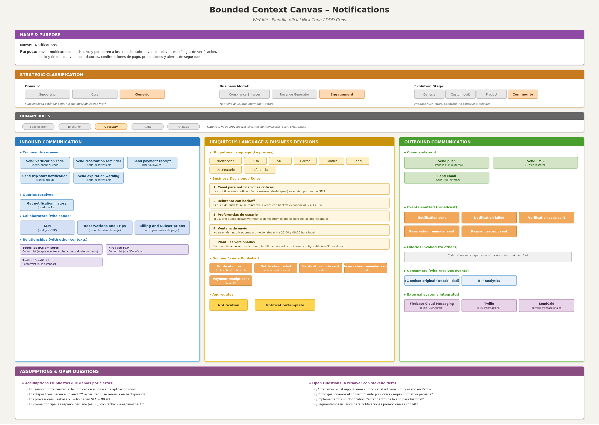

---

##### Canvas 7: Customer Support and Feedback

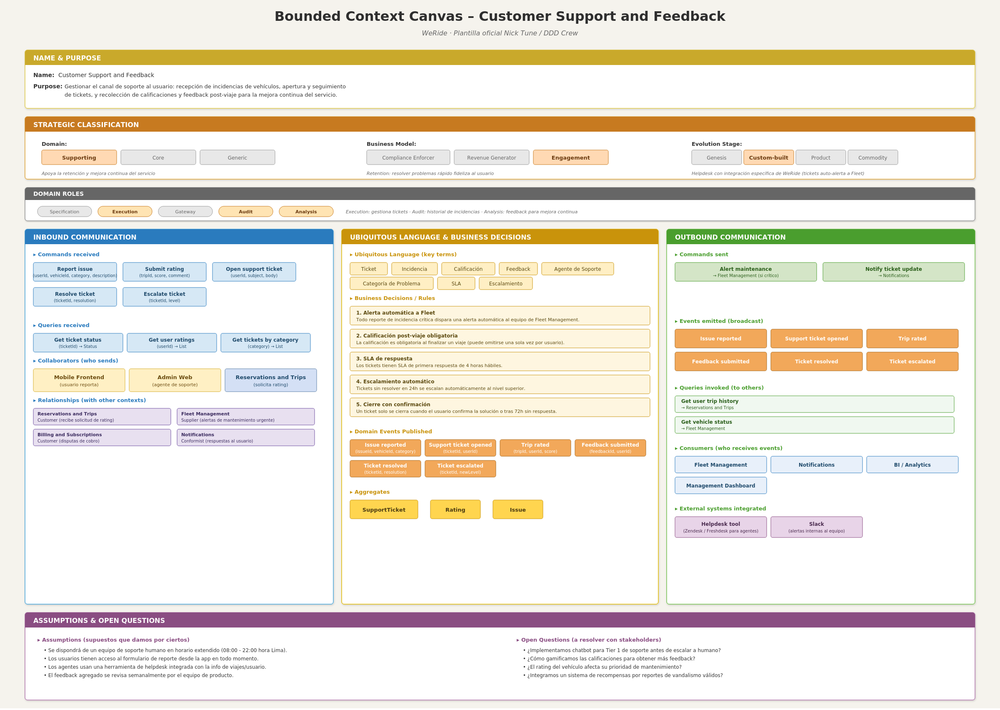

### 2.5.2. Context Mapping

Durante la fase de modelado basado en el dominio, se han identificado los siguientes bounded contexts: Identity and Access Management (IAM), Fleet Management, Reservations and Trips, Billing and Subscriptions, Geolocation and Map, Notifications y Customer Support and Feedback.
A continuación, se describe el tipo de relación existente entre estos contextos y la forma en que se comunican entre sí.

**Análisis de Bounded Contexts**

-  **Identity and Access Management (IAM) ↔ Reservations and Trips**
    - Relación: Upstream (IAM) / Downstream (Reservations)
    - Patrón: **Conformist** (IAM define el modelo de usuario y autenticación, y Reservations se adapta a este modelo para gestionar reservas y viajes)

-  **Identity and Access Management (IAM) ↔ Billing and Subscriptions**
    - Relación: Upstream (IAM) / Downstream (Billing)
    - Patrón: **Conformist** (Billing utiliza la información de identidad del usuario sin modificar su estructura, garantizando consistencia en pagos y suscripciones)

- **Geolocation and Map ↔ Fleet Management**
    - Relación: Upstream (Geolocation) / Downstream (Fleet)
    - Patrón: **ACL** (Fleet traduce coordenadas, rutas y datos geoespaciales a su propio modelo de ubicación de vehículos)

- **Geolocation and Map ↔ Reservations and Trips**
    - Relación: Upstream (Geolocation) / Downstream (Reservations)
    - Patrón: **ACL** (Reservations utiliza servicios de mapas y rutas, traduciendo la información geográfica a su lógica de negocio para trayectos)

- **Fleet Management ↔ Reservations and Trips**
    - Relación: Upstream (Fleet) / Downstream (Reservations)
    - Patrón: **PL** (Ambos contextos comparten conceptos como Vehicle, Status y Availability para garantizar consistencia en tiempo real durante las reservas)

- **Reservations and Trips ↔ Billing and Subscriptions**
    - Relación: Upstream (Reservations) / Downstream (Billing)
    - Patrón: **ACL** (Billing traduce la información de viajes —duración, distancia, tiempo— en cálculos de costos, tarifas y generación de facturas)

- **Reservations and Trips ↔ Notifications**
    - Relación: Upstream (Reservations) / Downstream (Notifications)
    - Patrón: **PL** (Reservations emite eventos como TripStarted, TripEnded o ReservationCreated, que Notifications consume para informar al usuario)

- **Fleet Management ↔ Notifications**
    - Relación: Upstream (Fleet) / Downstream (Notifications)
    - Patrón: **PL** (Fleet genera eventos como BatteryLow o VehicleOutOfService, los cuales son utilizados para notificaciones preventivas o alertas)
 

- **Reservations and Trips ↔ Customer Support and Feedback**
    - Relación: Upstream (Reservations) / Downstream (Support)
    - Patrón: **ACL** (Support traduce la información de viajes en tickets, incidentes y reportes gestionables por el sistema de atención al cliente)

- **Fleet Management ↔ Customer Support and Feedback**
    - Relación: Upstream (Fleet) / Downstream (Support)
    - Patrón: **PL** (Billing emite eventos como PaymentProcessed o InvoiceGenerated, que Notifications utiliza para enviar comprobantes y alertas de pago)

- **Reservations and Trips ↔ Notifications**
    - Relación: Upstream (Reservations) / Downstream (Notifications)
    - Patrón: **ACL** (Support traduce eventos de fallos o estados del vehículo en incidencias reportadas por los usuarios o detectadas automáticamente)

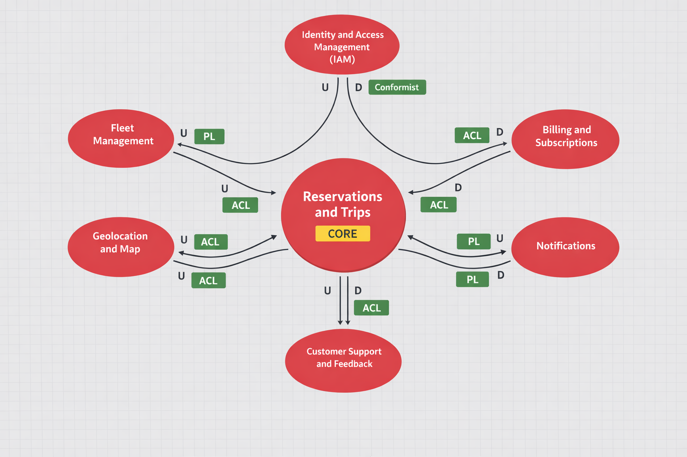

Se han identificado y analizado las relaciones entre los bounded contexts del sistema de micromovilidad. Cada relación ha sido clasificada utilizando patrones de context mapping, lo que permite comprender cómo interactúan los distintos contextos y cómo se comunican entre sí.

### 2.5.3. Software Architecture
#### 2.5.3.1. Software Architecture Context Level Diagrams

El diagrama de contexto en la arquitectura de software proporciona una visión general de alto nivel del sistema dentro de su entorno, mostrando cómo interactúa con los actores externos (usuarios, sistemas externos, etc.).

Para el sistema WeRide Platform, el diagrama de contexto incluye los siguientes actores y sistemas externos:

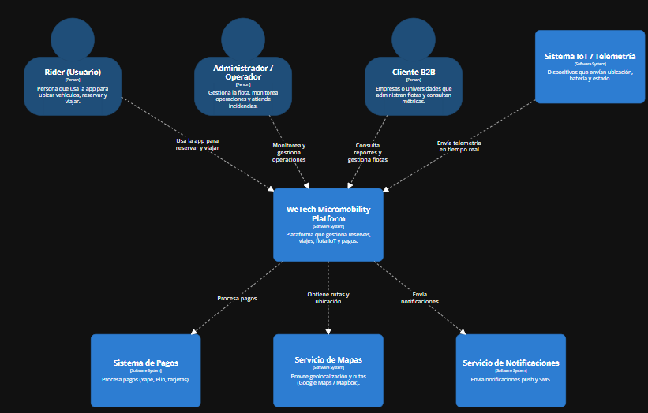

Para nuestro sistema WeRide, los actores y sistemas externos son:

- **Actores**:
  - **Rider (Usuario)**: Persona que utiliza la aplicación móvil para ubicar vehículos disponibles, realizar reservas, desbloquearlos y efectuar viajes dentro de la ciudad.
  - **Administrador / Operador**: Encargado de supervisar la flota de vehículos, monitorear su estado en tiempo real, gestionar incidencias y garantizar el correcto funcionamiento del sistema.
  - **Cliente B2B (Empresas / Universidades)**: Organizaciones que utilizan la plataforma para gestionar flotas asignadas, analizar métricas de uso y optimizar la movilidad interna de sus colaboradores o estudiantes.

- **Aplicación**:
  - **WeRide**: Sistema principal que gestiona la operación de micromovilidad eléctrica, incluyendo reservas, viajes, control de flota, integración con dispositivos IoT, procesamiento de pagos y notificaciones a los usuarios.

- **Sistemas Externos**:
  - **Sistema de Pagos**: Plataforma externa utilizada para procesar pagos, suscripciones y transacciones generadas por los viajes realizados por los usuarios.
  - **Servicio de Mapas**: Servicio que proporciona funcionalidades de geolocalización, cálculo de rutas y visualización de vehículos en el mapa.
  - **Sistema IoT / Telemetría**: Infraestructura de dispositivos instalados en los vehículos que envían información en tiempo real, como ubicación, nivel de batería y estado operativo.
  - **Servicio de Notificaciones**: Sistema externo encargado de enviar notificaciones push y mensajes SMS relacionados con reservas, viajes, alertas y eventos importantes del sistema.

#### 2.5.3.2. Software Architecture Container Level Diagrams
#### 2.5.3.3. Software Architecture Deployment Diagrams
## 2.6. Tactical-Level Domain-Driven Design
### 2.6.x. Bounded Context: <Bounded Context Name>
#### 2.6.x.1. Domain Layer
#### 2.6.x.2. Interface Layer
#### 2.6.x.3. Application Layer
#### 2.6.x.4 Infrastructure Layer
#### 2.6.x.5. Bounded Context Software Architecture Component Level Diagrams
#### 2.6.x.6. Bounded Context Software Architecture Code Level Diagrams
##### 2.6.x.6.1. Bounded Context Domain Layer Class Diagrams
##### 2.6.x.6.2. Bounded Context Database Design Diagram
