# Capítulo 3: Solution UI/UX Design #

## _3.1. Product Design_ ##

### 3.1.1. Style Guidelines ###

#### 3.1.1.1. General Style Guidelines ####

<h3>Branding</h3>

El logo de WR sintetiza de manera elegante y minimalista la propuesta de valor de la marca en el mundo de la micromovilidad eléctrica. El diseño en tipografía negra sobre fondo blanco comunica sobriedad, confianza y profesionalismo, asegurando legibilidad en cualquier soporte digital o físico.

En la parte superior, el scooter eléctrico estilizado simboliza movimiento, innovación y sostenibilidad, elementos centrales de la experiencia que WR ofrece. Su posición por encima de las iniciales representa la prioridad de la movilidad sobre cualquier otra función, transmitiendo dinamismo y acción inmediata.

La composición general mantiene un equilibrio entre modernidad y simplicidad, ideal para una plataforma tecnológica que busca conectar a las personas con alternativas de transporte accesibles, rápidas y ecológicas. La elección de una paleta monocromática resalta la seriedad de la propuesta, mientras que el ícono del scooter añade cercanía y un toque aspiracional.

Con este logo, WR se presenta como una marca confiable, eficiente y enfocada en transformar el desplazamiento urbano, adaptándose a las necesidades de estudiantes, profesionales y empresas.

***Variantes de logo***

***Logo original***


***Logo con iniciales light color***


***Colores invertidos***


<h3>Typography</h3>

La tipografía de nuestra app de micromovilidad eléctrica refleja dinamismo, innovación y accesibilidad, alineándose con los valores de sostenibilidad y movilidad inteligente que representamos. Hemos elegido una fuente sans-serif moderna, limpia y ligera, que transmite agilidad y simplicidad, elementos esenciales de nuestro servicio.

La fuente principal será "Kay Pho Du", que por su diseño esbelto y geométrico comunica tecnología y orden sin perder cercanía. Su alta legibilidad permite que los usuarios puedan consultar información rápida mientras se desplazan.

Para lograr una jerarquía visual clara, los títulos y subtítulos tendrán un tamaño más prominente que el cuerpo del texto. Los títulos (H1, H2) enfatizan energía y movimiento, mientras que los textos secundarios mantienen un tono amigable y sencillo.

El cuerpo del texto usará un tamaño base adaptable, que garantice lectura sin esfuerzo tanto en pantallas pequeñas (smartphones) como en tablets. Se mantendrá un interlineado aireado y márgenes equilibrados para no saturar la interfaz.

El lenguaje será directo y motivador, usando un tono casual que inspire confianza y fomente la adopción de alternativas de transporte sostenible.

<h3>Colors</h3>

La paleta de colores de nuestra app de micromovilidad eléctrica fue diseñada para reforzar el impacto visual del logo y proyectar dinamismo, sostenibilidad y confianza. El blanco se mantiene como base, representando simplicidad, limpieza y espacios abiertos, facilitando que los elementos clave destaquen sin saturar la vista.

El negro profundo del logo se utiliza en tipografía principal y elementos estructurales, comunicando seriedad y profesionalismo. Para transmitir energía y movimiento, incorporamos un verde lima brillante (#18FA3A) como color de acento, ideal para botones de acción (reservar, iniciar viaje) y mensajes de confirmación. Este tono evoca sostenibilidad y vitalidad, conectando con la misión de promover transporte limpio.

Un gris color (#EEEEEE) complementa la paleta y refuerza la percepción tecnológica de la plataforma, utilizado en íconos interactivos y estados activos. Además, tonos gris claro (#EAEAEA) y gris oscuro (#4F4F4F) equilibran la interfaz, mejorando la legibilidad y jerarquizando la información.

En conjunto, esta paleta crea una identidad moderna, ágil y ecológica, que motiva a los usuarios a adoptar la movilidad eléctrica como su primera opción dentro y fuera del campus.

---

#### Paleta de colores - WeRide

| **Color**        | **Uso**                                                                 | **Código Hex** |
|------------------|-------------------------------------------------------------------------|---------------|
| Blanco           | Fondo principal de la interfaz, espacios vacíos, sensación de limpieza y orden. | `#FFFFFF`     |
| Negro profundo   | Logo, textos principales, íconos y elementos estructurales.              | `#000000`     |
| Verde energía    | Botones de acción (reservar, iniciar viaje), confirmaciones y mensajes de éxito. | `#18FA3A`     |
| Gris claro       | Fondos secundarios, separadores, tarjetas de información.                | `#D9D9D9`     |
| Gris medio       | Texto secundario, íconos inactivos, descripciones y estados deshabilitados. | `#A6A6A6`     |

### 3.1.2. Information Architecture ###

#### 3.1.2.1. Organization Systems ####

Para la **landing page** de WeRide, se ha optado por una estructura jerárquica para ambos segmentos de usuarios, ya que se cuenta con una barra de navegación superior que dirige a diferentes secciones, cada una encapsulando información relevante y relacionada.

Para el proceso de inicio de sesión o creación de cuenta, se utiliza una organización lineal, permitiendo que el usuario avance paso a paso a medida que completa los datos requeridos hasta finalizar el registro o acceso.

Dentro de la aplicación principal, se mantiene una organización jerárquica para separar y encapsular las distintas funcionalidades, independientemente del tipo de usuario. Esto asegura que, aunque los usuarios tengan diferentes necesidades y accesos, ****la estructura de la aplicación sea coherente y fácil de navegar.****


#### 3.1.2.2. Labelling Systems ####

Las etiquetas emplean un lenguaje claro y conciso, alineado con el tono casual y motivador de la marca:
**Inicio:** Vista principal con mapa y scooters disponibles.
**Reservar:** Flujo de reserva paso a paso.
**Mis Viajes:** Historial de viajes y reservas activas.
**Perfil:** Gestión de cuenta, método de pago y preferencias.
**Ayuda:** Centro de soporte con preguntas frecuentes y contacto.

#### 3.1.2.3. SEO Tags and Meta Tags ####

**Titulo:**
```html
<title>WeRide</title>
```

**Codificación de carácteres:**
```html
<meta charset="utf-8">
```

**Descripción:**
```html
<meta name="description" content="WeRide is a mobile application focused on providing sustainable and smart urban mobility through electric scooters, bikes, and motorcycles.">
```

**Autor y Derechos de Autor:**
```html
<meta name="author" content="CultiConection">
<meta name="copyright" content="Copyright WeTech team" />
```

#### 3.1.2.4. Searching Systems ####

El sistema integral de micromovilidad eléctrica compartida incorporará un **módulo de búsqueda y localización en tiempo real**, que permitirá a los usuarios identificar la ubicación disponible de los vehículos más cercanos (scooters, bicicletas y motos eléctricas). Este sistema se sustenta en las siguientes características:  
Geolocalización en tiempo real:  
 Cada vehículo estará equipado con dispositivos GPS e IoT que transmitirán su ubicación de manera constante hacia la plataforma central.


**Mapa interactivo en la aplicación móvil**:  
 La app mostrará en un mapa la ubicación exacta de los vehículos disponibles, diferenciados por tipo (scooter, bicicleta o moto eléctrica).


**Filtros de búsqueda avanzada**
 Los usuarios podrán buscar vehículos según:


- Tipo de unidad preferida.


- Nivel de batería disponible.


- Distancia a pie desde su ubicación actual.


**Reserva inmediata**:
 Una vez identificado el vehículo, el usuario podrá seleccionarlo en la aplicación, reservarlo y dirigirse a recogerlo.


**Optimización para empresas**:
 En el caso de suscripciones corporativas, los sistemas de búsqueda también permitirán a los empleados visualizar vehículos disponibles en zonas cercanas a sus oficinas o campus, garantizando disponibilidad en horas de mayor demanda.


Con este enfoque, el sistema de búsqueda se convierte en un **componente esencial para la experiencia del usuario**, asegurando eficiencia en la localización y optimizando el uso de la flota.  

#### 3.1.2.5. Navigation Systems ####

El sistema integral de micromovilidad eléctrica compartida contará con un módulo de navegación inteligente que facilitará al usuario el uso de los vehículos y la planificación de sus desplazamientos. Dicho módulo se estructura en las siguientes funciones:  
Guía hacia el vehículo seleccionado:  
 Una vez realizada la reserva, la aplicación mostrará la ruta a pie más rápida desde la ubicación del usuario hasta el vehículo disponible, mediante mapas integrados en tiempo real.  


**Navegación durante el viaje:**   
 El sistema proporcionará indicaciones de ruta para que el usuario se desplace de manera eficiente hacia su destino, evitando zonas de alto tráfico cuando sea posible. Para ello, se integrarán APIs de mapas inteligentes como Google Maps o Mapbox, adaptadas a la movilidad ligera.  


**Seguridad en la navegación:**  


- Alertas en la aplicación respecto a calles restringidas o zonas con tráfico intenso.  


- Recomendación de rutas seguras y sostenibles para bicicletas, scooters y motos eléctricas.  


- Opciones de personalización (ruta más rápida, más segura o más ecológica).  


**Gestión de estaciones y puntos de aparcamiento:**  
 La navegación también incluirá la localización de zonas de parqueo autorizadas, estaciones de carga o puntos estratégicos de la empresa asociados a la suscripción corporativa.  


**Soporte para empresas:**  
 En el caso de planes empresariales, el sistema de navegación permitirá sugerir rutas entre las sedes de trabajo, facilitando la movilidad de los colaboradores.  


En conjunto, este módulo no solo ofrece orientación geográfica en tiempo real, sino que también optimiza la experiencia de uso, mejorando la seguridad del viaje y reduciendo la incertidumbre del usuario en entornos urbanos congestionados.  


### 3.1.3. Landing Page UI Design ###

#### 3.1.3.1. Landing Page Wireframes ####

- Navbar  
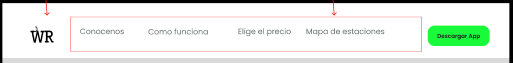
- Hero  
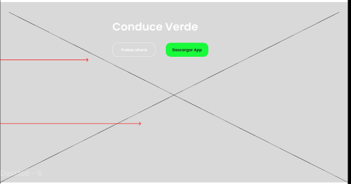
- Disposable Vehicles Section.  
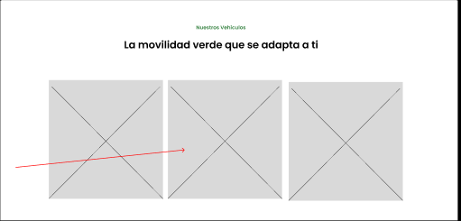
- Application user manual section.  
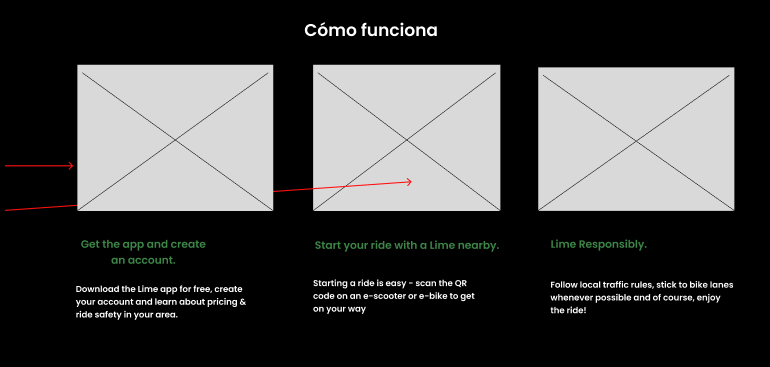
- Rates Section.  
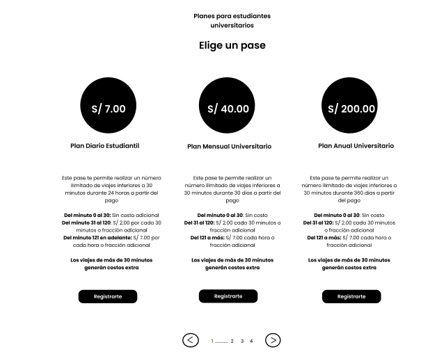
- Locations section.  
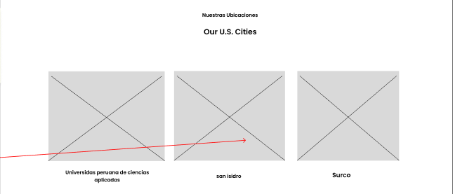
- Who we are section.  
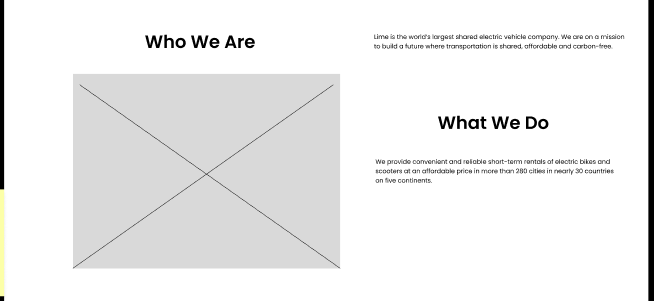
- About section.  
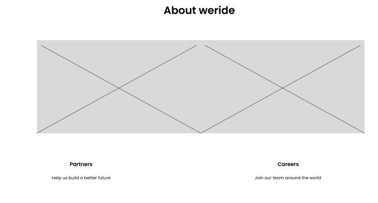
- Application download section.  
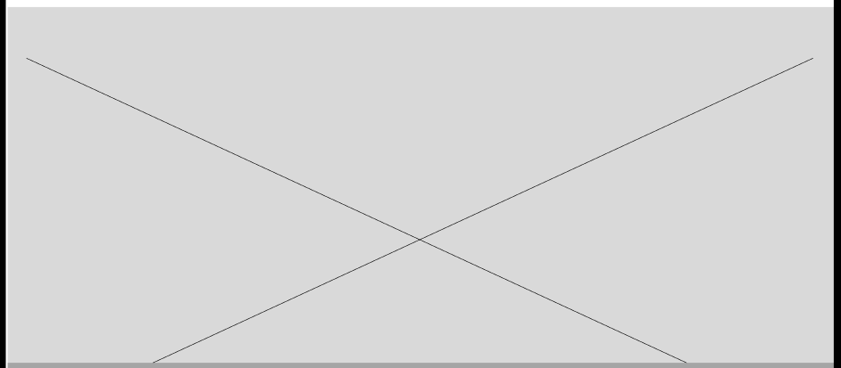
- Footer Section.  
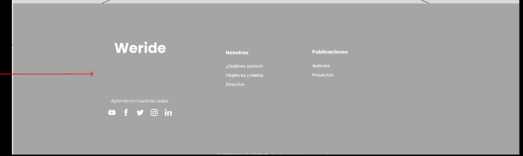

#### 3.1.3.2. Landing Page Mock-ups ####

- Navbar  

- Hero  
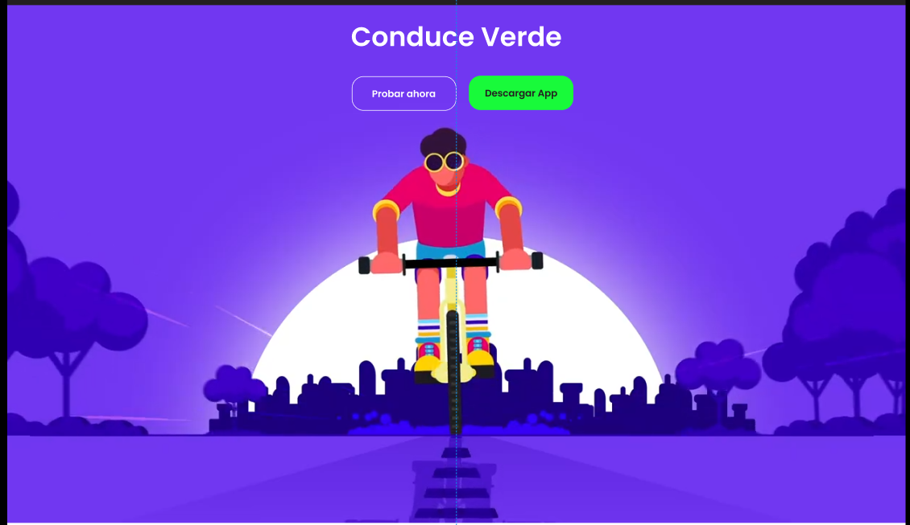
- Disposable Vehicles Section.  
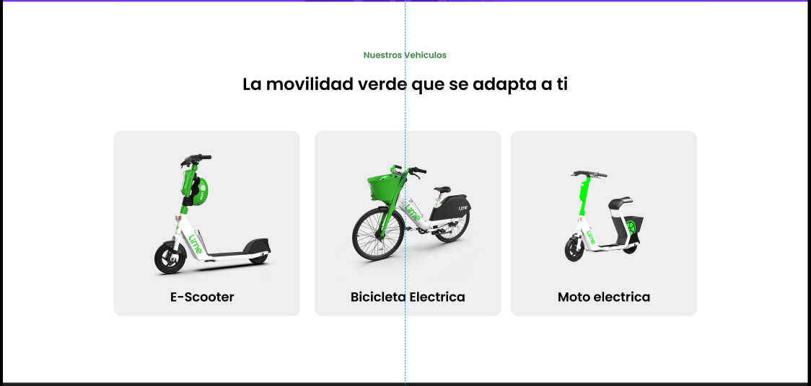
- Application user manual section.  
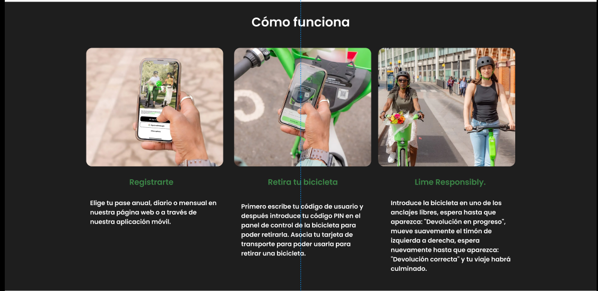
- Rates Section.  
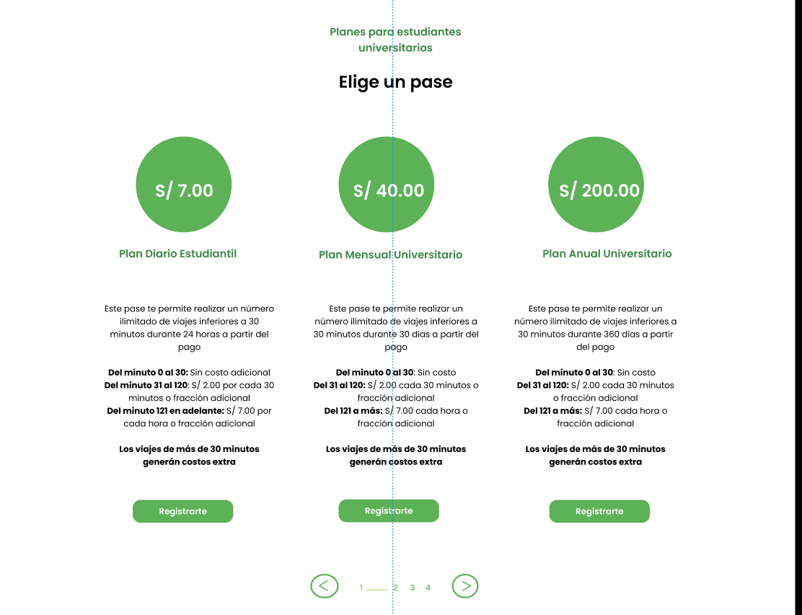
- Locations section.  
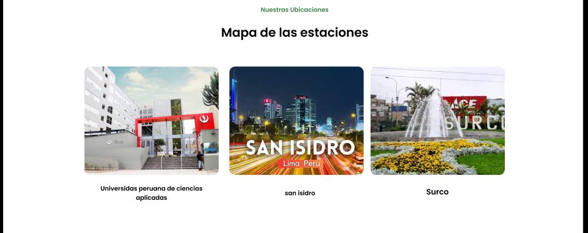
- Who we are section.  
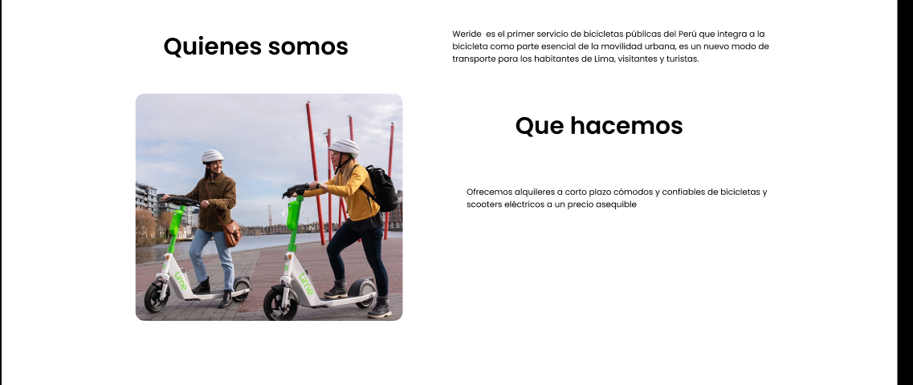
- About section.  
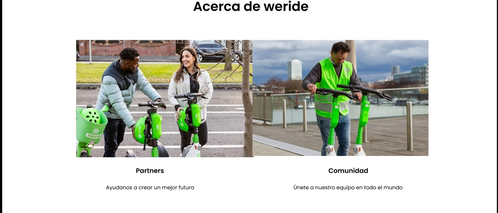
- Application download section.  
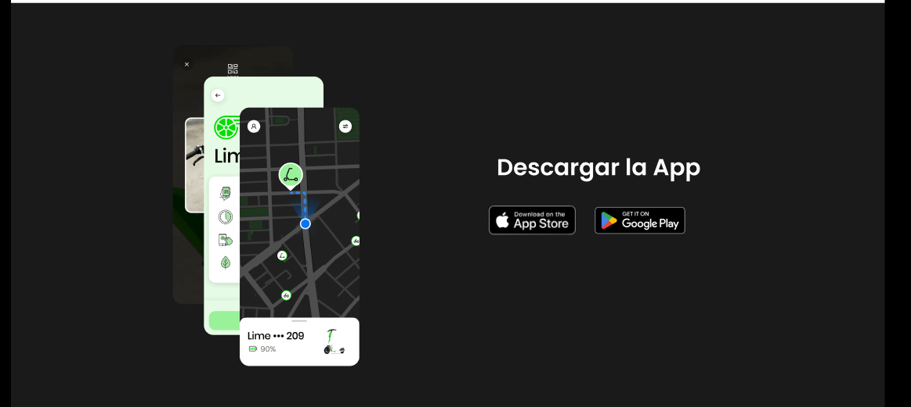
- Footer Section.  
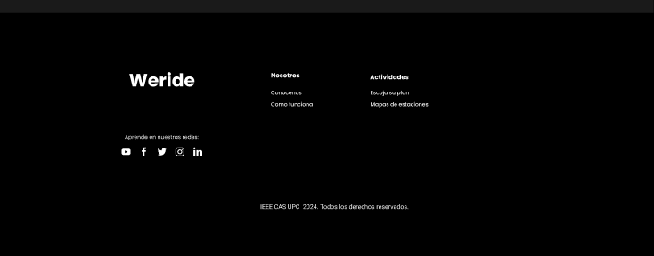

# Capitulo 3: Solution UI/UX Design #

## _3.1. Product Design_ ##

### 3.1.1. Style Guidelines ###

#### 3.1.1.1. General Style Guidelines ####

<h3>Branding</h3>

El logo de WR sintetiza de manera elegante y minimalista la propuesta de valor de la marca en el mundo de la micromovilidad electrica. El diseno en tipografia negra sobre fondo blanco comunica sobriedad, confianza y profesionalismo, asegurando legibilidad en cualquier soporte digital o fisico.

En la parte superior, el scooter electrico estilizado simboliza movimiento, innovacion y sostenibilidad, elementos centrales de la experiencia que WR ofrece. Su posicion por encima de las iniciales representa la prioridad de la movilidad sobre cualquier otra funcion, transmitiendo dinamismo y accion inmediata.

La composicion general mantiene un equilibrio entre modernidad y simplicidad, ideal para una plataforma tecnologica que busca conectar a las personas con alternativas de transporte accesibles, rapidas y ecologicas. La eleccion de una paleta monocromatica resalta la seriedad de la propuesta, mientras que el icono del scooter anade cercania y un toque aspiracional.

Con este logo, WR se presenta como una marca confiable, eficiente y enfocada en transformar el desplazamiento urbano, adaptandose a las necesidades de estudiantes, profesionales y empresas.

***Variantes de logo***

***Logo original***


***Logo con iniciales light color***


***Colores invertidos***


<h3>Typography</h3>

La tipografia de nuestra app de micromovilidad electrica refleja dinamismo, innovacion y accesibilidad, alineandose con los valores de sostenibilidad y movilidad inteligente que representamos. Hemos elegido una fuente sans-serif moderna, limpia y ligera, que transmite agilidad y simplicidad, elementos esenciales de nuestro servicio.

La fuente principal sera "Kay Pho Du", que por su diseno esbelto y geometrico comunica tecnologia y orden sin perder cercania. Su alta legibilidad permite que los usuarios puedan consultar informacion rapida mientras se desplazan.

Para lograr una jerarquia visual clara, los titulos y subtitulos tendran un tamano mas prominente que el cuerpo del texto. Los titulos (H1, H2) enfatizan energia y movimiento, mientras que los textos secundarios mantienen un tono amigable y sencillo.

El cuerpo del texto usara un tamano base adaptable, que garantice lectura sin esfuerzo tanto en pantallas pequenas (smartphones) como en tablets. Se mantendra un interlineado aireado y margenes equilibrados para no saturar la interfaz.

El lenguaje sera directo y motivador, usando un tono casual que inspire confianza y fomente la adopcion de alternativas de transporte sostenible.

<h3>Colors</h3>

La paleta de colores de nuestra app de micromovilidad electrica fue disenada para reforzar el impacto visual del logo y proyectar dinamismo, sostenibilidad y confianza. El blanco se mantiene como base, representando simplicidad, limpieza y espacios abiertos, facilitando que los elementos clave destaquen sin saturar la vista.

El negro profundo del logo se utiliza en tipografia principal y elementos estructurales, comunicando seriedad y profesionalismo. Para transmitir energia y movimiento, incorporamos un verde lima brillante (#18FA3A) como color de acento, ideal para botones de accion (reservar, iniciar viaje) y mensajes de confirmacion. Este tono evoca sostenibilidad y vitalidad, conectando con la mision de promover transporte limpio.

Un gris color (#EEEEEE) complementa la paleta y refuerza la percepcion tecnologica de la plataforma, utilizado en iconos interactivos y estados activos. Ademas, tonos gris claro (#EAEAEA) y gris oscuro (#4F4F4F) equilibran la interfaz, mejorando la legibilidad y jerarquizando la informacion.

En conjunto, esta paleta crea una identidad moderna, agil y ecologica, que motiva a los usuarios a adoptar la movilidad electrica como su primera opcion dentro y fuera del campus.

---

#### Paleta de colores - WeRide

| **Color**        | **Uso**                                                                 | **Codigo Hex** |
|------------------|-------------------------------------------------------------------------|---------------|
| Blanco           | Fondo principal de la interfaz, espacios vacios, sensacion de limpieza y orden. | `#FFFFFF`     |
| Negro profundo   | Logo, textos principales, iconos y elementos estructurales.              | `#000000`     |
| Verde energia    | Botones de accion (reservar, iniciar viaje), confirmaciones y mensajes de exito. | `#18FA3A`     |
| Gris claro       | Fondos secundarios, separadores, tarjetas de informacion.                | `#D9D9D9`     |
| Gris medio       | Texto secundario, iconos inactivos, descripciones y estados deshabilitados. | `#A6A6A6`     |

### 3.1.2. Information Architecture ###

#### 3.1.2.1. Organization Systems ####

Para la **landing page** de WeRide, se ha optado por una estructura jerarquica para ambos segmentos de usuarios, ya que se cuenta con una barra de navegacion superior que dirige a diferentes secciones, cada una encapsulando informacion relevante y relacionada.

Para el proceso de inicio de sesion o creacion de cuenta, se utiliza una organizacion lineal, permitiendo que el usuario avance paso a paso a medida que completa los datos requeridos hasta finalizar el registro o acceso.

Dentro de la aplicacion principal, se mantiene una organizacion jerarquica para separar y encapsular las distintas funcionalidades, independientemente del tipo de usuario. Esto asegura que, aunque los usuarios tengan diferentes necesidades y accesos, ****la estructura de la aplicacion sea coherente y facil de navegar.****


#### 3.1.2.2. Labelling Systems ####

Las etiquetas emplean un lenguaje claro y conciso, alineado con el tono casual y motivador de la marca:
**Inicio:** Vista principal con mapa y scooters disponibles.
**Reservar:** Flujo de reserva paso a paso.
**Mis Viajes:** Historial de viajes y reservas activas.
**Perfil:** Gestion de cuenta, metodo de pago y preferencias.
**Ayuda:** Centro de soporte con preguntas frecuentes y contacto.

#### 3.1.2.3. SEO Tags and Meta Tags ####

**Titulo:**
```html
<title>WeRide</title>
```

**Codificacion de caracteres:**
```html
<meta charset="utf-8">
```

**Descripcion:**
```html
<meta name="description" content="WeRide is a mobile application focused on providing sustainable and smart urban mobility through electric scooters, bikes, and motorcycles.">
```

**Autor y Derechos de Autor:**
```html
<meta name="author" content="CultiConection">
<meta name="copyright" content="Copyright WeTech team" />
```

#### 3.1.2.4. Searching Systems ####

El sistema integral de micromovilidad electrica compartida incorporara un **modulo de busqueda y localizacion en tiempo real**, que permitira a los usuarios identificar la ubicacion disponible de los vehiculos mas cercanos (scooters, bicicletas y motos electricas). Este sistema se sustenta en las siguientes caracteristicas:

Geolocalizacion en tiempo real: Cada vehiculo estara equipado con dispositivos GPS e IoT que transmitiran su ubicacion de manera constante hacia la plataforma central.

**Mapa interactivo en la aplicacion movil**: La app mostrara en un mapa la ubicacion exacta de los vehiculos disponibles, diferenciados por tipo (scooter, bicicleta o moto electrica).

**Filtros de busqueda avanzada**: Los usuarios podran buscar vehiculos segun tipo de unidad preferida, nivel de bateria disponible y distancia a pie desde su ubicacion actual.

**Reserva inmediata**: Una vez identificado el vehiculo, el usuario podra seleccionarlo en la aplicacion, reservarlo y dirigirse a recogerlo.

**Optimizacion para empresas**: En el caso de suscripciones corporativas, los sistemas de busqueda tambien permitiran a los empleados visualizar vehiculos disponibles en zonas cercanas a sus oficinas o campus.

#### 3.1.2.5. Navigation Systems ####

El sistema integral de micromovilidad electrica compartida contara con un modulo de navegacion inteligente que facilitara al usuario el uso de los vehiculos y la planificacion de sus desplazamientos.

**Guia hacia el vehiculo seleccionado**: Una vez realizada la reserva, la aplicacion mostrara la ruta a pie mas rapida desde la ubicacion del usuario hasta el vehiculo disponible, mediante mapas integrados en tiempo real.

**Navegacion durante el viaje**: El sistema proporcionara indicaciones de ruta para que el usuario se desplace de manera eficiente hacia su destino, evitando zonas de alto trafico cuando sea posible. Se integran APIs de mapas inteligentes como Google Maps o Mapbox.

**Seguridad en la navegacion**: Alertas en la aplicacion respecto a calles restringidas, recomendacion de rutas seguras y opciones de personalizacion (ruta mas rapida, mas segura o mas ecologica).

**Gestion de estaciones y puntos de aparcamiento**: La navegacion incluira la localizacion de zonas de parqueo autorizadas, estaciones de carga o puntos estrategicos.


### 3.1.3. Landing Page UI Design ###

#### 3.1.3.1. Landing Page Wireframes ####

- Navbar  

- Hero  

- Disposable Vehicles Section.  

- Application user manual section.  

- Rates Section.  

- Locations section.  

- Who we are section.  

- About section.  

- Application download section.  

- Footer Section.  


#### 3.1.3.2. Landing Page Mock-ups ####

- Navbar  

- Hero  

- Disposable Vehicles Section.  

- Application user manual section.  

- Rates Section.  

- Locations section.  

- Who we are section.  

- About section.  

- Application download section.  

- Footer Section.  


### 3.1.4. Mobile Applications UI/UX Design ###

#### 3.1.4.1. Mobile Applications Wireframes ####

#### 3.1.4.2. Mobile Applications Wireflow Diagrams ####

#### 3.1.4.3. Mobile Applications Mock-ups ####

Los mock-ups de la aplicacion movil **WeRide** representan el diseno de alta fidelidad de cada pantalla, aplicando el Style Guide definido: paleta monocromatica con verde energia (`#18FA3A`) como acento, tipografia *Kay Pho Du*, fondo blanco y elementos estructurales en negro. A continuacion se presentan los mock-ups organizados por flujo funcional.

---

##### Flujo 1 — Acceso a la aplicacion (EP01)

**Pantalla de Bienvenida / Splash Screen**

La pantalla inicial muestra el logo de WeRide centrado sobre fondo negro, con el icono del scooter y el nombre de la marca. Refuerza el branding antes de redirigir al inicio de sesion.


---

**Pantalla de Registro / Inicio de Sesion (US-01)**

Vista dividida en dos pestanas superiores: *Iniciar Sesion* y *Registrarse*. El formulario de login solicita correo electronico y contrasena. El boton de accion principal (color `#18FA3A`) activa la autenticacion. Se incluye la opcion de acceso con Google.


---

**Pantalla de Ingreso de Numero de Celular (US-02)**

Pantalla de paso unico con indicador de progreso de 3 pasos. Campo de numero telefonico con prefijo de pais (+51 Peru) autodetectado. El boton *Continuar* se activa en verde al cumplir el formato (9 digitos).


---

**Pantalla de Verificacion de Codigo SMS (US-03)**

Seis campos de entrada numerica individuales centrados en pantalla. Contador de reenvio en gris. Al completar el codigo correcto, la pantalla transiciona automaticamente con confirmacion visual en verde.


---

**Pantalla de Datos de Perfil (US-04)**

Formulario de creacion de perfil con campo de foto (circular con icono de camara), nombre completo, fecha de nacimiento y genero. Boton *Guardar y Continuar* en verde al pie de la pantalla.


---

##### Flujo 2 — Funcionalidades principales (EP02)

**Pantalla Principal / Home (US-05)**

Vista central con mapa interactivo (Google Maps / Mapbox) mostrando vehiculos disponibles en tiempo real. Barra de busqueda de direccion en la parte superior. Bottom navigation bar con iconos de *Inicio*, *Garaje*, *Viaje*, *Planes* y *Tu*. Tarjeta flotante deslizable con el vehiculo mas cercano y boton *Reservar ahora* en verde.


---

**Pantalla de Perfil (US-06)**

Cabecera con foto y nombre del usuario sobre fondo negro. Lista de opciones: *Administrar cuenta*, *Personalizar perfil*, *Cartera*, *Mis Viajes*, *Centro de Seguridad*, *Ayuda* y *Ajustes*. Cada opcion tiene icono a la izquierda y flecha de navegacion a la derecha.


---

**Pantalla de Garaje — Listado de Vehiculos (US-07)**

Catalogo con tarjetas de cada vehiculo: imagen, nombre, tipo, nivel de bateria en barra de progreso, calificacion en estrellas, disponibilidad y icono de favoritos. Chips de filtro por tipo en la parte superior.


---

**Pantalla de Garaje — Filtros (US-08)**

Bottom sheet deslizable con chips de seleccion para: tipo de vehiculo, nivel de bateria (slider), disponibilidad y calificacion minima. Boton *Aplicar filtros* en verde al pie.


---

##### Flujo 3 — Gestion de pagos y suscripciones (EP03)

**Pantalla de Planes (US-09)**

Tres tarjetas de plan: *Basico*, *Estandar* y *Premium*. Cada tarjeta contiene precio mensual en soles, lista de beneficios con checks en verde y boton *Seleccionar*. El plan recomendado lleva etiqueta *POPULAR* con fondo verde.


---

**Pantalla de Pago (US-10)**

Formulario con tres metodos: *Tarjeta* (numero, vencimiento y CVV), *Yape* (numero de celular + QR) y *Plin* (numero de celular). Pestanas superiores para cambiar metodo. Resumen de compra fijo al pie con boton *Finalizar Pago* en verde e icono de seguridad SSL.


---

##### Flujo 4 — Mapa y localizacion (EP04)

**Pantalla de Mapa — Vehiculos Cercanos (US-11)**

Vista de mapa a pantalla completa con marcadores de vehiculos agrupados. Al tocar un vehiculo aparece tarjeta inferior con bateria, distancia y boton *Reservar* en verde. Leyenda de colores por tipo de vehiculo.


---

##### Flujo 5 — Gestion de viajes (EP05)

**Pantalla de Viaje Activo (US-12)**

Mapa con ruta trazada. Panel inferior con nivel de bateria animado, tiempo transcurrido, distancia recorrida y velocidad. Boton *Finalizar Viaje* en rojo y boton secundario *Reportar problema*.


---

**Pantalla de Historial de Viajes (US-13)**

Lista cronologica de viajes en tarjetas con: fecha, tipo de vehiculo, distancia, duracion, costo y calificacion. Filtro por mes en la parte superior.


---

**Pantalla de Calificacion de Viaje (US-14)**

Modal post-viaje con resumen del trayecto y 5 estrellas interactivas. Campo opcional de comentario. Boton *Enviar Calificacion* (verde) y *Omitir* (gris). Animacion de confirmacion con check verde al enviar.


---

**Pantalla de Reporte de Problema (US-15)**

Chips de categoria: *Falla mecanica*, *Bateria*, *Bloqueo*, *Accidente*, *App*. Campo de descripcion de texto libre y opcion de adjuntar foto. Confirmacion con numero de ticket asignado.


---

##### Flujo 6 — Gestion de reservas (EP06)

**Pantalla de Detalle de Vehiculo y Creacion de Reserva (US-17)**

Imagen grande del vehiculo, nombre, tipo, modelo y nivel de bateria. Seccion de informacion con ubicacion exacta (mapa miniatura) y estacion virtual. Boton *Reservar ahora* en verde. Al confirmarse, contador regresivo de reserva activa.


---

**Pantalla de Reserva Activa con Notificacion (US-16, US-18)**

Temporizador circular de cuenta regresiva en verde, distancia y direccion al vehiculo, boton *Cancelar Reserva* y boton *Desbloquear Vehiculo*. Notificacion push visible cuando faltan 2 minutos para la expiracion.


---

##### Flujo 7 — Desbloqueo de vehiculos (EP07)

**Pantalla de Desbloqueo por QR (US-19)**

Visor de camara con marco de escaneo animado en verde. Instruccion: *"Apunta al codigo QR del vehiculo"*. Al escanear: animacion de desbloqueo y mensaje *"Vehiculo desbloqueado!"* en verde. En error: mensaje en rojo con opcion de reintentar.


---

**Pantalla de Desbloqueo desde la App (US-20, US-21)**

Estado en tiempo real del desbloqueo con icono de candado animado (cerrado → abriendo → abierto). Tres estados: *Procesando...* (gris), *Desbloqueando...* (amarillo) y *Desbloqueado!* (verde). Transicion automatica a Viaje Activo al confirmarse.


---

**Pantalla de Desbloqueo Programado (US-22)**

Selector de fecha y hora nativo de Android. Listado de vehiculos disponibles en ese horario con indicador de disponibilidad. Boton *Confirmar Programacion* y opcion de agregar al calendario del dispositivo.


---

#### 3.1.4.4. Mobile Applications Userflow Diagrams ####

Los diagramas de flujo de usuario representan los caminos que recorre el usuario dentro de la aplicacion movil para completar una tarea especifica, mostrando cada pantalla, decision y transicion. Se presentan los cinco flujos mas representativos de WeRide, alineados con los Bounded Contexts y User Stories del Capitulo 2.

---

##### Userflow 1 — Registro e Inicio de Sesion (US-01, US-02, US-03, US-04)

Este flujo cubre el acceso completo a la aplicacion, desde la apertura hasta el acceso al Home. Inicia en el Splash Screen y bifurca segun si el usuario ya tiene cuenta. El flujo de registro incluye validacion de numero de celular mediante codigo SMS y creacion de perfil. El flujo de login valida credenciales con mensaje de error en caso de fallo.

**Pantallas:** Splash → Login/Registro → Nro. Celular → Codigo SMS → Datos de Perfil → Home.


---

##### Userflow 2 — Busqueda, Reserva y Desbloqueo de Vehiculo (US-11, US-17, US-19, US-20, US-21)

Flujo principal de uso: desde localizar un vehiculo hasta iniciar el viaje. Incluye verificacion de plan activo (derivando a seleccion de plan si no tiene) y bifurcacion entre desbloqueo por QR o desde la app, con manejo de errores en ambos casos.

**Pantallas:** Home → Mapa → Detalle Vehiculo → (Planes → Pago →) Reserva Activa → QR/Desbloqueo → Viaje Activo.


---

##### Userflow 3 — Viaje Activo, Finalizacion y Calificacion (US-12, US-13, US-14, US-15)

Flujo de la experiencia de viaje desde el inicio hasta la retroalimentacion post-trayecto. Incluye la opcion de reporte de problema durante el viaje y el flujo completo de calificacion con comentario opcional, finalizando con la generacion automatica de factura.

**Pantallas:** Viaje Activo → (Reporte Problema →) Finalizar → Resumen → Rating → Factura → Home.


---

##### Userflow 4 — Seleccion y Pago de Plan (US-09, US-10)

Flujo de contratacion de plan de suscripcion. El usuario navega entre los tres planes, selecciona el metodo de pago (Tarjeta, Yape o Plin), revisa el resumen y confirma. Incluye manejo del error de pago con opcion de reintento.

**Pantallas:** Planes → Detalle Plan → Pago → Resumen → Confirmacion → Home.


---

##### Userflow 5 — Desbloqueo Programado (US-22)

Flujo para usuarios que planifican su viaje con anticipacion. Permite seleccionar fecha y hora, verificar disponibilidad del vehiculo en ese horario, confirmar la programacion y recibir notificacion automatica en el momento indicado para el desbloqueo.

**Pantallas:** Garaje → Detalle Vehiculo → Programar Desbloqueo → Confirmacion → (Notificacion automatica) → Viaje Activo.


---

#### 3.1.4.5. Mobile Applications Prototyping ####

El prototipo interactivo de la aplicacion movil **WeRide** fue desarrollado en **Figma**, herramienta seleccionada por el equipo para el diseno colaborativo de interfaces. El prototipo conecta todos los mock-ups de alta fidelidad mediante transiciones y animaciones que simulan la experiencia real de uso en un dispositivo Android, utilizando el frame **Android Large (360 x 800 px)**.

---

##### Descripcion del prototipo

El prototipo cubre los **cinco flujos principales** de la aplicacion (registro, reserva, viaje, planes y desbloqueo programado), permitiendo navegar entre pantallas mediante interacciones tactiles simuladas: tap, swipe, long press y scroll. Las transiciones empleadas son *Smart Animate* para cambios de estado fluidos y *Slide* para la navegacion entre vistas principales.

**Caracteristicas tecnicas del prototipo:**

| Parametro | Detalle |
|---|---|
| Herramienta | Figma (Prototype mode) |
| Frame base | Android Large — 360 x 800 px |
| Cantidad de pantallas | 21 pantallas de alta fidelidad |
| Flujos cubiertos | 5 flujos principales (US-01 a US-22) |
| Tipo de transiciones | Smart Animate, Slide, Dissolve |
| Hotspots activos | Botones CTA, iconos de navegacion, campos de formulario, QR scanner simulado |

---

##### Flujo 1 — Acceso a la aplicacion (Splash → Login → Verificacion → Perfil → Home)

Desde el Splash Screen, el usuario elige entre registrarse o iniciar sesion. El prototipo simula la validacion del codigo SMS y la transicion al formulario de perfil hasta llegar al Home.


---

##### Flujo 2 — Reserva y Desbloqueo (Home → Mapa → Reserva → QR → Viaje Activo)

El mapa interactivo permite seleccionar un vehiculo y acceder a su detalle. El boton *Reservar ahora* activa el temporizador animado de 15 minutos y habilita las opciones de desbloqueo.


---

##### Flujo 3 — Viaje Activo y Calificacion

Simula el estado de viaje en tiempo real con mapa de ruta trazado. El boton *Finalizar Viaje* activa el flujo de resumen, calificacion y generacion de factura simulada.


---

##### Flujo 4 — Seleccion de Plan y Pago

Permite navegar entre los tres planes y simula el proceso de pago con los tres metodos (tarjeta, Yape y Plin), mostrando el estado de aprobacion y el mensaje de plan activado.


---

##### Vista general del prototipo en Figma


---

##### Decisiones de diseno del prototipo

Durante el proceso de prototipado, el equipo tomo las siguientes decisiones de diseno basadas en los hallazgos de las entrevistas del Capitulo 2:

- **CTAs siempre visibles:** Los botones de accion principal (*Reservar*, *Desbloquear*, *Pagar*) estan siempre en la zona de alcance del pulgar (bottom 30% de la pantalla), respondiendo al feedback sobre botones poco visibles identificado en las entrevistas.

- **Precios siempre visibles:** Los costos del plan y de la reserva se muestran en cada etapa del flujo sin necesidad de navegar a otra pantalla, eliminando la friccion identificada en las entrevistas con Gianella Castro.

- **Integracion de Yape/Plin en primer plano:** Los metodos de pago locales aparecen como primera opcion en la pantalla de pago, alineandose con el comportamiento de pago de los usuarios peruanos entrevistados que prefieren Yape sobre tarjeta.

- **Onboarding progresivo:** El registro se divide en 3 pasos cortos (celular → verificacion → perfil) en lugar de un formulario extenso, reduciendo la friccion de adopcion inicial identificada en el segmento B2C.

- **Bottom Navigation fija:** La barra de navegacion inferior se mantiene presente en todas las pantallas principales, garantizando acceso inmediato a las cinco secciones clave sin importar la profundidad de navegacion.


