# Capítulo 4: Product Implementation & Validation #

## _4.1. Software Configuration Management_ ##

Esta guía define las decisiones y acuerdos fundamentales para el desarrollo, mantenimiento y despliegue de la aplicación **WeRide**, que gestiona el alquiler de vehículos. El objetivo es asegurar la coherencia, eficiencia y calidad a lo largo del ciclo de vida del proyecto.

### 4.1.1. Software Development Environment Configuration ###

En esta sección, se explica los entornos en donde se decidió llevar a cabo el ciclo de vida de desarrollo de los productos de software relacionados al proyecto del curso.

<table border="1">
  <tr>
    <td>Project Management</td>
    <td><h4>Github</h4>Plataforma en línea que permite almacenar código fuente en repositorios. Gracias a la tecnología de control de versiones Git, se puede organizar el código y facilitar el trabajo colaborativo en equipo.</td>
  </tr>
  <tr>
    <td></td>
    <td><h4>WhatsApp</h4>Aplicación de mensajería instantánea utilizada para la comunicación del equipo, coordinación de actividades y envío de recordatorios de reuniones.</td>
  </tr>
  <tr>
    <td></td>
    <td><h4>Trello</h4>Software de administración y gestión de proyectos utilizado para establecer, organizar y asignar las tareas del equipo.</td>
  </tr>

  <tr>
    <td>Requirements Management</td>
    <td><h4>Miro</h4>Plataforma colaborativa en línea utilizada para la gestión de requisitos, organización de ideas y elaboración de diagramas y flujos de trabajo de manera visual.</td>
  </tr>

  <tr>
    <td>Product UX/UI Design</td>
    <td><h4>Figma</h4>Aplicación que permite el diseño de interfaces mediante herramientas colaborativas, facilitando la creación de prototipos interactivos y experiencias de usuario.</td>
  </tr>

  <tr>
    <td>Software Development</td>
    <td><h4>Git</h4>Sistema de control de versiones utilizado para gestionar cambios en el código fuente y facilitar el trabajo colaborativo.</td>
  </tr>
  <tr>
    <td></td>
    <td><h4>Node.js</h4>Entorno de ejecución de JavaScript del lado del servidor que permite desarrollar aplicaciones web escalables y de alto rendimiento.</td>
  </tr>
  <tr>
    <td></td>
    <td><h4>HTML</h4>Lenguaje de marcado utilizado para la estructuración y presentación del contenido en páginas web.</td>
  </tr>
  <tr>
    <td></td>
    <td><h4>CSS</h4>Lenguaje utilizado para estilizar y dar formato visual a documentos HTML.</td>
  </tr>
  <tr>
    <td></td>
    <td><h4>TypeScript</h4>Lenguaje de programación basado en JavaScript que añade tipado estático y facilita el desarrollo de aplicaciones web escalables.</td>
  </tr>
  <tr>
    <td></td>
    <td><h4>VSCode</h4>Editor de código fuente que ofrece múltiples extensiones y herramientas para agilizar el desarrollo de software.</td>
  </tr>
  <tr>
    <td></td>
    <td><h4>WebStorm</h4>Entorno de desarrollo integrado (IDE) orientado al desarrollo frontend y aplicaciones JavaScript/TypeScript, que ofrece herramientas avanzadas para mejorar la productividad.</td>
  </tr>
  <tr>
    <td></td>
    <td><h4>Angular</h4>Framework para el desarrollo de aplicaciones web modernas y escalables basado en el modelo Single Page Application (SPA), que facilita la creación de interfaces dinámicas mediante TypeScript.</td>
  </tr>
  <tr>
    <td></td>
    <td><h4>IntelliJ IDEA</h4>Entorno de desarrollo integrado (IDE) utilizado principalmente para el desarrollo en Java, que ofrece herramientas avanzadas para la codificación, depuración y pruebas.</td>
  </tr>
  <tr>
    <td></td>
    <td><h4>Java</h4>Lenguaje de programación orientado a objetos utilizado para desarrollar aplicaciones robustas, seguras y multiplataforma.</td>
  </tr>
  <tr>
    <td></td>
    <td><h4>Spring Boot</h4>Framework basado en Java que facilita el desarrollo de aplicaciones y microservicios robustos y escalables.</td>
  </tr>
  <tr>
    <td></td>
    <td><h4>Swagger</h4>Herramienta utilizada para diseñar, documentar y probar APIs RESTful de manera interactiva.</td>
  </tr>
  <tr>
    <td></td>
    <td><h4>Android Studio</h4>Entorno de desarrollo oficial para aplicaciones Android, que proporciona herramientas para programación, diseño de interfaces y pruebas.</td>
  </tr>
  <tr>
    <td></td>
    <td><h4>Kotlin</h4>Lenguaje de programación moderno y conciso utilizado principalmente para el desarrollo de aplicaciones Android.</td>
  </tr>
  <tr>
    <td></td>
    <td><h4>Gradle</h4>Herramienta de automatización de compilación y gestión de dependencias utilizada en proyectos Java y Android.</td>
  </tr>
  <tr>
    <td></td>
    <td><h4>Jetpack Compose</h4>Toolkit moderno de Android para la creación de interfaces de usuario nativas mediante programación declarativa en Kotlin.</td>
  </tr>
  <tr>
    <td></td>
    <td><h4>MySQL Workbench</h4>Herramienta visual utilizada para el diseño, modelado y administración de bases de datos MySQL.</td>
  </tr>

  <tr>
    <td>Software Deployment</td>
    <td><h4>GitHub Pages</h4>Servicio de alojamiento web utilizado para realizar el despliegue y publicación del landing page del proyecto.</td>
  </tr>
</table>

### 4.1.2. Source Code Management ###

Hemos optado por crear un repositorio en GitHub para nuestro proyecto, tanto para el informe como para la landing page. Esto facilitó la colaboración entre los miembros del equipo,aprovechando las herramientas útiles que esta plataforma ofrece para el manejo del código fuente y sus versiones.

- URL del repositorio Report en GitHub: https://github.com/OpenSource-Grupo-4/ReportTB1
- URL del repositorio Landing Page en GitHub: https://github.com/OpenSource-Grupo-4/Landing-Page
- URL del repositorio de la Web Application en GitHub:https://github.com/OpenSource-Grupo-4/Frontend-WeRide
- URL del respositorio de los Web Services en GitHub:https://github.com/OpenSource-Grupo-4/Backend-WeRide

### 4.1.3. Source Code Style Guide & Conventions ###

##### Landing Page:

Para "**WeRide**", hemos utilizado "**HTML y CSS**". Para estructurar el contenido usamos etiquetas de section y divisiones para contenido específico de cada una de las secciones. Además, hemos empleado atributos como ***HTML Style*** para personalizar el aspecto visual, definiendo propiedades como color, tamaño de fuente y tipo de letra.

Para resaltar elementos importantes, hemos aplicado ***HTML Text Formatting***, incluyendo etiquetas como b para negrita, strong para resaltado y del para mostrar cambios de precios. En cuanto a la navegación, hemos implementado una barra de navegación horizontal utilizando **CSS** para mejorar la experiencia del usuario al explorar el contenido.

Los formularios, creados con **CSS**, permiten a los usuarios ingresar información relevante, como detalles de inicio de sesión, información de pago y dirección de envío. Para añadir interactividad, hemos agregado botones con efectos hover utilizando CSS y paginación CSS para facilitar la navegación entre las diferentes páginas de productos.

Finalmente, en el **footer**, hemos incluido enlaces a las redes sociales de la organización para brindar a los usuarios una forma adicional de conectarse y seguir nuestras actualizaciones.

##### Web Application:

Para "**WeRide Web**", hemos utilizado "**TypeScript, HTML y CSS**". La estructura del proyecto sigue el patrón de arquitectura de **Single Page Application (SPA)**, utilizando el framework **Angular** para organizar el código en módulos, componentes y servicios.

Los componentes estan estructurados según DDD (Domain-Driven Design), donde cada componente representa un bounded context específico, como **auth**, **booking**, **garage**, **plans** y **trip**. Cada componente tiene su propio archivo HTML para la estructura, CSS para el estilo y TypeScript para la lógica y enrutamiento así como la comunicación entre componentes y servicios.

##### Mobile Application:

Para "**WeRide Mobile**", se ha utilizado Kotlin junto con Jetpack Compose para el desarrollo nativo en Android. La estructura del proyecto sigue una arquitectura modular basada en buenas prácticas de desarrollo, separando la lógica de negocio, la interfaz de usuario y la gestión de datos para mejorar la mantenibilidad y escalabilidad de la aplicación.

Los componentes de la aplicación están organizados en paquetes según sus funcionalidades, como authentication, booking, profile, trip y plans. Cada pantalla se desarrolla mediante composables de Jetpack Compose, permitiendo construir interfaces dinámicas y reactivas de manera declarativa. Asimismo, se emplean ViewModels para la gestión del estado y la comunicación entre la interfaz y la lógica de negocio.

Siguiendo las convenciones de Kotlin, los nombres de paquetes se escriben en minúsculas y sin guiones bajos. Para clases y composables se utiliza la nomenclatura UpperCamelCase, mientras que las funciones, propiedades y variables locales emplean camelCase. Además, se prioriza el uso de val sobre var para fomentar la inmutabilidad y mantener un código más seguro y mantenible.

### 4.1.4. Software Deployment Configuration ###

##### Landing Page:

Utilizaremos GitHub Pages para alojar nuestra Landing Page. Para lograrlo, subiremos los archivos esenciales (HTML, CSS, etc.) a un repositorio público en GitHub. De
esta manera, nuestra página estará disponible en línea y accesible para todos los usuarios.

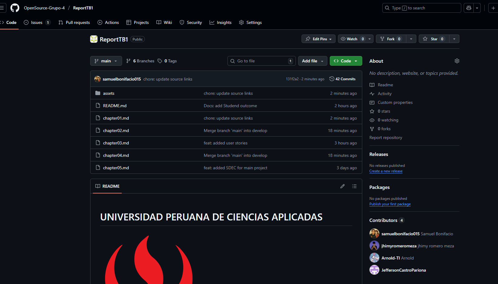

##### Web Application:

Utilizaremos Vercel para alojar nuestra Web Application.
Para lograrlo, configuraremos un proyecto en Vercel y conectaremos nuestro repositorio de GitHub. Vercel se encargará de la construcción y el despliegue de nuestra aplicación automáticamente cada vez que realicemos un push a la rama principal.

## _4.2. Landing Page & Mobile Applications Implementation_ ##

### 4.2.1. Sprint 1 ###

#### 4.2.1.1. Sprint Planning 1 ####

El Sprint Planning 1 es una reunión esencial para iniciar el primer sprint de un proyecto, donde el equipo define los objetivos y la estrategia para cumplirlos. En este caso, nuestro objetivo principal es implementar la landing page de la aplicación, asegurando una presentación efectiva del producto.

| Sprint #                           | Sprint 1                                                                                                                                                                                                                                                                   |
| ---------------------------------- |----------------------------------------------------------------------------------------------------------------------------------------------------------------------------------------------------------------------------------------------------------------------------|
| **Date**                           | 2026-07-05                                                                                                                                                                                                                                                                 |
| Time                               | 10:00 PM                                                                                                                                                                                                                                                                   |
| Location                           | Virtual - Meet                                                                                                                                                                                                                                                             |
| Prepared By                        | Gonzales Castillo Angel Martin                                                                                                                                                                                                                                             |
| Attendees (to planning meeting)    | Berrocal Ramirez Omar, Lang Nassi Werner Khalil, Jhimy Pool Romero Meza, Seijas Vásquez Diego Antonio                                                                                                                                                                      |
| Sprint n - 1 Review Summary        | sEste es el primer Sprint, por lo que ete campo no aplica.                                                                                                                                                                                                                 |
| Sprint n - 1 Retrospective Summary | Este es el primer Sprint, por lo que este campo no aplica.                                                                                                                                                                                                                 |
| Sprint 1 Goal                      | Implementar la landing page de WeRide, brindando una primera experiencia visual y funcional del producto. Este objetivo busca validar la propuesta de valor a través del diseño, estructura y navegabilidad. El éxito se medirá con el despliegue operativo de la página.  |
| Sprint 1 Velocity                  | Nuestro equipo puede aceptar hasta 17 Story Points.                                                                                                                                                                                                                        |
| Sum of Story Points                | La suma de Story Points atendidos es de 15.                                                                                                                                                                                                                                |

#### 4.2.1.2. Sprint Backlog 1 ####

#### 4.2.1.3. Development Evidence for Sprint Review 1 ####

#### 4.2.1.4. Testing Suite Evidence for Sprint Review 1 ####

#### 4.2.1.5. Execution Evidence for Sprint Review 1 ####

#### 4.2.1.6. Services Documentation Evidence for Sprint Review 1 ####

#### 4.2.1.7. Software Deployment Evidence for Sprint Review 1 ####

#### 4.2.1.8. Team Collaboration Insights during Sprint 1 ####

## _4.3. Entrevistas de validación

### 4.3.1. Diseño de entrevistas de validación  
**Segmento 1: Universitarios y Jóvenes Profesionales (B2C)**

**Preguntas principales (Landing Page):**

- "¿Qué entiendes que ofrece WeRide al ver la landing page?"
  
- "¿Cuál es el elemento que más te llama la atención o te genera confianza? (ej. precios, testimonios, método de pago)"
  
- "¿Qué información te falta para sentirte seguro al registrarte?"
  
- "¿Qué cambiarías en el diseño o en el copy para que la propuesta sea más clara?"

- "¿El llamado a la acción (CTA) es claro y te invita a registrarte o saber más?"
  
- "¿Las imágenes y gráficos reflejan la experiencia real del servicio?"

- "¿Confías en las formas de pago mostradas en la landing? ¿Por qué sí/no?"
  
- "¿La landing carga rápido y se ve bien en tu dispositivo móvil?"
  
**Preguntas principales (Frontend Web Application):**

- "Si elegiste 'Continuar como invitado', ¿te quedó claro qué funcionalidades tendrías disponibles sin registrarte?"

- "Al llegar a WeRide por primera vez, ¿qué impresión te causó la página de inicio? ¿Te resultó clara la propuesta de valor?"

- "Después de acceder, ¿te resultó intuitivo entender cómo navegar por la aplicación? ¿Qué fue lo primero que intentaste hacer?"

- "Si tuvieras que buscar el historial de tus viajes anteriores, ¿dónde buscarías primero? ¿Te parece lógica esa ubicación?"
  
- "Al buscar un vehículo, ¿la información mostrada (imagen, batería, marca, disponibilidad, precio) fue suficiente para decidir?"

- "Si todos los vehículos cercanos estuvieran ocupados, ¿qué esperarías que la app te ofreciera? (notificaciones, reserva anticipada, alternativas)"
  
- "Describe el proceso de crear una reserva: ¿hubo pasos poco claros o que te generaron dudas?"
  
- "¿Qué te pareció el proceso de pago y los formularios asociados (tarjeta, selección de plan)?"
  
- "¿Hubo algún momento en que te sentiste perdido/a o no supiste qué hacer a continuación?"

**Segmento 2: Empresas y Planes Corporativos (B2B)**

**Preguntas principales (Landing Page):**
- “Al ver la landing de WeRide, ¿qué entendiste que ofrece la plataforma específicamente para empresas?”

- “¿La propuesta de valor empresarial te pareció clara o orientada más al usuario final?”

- “¿Qué elemento visual o textual te transmitió mayor confianza para un uso corporativo?”

- “¿Qué información clave te faltó para evaluar si esto es viable para tu empresa? (precios, soporte, infraestructura, contratos, SLA, mantenimiento…)”

- “¿El CTA te orientó a una solución empresarial (‘solicitar demo’, ‘agendar llamada’, etc.) o lo sentiste más de consumo público?”

- “¿Consideras que la landing diferencia bien entre los servicios B2C y B2B?”

- “¿El diseño te transmite profesionalismo suficiente para un proveedor corporativo?”

**Preguntas principales (Frontend Web Application):**
- “¿Los empleados deberían poder reservar vehículos? ¿O prefieres uso inmediato sin reserva?”

- “En una operación real, ¿cuánto antes se planifican los desplazamientos?”

- “¿Se necesitarían restricciones personalizadas (por sede, por tipo de vehículo, por horas)?”

- “Si todos los vehículos estuvieran ocupados, ¿qué solución esperas? (lista de espera, reserva prioritaria por cargo/área, flota adicional, alertas)”

- “¿Qué tipo de procesos necesitan aprobación previa?”

- “¿Qué modelo se adapta mejor a tu empresa: pago por uso, suscripción mensual, leasing de flota, tarifa fija por empleado?”

- “¿La interfaz te transmite suficiente profesionalismo para un uso corporativo?”
  
---

### 4.3.2. Registro de entrevistas de validación  

**Segmento 1: Universitarios y Jóvenes Profesionales (B2C)**

#### Entrevista 1

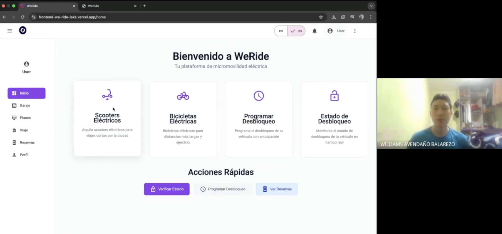

| Campo | Valor |
|-------|-------|
| **Nombre** | Williams Avendaño |
| **Edad** | 20 años |
| **Distrito** | Surco |
| **Institución** | Estudiante ESAN |
| **Video** | [https://www.youtube.com/watch?v=vxBR4mxMcmQ](https://www.youtube.com/watch?v=vxBR4mxMcmQ) |
| **Timing** | 00:00:00 – 00:10:44 |
| **Duración** | 10:44 |
| **Resumen** | Williams comenta que usa apps como Beat y scooters públicos para moverse. Le interesa WeRide porque ahorra tiempo y es más económico. Sugiere más información sobre cobertura. Valora que la app sea fácil de usar y que permita reservar vehículos. |
| **Características Objetivas** | iPhone 12, laptop ASUS; apps: Google Maps, Beat, Yape, WhatsApp. |
| **Características Subjetivas** | Organizado, práctico; prefiere marcas confiables (Apple, Nike); influenciado por amigos y TikTok. |

---

#### Entrevista 2

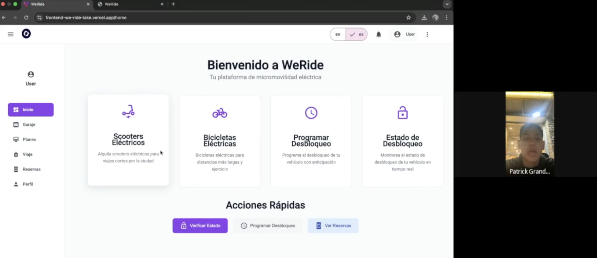

| Campo | Valor |
|-------|-------|
| **Nombre** | Patrick Cárdenas |
| **Edad** | 19 años |
| **Distrito** | Ate |
| **Institución** | Estudiante PUCP |
| **Video** | [https://www.youtube.com/watch?v=vxBR4mxMcmQ](https://www.youtube.com/watch?v=vxBR4mxMcmQ) |
| **Timing** | 00:10:45 – 00:19:15 |
| **Duración** | 8:30 |
| **Resumen** | Patrick se mueve entre casa, universidad y prácticas. Usa buses y motos por apps. Sugiere agregar un mapa de disponibilidad en tiempo real. La landing y la app le parecen claras y profesionales. |
| **Características Objetivas** | Samsung A52, laptop Lenovo; apps: Moovit, Google Maps, Uber Moto, Plin. |
| **Características Subjetivas** | Extrovertido, sociable; busca rapidez. Prefiere Samsung/Xiaomi; influido por YouTube. |

---

#### Entrevista 3

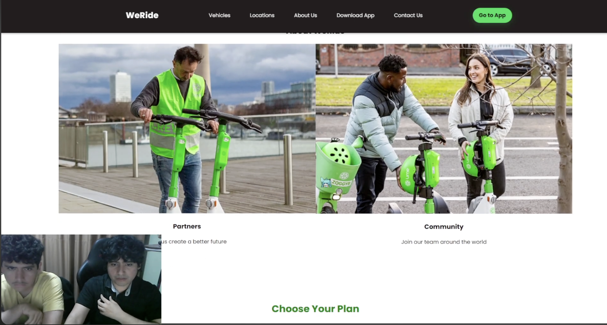

| Campo | Valor |
|-------|-------|
| **Nombre** | Patrick Correa |
| **Edad** | 20 años |
| **Distrito** | San Miguel |
| **Institución** | Estudiante Universidad de Lima |
| **Video** | [https://www.youtube.com/watch?v=vxBR4mxMcmQ](https://www.youtube.com/watch?v=vxBR4mxMcmQ) |
| **Timing** | 00:19:16 – 00:47:42 |
| **Duración** | 28:22 |
| **Resumen** | Correa usa transporte público y bicicleta. Percibe WeRide como útil si opera cerca de su universidad. Entendió bien la landing, pero pide más información sobre seguridad. La app le parece intuitiva e incluso sugiere incluir tutoriales para nuevos usuarios. |
| **Características Objetivas** | iPhone XR, iPad 8th gen; apps: Google Maps, Cabify, Duolingo, Instagram. |
| **Características Subjetivas** | Tranquilo, analítico; prefiere diseños minimalistas; influido por TikTokers y creadores estudiantiles. |

**Segmento 2: Empresas y Planes Corporativos (B2B)**

#### Entrevista 1

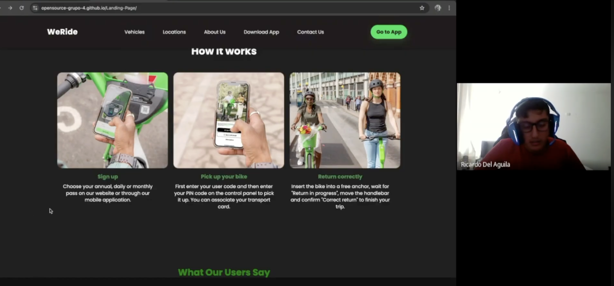

| Campo | Valor |
|-------|-------|
| **Nombre** | Ricardo Del Aguila |
| **Edad** | 27 años |
| **Distrito** | San Miguel |
| **Cargo** | Jefe de inmobiliaria Grupo Horc |
| **Video** | [https://www.youtube.com/watch?v=0qsQ9NOwHMc](https://www.youtube.com/watch?v=0qsQ9NOwHMc) |
| **Timing** | 00:00:00 – 00:13:14 |
| **Duración** | 13:14 |
| **Resumen** | Ricardo entiende que WeRide ofrece movilidad interna eficiente y controlable para empresas. La landing le pareció más dirigida al usuario final, pero identifica potencial corporativo. Señala que necesita información sobre SLA, costos y soporte técnico. Destaca que la interfaz del panel corporativo inspira confianza. Sugiere agregar casos de éxito y comparativas de ahorro. |
| **Características Objetivas** | Laptop Dell Latitude corporativa, iPhone 14 Pro; usa Slack, Microsoft Teams, Trello, Google Workspace; maneja dashboards a diario. |
| **Características Subjetivas** | Perfil analítico, orientado a procesos. Prefiere soluciones confiables y con respaldo técnico. Le influyen benchmarks y referencias de otras empresas del sector. |

---

#### Entrevista 2

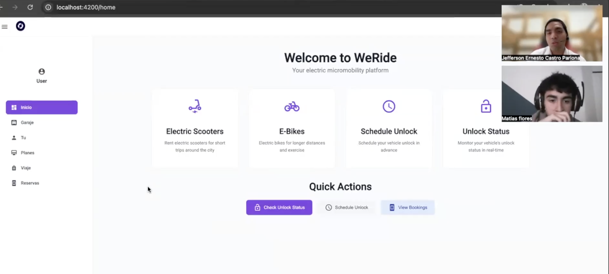

| Campo | Valor |
|-------|-------|
| **Nombre** | Matias Flores Flores |
| **Edad** | 26 años |
| **Distrito** | San Isidro |
| **Cargo** | Jefe de Recursos Humanos – empresa de servicios |
| **Video** | [https://www.youtube.com/watch?v=vxBR4mxMcmQ](https://www.youtube.com/watch?v=vxBR4mxMcmQ) |
| **Timing** | 00:13:15 – 00:22:35 |
| **Duración** | 9:20 |
| **Resumen** | Matias percibe que WeRide ofrece una alternativa sostenible de movilidad para colaboradores, reduciendo tiempos muertos. Considera que la landing transmite profesionalismo, pero falta segmentación clara B2B/B2C. Requiere información sobre modelos de pago por empleado y contratos mensuales. En el frontend destaca la necesidad de restricciones por sede y roles. También menciona que valoraría flujos de aprobación por jefatura. |
| **Características Objetivas** | iPhone 13, laptop MacBook Air M1; apps: Teams, Outlook, BambooHR, Zoom; gestión constante de personal. |
| **Características Subjetivas** | Empático, orientado a bienestar laboral. Prefiere marcas con enfoque moderno y sostenible (Apple, Notion). Influenciado por tendencias de HR Tech y recomendaciones en LinkedIn. |

---

#### Entrevista 3

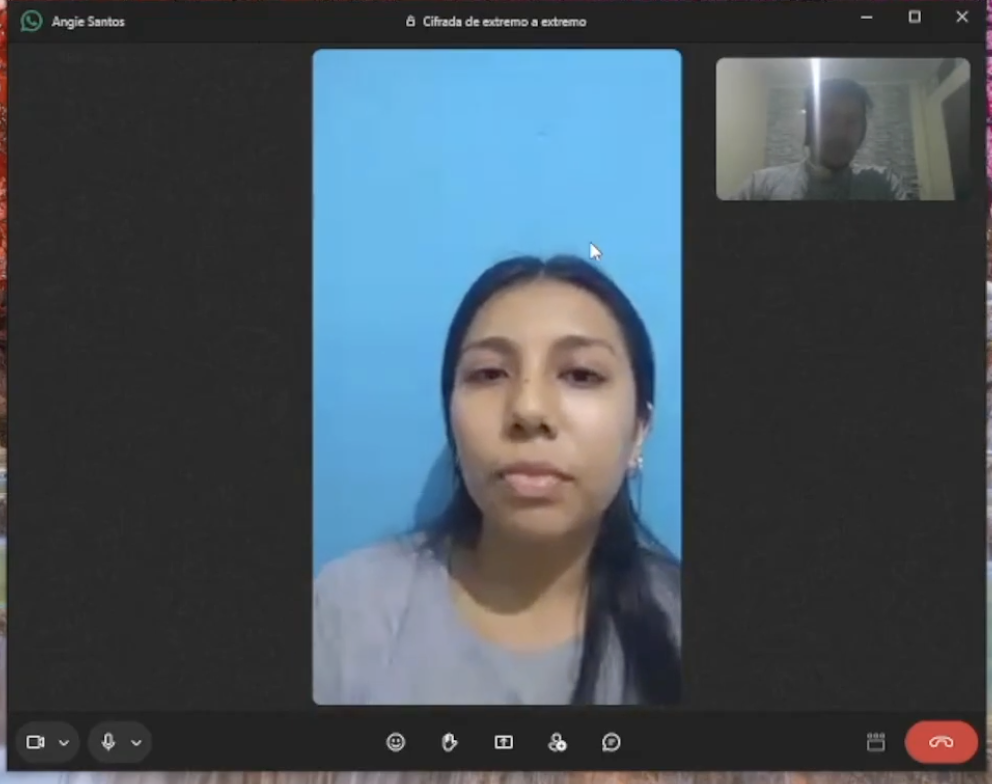

| Campo | Valor |
|-------|-------|
| **Nombre** | Angie Santos |
| **Edad** | 46 años |
| **Distrito** | Santiago de Surco |
| **Cargo** | Jefa de TI – empresa corporativa multisede |
| **Video** | [https://www.youtube.com/watch?v=vxBR4mxMcmQ](https://www.youtube.com/watch?v=vxBR4mxMcmQ) |
| **Timing** | 00:22:36 – 00:29:05 |
| **Duración** | 7:31 |
| **Resumen** | Angie entendió que WeRide puede integrarse como una solución tecnológica para movilidad interna, con trazabilidad y control. La landing le pareció visualmente sólida, pero requiere información técnica: API, integraciones, seguridad, infraestructura y tiempos de mantenimiento. En la app considera importante la disponibilidad en tiempo real y alertas automáticas. Prefiere modelos de suscripción con leasing de flota. |
| **Características Objetivas** | Laptop ThinkPad serie T, Pixel 7 Pro; apps: Azure AD, Jira, Confluence, Power BI, Google Admin; revisa métricas y KPIs a diario. |
| **Características Subjetivas** | Perfil estratégico y exigente en temas de ciberseguridad. Prefiere soluciones escalables y con soporte 24/7. Influenciada por estándares internacionales y casos de integración tecnológica. |

### 4.3.3. Evaluaciones según heurísticas  

### Auditoria del Grupo 4:

**UX Heuristics & Principles Evaluation**

**Usability – Inclusive Design – Information Architecture**

**CARRERA:** Ingeniería de Software

**CURSO:** Desarrollo de Aplicaciones Open Source

**SECCIÓN:** 7380  

**PROFESORES:** Todos

**AUDITOR:** Apaza Bocanegra, Elizabeth Noelia

**CLIENTE(S):**
- Bonifacio Jaramillo, Samuel Jesus
- Castro Pariona, Jefferson Ernesto
- Morales Sosa, Arnold Gabriel
- Romero Meza, Jhimy Pool
- Seminario Castillo, Diego Vicente

**SITE o APP A EVALUAR:** WeRide

## TAREAS A EVALUAR:

El alcance de esta evaluación incluye la revisión de la usabilidad de las siguientes tareas:

1. Falta de Login en la Landing Page.
2. Funciones Inaccesibles en el login.
3. Interfaz demasiado limpia y sin distribucion clara, imagenes demasiado grandes.
4. Cards demasiado amplias, no funciona el boton de filtrado ni el de favoritos.
5. No hay datos para Bicicletas electricas.
6. No permite Cancelar Reservas.
7. No permite Guardar nuevas reservas desde Booking.
8. La seccion de viaje en ver detalles esta inactiva.
9. El boton Pagar de la seccion planes esta inactivo.
10. Botones de la barra principal como setings, user y demas estan inactivos.
11. No hay opciones de traduccion dificultan comprension de recibos.
12. Reservar vehiculo inactivo.
13. Boton de reservar en cards tambien Inactivo.
14. No permite usar el boton edit booking.

## ESCALA DE SEVERIDAD:

Los errores serán puntuados tomando en cuenta la siguiente escala de severidad

| Nivel | Descripción                                                                                                                                                                                    |
| :---: | :--------------------------------------------------------------------------------------------------------------------------------------------------------------------------------------------- |
| 1     | Problema superficial: puede ser fácilmente superador por el usuario ó ocurre con muy poco frecuencia. No necesita ser arreglado a no ser que exista disponibilidad de tiempo.                  |
| 2     | Problema menor: puede ocurrir un poco más frecuentemente o es un poco más difícil de superar para el usuario. Se le debería asignar una prioridad baja resolverlo de cara al siguiente reléase |
| 3     | Problema mayor: ocurre frecuentemente o los usuarios no son capaces de resolverlos. Es importante que sean corregidos y se les debe asignar una prioridad alta.                                |
| 4     | Problema muy grave: un error de gran impacto que impide al usuario continuar con el uso de la herramienta. Es imperativo que sea corregido antes del lanzamiento.                              |

## TABLA RESUMEN:

| \#    | Problema                                                    | Escala de severidad | Heurística/Principio violada(o)                 |
| :---: | :---------------------------------------------------------- | :-----------------: | :---------------------------------------------- |
| 1	    | Falta de Login en la Landing Page	                          | 2	                  | Usability: Libertad y control del usuario       |
| 2	    | Funciones inaccesibles en el Login	                        | 3	                  | Usability: Visibilidad del estado del sistema   | 
| 3	    | Interfaz sin distribución clara; imágenes demasiado grandes	| 1	                  | Usability: Diseño estético y minimalista        |
| 4	    | Cards muy amplias; filtrado y favoritos inactivos	          | 3	                  | Usability: Libertad y control del usuario       |
| 5	    | No hay datos para Bicicletas Eléctricas	                    | 2	                  | Usability: Consistencia y estándares            |
| 6	    | No permite cancelar reservas	                              | 4	                  | Usability: Libertad y control del usuario       |
| 7	    | No se guardan nuevas reservas desde Booking	                | 4	                  | Usability: Prevención y recuperación de errores |
| 8	    | Sección “Viaje” en Ver Detalles inactiva	                  | 2	                  | Usability: Visibilidad del estado del sistema   |
| 9	    | Botón “Pagar” inactivo en la sección Planes	                | 3	                  | Usability: Libertad y control del usuario       |
| 10	  | Botones del menú superior (Settings, User, etc.) inactivos	| 2	                  | Usability: Visibilidad del estado del sistema   |
| 11	  | No hay traducción; dificulta comprensión de recibos	        | 1	                  | Usability: Consistencia y estándares            |
| 12	  | Función “Reservar vehículo” inactiva	                      | 4	                  | Usability: Prevención de errores                |
| 13	  | Botón reservar en las cards inactivo	                      | 3	                  | Usability: Libertad y control del usuario       |
| 14	  | Botón “Edit Booking” no funciona	                          | 3	                  | Usability: Flexibilidad y eficiencia de uso     |

## DESCRIPCIÓN DE PROBLEMAS:

## OBSERVACIÓN 1: Falta de Login en la Landing Page

- **Severidad:** 2. Heurística violada: Usabilidad – Libertad y control del usuario
- **Problema:** La Landing Page no ofrece un acceso visible hacia la pantalla de Login. El usuario no tiene una ruta clara para ingresar al sistema, generando confusión y aumentando la tasa de abandono.
- **Recomendación:** Agregar un botón visible (“Iniciar Sesión”, “Ir al Panel”), ubicado en el header o hero principal.

    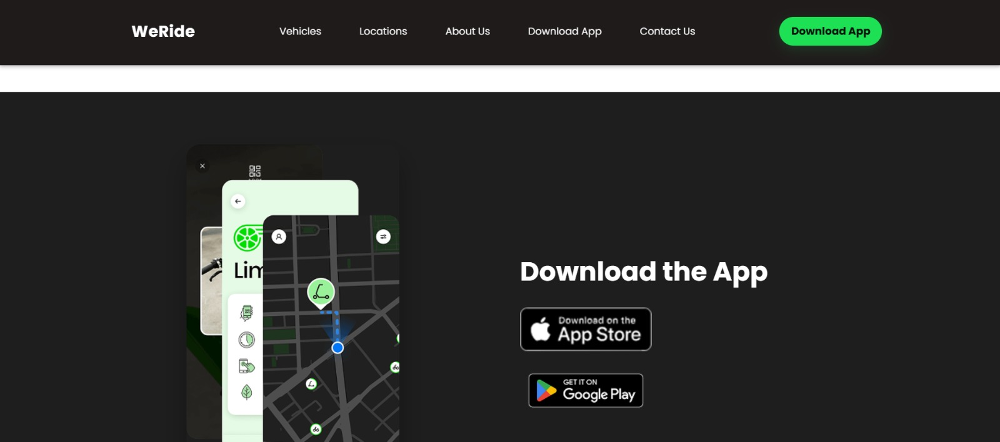    

## OBSERVACIÓN 2: Funciones inaccesibles en el Login

- **Severidad:** 3. Heurística violada: Usabilidad – Visibilidad del estado del sistema
- **Problema:** Algunas funciones de la pantalla de Login no responden o no muestran retroalimentación, como recuperación de contraseña o creación de cuenta. El usuario queda sin información sobre fallas.
- **Recomendación:** Habilitar todos los botones y agregar mensajes de feedback claros (error, éxito, pasos a seguir).

    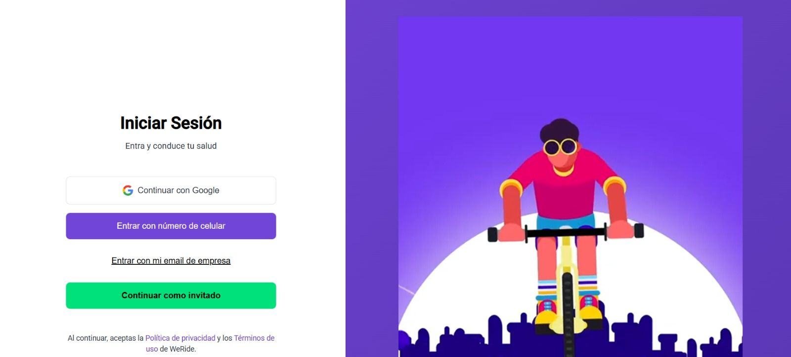    

## OBSERVACIÓN 3: Interfaz demasiado limpia, sin distribución clara e imágenes muy grandes

- **Severidad:** 1. Heurística violada: Usabilidad – Diseño estético y minimalista
- **Problema:** La interfaz presenta espacios vacíos extensos y elementos demasiado grandes, lo que dificulta encontrar las funciones principales.
- **Recomendación:** Redistribuir el layout usando jerarquía visual, reducir el tamaño de imágenes y reforzar la navegación.

    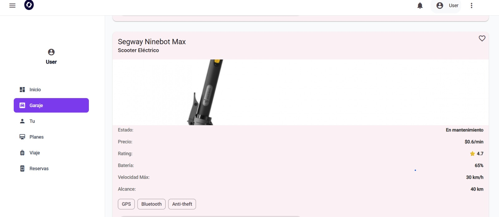    

## OBSERVACIÓN 4: Cards demasiado amplias; botones de filtrado y favoritos no funcionan

- **Severidad:** 3. Heurística violada: Usabilidad – Libertad y control del usuario
- **Problema:** Las cards ocupan demasiado espacio y los botones clave no funcionan, afectando directamente el flujo de selección de vehículos.
- **Recomendación:** Optimizar dimensiones, activar funcionalidad de filtros, favoritos y feedback visual.

    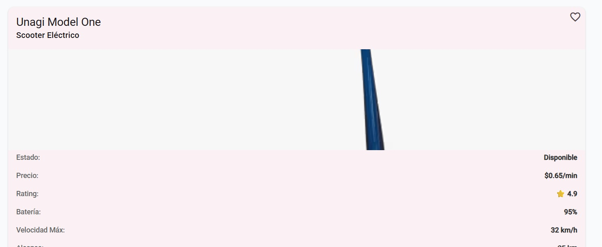    

## OBSERVACIÓN 5: No hay datos para Bicicletas eléctricas

- **Severidad:** 2. Heurística violada: Usabilidad – Consistencia y estándares
- **Problema:** La sección aparece vacía, lo que genera una experiencia inconsistente frente a otras categorías que sí muestran información.
- **Recomendación:** Cargar datos por defecto, mostrar placeholders o indicar que “Pronto habrá disponibilidad”.

    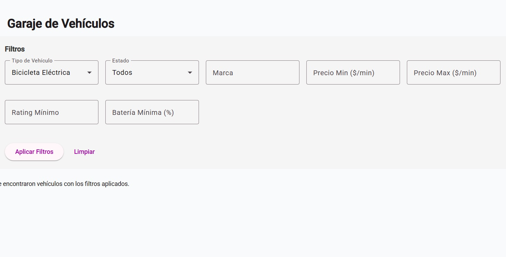    

## OBSERVACIÓN 6: No permite Cancelar Reservas

- **Severidad:** 4. Heurística violada: Usabilidad – Libertad y control del usuario
- **Problema:** Los usuarios no pueden cancelar sus reservas, bloqueando su flujo y generando frustración.
- **Recomendación:** Incorporar botón “Cancelar reserva” con confirmación de acción.

    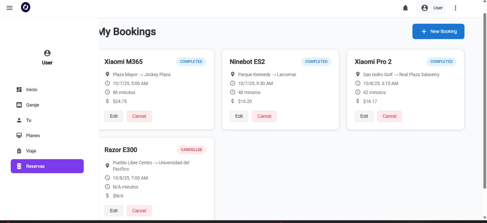    

## OBSERVACIÓN 7: No permite guardar nuevas reservas desde Booking

- **Severidad: 4**. Heurística violada: Usabilidad – Prevención y recuperación de errores
- **Problema:** El flujo de Booking falla al guardar una nueva reserva, interrumpiendo una función crítica.
- **Recomendación:** Corregir el flujo técnico y añadir mensajes que indiquen causa del error y pasos sugeridos.

    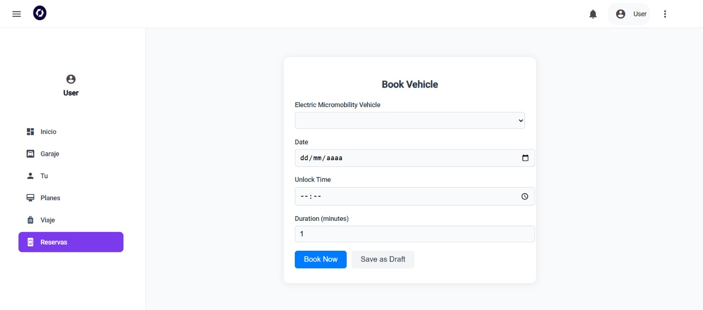    

## OBSERVACIÓN 8: La sección “Viaje” en Ver Detalles está inactiva

- **Severidad:** 2. Heurística violada: Usabilidad – Visibilidad del estado del sistema
- **Problema:** El panel “Viaje” no despliega información ni responde a la interacción. El usuario no entiende si es temporal, un error o falta de permisos.
- **Recomendación:** Activar el componente o mostrar un mensaje informativo (“Función en desarrollo”, “No hay información disponible”).

    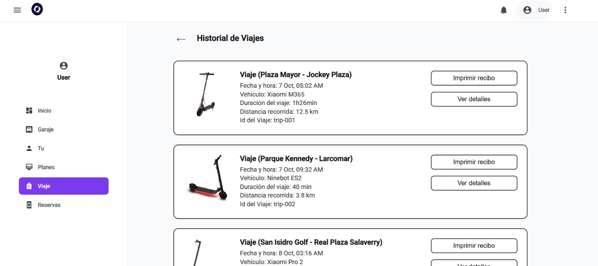    

## OBSERVACIÓN 9: El botón “Pagar” de la sección Planes está inactivo

- **Severidad:** 3. Heurística violada: Usabilidad – Libertad y control del usuario
- **Problema:** El usuario no puede completar el pago de un plan, bloqueando una acción central del modelo de negocio.
- **Recomendación:** Activar el botón, conectar el flujo a la pasarela de pago y agregar validaciones previas.

    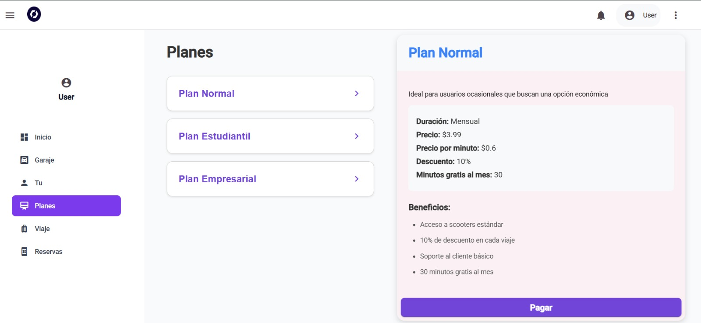    

## OBSERVACIÓN 10: Botones como Settings y User en la barra principal están inactivos

- **Severidad:** 2. Heurística violada: Usabilidad – Visibilidad del estado del sistema
- **Problema:** Los accesos principales no ejecutan acción alguna, lo que genera percepción de sistema incompleto o fallido.
- **Recomendación:** Implementar navegación interna o, al menos, mensajes temporales de “módulo en construcción”.

    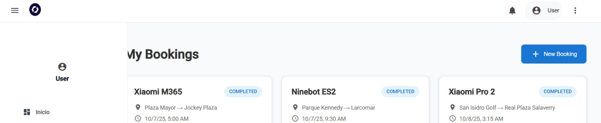    

## OBSERVACIÓN 11: No hay opciones de traducción y dificulta la comprensión de recibos

- **Severidad:** 1. Heurística violada: Usabilidad – Consistencia y estándares
- **Problema:** El contenido de recibos y pantallas clave está solo en un idioma, dificultando la comprensión para usuarios que no lo manejan.
- **Recomendación:** Integrar sistema de internacionalización (i18n) y traducciones completas.

    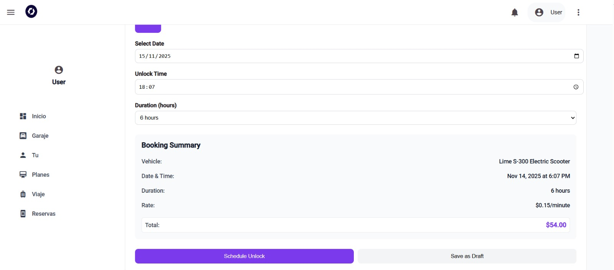    

## OBSERVACIÓN 12: Reservar vehículo está inactivo

- **Severidad:** 4. Heurística violada: Usabilidad – Prevención de errores
- **Problema:** Al intentar reservar un vehículo, el botón o acción no funciona. Esto afecta directamente la funcionalidad principal del sistema.
- **Recomendación:** Habilitar el botón, validar datos y mostrar confirmación de reserva exitosa.

    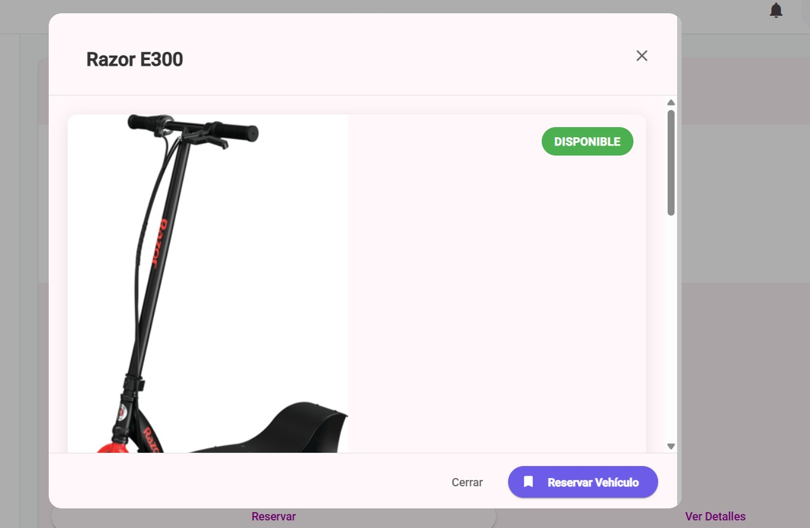    

## OBSERVACIÓN 13: Botón de reservar dentro de las cards también está inactivo

- **Severidad:** 3. Heurística violada: Usabilidad – Libertad y control del usuario
- **Problema:** El usuario no puede reservar desde la vista de cards, obligándolo a pasos adicionales o impidiendo continuar.
- **Recomendación:** Activar interacción, añadir feedback visual y redirigir al flujo de Booking.

    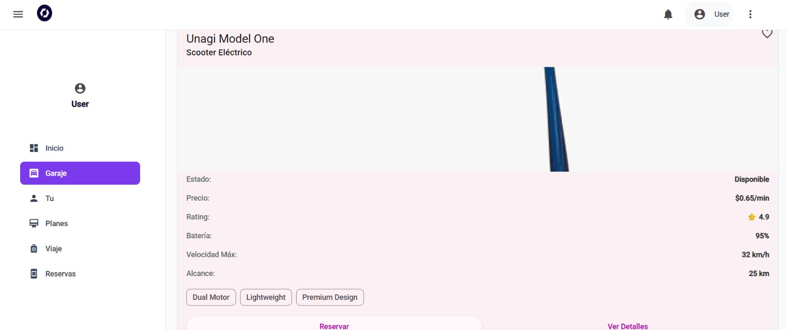    

## OBSERVACIÓN 14: No permite usar el botón “Edit Booking”

- **Severidad:** 3. Heurística violada: Usabilidad – Flexibilidad y eficiencia de uso
- **Problema:** El botón para editar una reserva no responde, y el usuario no puede modificar fechas, horarios o vehículo seleccionado.
- **Recomendación:** Implementar formulario editable, mensajes de validación y confirmación de cambios.

    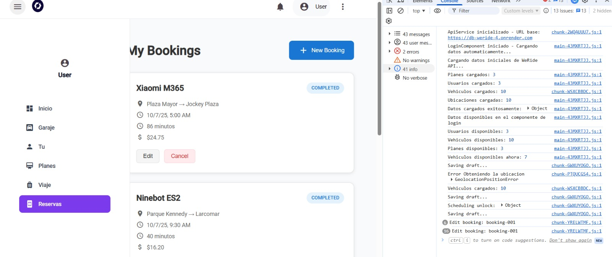    

---
