<br></br>
<p align="center">
  
</p>

## **<p align="center"><strong>Universidad Peruana de Ciencias Aplicadas</strong></p>**

<p align="center"><strong>Ingeniería de Software</strong><br>
Periodo: 202601 <br>
1ACC0238 - Aplicaciones para dispositivos moviles <br>
NRC: 3248
<br>
<strong>Docente: David Gerardo Quevedo Velasco</strong> </p>

## <h2 align="center">Informe del Trabajo Final</h2>

<h3 align="center">Startup: WeTech</h3>
<p align="center"><strong>Producto: WeRide</strong></p>

<h3 align="center">Team Members:</h3>

<div align="center">
<p align="=center">
Gonzales Castillo Angel Martin- U202319724  <br>  
Berrocal Ramirez Omar - U20201B529  <br> 
Lang Nassi Werner Khalil - U202310003 <br>
Jhimy Pool Romero Meza - U202321510 <br>
Seijas Vásquez Diego Antonio - U202210167 </p>


</div>

<p align="center"><strong>Mayo 2026</strong></p>

<!-- salto de hoja-->
<div style="page-break-before: always;"></div>

# Registro de Versiones del Informe

El objetivo de esta sección es resumir las modificaciones relevantes que se realizan al informe durante el ciclo de vida del proyecto.  

<div style="display: flex; justify-content: center; margin-top: 12px;">

<table style="border-collapse: collapse; width: 85%; text-align: left; font-family: Arial, sans-serif;">
  <caption style="caption-side: top; text-align: left; font-weight: bold; margin-bottom: 8px;">Tabla: Registro de versiones</caption>
  <thead>
    <tr>
      <th style="background-color: #222; color: #fff; padding: 10px; border: 1px solid #444; width: 12%;">Versión</th>
      <th style="background-color: #222; color: #fff; padding: 10px; border: 1px solid #444; width: 18%;">Fecha</th>
      <th style="background-color: #222; color: #fff; padding: 10px; border: 1px solid #444; width: 20%;">Autor</th>
      <th style="background-color: #222; color: #fff; padding: 10px; border: 1px solid #444;">Descripción de modificación</th>
    </tr>
  </thead>
  <tbody>
    <tr>
      <td style="padding: 10px; border: 1px solid #ccc; font-weight: bold;">V1.0</td>
      <td style="padding: 10px; border: 1px solid #ccc;">23 de Abril 2026</td>
      <td style="padding: 10px; border: 1px solid #ccc;">G2 WeTech</td>
      <td style="padding: 10px; border: 1px solid #ccc;">Versión inicial del informe: se completaron los 2 primeros capítulos.</td>
    </tr>
  </tbody>
   <tbody>
    <tr>
      <td style="padding: 10px; border: 1px solid #ccc; font-weight: bold;">V2.0</td>
      <td style="padding: 10px; border: 1px solid #ccc;">13 de Mayo 2026</td>
      <td style="padding: 10px; border: 1px solid #ccc;">G2 WeTech</td>
      <td style="padding: 10px; border: 1px solid #ccc;">Segunda Version del informe: se completaron los capitulos 3 y 4.</td>
    </tr>
  </tbody>
   <tbody>
    <tr>
      <td style="padding: 10px; border: 1px solid #ccc; font-weight: bold;">V3.0</td>
      <td style="padding: 10px; border: 1px solid #ccc;">6 de Junio 2026</td>
      <td style="padding: 10px; border: 1px solid #ccc;">G2 WeTech</td>
      <td style="padding: 10px; border: 1px solid #ccc;">Tercera Version del informe: Se desarollo el sprint 2.</td>
    </tr>
  </tbody>
  
</table>

</div>


# Project Report Collaboration Insights

Para la elaboración del informe del proyecto utilizamos GitHub como herramienta principal para la organización, control de versiones y colaboración del equipo.  
A través del repositorio del informe registramos cambios, realizamos revisiones continuas y mantenemos el historial de actualizaciones alineado con cada entrega del curso.

### Repositorios relevantes
- https://github.com/Grupo-2-Aplicaciones-Moviles/Project-Report

---

## Entrega AV1: V1.0

En esta primera entrega se redactó el informe del proyecto hasta el punto 2.6.3.6.2 (Bounded Context Domain Layer Class Diagrams). Durante este proceso se realizaron diversas actividades, siendo las más relevantes: la definición de los antecedentes y problematicas identificados, la implementación del Lean UX Canvas, analisis de competidores, creación de artefactos (User Personas, Task Matrix, etc), redacción de User Stories, Event Storming, diseño de los diagramas C4 Model (Contexto y Contenedores) y diagramas de los Bounded Context.

Para evidenciar nuestros avances y la colaboración en el proyecto, se utilizó GitHub como plataforma principal de gestión de versiones y control de cambios. A continuación, se presentan algunos insights relevantes sobre la colaboración en el desarrollo del informe:

### Evidencias
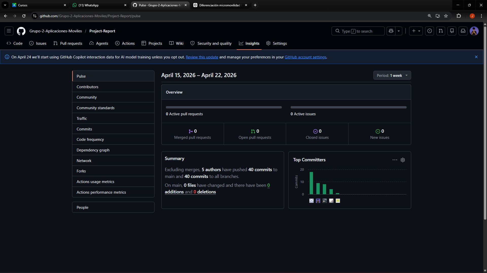
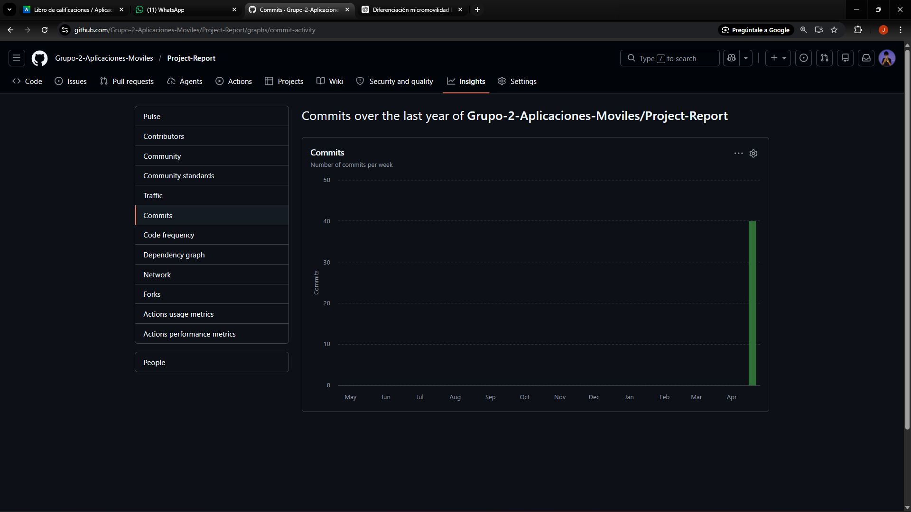
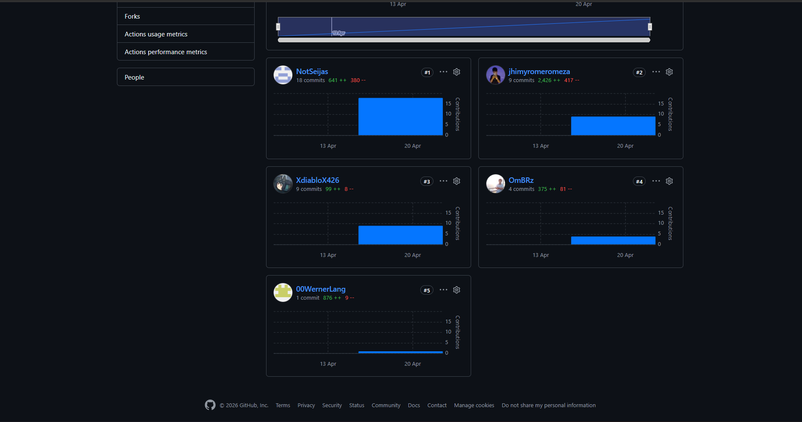

---

## Entrega TB1: V2.0

En esta segunda entrega se redactó el informe del proyecto hasta el punto correspondiente al desarrollo y validación de la solución propuesta. Durante este proceso se realizaron diversas actividades relevantes, entre ellas: la planificación y organización del Sprint 1 mediante el Sprint Planning y Sprint Backlog, el diseño de la interfaz de la Landing Page y de la aplicación móvil (Wireflows, Wireframes, Mock-Ups, Userflows y Prototyping), la definición de la arquitectura de información y lineamientos de estilo, así como la gestión de configuración del software. Además, se documentaron las evidencias de desarrollo, testing, ejecución, despliegue y documentación de servicios para el Sprint Review 1. Finalmente, se llevaron a cabo actividades de validación de la solución, incluyendo el diseño y registro de entrevistas de validación, evaluaciones heurísticas y el análisis de colaboración del equipo durante el Sprint 1.

Para evidenciar nuestros avances y la colaboración en el proyecto, se utilizó GitHub como plataforma principal de gestión de versiones y control de cambios. A continuación, se presentan algunos insights relevantes sobre la colaboración en el desarrollo del informe:

### Evidencias


---


## Entrega AV2: V3.0

En esta tercera entrega se redactó el informe del proyecto hasta el punto correspondiente a la validación final de la solución propuesta. Durante este proceso se realizaron diversas actividades relevantes, entre ellas: la planificación y organización del Sprint 2 mediante el Sprint Planning y Sprint Backlog, el desarrollo de la aplicación móvil Android con funcionalidades de autenticación, búsqueda de vehículos, reservas y gestión de perfil, así como el desarrollo de servicios backend para soportar estas funcionalidades. Además, se documentaron las evidencias de desarrollo, testing, ejecución, despliegue y documentación de servicios para el Sprint Review 2. 


---


## Contenido

### Tabla de contenidos

- [Student Outcome](#student-outcome-ver-anexo-a)
- [Objetivos SMART](#objetivos-smart)
- [Capítulo I: Presentación](#capítulo-i-presentación)

    - [1.1. Startup Profile](#11-startup-profile)
        - [1.1.1. Descripción de la Startup](#111-descripción-de-la-startup)
        - [1.1.2. Perfiles de integrantes del equipo](#112-perfiles-de-integrantes-del-equipo)
    - [1.2. Solution Profile](#12-solution-profile)
        - [1.2.1. Antecedentes y problemática](#121-antecedentes-y-problemática)
        - [1.2.2. Lean UX Process](#122-lean-ux-process)
            - [1.2.2.1. Lean UX Problem Statements](#1221-lean-ux-problem-statements)
            - [1.2.2.2. Lean UX Assumptions](#1222-lean-ux-assumptions)
            - [1.2.2.3. Lean UX Hypothesis Statements](#1223-lean-ux-hypothesis-statements)
            - [1.2.2.4. Lean UX Canvas](#1224-lean-ux-canvas)
    - [1.3. Segmentos objetivo](#13-segmentos-objetivo)

- [Capítulo II: Requirements Development and Software Solution Design](#capítulo-ii-requirements-development-and-software-solution-design)
    - [2.1. Competidores](#21-competidores)
        - [2.1.1. Análisis competitivo](#211-análisis-competitivo)
        - [2.1.2. Estrategias y tácticas frente a competidores](#212-estrategias-y-tácticas-frente-a-competidores)
    - [2.2. Entrevistas](#22-entrevistas)
        - [2.2.1. Diseño de entrevistas](#221-diseño-de-entrevistas)
        - [2.2.2. Registro de entrevistas](#222-registro-de-entrevistas)
        - [2.2.3. Análisis de entrevistas](#223-análisis-de-entrevistas)
    - [2.3. Needfinding](#23-needfinding)
        - [2.3.1. User Personas](#231-user-personas)
        - [2.3.2. User Task Matrix](#232-user-task-matrix)
        - [2.3.3. User Journey Mapping](#233-user-journey-mapping)
        - [2.3.4. Empathy Mapping](#234-empathy-mapping)
        - [2.3.5. Ubiquitous Language](#235-ubiquitous-language)
    - [2.4. Requirements specification](#24-requirements-specification)
        - [2.4.1. User Stories](#241-user-stories)
        - [2.4.2. Impact Mapping](#242-impact-mapping)
        - [2.4.3. Product Backlog](#243-product-backlog)
    - [2.5. Strategic-Level Domain-Driven Design](#25-strategic-level-domain-driven-design)
        - [2.5.1. EventStorming](#251-eventstorming)
            - [2.5.1.1. Candidate Context Discovery](#2511-candidate-context-discovery)
            - [2.5.1.2. Domain Message Flows Modeling](#2512-domain-message-flows-modeling)
            - [2.5.1.3. Bounded Context Canvases](#2513-bounded-context-canvases)
        - [2.5.2. Context Mapping](#252-context-mapping)
        - [2.5.3. Software Architecture](#253-software-architecture)
            - [2.5.3.1. Software Architecture Context Level Diagrams](#2531-software-architecture-context-level-diagrams)
            - [2.5.3.2. Software Architecture Container Level Diagrams](#2532-software-architecture-container-level-diagrams)
            - [2.5.3.3. Software Architecture Deployment Diagrams](#2533-software-architecture-deployment-diagrams)
    - [2.6. Tactical-Level Domain-Driven Design](#26-tactical-level-domain-driven-design)
        - [2.6.x. Bounded Context: <Bounded Context Name>](#26x-bounded-context-bounded-context-name)
            - [2.6.x.1. Domain Layer](#26x1-domain-layer)
            - [2.6.x.2. Interface Layer](#26x2-interface-layer)
            - [2.6.x.3. Application Layer](#26x3-application-layer)
            - [2.6.x.4. Infrastructure Layer](#26x4-infrastructure-layer)
            - [2.6.x.5. Bounded Context Software Architecture Component Level Diagrams](#26x5-bounded-context-software-architecture-component-level-diagrams)
            - [2.6.x.6. Bounded Context Software Architecture Code Level Diagrams](#26x6-bounded-context-software-architecture-code-level-diagrams)
                - [2.6.x.6.1. Bounded Context Domain Layer Class Diagrams](#26x61-bounded-context-domain-layer-class-diagrams)
                - [2.6.x.6.2. Bounded Context Database Design Diagram](#26x62-bounded-context-database-design-diagram)

---  

# Student Outcome

### ABET - EAC - Student Outcome 7

Criterio: La capacidad de adquirir y aplicar nuevos conocimientos según sea
necesario, utilizando estrategias de aprendizaje apropiadas.

En el siguiente cuadro se describe las acciones realizadas y enunciados de conclusiones
por parte del grupo, que permiten sustentar el haber alcanzado el logro del ABET –
EAC - Student Outcome 7.


<table style="width:100%; border-collapse:collapse; text-align:left; font-size:14px;">
  <thead>
    <tr style="background:#f2f2f2;">
      <th style="border:1px solid #999; padding:8px; font-weight:bold; text-align:center;">Criterio Específico</th>
      <th style="border:1px solid #999; padding:8px; font-weight:bold; text-align:center;">Acciones Realizadas</th>
      <th style="border:1px solid #999; padding:8px; font-weight:bold; text-align:center;">Conclusiones</th>
    </tr>
  </thead>

  <tbody>
    <!-- CRITERIO 1 -->
    <tr>
      <td style="border:1px solid #999; padding:8px; vertical-align:top; font-weight:bold;">
        Actualiza conceptos y conocimientos necesarios para su desarrollo profesional y en especial para su proyecto en soluciones de software.
      </td>
      <td style="border:1px solid #999; padding:8px; vertical-align:top;">
        <strong>Seijas Vásquez Diego Antonio</strong>
        <ul style="margin:4px 0 10px; padding-left:20px;">
          <li><b>AV1:</b> Repasé mis conceptos de Event Storming y como hacer los moledos de message flows y bounded context canvases.</li>
          <li><b>TB1:</b> Reforcé mis conocimientos en diseño UI/UX mediante la elaboración de mockups, userflows y prototipos para la aplicación móvil, considerando principios de usabilidad y experiencia de usuario.</li>
        </ul>
        <strong>Romero Meza Jhimy Pool</strong>
        <ul style="margin:4px 0 10px; padding-left:20px;">
          <li><b>AV1:</b> Utilicé entrevistas y herramientas de needfinding (user personas, task matrix, journey mapping y empathy mapping) que me permitieron tener un mejor panorama de los usuarios para detectar oportunidades y afianzar la importancia de seguir aprendiendo.</li>
          <li><b>TB1:</b> Profundicé mis conocimientos sobre validación de soluciones digitales aplicando entrevistas y evaluaciones heurísticas para identificar problemas de usabilidad y oportunidades de mejora.</li>
        </ul>
        <strong>Lang Nassi Werner Khalil</strong>
        <ul style="margin:4px 0 10px; padding-left:20px;">
          <li><b>AV1:</b> Repasé conceptos de las capas del desarrollo con Bounded context para poder documentar su implementación en nuestro proyecto.</li>
          <li><b>TB1:</b> Reforcé conceptos relacionados con testing, despliegue y documentación de servicios para evidenciar correctamente el desarrollo y funcionamiento de la solución implementada.</li>
        </ul>
        <strong>Berrocal Ramirez Omar Christian</strong>
        <ul style="margin:4px 0 10px; padding-left:20px;">
          <li><b>AV1:</b> Repasé mis conceptos de la capa de infraestrutuca y diagramas c4, diagramas de clase y diagramas de base de datos, con la finalidad de realizarlos por cada bounded context identificado para el proyecto.</li>
           <li><b>TB1:</b> Actualicé mis conocimientos sobre metodologías ágiles y planificación Scrum mediante la elaboración del Sprint Planning, Sprint Backlog y el diseño visual inicial de la Landing Page.</li>
        </ul>
        <strong>Gonzales Castillo Angel Martin</strong>
        <ul style="margin:4px 0 10px; padding-left:20px;">
          <li><b>AV1:</b> Utilicé mis conocimientos en diagramas de C4 para hacer los diagramas de nivel contexto.</li>
          <li><b>TB1:</b> Reforcé mis conocimientos en arquitectura de información, lineamientos de diseño y elaboración de wireflows y wireframes para mejorar la organización y navegación de la aplicación móvil.</li>
        </ul>
      </td>
      <td style="border:1px solid #999; padding:8px; vertical-align:top;">
        <ul style="margin:4px 0 10px; padding-left:20px;">
            <p><b>AV1:</b> Como equipo repasamos conceptos vistos anteriormente, como Event Storming, Scrum, patrones de diseño de software, Domain Driven Design, diagramas y métodos ágiles, demostrando así la necesidad de poner en práctica constantemente lo aprendido para su uso en proyectos de software.</p>
      <p><b>TB1:</b> Como equipo reforzamos conocimientos relacionados con metodologías ágiles, diseño UI/UX, arquitectura de información, validación de soluciones, testing y despliegue de software, aplicando estos conceptos en el desarrollo y documentación del Sprint 1 del proyecto.</p>
        </ul>
      </td>
    </tr>
    <!-- CRITERIO 2 -->
    <tr>
      <td style="border:1px solid #999; padding:8px; vertical-align:top; font-weight:bold;">
        Reconoce la necesidad del aprendizaje permanente para el desempeño profesional y el desarrollo de proyectos en soluciones de software.
      </td>
      <td style="border:1px solid #999; padding:8px; vertical-align:top;">
        <strong>Seijas Vásquez Diego Antonio</strong>
        <ul style="margin:4px 0 10px; padding-left:20px;">
          <li><b>AV1:</b> Realizar los messages flows y bounded context canvases me dió un mejor panorama y comprensión del proyecto. Gracias a ello podré absorlver cualquier duda y apoyar a mis compañeros.</li>
          <li><b>TB1:</b> Elaborar mockups, userflows y prototipos me permitió comprender la importancia de mantenerse actualizado en tendencias de diseño UI/UX para desarrollar aplicaciones más intuitivas y funcionales.</li>
        </ul>
        <strong>Romero Meza Jhimy Pool</strong>
        <ul style="margin:4px 0 10px; padding-left:20px;">
          <li><b>AV1:</b> Documentar de manera detallada las necesidades de los usuario y las historias de usuario me permitió compender que es lo que se necesita para que nuestro proyecto tenga éxito.</li>
          <li><b>TB1:</b> Realizar entrevistas de validación y evaluaciones heurísticas me ayudó a reconocer la importancia de aprender continuamente nuevas técnicas de evaluación para mejorar la experiencia de usuario.</li>
        </ul>
        <strong>Lang Nassi Werner Khalil</strong>
        <ul style="margin:4px 0 10px; padding-left:20px;">
          <li><b>AV1:</b> Comprender el funcionamiento de cada capa y como estas se comunican entre sí en el desarrollo de software me ayuda a tener una mejor comprensión del flujo de nuestro producto de software.</li>
          <li><b>TB1:</b> Trabajar en evidencias de testing, despliegue y documentación de servicios me permitió reconocer la necesidad de seguir aprendiendo herramientas y buenas prácticas para garantizar la calidad del software.</li>
        </ul>
        <strong>Berrocal Ramirez Omar Christian</strong>
        <ul style="margin:4px 0 10px; padding-left:20px;">
          <li><b>AV1:</b> Volver a realizar diagramas me ayudó a comprender lo importante que es la planificación en un proyecto para seguir estandares de calidad y realizar un buen producto de software.</li>
          <li><b>TB1:</b> Participar en la planificación del Sprint y en el diseño de la Landing Page reforzó la importancia de seguir aprendiendo metodologías ágiles y herramientas de diseño para organizar eficientemente el trabajo del equipo.</li>
        </ul>
        <strong>Gonzales Castillo Angel Martin</strong>
        <ul style="margin:4px 0 10px; padding-left:20px;">
          <li><b>AV1:</b> Revisar que nuevos conceptos surgieron en los ultimos años es importante para poder plantear una infraestructura que siga los estándares y sea seguro.</li>
          <li><b>TB1:</b> Desarrollar wireflows, wireframes y lineamientos de diseño me permitió reconocer la importancia de actualizar constantemente conocimientos en arquitectura de información y experiencia de usuario.</li>
        </ul>
      </td>
      <td style="border:1px solid #999; padding:8px; vertical-align:top;">
        <ul style="margin:4px 0 10px; padding-left:20px;">
                <p><b>AV1:</b> Como equipo reconocemos que el aprendizaje permanente es fundamental para estar siempre a la vanguardia y mantener la calidad de nuestro producto. Identificar las nuevas tendencias de tecnologías y metodologías nos ayudará a elegir las mejores alternativas de desarrollo a lo largo del proyecto.</p>
      <p><b>TB1:</b> Como equipo comprendimos que el aprendizaje continuo es clave para adaptarnos a nuevas herramientas, metodologías ágiles y tendencias de diseño y validación, permitiéndonos mejorar constantemente la calidad y funcionalidad de nuestra solución de software.</p>
        </ul>
      </td>
    </tr>

  </tbody>
</table>

---

# Objetivos SMART

**Berrocal Ramirez Omar Christian:**

- **Objetivo 1:** Obtener la certificación ISTQB Foundation Level dentro de los próximos 3 meses de egresado, estudiando almenos 6 horas semanales para potenciar mi perfil profesional y aumentar mis opotunidades laborales en el campo de pruebas de software.
- **Objetivo 2:** Mejorar mis habilidades de comunicación en inglés técnico, alcanzando un nivel C1 en el examen Linguaskill dentro de los próximos 2 meses, mediante la práctica diaria de lectura y escritura de documentos técnicos y la participación en foros especializados.

**Gonzales Castillo Angel Martin:**

- **Objetivo 1:** Obtener al menos 2 certificaciones profesionales relacionadas a bd y frontend dentro de los primeros 12 meses después de egresar, dedicando un mínimo de 8 horas semanales al estudio y práctica
- **Objetivo 2:** Conseguir un empleo formal en el área de desarrollo de software dentro de los 6 meses posteriores a la graduación, enviando al menos 10 postulaciones semanales, participando en 2 ferias laborales y mejorando continuamente el portafolio con mínimo 3 proyectos personales relevantes.

**Lang Nassi Werner Khalil:**

- **Objetivo 1:** Obtener una certificacion en Deep Learning dentro de los próximos 4 meses, incrementando mis capacidades y dar lugar a una mejora en el portafolio.
- **Objetivo 2:** Desarrollar y desplegar al menos 4 SAAS en el plazo de este ciclo académico con el fin de reforzar mis conocimientos y aprender a usar nuevas herramientas, así mismo mejorar con las ya conocidas. Lograr hacer deploys en servidores propios haciendo todo el proceso de deploy desde 0 sin uso de herramientas 3eras con el fin de practicar técnicas de seguridad de servidores y entender su funcionamiento a mayor nivel práctico y no solo teórico.

**Jhimy Pool Romero Meza:**

- **Objetivo 1:**
  Desarrollar y desplegar un prototipo funcional de la plataforma WeTech Micromobility en un plazo de 4 meses, implementando al menos los módulos principales (gestión de usuarios, reservas, visualización de scooters y optimización básica de rutas), dedicando un mínimo de 8 horas semanales, con el fin de validar la propuesta tecnológica y fortalecer mi portafolio profesional en desarrollo de software.
- **Objetivo 2:**
  Implementar un sistema de optimización y seguridad de rutas dentro de la aplicación WeTech en un plazo de 3 meses, integrando datos de geolocalización y zonas de riesgo, dedicando al menos 7 horas semanales al desarrollo, con el fin de ofrecer una experiencia de movilidad más eficiente y segura para los usuarios.

**Seijas Vásquez Diego Antonio:**

- **Objetivo 1:** Desarrollar y desplegar una aplicación web full stack funcional en un plazo de 2 meses, utilizando tecnologías como React y .NET, dedicando al menos 10 horas semanales al desarrollo, con el fin de fortalecer mis habilidades prácticas y contar con un proyecto sólido para mi portafolio profesional.
- **Objetivo 1:** Conseguir mi primer empleo como desarrollador junior en un periodo máximo de 4 meses, postulando a al menos 5 ofertas laborales por semana y mejorando continuamente mi CV y portafolio, para iniciar mi experiencia profesional en el área de desarrollo de software.


---

---

# Capitulo I: Introducción

## 1.1. Startup Profile

### 1.1.1. Descripción de la Startup

Somos WeTech, interesados en el desarrollo de soluciones de micromovilidad eléctrica compartida, integrando tecnología de vanguardia en transporte urbano. 

Buscamos transformar la movilidad urbana en Lima  ofreciendo un transporte rápido, económico, sostenible y adaptado a la realidad peruana.

<div style="display:flex; justify-content:center; margin-top:18px;">
  <table style="width:95%; max-width:900px; border-collapse:collapse; font-family:Arial, sans-serif; font-size:14px;">
    <caption style="caption-side:top; text-align:left; font-weight:bold; margin-bottom:8px;">Misión, Visión y Valores — WeTech</caption>
    <thead>
      <tr>
        <th style="background:#222; color:#fff; padding:12px; border:1px solid #ccc; text-align:left;">Misión</th>
        <th style="background:#222; color:#fff; padding:12px; border:1px solid #ccc; text-align:left;">Visión</th>
        <th style="background:#222; color:#fff; padding:12px; border:1px solid #ccc; text-align:left;">Valores</th>
      </tr>
    </thead>
    <tbody>
      <tr>
        <td style="padding:12px; border:1px solid #ddd; vertical-align:top;">
          <ul style="margin:0; padding-left:18px;">
            <li>Impulsar la transición hacia una movilidad urbana sostenible en el Perú.</li>
            <li>Ofrecer alternativas de transporte compartido que reduzcan el tráfico y las emisiones.</li>
            <li>Mejorar la calidad de vida de nuestros usuarios mediante servicios accesibles y seguros.</li>
          </ul>
        </td>
        <td style="padding:12px; border:1px solid #ddd; vertical-align:top;">
          <ul style="margin:0; padding-left:18px;">
            <li>Ser la opción principal en micromovilidad eléctrica en Lima y otras ciudades del Perú.</li>
            <li>Ser reconocidos por la innovación, el impacto social y por contribuir a ciudades más limpias y conectadas.</li>
          </ul>
        </td>
        <td style="padding:12px; border:1px solid #ddd; vertical-align:top;">
          <ul style="margin:0; padding-left:18px;">
            <li><strong>Confidencialidad:</strong> Protección de vehículos y datos de clientes.</li>
            <li><strong>Innovación:</strong> Mejora continua del servicio y la plataforma.</li>
            <li><strong>Sostenibilidad:</strong> Compromiso con soluciones que reduzcan el impacto ambiental.</li>
            <li><strong>Accesibilidad:</strong> Servicios diseñados para ser económicos y fáciles de usar.</li>
          </ul>
        </td>
      </tr>
    </tbody>
  </table>
</div>

### 1.1.2. Perfiles de los miembros del equipo

<table style="width:100%; border-collapse: collapse; font-family: Arial, sans-serif; font-size: 12px; table-layout: fixed;">
  <thead>
    <tr>
      <th style="padding: 10px; border: 1px solid #aaa; background:#f2f2f2; width: 28%;">Integrantes</th>
      <th style="padding: 10px; border: 1px solid #aaa; background:#f2f2f2; width: 18%;">Foto</th>
      <th style="padding: 10px; border: 1px solid #aaa; background:#f2f2f2;">Descripción del perfil</th>
    </tr>
  </thead>

  <tbody>
    <tr>
      <td style="padding: 10px; border: 1px solid #aaa;">
        Gonzales Castillo, Angel Martin<br>
        <span style="font-size:11px; color:#555;">(U202319724)</span>
      </td>
      <td style="padding: 10px; border: 1px solid #aaa; text-align:center;">
        
      </td>
      <td style="padding: 10px; border: 1px solid #aaa; text-align: justify;">
        Mi nombre es Martin Gonzales, tengo 20 años y estoy cursando mi 7to ciclo de la carrera de Ingeniería de Software en la UPC. Me caracterizo por mi interés en la programación, la tecnología y el aprendizaje continuo. Tengo una actitud analítica y organizada, lo que me permite desarrollar proyectos académicos y prácticos con dedicación, buscando siempre aplicar los conocimientos adquiridos de manera efectiva.
      </td>
    </tr>
    <tr>
      <td style="padding: 10px; border: 1px solid #aaa;">
        Berrocal Ramirez, Omar Christian<br>
        <span style="font-size:11px; color:#555;">(U20201B529)</span>
      </td>
      <td style="padding: 10px; border: 1px solid #aaa; text-align:center;">
        
      </td>
      <td style="padding: 10px; border: 1px solid #aaa; text-align: justify;">
        Soy estudiante de la carrera de Ingeniería de Software en la Universidad Peruana de Ciencias Aplicadas (UPC). Me considero una persona que le gusta asumir nuevos retos y muy capaz. Además considero importante la cualidad de saber escuchar y respetar la opinión de los demás, así se aprende algo nuevo siempre. Mis hoobies son el baile y los videojuegos, siendo este último que me hizo optar por una carrera relacionada a la tecnología y mis gustos.
      </td>
    </tr>
    <tr>
      <td style="padding: 10px; border: 1px solid #aaa;">
        Romero Meza, Jhimy Pool<br>
        <span style="font-size:11px; color:#555;">(U202321510)</span>
      </td>
      <td style="padding: 10px; border: 1px solid #aaa; text-align:center;">
        
      </td>
      <td style="padding: 10px; border: 1px solid #aaa; text-align: justify;">
        Estudiante de Ingeniería de Software (6to ciclo). Se destaca por su responsabilidad, compromiso y disposición constante para colaborar. Cuenta con conocimientos previos en tecnología y en el desarrollo de proyectos, demostrando iniciativa y capacidad de aprendizaje autónomo.
      </td>
    </tr>
    <tr>
      <td style="padding: 10px; border: 1px solid #aaa;">
        Seijas Vásqiez, Diego Antonio<br>
        <span style="font-size:11px; color:#555;">(U202210167)</span>
      </td>
      <td style="padding: 10px; border: 1px solid #aaa; text-align:center;">
        
      </td>
      <td style="padding: 10px; border: 1px solid #aaa; text-align: justify;">
        Estudiante de Ingeniería de Software. Se caracteriza por su responsabilidad y su enfoque orientado a resultados de calidad. Mantiene una actitud innovadora y práctica, participando activamente en el trabajo colaborativo y en la búsqueda de soluciones eficientes.
      </td>
    </tr>
    <tr>
      <td style="padding: 10px; border: 1px solid #aaa;">
        Lang Nassi, Werner Khalil<br>
        <span style="font-size:11px; color:#555;">(u202310003)</span>
      </td>
      <td style="padding: 10px; border: 1px solid #aaa; text-align:center;">
        
      </td>
      <td style="padding: 10px; border: 1px solid #aaa; text-align: justify;">
        Estudiante de la Universidad Peruana de Ciencias Aplicadas (UPC), cursando en 7.º ciclo. Soy un estudiante que le gusta investigar cosas nuevas.
      </td>
    </tr>
  </tbody>
</table>


## 1.2. Solution Profile
### 1.2.1 Antecedentes y problemática
# Antecedentes

En los últimos años, la ciudad de Lima ha experimentado un incremento significativo en el tráfico vehicular, la congestión urbana y los niveles de contaminación ambiental. Paralelamente, la tendencia global hacia la micromovilidad eléctrica ha demostrado ser una alternativa eficiente, sostenible y económica para los desplazamientos de corta distancia en entornos urbanos densos.

En este contexto surge **WeTech**, una startup enfocada en desarrollar soluciones de **micromovilidad eléctrica compartida** mediante bicicletas y scooters inteligentes equipados con tecnología **IoT**. Esta tecnología permite el monitoreo en tiempo real, la geolocalización, la detección de incidentes, el control operativo y la seguridad del sistema.

La propuesta combina **hardware IoT**, una **plataforma backend escalable** y **aplicaciones web/móviles**, con el objetivo de ofrecer un servicio accesible, confiable y sostenible que contribuya a **reducir el tráfico y mejorar la calidad de vida en Lima**.

---

# Problemática — Análisis 5W2H

## Who — ¿Quiénes están involucrados?
- Usuarios urbanos que buscan movilizarse rápida y económicamente.
- Estudiantes, trabajadores y turistas que realizan trayectos cortos diarios.
- La ciudad de Lima, afectada por congestión, contaminación y falta de alternativas eficientes.
- **WeTech**, responsable de la operación, mantenimiento y gestión IoT de la flota.

---

## What — ¿Qué problema se busca resolver?

Lima carece de un sistema de micromovilidad eléctrica compartida que integre accesibilidad, sostenibilidad, seguridad y monitoreo en tiempo real. Esto genera:

- Escasez de opciones eficientes para distancias cortas.
- Tiempos de viaje elevados y congestión persistente.
- Baja adopción de soluciones de transporte basadas en IoT.
- Gestión ineficiente de flotas por falta de datos actualizados.

---

## Where — ¿Dónde ocurre?

El problema se presenta en **Lima Metropolitana**, especialmente en zonas con:

- Congestión vehicular recurrente.
- Alta afluencia peatonal.
- Necesidad de alternativas de movilidad de “última milla”.

---

## When — ¿Cuándo ocurre?

- Actualmente, debido al crecimiento poblacional y la dependencia del vehículo particular.
- Se intensifica en **horas punta**, donde existe mayor demanda de alternativas sostenibles.

---

## Why — ¿Por qué ocurre?

- Infraestructura insuficiente para transporte urbano sostenible.
- Alta dependencia de autos particulares y taxis.
- Ausencia de soluciones IoT que optimicen monitoreo y gestión operativa.
- Brecha tecnológica en el sistema de transporte peruano.

---

## How — ¿Cómo se manifiesta el problema?

- Mayor tiempo de desplazamiento y pérdida de productividad.
- Incremento de emisiones contaminantes.
- Dificultad para localizar vehículos, prevenir robos o detectar fallas sin IoT.
- Operaciones manuales costosas y lentas para gestionar la flota.

---

## How Much — ¿Cuánto impacta?

- Pérdidas económicas significativas por horas-hombre perdidas en tráfico.
- El transporte genera **más del 30% de las emisiones urbanas**.
- Los usuarios pagan entre **30% y 40% más** por trayectos cortos al no existir alternativas.
- La falta de monitoreo IoT incrementa los costos operativos entre **25% y 50%**.

---

La ausencia de un sistema de micromovilidad eléctrica inteligente afecta directamente la eficiencia del transporte urbano en Lima, generando impactos económicos, ambientales y sociales. **WeTech** plantea una solución integral basada en vehículos eléctricos compartidos, tecnología IoT y una plataforma robusta que responde a una necesidad **urgente y creciente** en la ciudad.

### 1.2.2 Lean UX Process

En esta sección aplicamos el **Lean UX Process** (Gothelf & Seiden, 3rd Edition).  
Se presenta: **Problem Statement**, **Assumptions**, **Hypothesis Statements** y el **Lean UX Canvas**, adaptados al proyecto **WeTech** (micromovilidad eléctrica compartida + IoT).

---

#### 1.2.2.1 Lean UX — Problem Statement

**Context (Contexto)**  
En Lima existe alta congestión urbana, emisiones elevadas y carencia de alternativas de transporte económico y sostenible para recorridos de corta distancia. La operación de flotas (bicicletas y scooters eléctricos) requiere herramientas de monitoreo en tiempo real y gestión eficiente para reducir pérdidas, mejorar disponibilidad y aumentar seguridad.

**Problem (Problema)**  
No hay una solución integrada que combine micromovilidad compartida + IoT + plataforma digital que ofrezca: geolocalización fiable, estado de batería y vehículo en tiempo real, reservas y desbloqueo sencillos, y métricas operativas que permitan una operación escalable y segura en Lima.

**Impact (Impacto esperado)**  
Sin una solución integrada: pérdidas operativas por robos/fallas, baja tasa de uso por falta de confianza/visibilidad, y altos costos de mantenimiento. Con la solución (WeTech) se espera aumentar la utilización de la flota, reducir tiempos de búsqueda/disponibilidad y disminuir costos operativos.

**Measure of success (Criterios de éxito)**  
- Disponibilidad media de la flota ≥ 85% en zonas objetivo.  
- Incremento de la utilización por vehículo ≥ 20% en 12 semanas.  
- Reducción de incidentes operativos (robos/fallas) ≥ 30% tras despliegue de IoT y procesos.  
- Satisfacción de usuarios (NPS o encuesta) ≥ 60.

---

#### 1.2.2.2 Lean UX — Assumptions

> Las assumptions se agrupan en: Business, User, Value, Feature.

**a) Business Assumptions**  
- Existe demanda suficiente en Lima para un servicio de micromovilidad eléctrica compartida rentable.  
- Un modelo de ingreso mixto (tarifa por uso + suscripción para usuarios frecuentes + acuerdos B2B con empresas/municipalidades) es viable.  
- Reducción de costos operativos mediante telemetría IoT permitirá escalabilidad del negocio.

**b) User Assumptions**  
- Usuarios urbanos (estudiantes, trabajadores, turistas) adoptarán el servicio si es más rápido y económico que sus opciones actuales.  
- Los usuarios valoran la visibilidad en tiempo real (ubicación y estado del vehículo) y procesos de desbloqueo sencillos.  
- La percepción de seguridad influye decisivamente en la intención de uso.

**c) Value Assumptions**  
- Proveer datos en tiempo real (batería, ubicación, disponibilidad) aumentará la confianza del usuario y la retención.  
- La optimización de rutas y redistribución basada en datos reducirá costos operativos y mejorará la experiencia.  
- Integración de IoT permitirá diagnósticos preventivos y reducción de fallas.

**d) Feature Assumptions**  
- Un mapa con disponibilidad en tiempo real y reserva rápida aumentará conversiones de uso.  
- Alertas de batería y mantenimiento automático reducirán tiempos de inactividad.  
- Simulación de backend (JSON Server) es suficiente en fases tempranas para validar flujos UX del frontend.

---

#### 1.2.2.3 Lean UX — Hypothesis Statements

> Cada hipótesis sigue el patrón: *We believe... / We will know this is true when...*

**a) Business Hypothesis**  
We believe that WeTech will achieve a sustainable unit economics if IoT-driven operations reduce downtime and maintenance costs by ≥25%.  
**We will know this is true when:** acuerdos piloto con al menos 1 operador/empresa, costo operativo por vehículo disminuye ≥25% en 3 meses y el ingreso promedio por vehículo aumenta ≥15%.

**b) User Hypothesis**  
We believe that urban users (initial segment: commuters 18–45 años) will choose WeTech if they can reliably find and unlock vehicles in <60s and see battery/estado en tiempo real.  
**We will know this is true when:** tasa de conversión de vista→reserva ≥10%, tiempo medio de desbloqueo <60s y retención semanal positiva tras 4 semanas.

**c) Value Hypothesis**  
We believe that combinar IoT con notificaciones y un UX simple disminuirá la fricción de uso y aumentará la utilización por vehículo.  
**We will know this is true when:** utilización por vehículo aumenta ≥20% en 8–12 semanas y encuestas de satisfacción muestran mejora significativa.

**d) Feature Hypothesis**  
We believe that implementar: (1) mapa en tiempo real, (2) reservas rápidas y (3) alertas de estado, incrementará logs de uso y reducirá incidencias operativas.  
**We will know this is true when:** número de sesiones activas aumenta semanalmente, tickets/averías por vehículo disminuyen ≥30% y el uso del mapa/reserva representa ≥50% de sesiones.

---

#### 1.2.2.4 Lean UX Canvas


**Resumen:**  
El Lean UX Canvas integra la visión de negocio, las necesidades del usuario, las hipótesis clave y los experimentos necesarios para validar el modelo de micromovilidad inteligente de **WeTech**. Este enfoque prioriza aprendizaje rápido con usuarios reales, minimiza riesgos y utiliza IoT y datos operativos para diferenciarse frente a competidores tradicionales en el contexto urbano de Lima.

---

## 1. Business Problem
Lima enfrenta congestión vehicular, largos tiempos de traslado y aumento de la contaminación. Las operaciones de micromovilidad existentes son ineficientes por falta de telemetría, baja disponibilidad de flota y escasa adaptación a la realidad local. No existe una solución de micromovilidad eléctrica, económica y confiable, optimizada con IoT para las necesidades de la ciudad.

---

## 2. Users / Customers (Initial Segment)
- **Usuarios finales (B2C):** Personas de 18–45 años (estudiantes, profesionales, trabajadores) que realizan desplazamientos cortos diarios en Lima.  
- **Clientes institucionales (B2B/B2G):** Universidades, empresas, parques industriales y municipalidades que requieren movilidad interna o gestión de flota.  
- Ambos segmentos priorizan disponibilidad, seguridad y costos accesibles.

---

## 3. User Needs / Pain Points
- Dificultad para encontrar vehículos cercanos y operativos.  
- Incertidumbre sobre nivel de batería y estado técnico.  
- Procesos de desbloqueo lentos o poco fiables.  
- Falta de transparencia en costos y tiempos de viaje.  
- Riesgo de robos y vandalismo en zonas inseguras.  
- Escasez de opciones ecológicas y económicas para trayectos cortos.

---

## 4. Value Proposition / Solution Ideas
- **Flota inteligente con IoT** (GPS, telemetría, bloqueo remoto, alertas).  
- **Aplicación móvil**: registro ágil, mapa en tiempo real, reserva y desbloqueo.  
- **Backend de operaciones** con algoritmos para optimización de rutas y mantenimiento predictivo.  
- **Dashboard administrativo** para monitoreo, gestión de zonas y KPIs.  
- Modelos de tarifa: pago por uso, suscripciones y alianzas corporativas.

---

## 5. Assumptions (Negocio, Usuario, Tecnología)
- Los usuarios adoptarán micromovilidad si la experiencia es simple, económica y confiable.  
- Existe demanda suficiente en distritos con alta congestión.  
- Telemetría IoT reducirá costos operativos (downtime, pérdidas, mantenimiento).  
- Clientes B2B valorarán soporte local y personalización.  
- La infraestructura urbana permite operar rutas de última milla.

---

## 6. Hypothesis Statements
- **Usuario:** Si ofrecemos vehículos visibles en un mapa y reservas rápidas, los usuarios usarán la app para viajes cortos.  
- **Valor:** Si implementamos telemetría IoT, la disponibilidad aumentará y las fallas disminuirán, mejorando la confiabilidad percibida.  
- **Negocio:** Si validamos demanda en zonas piloto, el modelo freemium/suscripción será sostenible.  
- **Feature:** Si mostramos batería y estado del vehículo, reduciremos cancelaciones y fricción.

---

## 7. Experiments / MVP Plan
- Construir un **MVP**: Landing page + App mínima (mapa básico, registro, reserva, simulación IoT) + Dashboard inicial.  
- Simular IoT con **JSON Server / MQTT mock / simuladores** para validar flujos sin hardware físico.  
- Ejecutar un **piloto cerrado** (campus, empresa o zona acotada) para recopilar datos reales.  
- Medir con analytics propio y métricas clave; realizar entrevistas y tests de usabilidad.  
- Iterar priorizando features que reduzcan fricción y mejoren conversión.

---

## 8. Success Metrics (Métricas de Éxito)
- **Disponibilidad de flota ≥ 85%**.  
- **Tasa de utilización (trips/vehículo/día) +20%** durante semanas iniciales.  
- **Reducción de incidentes/fallas ≥ 30%** por uso de IoT.  
- **Retención semanal** y usuarios activos recurrentes.  
- **Tiempo de desbloqueo ≤ 5 segundos**.  
- **NPS ≥ 40** en fase piloto.

---

## 9. Risks & Mitigations
- **Riesgo:** Vandalismo o robos.  
  **Mitigación:** Geofencing, alarmas, bloqueo remoto, sensores de movimiento y zonas seguras.  
- **Riesgo:** Baja adopción inicial.  
  **Mitigación:** Promociones, acuerdos B2B, hubs en hotspots y UX simplificada.  
- **Riesgo:** Fallas técnicas de IoT.  
  **Mitigación:** Tests progresivos, redundancia de datos y actualizaciones de firmware seguras.  
- **Riesgo:** Fricciones regulatorias.  
  **Mitigación:** Coordinación con municipalidades, cumplimiento normativo y pilotos conjuntos.

---

<table style="border-collapse:collapse; width:100%; max-width:1200px; margin:24px auto; font-family:Arial, Helvetica, sans-serif; font-size:13px;">
  <thead>
    <tr>
      <th style="border:1px solid #ddd; padding:12px; background:#f6f6f6; text-align:center; width:28%;">Bloque del Lean UX Canvas</th>
      <th style="border:1px solid #ddd; padding:12px; background:#f6f6f6; text-align:center; width:72%;">Contenido Mejorado (WeTech)</th>
    </tr>
  </thead>
  <tbody>
    <tr>
      <td style="border:1px solid #ddd; padding:12px; vertical-align:top;"><strong>1. Business Problem</strong></td>
      <td style="border:1px solid #ddd; padding:12px; vertical-align:top;">
        Lima enfrenta congestión, altos tiempos de traslado y mayor contaminación. Las empresas actuales de micromovilidad operan sin telemetría, con baja disponibilidad y adaptación local. No existe una solución eléctrica, accesible y optimizada por IoT para la realidad peruana.
      </td>
    </tr>
    <tr>
      <td style="border:1px solid #ddd; padding:12px; vertical-align:top;"><strong>2. Users / Customers (Initial Segment)</strong></td>
      <td style="border:1px solid #ddd; padding:12px; vertical-align:top;">
        <ul style="margin:0; padding-left:16px;">
          <li><strong>B2C:</strong> Personas 18–45 años (estudiantes, profesionales) con trayectos cortos.</li>
          <li><strong>B2B/B2G:</strong> Universidades, empresas y municipalidades que requieren movilidad y gestión de flota.</li>
        </ul>
      </td>
    </tr>
    <tr>
      <td style="border:1px solid #ddd; padding:12px; vertical-align:top;"><strong>3. User Needs / Pain Points</strong></td>
      <td style="border:1px solid #ddd; padding:12px; vertical-align:top;">
        Dificultad para ubicar vehículos, incertidumbre sobre batería/estado, desbloqueos lentos, falta de transparencia en costos, inseguridad y escasez de alternativas ecológicas.
      </td>
    </tr>
    <tr>
      <td style="border:1px solid #ddd; padding:12px; vertical-align:top;"><strong>4. Value Proposition / Solution Ideas</strong></td>
      <td style="border:1px solid #ddd; padding:12px; vertical-align:top;">
        Flota IoT (GPS, telemetría, bloqueo remoto), app móvil con mapa y reserva, backend con optimización y mantenimiento predictivo, dashboard administrativo y modelos de tarifa flexibles.
      </td>
    </tr>
    <tr>
      <td style="border:1px solid #ddd; padding:12px; vertical-align:top;"><strong>5. Assumptions</strong></td>
      <td style="border:1px solid #ddd; padding:12px; vertical-align:top;">
        Adopción si la experiencia es simple y económica; demanda en distritos congestionados; IoT reduce costos; B2B valora soporte local; infraestructura permite rutas de última milla.
      </td>
    </tr>
    <tr>
      <td style="border:1px solid #ddd; padding:12px; vertical-align:top;"><strong>6. Hypothesis Statements</strong></td>
      <td style="border:1px solid #ddd; padding:12px; vertical-align:top;">
        Hipótesis sobre uso si hay visibilidad en mapa y reservas rápidas; telemetría mejora disponibilidad; pilotos validan modelo freemium; mostrar batería reduce cancelaciones.
      </td>
    </tr>
    <tr>
      <td style="border:1px solid #ddd; padding:12px; vertical-align:top;"><strong>7. Experiments / MVP Plan</strong></td>
      <td style="border:1px solid #ddd; padding:12px; vertical-align:top;">
        MVP (landing, app mínima, dashboard). Simulación IoT (JSON Server / MQTT mock). Piloto cerrado en zona controlada. Analytics y tests de usabilidad para iterar.
      </td>
    </tr>
    <tr>
      <td style="border:1px solid #ddd; padding:12px; vertical-align:top;"><strong>8. Success Metrics</strong></td>
      <td style="border:1px solid #ddd; padding:12px; vertical-align:top;">
        Disponibilidad ≥85%, utilización +20%, reducción de fallas ≥30%, retención semanal, desbloqueo ≤5s, NPS ≥40 en piloto.
      </td>
    </tr>
    <tr>
      <td style="border:1px solid #ddd; padding:12px; vertical-align:top;"><strong>9. Risks & Mitigations</strong></td>
      <td style="border:1px solid #ddd; padding:12px; vertical-align:top;">
        <strong>Vandalismo:</strong> geofencing, alarmas y bloqueo remoto.<br>
        <strong>Baja adopción:</strong> promociones, alianzas B2B y hubs en hotspots.<br>
        <strong>Fallos IoT:</strong> pruebas progresivas y redundancia.<br>
        <strong>Regulación:</strong> coordinación con autoridades y pilotos conjuntos.
      </td>
    </tr>
  </tbody>
</table>

## 1.3. Segmentos objetivo.

### Segmentación de Usuarios — WeTech 

El sistema integral de micromovilidad eléctrica compartida propuesto por **WeTech** se enfocará inicialmente en dos segmentos estratégicos, seleccionados según criterios demográficos, comportamentales, tecnológicos y de adopción potencial. Estos segmentos representan los grupos con mayor probabilidad de uso recurrente y sostenible del servicio, permitiendo validar el modelo operativo y escalar posteriormente hacia otros mercados.

---

### 1. Jóvenes Universitarios

Este segmento está conformado por estudiantes de educación superior —universidades, institutos y centros tecnológicos— cuyas edades oscilan entre **17 y 27 años**. Se concentran principalmente en zonas urbanas con alta congestión vehicular, como **Lima Metropolitana, Arequipa, Trujillo y Cusco**, ciudades donde los tiempos de traslado representan un problema creciente.

### **Características demográficas y tecnológicas**
- Edad: **17–27 años**, con predominancia de jóvenes que combinan transporte público con tramos cortos.
- Alta familiaridad con **aplicaciones móviles**, pagos digitales y soluciones bajo demanda.
- Acceso constante a **smartphones y conectividad móvil**.
- Alta **sensibilidad al costo** y al tiempo de transporte.

### **Necesidades y comportamientos**
- Necesitan cubrir trayectos cortos y medios (1–5 km) entre vivienda, campus, paraderos y centros de recreación.
- Buscan alternativas más económicas que taxis y más rápidas que transporte público saturado.
- Valoran opciones sostenibles, accesibles y con disponibilidad inmediata.
- Su adopción tecnológica es alta: pagos rápidos (Yape / Plin), geolocalización y desbloqueo simple.

### **Sustento**
- Más del **45% de los viajes diarios en Lima** corresponden a distancias cortas, ideales para micromovilidad.  
- Los jóvenes entre **18 y 29 años** son el grupo con mayor adopción de apps de movilidad y pagos digitales.  
- La congestión en horas punta eleva los tiempos de viaje hasta **70–90 minutos**, incentivando alternativas eficientes.

Este segmento representa la base ideal para validar el producto por su uso intensivo, su capacidad de viralización y su apertura natural a nuevas tecnologías.

---

### 2. Empresas y Organizaciones (Segmento B2B)

El segundo segmento está compuesto por **empresas privadas, instituciones educativas, entidades administrativas y parques empresariales** que buscan soluciones de movilidad sostenible para optimizar el desplazamiento interno de sus trabajadores, estudiantes o colaboradores.

### **Características institucionales**
- Organizaciones medianas y grandes con más de **200 trabajadores** o comunidades estudiantiles extensas.
- Entornos con trayectos internos frecuentes (campus, parques industriales, oficinas corporativas).
- Interés creciente en iniciativas **ESG y sostenibilidad**.

### **Necesidades y comportamientos**
- Requieren alternativas rápidas para movimientos internos o cercanos (campus y sedes conectadas).
- Necesitan **seguridad, trazabilidad y control** de flota.
- Buscan reducir costos de transporte interno y tiempos muertos.
- Demandan **planes de suscripción**, panel administrativo, métricas de uso y vehículos con telemetría IoT.

### **Sustento**
- El **35% de empresas peruanas** reporta proyectos activos relacionados con sostenibilidad.  
- Las instituciones educativas gestionan campus con **10,000–30,000 usuarios diarios**, generando alta demanda de movilidad interna.  
- Los modelos corporativos de suscripción brindan **ingresos recurrentes** y menor rotación estacional.

Este segmento es clave para establecer relaciones comerciales estables, mejorar la predictibilidad financiera y posicionar a WeTech como un aliado estratégico en movilidad sostenible.

---

---

## 2.1. Competidores
### 2.1.1. Análisis competitivo

<table>
    <tr>
      <th colspan="22">Competitive Analysis Landscape</th>
    </tr>
    <tr>
      <td colspan="1">¿Por qué llevar a cabo el análisis?</td>
      <td colspan="17">El análisis competitivo es esencial para entender el mercado, identificar oportunidades que nos diferencien y anticipar amenazas. Permite ajustar la estrategia para ganar ventaja sobre la competencia y asegurar el éxito del producto.</td>
    </tr>
    <tr>
      <td colspan="2"></td>
      <td>WeRide<br></td>
      <td>Lime<br></td>
      <td>CityBikeLima<br></td>
      <td>Whoosh<br></td>
  </tr>
    <tr>
      <td rowspan="2">Perfil</td>
      <td>Overview</td>
      <td>Plataforma diseñada para optimizar la  micromovilidad eléctrica enfocada en motos, scooters y bicis inteligentes con IoT, mejorando la experiencia de usuarios y solucionando problemas como la alta tasa de tránsito vehícular.</td>
      <td>Multinacional líder en scooters y bicicletas eléctricas compartidas, presente en múltiples ciudades globales.</td>
      <td>Programa público de bicicletas compartidas en Lima, operado con soporte municipa</td>
      <td>Plataforma internacional de scooters eléctricos compartidos con foco en Europa y Latinoamérica</td>
  </tr>
    <tr>
    <td>Ventaja competitiva ¿Qué valor ofrece a los clientes?</td>
      <td>Enfoque local: integra pagos peruanos (Yape/Plin), tarifas accesibles y flotas adaptadas al contexto nacional.</td>
      <td>Amplia cobertura internacional, marca reconocida y gran inversión en tecnología.</td>
      <td>Accesibilidad y precios bajos, integración con transporte público.</td>
      <td>Experiencia de usuario optimizada, flota moderna y rápida expansión.</td>
      </tr>
  <tr>
      <td rowspan="2">Perfil de Marketing</td>
      <td>Mercado Objetivo</td>
      <td>Jóvenes, estudiantes, profesionales urbanos, turistas en Lima y otras ciudades peruanas.</td>
      <td>Usuarios urbanos globales que buscan movilidad rápida y sostenible.</td>
      <td>Ciudadanos limeños que necesitan transporte económico y ecológico en zonas céntricas.</td>
      <td>Usuarios de centros urbanos en expansión que buscan transporte práctico.</td>
    </tr>
    <tr>
    <td>Estrategias de Marketing</td>
      <td>Campañas digitales locales, alianzas con universidades y municipalidades, enfoque en sostenibilidad.</td>
      <td>Publicidad global, branding fuerte, promociones en apps y eventos verdes.</td>
      <td>Marketing institucional con apoyo municipal, señalética en estaciones.</td>
      <td>Marketing digital, descuentos por uso recurrente, gamificación en la app.</td>
      </tr>
  <tr>
      <td rowspan="3">Perfil de Producto</td>
      <td>Productos y Servicios</td>
      <td>Scooters, motos eléctricas y bicicletas compartidas con IoT, app para reserva y pago.</td>
      <td>Scooters y bicicletas eléctricas compartidas con geolocalización.</td>
      <td>Bicicletas mecánicas y eléctricas en estaciones físicas.</td>
      <td>Scooters eléctricos con desbloqueo vía app.</td>
    </tr>
    <tr>
    <td>Precios y Costos</td>
      <td>Planes de suscripción escalonados según el número de usuarios y servicios adicionales.</td>
      <td>Tarifas más altas, variables según ciudad; paquetes promocionales.</td>
      <td>Bajos costos de alquiler por tiempo (subvencionados)</td>
      <td>Planes semanales con opciones de servicios premium.</td>
      </tr>
  <td>Canales de distribución (Web y/o Móvil)</td>
      <td>Sitio Web</td>
      <td>Sitio Web</td>
      <td>Sitio Web</td>
      <td>Sitio Web y móvil.</td>
  <tr>
      <td rowspan="4">Análisis SWOT</td>
      <td>Fortalezas</td>
      <td>Conocimiento local, integración con pagos peruanos, tarifas accesibles.</td>
      <td>Escala internacional, financiamiento robusto, marca reconocida.</td>
      <td>Respaldo municipal, precios muy bajos, simpleza.</td>
      <td>Flota moderna, app fácil de usar, expansión ágil.</td>
    </tr>
    <tr>
    <td>Debilidades</td>
      <td>Escala inicial limitada, menor financiamiento comparado a multinacionales.</td>
      <td>Altos precios en algunos mercados, críticas por sostenibilidad real.</td>
      <td>Limitada cobertura, infraestructura básica, tecnología rezagada.</td>
      <td>Menor reconocimiento global que Lime, cobertura desigual.</td>
      </tr>
    <tr>
  <td>Oportunidades</td>
      <td>Expandir a más ciudades peruanas, integrar con transporte público y turismo.</td>
      <td>Crecer en mercados emergentes, integrar más tipos de vehículos.</td>
      <td>Modernizar flota con bicicletas eléctricas, mejorar app.</td>
      <td>Expandirse en LATAM con asociaciones estratégicas.</td>
  </tr>
    <tr>
  <td>Amenazas</td>
      <td>Competencia internacional (Lime, Whoosh), trabas regulatorias locales.</td>
      <td>Regulaciones urbanas, vandalismo y saturación de mercado.
  </td>
      <td>Dependencia de apoyo municipal y presupuesto público.</td>
      <td>Competencia fuerte (Lime, WeRide), regulaciones urbanas.</td>
  </tr>
  </table>

  ---
### 2.1.2. Estrategias y tácticas frente a competidores

Para fortalecer nuestra posición en el mercado peruano de micromovilidad eléctrica, WeRide priorizará una estrategia basada en el aprovechamiento de sus principales ventajas competitivas. Nuestra propuesta se centra en la integración de pagos locales (Yape y Plin), tarifas accesibles y un ecosistema integral de micromovilidad compuesto por scooters, bicicletas y motos eléctricas con tecnología IoT. Estas capacidades nos permiten diferenciarnos de competidores globales como Lime o Whoosh, cuya oferta no está adaptada al comportamiento, necesidades y hábitos de movilidad del usuario urbano peruano. Al ofrecer una experiencia más local, flexible y alineada a la realidad nacional, WeRide se posicionará como la alternativa más conveniente, cercana y sostenible.

En relación con nuestras debilidades, como la disponibilidad inicial limitada de flota y recursos, implementaremos una estrategia gradual de despliegue. Comenzaremos con pilotos focalizados en zonas de alto flujo, como áreas universitarias y polos empresariales, lo que permitirá validar hipótesis de uso, optimizar la operación y construir confianza en el servicio. Esta fase inicial reducirá riesgos, facilitará una asignación eficiente del capital y generará tracción para escalamiento posterior.

Para mitigar amenazas como la competencia emergente en el ámbito nacional, el ingreso potencial de actores internacionales y las barreras regulatorias de los gobiernos locales, adoptaremos un enfoque proactivo mediante alianzas estratégicas con municipalidades y empresas privadas. Estas alianzas no solo facilitarán la operación y el acceso al espacio público, sino que reforzarán la percepción de WeRide como un aliado en la movilidad urbana sostenible. Asimismo, complementaremos esta línea de acción con campañas educativas enfocadas en el uso responsable de vehículos eléctricos y en los beneficios medioambientales, fortaleciendo nuestro posicionamiento y diferenciación frente a alternativas ya existentes.

## 2.2. Entrevistas
### 2.2.1. Diseño de entrevista
# Guía de Entrevistas – WeRide (Micromovilidad Eléctrica e IoT)

## Objetivo
Obtener información cualitativa que permita validar supuestos, mapear necesidades reales, priorizar funcionalidades y construir arquetipos (personas) para WeRide.

---

## Buenas prácticas para entrevistas
- Realizar entrevistas semiestructuradas (guía de preguntas flexible).
- Duración recomendada: 30 a 45 minutos (máximo 1 hora).
- Iniciar con consentimiento informado: explicar propósito, uso de datos y pedir permiso para grabar.
- Evitar preguntas cerradas al inicio; priorizar preguntas abiertas.
- Utilizar preguntas de seguimiento (*probes*):  
  - “¿Puedes contarme más?”  
  - “¿Qué pasó luego?”  
  - “¿Por qué fue importante?”
- No inducir respuestas ni sugerir soluciones.
- Tomar notas durante la entrevista y, de ser posible, grabar y transcribir.
- Seleccionar entrevistados diversos (edad, distrito, uso de tecnología).
- Validar hipótesis al final mediante preguntas cerradas.

---

## Estructura de cada entrevista
1. **Introducción (3–5 minutos):** presentación, objetivo, consentimiento.  
2. **Contexto del usuario (5–8 minutos):** rutina, desplazamientos, dispositivos.  
3. **Experiencia actual con movilidad (10–15 minutos):** rutas, problemas y soluciones actuales.  
4. **Reacción a la propuesta (10–12 minutos):** interés en WeRide, disposición a pagar y condiciones.  
5. **Cierre (3–5 minutos):** resumen, agradecimiento y preguntas finales.

---

## Campos a registrar por entrevista (plantilla mínima)
- ID de la entrevista / Fecha / Entrevistador  
- Segmento (B2C o B2B)  
- Nombre (opcional) o alias  
- Edad / Género  
- Distrito de residencia, trabajo o estudio  
- Ocupación / Institución / Rol dentro de la empresa (para B2B)  
- Teléfono o correo electrónico (opcional)  
- Uso de smartphone (sí/no) y modelo  
- Aplicaciones utilizadas (transporte, pagos)  
- Notas principales / Insights / Comentarios textuales relevantes  
- Enlace o archivo de la grabación  
- Nivel de interés (escala 1–5)  
- Comentarios finales  

---

# Segmento 1: Universitarios y Jóvenes Profesionales (B2C)

## Propósito
Entender la movilidad diaria, los puntos de fricción, el uso de aplicaciones y la disposición a utilizar WeRide, incluyendo precio, desbloqueo y métodos de pago.

---

## Guía de preguntas principales

### 1. Transporte actual
- ¿Cómo te movilizas actualmente en tu día a día?  
  *Probe:* combinación de transporte público y otros medios; proporciones.

### 2. Rutas y tiempos
- ¿Qué rutas realizas con frecuencia y cuánto tiempo pierdes en el tráfico?  
  *Probe:* ejemplos concretos (casa a universidad/oficina).

### 3. Problemas en la movilidad
- ¿Qué problemas enfrentas habitualmente? (costo, inseguridad, congestión, cobertura).  
  *Probe:* experiencias en horas punta o situaciones de riesgo.

### 4. Uso de aplicaciones
- ¿Qué aplicaciones utilizas para moverte o pagar transporte?  
  *Probe:* frecuencia de uso, aspectos que te agradan o desagradan.

### 5. Pagos digitales
- ¿Usas Yape, Plin u otros? ¿Cómo ha sido tu experiencia con estas aplicaciones?

### 6. Experiencia con micromovilidad eléctrica
- ¿Has utilizado scooters, bicicletas o motos eléctricas? Describe tu experiencia.  
  *Probe:* elementos positivos y negativos.

### 7. Motivadores y frenos
- ¿Qué te motivaría o impediría usarlas regularmente?  
  *Probe:* precio, seguridad, batería, cobertura, comodidad.

### 8. Planes de suscripción
- ¿Pagarías un plan mensual? ¿Por qué?  
  *Probe:* monto estimado, beneficios esperados.

### 9. Funcionalidades de la aplicación
- ¿Qué funcionalidades debería tener la aplicación para que la utilices?  
  *Probe:* mapa en tiempo real, estado de batería, reserva, soporte.

### 10. Factores de decisión
- ¿Qué consideras más importante: precio, conveniencia o sostenibilidad? ¿Por qué?

### 11. Descubrimiento de nuevos servicios
- ¿Cómo te enteras de nuevas aplicaciones o servicios?  
- ¿Qué te motiva a probar una nueva aplicación?

---

## Preguntas complementarias (demográficas)
- Edad, ciclo académico o año profesional  
- Distrito de residencia  
- Distancia aproximada hacia el campus o el trabajo  
- Frecuencia de desplazamientos semanales  
- Uso de tarjetas y aplicaciones bancarias  
- Participación en grupos sociales que puedan viralizar el servicio  

---

# Segmento 2: Empresas y Planes Corporativos (B2B)

## Propósito
Explorar necesidades operativas, casos de uso, disposición de pago por suscripción y requisitos de control e integración para una flota de micromovilidad eléctrica compartida.

---

## Guía de preguntas principales

### 1. Movilidad actual
- ¿Cómo gestionan actualmente la movilidad de sus colaboradores o procesos internos?  
  *Probe:* transporte corporativo, reembolsos por taxi, vehículos propios.

### 2. Problemas actuales
- ¿Qué dificultades presentan? (costos, tiempos, coordinación, mantenimiento).

### 3. Interés en micromovilidad eléctrica
- ¿Considerarían el uso de vehículos eléctricos compartidos? ¿Por qué?  
  *Probe:* traslados dentro del campus, entre sedes, entregas rápidas.

### 4. Casos de uso
- ¿Para qué situaciones específicas consideran útil la solución?

### 5. Integraciones
- ¿Requerirían integrarse con sistemas internos (RRHH, control de accesos, reservas)?  
  *Probe:* tipo de datos esperados (CSV, API), frecuencia de reportes.

### 6. Seguridad y control
- ¿Qué medidas consideran necesarias? (seguimiento, bloqueo remoto, geocercas).

### 7. Modelos de pago
- ¿Prefieren alquiler de flota, planes corporativos o pago por uso? ¿Por qué?  
  *Probe:* aceptación de un uso mínimo mensual garantizado.

### 8. Información necesaria para aprobar un piloto
- ¿Qué necesitan conocer? (costos, métricas clave, SLA, mantenimiento).

### 9. Métricas de evaluación
- ¿Cómo miden el retorno de inversión en movilidad?  
  (tiempos reducidos, costos por traslado, satisfacción del personal)

### 10. Iniciativas previas
- ¿Han implementado soluciones verdes o de movilidad anteriormente? ¿Cuáles fueron los resultados?

---

## Preguntas institucionales
- Tamaño de la organización (número de empleados)  
- Número de sedes  
- Responsable de movilidad (cargo y contacto)  
- Políticas internas de sostenibilidad  
- Horarios pico o patrones de desplazamiento  
- Restricciones internas o normativas (zonas, horarios)  


### 2.2.2. Registro de entrevistas  

**Segmento 1: Universitarios y Jóvenes Profesionales (B2C)**

<div style="border:1px solid #111; padding:12px; border-radius:4px; max-width:820px; font-family:Arial, Helvetica, sans-serif; font-size:15px;">
  <div style="padding:8px 4px 20px 4px; font-size:17px;">
    <strong>Entrevista N°1</strong>
  </div>
  <div style="border-top:1px solid #111; padding-top:10px; margin-bottom:14px;">
    <div style="font-style:italic; margin-bottom:8px;">
      <strong>Vista Previa:</strong><br/>
      <br>
      Entrevista con el Sr.	Patrick Correa (Entrevistado) y Morales Sosa, Arnold Gabriel (Entrevistador).
    </div>
  </div>
  <table style="width:100%; border-collapse:collapse; margin-bottom:14px; font-size:14px;">
    <tr>
      <td style="border:1px solid #111; padding:10px; vertical-align:top; width:50%;">
        <strong>Entrevistado/a:</strong><br>Luis Gutierrez (Estudiante)
      </td>
      <td style="border:1px solid #111; padding:10px; vertical-align:top; width:50%;">
        <strong>Entrevistador:</strong><br>Morales Sosa, Arnold Gabriel 
      </td>
    </tr>
    <tr>
      <td colspan="2" style="border:1px solid #111; padding:10px; vertical-align:top;">
        <strong>Información del entrevistado:</strong><br>
        Sexo: Masculino &nbsp;/&nbsp; Edad: 18 &nbsp;/&nbsp; Residencia: San Martin de porres
      </td>
    </tr>
    <tr>
      <td colspan="2" style="border:1px solid #111; padding:10px; vertical-align:top;">
        <strong>Enlace Entrevista:</strong><br>
        <a href="" target="_blank" rel="noopener">
          https://drive.google.com/drive/u/0/folders/1XgBIMeQNKaud0Rkuwpz37M8oWlCvsBls
        </a>
      </td>
    </tr>
    <tr>
      <td style="border:1px solid #111; padding:10px; vertical-align:top;">
        <strong>Inicio:</strong> 0:00
      </td>
      <td style="border:1px solid #111; padding:10px; vertical-align:top;">
        <strong>Duración:</strong> 13:25
      </td>
    </tr>
    <tr>
      <td colspan="2" style="border:1px solid #111; padding:14px; vertical-align:top; min-height:120px;">
        <strong>Resumen de Entrevista:</strong>
        <div style="margin-top:8px; line-height:1.45; white-space:pre-wrap;">
          Se moviliza diariamente desde SMP. Problemas de congestión y transporte costoso.
        </div>
      </td>
    </tr>
  </table>
</div>

<div style="border:1px solid #111; padding:12px; border-radius:4px; max-width:820px; font-family:Arial, Helvetica, sans-serif; font-size:15px;">
  <div style="padding:8px 4px 20px 4px; font-size:17px;">
    <strong>Entrevista N°2</strong>
  </div>
  <div style="border-top:1px solid #111; padding-top:10px; margin-bottom:14px;">
    <div style="font-style:italic; margin-bottom:8px;">
      <strong>Vista Previa:</strong><br/>
      <br>
      Entrevista con el Sr. Nelson Gutierrez (Entrevistado) y Jefferson Castro (Entrevistador).
    </div>
  </div>
  <table style="width:100%; border-collapse:collapse; margin-bottom:14px; font-size:14px;">
    <tr>
      <td style="border:1px solid #111; padding:10px; vertical-align:top; width:50%;">
        <strong>Entrevistado/a:</strong><br>Nelson Gutierrez
      </td>
      <td style="border:1px solid #111; padding:10px; vertical-align:top; width:50%;">
        <strong>Entrevistador:</strong><br>Castro Pariona, Jefferson
      </td>
    </tr>
    <tr>
      <td colspan="2" style="border:1px solid #111; padding:10px; vertical-align:top;">
        <strong>Información del entrevistado:</strong><br>
        Sexo: Masculino &nbsp;/&nbsp; Edad: 25 &nbsp;/&nbsp; Residencia: Lima
      </td>
    </tr>
    <tr>
      <td colspan="2" style="border:1px solid #111; padding:10px; vertical-align:top;">
        <strong>Enlace Entrevista:</strong><br>
        <a href="" target="_blank" rel="noopener">
          https://drive.google.com/drive/folders/1IhoIIoGrqAko63d2aeLAtHhRbXSkmOFy
        </a>
      </td>
    </tr>
    <tr>
      <td style="border:1px solid #111; padding:10px; vertical-align:top;">
        <strong>Inicio:</strong> 0:00
      </td>
      <td style="border:1px solid #111; padding:10px; vertical-align:top;">
        <strong>Duración:</strong> 07:37
      </td>
    </tr>
    <tr>
      <td colspan="2" style="border:1px solid #111; padding:14px; vertical-align:top; min-height:120px;">
        <strong>Resumen de Entrevista:</strong>
        <div style="margin-top:8px; line-height:1.45; white-space:pre-wrap;">
          El estudiante universitario promedio depende en un 80% del transporte público para            sus traslados diarios, enfrentando como principales problemas la pérdida de hasta             tres horas por el tráfico, la inseguridad en los paraderos y la incomodidad de                viajar aglomerado. Es un usuario nativo digital que depende de aplicaciones como              Yape y Google Maps, por lo que le frustra el uso de efectivo en los buses y valora            la micromovilidad eléctrica como una solución rápida y divertida, aunque su                   adopción regular se ve frenada por la percepción de peligro vial y, sobre todo, por           el costo. Su decisión final siempre prioriza el precio sobre la sostenibilidad,               mostrando disposición a pagar una suscripción mensual accesible (aprox. 60-70                 soles) y descubriendo nuevos servicios casi exclusivamente a través de TikTok y               códigos promocionales.
        </div>
      </td>
    </tr>
  </table>
</div>

---

<div style="border:1px solid #111; padding:12px; border-radius:4px; max-width:820px; font-family:Arial, Helvetica, sans-serif; font-size:15px;">
  <div style="padding:8px 4px 20px 4px; font-size:17px;">
    <strong>Entrevista N°3</strong>
  </div>
  <div style="border-top:1px solid #111; padding-top:10px; margin-bottom:14px;">
    <div style="font-style:italic; margin-bottom:8px;">
      <strong>Vista Previa:</strong><br/>
      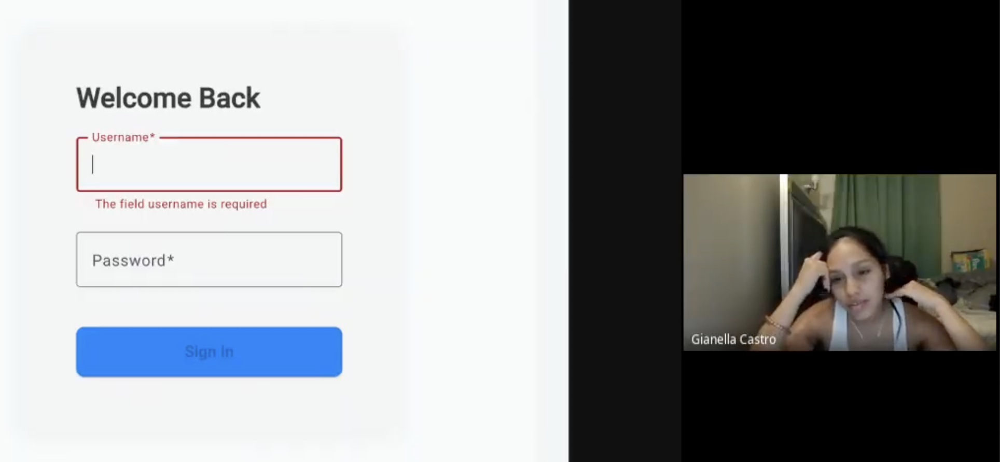<br>
      Entrevista con Gianella Castro (Entrevistada) y Jefferson Castro (Entrevistador).
    </div>
  </div>
  <table style="width:100%; border-collapse:collapse; margin-bottom:14px; font-size:14px;">
    <tr>
      <td style="border:1px solid #111; padding:10px; vertical-align:top; width:50%;">
        <strong>Entrevistado/a:</strong><br>Castro Tello, Gianella
      </td>
      <td style="border:1px solid #111; padding:10px; vertical-align:top; width:50%;">
        <strong>Entrevistador:</strong><br>Castro Pariona, Jefferson
      </td>
    </tr>
    <tr>
      <td colspan="2" style="border:1px solid #111; padding:10px; vertical-align:top;">
        <strong>Información del entrevistado:</strong><br>
        Sexo: Femenino &nbsp;/&nbsp; Edad: 29 &nbsp;/&nbsp; Residencia: Miraflores
      </td>
    </tr>
    <tr>
      <td colspan="2" style="border:1px solid #111; padding:10px; vertical-align:top;">
        <strong>Enlace Entrevista:</strong><br>
        <a href="" target="_blank" rel="noopener">
          https://drive.google.com/file/d/1mHCqNOhn-29ejmFIuWm-jjzBFYX-SWkX/view?usp=sharing
        </a>
      </td>
    </tr>
    <tr>
      <td style="border:1px solid #111; padding:10px; vertical-align:top;">
        <strong>Inicio:</strong> 0:00
      </td>
      <td style="border:1px solid #111; padding:10px; vertical-align:top;">
        <strong>Duración:</strong> 09:41
      </td>
    </tr>
    <tr>
      <td colspan="2" style="border:1px solid #111; padding:14px; vertical-align:top; min-height:120px;">
        <strong>Resumen de Entrevista:</strong>
        <div style="margin-top:8px; line-height:1.45; white-space:pre-wrap;">
          Gianella valida el potencial de WeRide para sus viajes cortos por el bajo costo, pero su experiencia de uso actual es frustrante. En la prueba, criticó severamente la interfaz: se sintió perdida por botones inactivos y llamadas a la acción (CTAs) que no se veían. Su desconfianza aumentó al no encontrar información clara sobre cancelaciones ni precios visibles de inmediato. Su conclusión fue tajante: para que ella adopte la app, la "conveniencia" debe ser real, lo que implica integrar pagos inmediatos con Yape/Plin y simplificar todo el proceso de registro y reserva.
        </div>
      </td>
    </tr>
  </table>
</div>

---

**Segmento 2: Empresas y Planes Corporativos (B2B)**

<div style="border:1px solid #111; padding:12px; border-radius:4px; max-width:820px; font-family:Arial, Helvetica, sans-serif; font-size:15px;">
  <div style="padding:8px 4px 20px 4px; font-size:17px;">
    <strong>Entrevista N°1</strong>
  </div>
  <div style="border-top:1px solid #111; padding-top:10px; margin-bottom:14px;">
    <div style="font-style:italic; margin-bottom:8px;">
      <strong>Vista Previa:</strong><br/>
      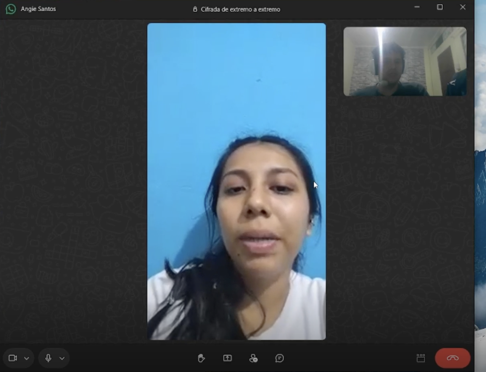<br>
      Entrevista con el Sr. Angie Santos (Entrevistado) y Jefferson Castro (Entrevistador).
    </div>
  </div>
  <table style="width:100%; border-collapse:collapse; margin-bottom:14px; font-size:14px;">
    <tr>
      <td style="border:1px solid #111; padding:10px; vertical-align:top; width:50%;">
        <strong>Entrevistado/a:</strong><br>Angie Santos (Jefe de TI)
      </td>
      <td style="border:1px solid #111; padding:10px; vertical-align:top; width:50%;">
        <strong>Entrevistador:</strong><br>Castro Pariona, Jefferson
      </td>
    </tr>
    <tr>
      <td colspan="2" style="border:1px solid #111; padding:10px; vertical-align:top;">
        <strong>Información del entrevistado:</strong><br>
        Sexo: Masculino &nbsp;/&nbsp; Edad: 46 años &nbsp;/&nbsp; Residencia: Lima - San Isidro
      </td>
    </tr>
    <tr>
      <td colspan="2" style="border:1px solid #111; padding:10px; vertical-align:top;">
        <strong>Enlace Entrevista:</strong><br>
        <a href="" target="_blank" rel="noopener">
          https://upcedupe-my.sharepoint.com/personal/u201822516_upc_edu_pe/_layouts/15/stream.aspx?id=%2Fpersonal%2Fu201822516%5Fupc%5Fedu%5Fpe%2FDocuments%2FEntrevistas%2FEntrevista%5FAngieSantos%5FSegmento2%2Emp4
        </a>
      </td>
    </tr>
    <tr>
      <td style="border:1px solid #111; padding:10px; vertical-align:top;">
        <strong>Inicio:</strong> 0:00
      </td>
      <td style="border:1px solid #111; padding:10px; vertical-align:top;">
        <strong>Duración:</strong> 5:22
      </td>
    </tr>
    <tr>
      <td colspan="2" style="border:1px solid #111; padding:14px; vertical-align:top; min-height:120px;">
        <strong>Resumen de Entrevista:</strong>
        <div style="margin-top:8px; line-height:1.45; white-space:pre-wrap;">
          Consultora 150+ empleados. Impuntualidad y alto gasto en subsidios. Viable: scooters y motos eléctricas.
        </div>
      </td>
    </tr>
  </table>
</div>

<div style="border:1px solid #111; padding:12px; border-radius:4px; max-width:820px; font-family:Arial, Helvetica, sans-serif; font-size:15px;">
  <div style="padding:8px 4px 20px 4px; font-size:17px;">
    <strong>Entrevista N°2</strong>
  </div>
  <div style="border-top:1px solid #111; padding-top:10px; margin-bottom:14px;">
    <div style="font-style:italic; margin-bottom:8px;">
      <strong>Vista Previa:</strong><br/>
      <br>
      Entrevista con el Sr. Bedith Lozano (Entrevistado) y Jefferson Castro (Entrevistador).
    </div>
  </div>
  <table style="width:100%; border-collapse:collapse; margin-bottom:14px; font-size:14px;">
    <tr>
      <td style="border:1px solid #111; padding:10px; vertical-align:top; width:50%;">
        <strong>Entrevistado/a:</strong><br>Bedith Lozano (Gerente Op.)
      </td>
      <td style="border:1px solid #111; padding:10px; vertical-align:top; width:50%;">
        <strong>Entrevistador:</strong><br>Jhimy pool romero meza
      </td>
    </tr>
    <tr>
      <td colspan="2" style="border:1px solid #111; padding:10px; vertical-align:top;">
        <strong>Información del entrevistado:</strong><br>
        Sexo: Femenino &nbsp;/&nbsp; Edad: 35 &nbsp;/&nbsp; Residencia: Lima
      </td>
    </tr>
    <tr>
      <td colspan="2" style="border:1px solid #111; padding:10px; vertical-align:top;">
        <strong>Enlace Entrevista:</strong><br>
        <a href="" target="_blank" rel="noopener">
          https://drive.google.com/drive/folders/1l6s8kK4PLq3Z56Flyd6ds6cXaVTdkyk4?usp=sharing
        </a>
      </td>
    </tr>
    <tr>
      <td style="border:1px solid #111; padding:10px; vertical-align:top;">
        <strong>Inicio:</strong> 0:00
      </td>
      <td style="border:1px solid #111; padding:10px; vertical-align:top;">
        <strong>Duración:</strong> 6:20
      </td>
    </tr>
    <tr>
      <td colspan="2" style="border:1px solid #111; padding:14px; vertical-align:top; min-height:120px;">
        <strong>Resumen de Entrevista:</strong>
        <div style="margin-top:8px; line-height:1.45; white-space:pre-wrap;">
          Mensajería 25 motos gasolina. Costos, mantenimiento, retrasos. Abierta a eléctrica con GPS.
        </div>
      </td>
    </tr>
  </table>
</div>

<!-- Falta-->
<div style="border:1px solid #111; padding:12px; border-radius:4px; max-width:820px; font-family:Arial, Helvetica, sans-serif; font-size:15px;">
  <div style="padding:8px 4px 20px 4px; font-size:17px;">
    <strong>Entrevista N°3</strong>
  </div>
  <div style="border-top:1px solid #111; padding-top:10px; margin-bottom:14px;">
    <div style="font-style:italic; margin-bottom:8px;">
      <strong>Vista Previa:</strong><br/>
      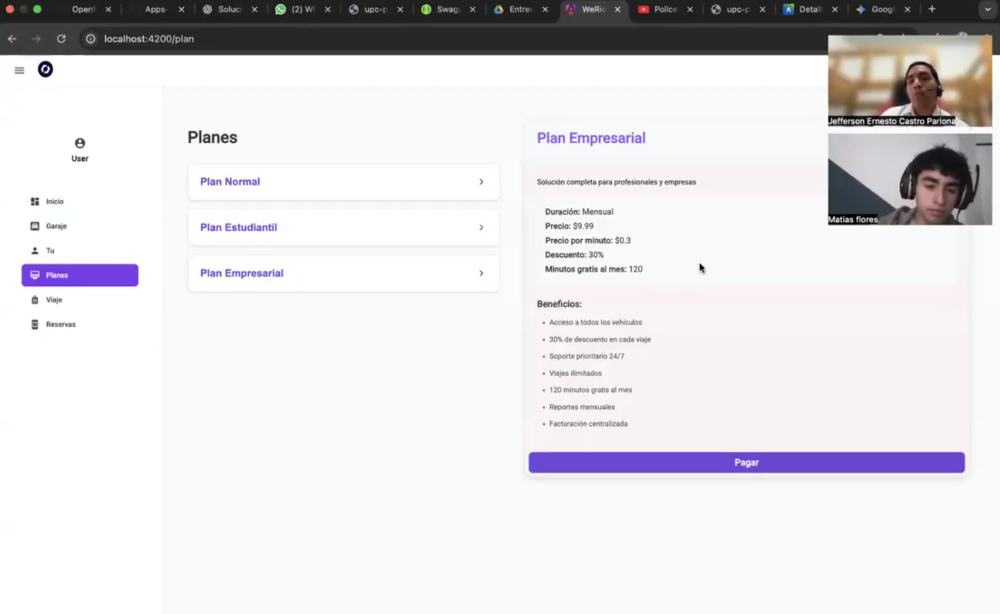<br>
      Entrevista con el Sr. Matias Flores Flores (Entrevistado) y Jefferson Castro (Entrevistador).
    </div>
  </div>
  <table style="width:100%; border-collapse:collapse; margin-bottom:14px; font-size:14px;">
    <tr>
      <td style="border:1px solid #111; padding:10px; vertical-align:top; width:50%;">
        <strong>Entrevistado/a:</strong><br>Flores Flores, Matias
      </td>
      <td style="border:1px solid #111; padding:10px; vertical-align:top; width:50%;">
        <strong>Entrevistador:</strong><br>Castro Pariona, Jefferson
      </td>
    </tr>
    <tr>
      <td colspan="2" style="border:1px solid #111; padding:10px; vertical-align:top;">
        <strong>Información del entrevistado:</strong><br>
        Sexo: Masculino &nbsp;/&nbsp; Edad: 25 &nbsp;/&nbsp; Residencia: Lima
      </td>
    </tr>
    <tr>
      <td colspan="2" style="border:1px solid #111; padding:10px; vertical-align:top;">
        <strong>Enlace Entrevista:</strong><br>
        <a href="" target="_blank" rel="noopener">
          https://drive.google.com/drive/folders/1UKbCq7bH5Y9_RQoZWcmjvXqT5jydmitV
        </a>
      </td>
    </tr>
    <tr>
      <td style="border:1px solid #111; padding:10px; vertical-align:top;">
        <strong>Inicio:</strong> 0:00
      </td>
      <td style="border:1px solid #111; padding:10px; vertical-align:top;">
        <strong>Duración:</strong> 09:41
      </td>
    </tr>
    <tr>
      <td colspan="2" style="border:1px solid #111; padding:14px; vertical-align:top; min-height:120px;">
        <strong>Resumen de Entrevista:</strong>
        <div style="margin-top:8px; line-height:1.45; white-space:pre-wrap;">
          Matias valora la conveniencia, bajo costo y rapidez. Percibe WeRide como una opción práctica para desplazamientos cortos si la propuesta es clara y el proceso de
          registro/pago es sencillo. Confían más si ven precios visibles, testimonios y
          métodos de pago locales (Yape/Plin). Reportaron dudas por falta de información
          (políticas de uso, cancelaciones) y encontraron áreas de la interfaz poco
          intuitivas (CTA poco visibles, botones inactivos).
        </div>
      </td>
    </tr>
  </table>
</div>

### 2.2.3. Análisis de entrevistas  

Segmento 1: Universitarios y Jóvenes Profesionales (B2C)  

El análisis de este segmento evidencia una alta dependencia del transporte público para los desplazamientos diarios, lo cual genera una experiencia negativa caracterizada por la congestión, la inseguridad y la pérdida significativa de tiempo, que puede alcanzar hasta tres horas por día. Estos usuarios, en su mayoría nativos digitales, están acostumbrados al uso de aplicaciones móviles para resolver sus necesidades cotidianas, por lo que valoran soluciones rápidas, accesibles y completamente digitalizadas. En este contexto, la micromovilidad eléctrica se percibe como una alternativa atractiva debido a su rapidez y practicidad, especialmente para trayectos cortos.

Sin embargo, la adopción de este tipo de soluciones se ve limitada por factores clave como el costo del servicio y la percepción de inseguridad vial. Asimismo, la experiencia de usuario dentro de la aplicación representa una barrera importante, ya que se identificaron problemas relacionados con la falta de claridad en la interfaz, botones poco visibles, procesos confusos y ausencia de información relevante sobre precios y políticas de uso. Estas deficiencias generan desconfianza y reducen la intención de uso.

A partir de estos hallazgos, se concluye que existe una oportunidad significativa para el proyecto, siempre que se logre ofrecer una experiencia sencilla, transparente y económicamente accesible. La implementación de pagos digitales integrados, una interfaz intuitiva y la visibilidad clara de precios y condiciones son elementos fundamentales para lograr la adopción en este segmento. En este sentido, el usuario prioriza la conveniencia real, entendida como un proceso rápido, sin fricciones y con costos predecibles.
  
Segmento 2: Empresas y Planes Corporativos (B2B)  
  
El segmento empresarial presenta una problemática distinta, enfocada principalmente en la eficiencia operativa y la optimización de costos en actividades logísticas, como la mensajería. Actualmente, estas empresas enfrentan gastos elevados asociados al uso de vehículos a gasolina, así como dificultades relacionadas con el mantenimiento y los retrasos en las entregas. En este contexto, existe una apertura hacia soluciones de micromovilidad eléctrica, especialmente aquellas que incorporan tecnologías de monitoreo como GPS, debido a su potencial para reducir costos y mejorar la gestión de la flota.  
  
No obstante, el análisis revela que la decisión de adopción en este segmento está fuertemente influenciada por la claridad de la propuesta de valor y la confianza en el servicio. Durante la evaluación, se identificaron dudas relacionadas con la falta de información sobre precios, políticas de uso y condiciones del servicio, lo que genera incertidumbre. Además, se detectaron deficiencias en la interfaz de la aplicación, como llamadas a la acción poco visibles y procesos no intuitivos, lo cual afecta la percepción de profesionalismo y confiabilidad de la solución.  
  
En consecuencia, se concluye que, para lograr la adopción en el segmento B2B, es fundamental ofrecer una propuesta clara, transparente y respaldada por evidencia, como testimonios o casos de éxito. Asimismo, resulta clave implementar herramientas que permitan el monitoreo en tiempo real de la flota, así como planes de servicio estructurados y fáciles de entender. En este segmento, la decisión de uso no se basa únicamente en la innovación, sino en la capacidad de la solución para generar confianza y demostrar beneficios concretos en términos de ahorro y eficiencia.  

## 2.3. Needfinding
### 2.3.1. User Personas

  **1er segmento:  Universitarios y Jóvenes Profesionales (B2C)**

  


  **2do segmento:  Empresas y Planes Corporativos (B2B)**

  

  ---
### 2.3.2. User Task Matrix

    **Camila Torres (Joven universitaria)**

  | **Tareas / Tasks**                             | **Frecuencia** | **Importancia** |
  |-------------------------------------------------|---------------|----------------|
  | Buscar información para trabajos                | Alta          | Alta           |
  | Coordinar con compañeros de grupo               | Alta          | Alta           |
  | Acceder a material de estudio (libros, PDFs, videos) | Alta      | Alta           |
  | Planificar tiempo para estudiar                 | Alta          | Alta           |
  | Asistir a clases / capacitaciones               | Alta          | Alta           |
  | Comunicar avances de proyecto                   | Media         | Alta           |
  | Resolver dudas con expertos                     | Media         | Alta           |
  | Evaluar proveedores de herramientas/servicios   | Baja          | Media          |
  | Preparar reportes de resultados                 | Baja          | Media          |

  ---

  **Luis Salazar (Gerente de Operaciones)**

  | **Tareas / Tasks**                              | **Frecuencia** | **Importancia** |
  |-------------------------------------------------|---------------|----------------|
  | Buscar información para proyectos               | Media         | Media          |
  | Planificar tiempo de trabajo                    | Media         | Alta           |
  | Asistir a reuniones/capacitaciones              | Media         | Alta           |
  | Comunicar avances de proyecto                   | Alta          | Alta           |
  | Resolver dudas con expertos                     | Alta          | Alta           |
  | Evaluar proveedores de herramientas/servicios   | Alta          | Alta           |
  | Supervisar cumplimiento de estándares o KPIs    | Alta          | Alta           |
  | Preparar reportes de resultados                 | Alta          | Alta           |  

### 2.3.3. User Journey Mapping

    El User Journey Mapping se desarrolló para comprender la experiencia de los usuarios al interactuar con nuestra plataforma. Este mapeo detalla cada paso que el usuario realiza, los obstáculos que puede encontrar, y las emociones que surgen en el proceso. Así, nos ayuda a identificar oportunidades para mejorar la usabilidad y satisfacción del usuario.

  ### Segmento 1: Jovenes Universitarios. 
  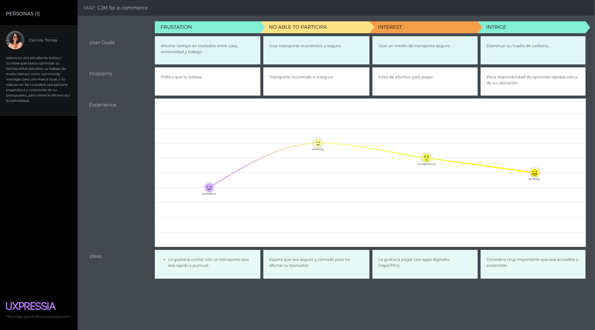

  ### Segmento 2: Empresas y Planes Corporativos (B2B)

  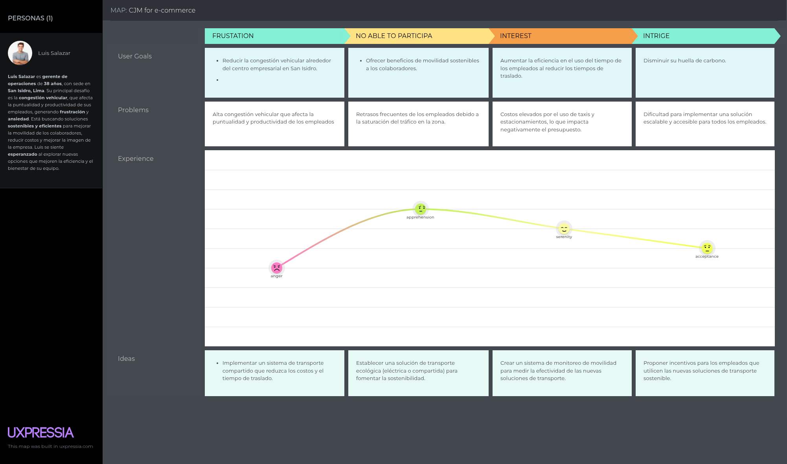 

### 2.3.4. Empathy Mapping  

- Camila Torres:  

  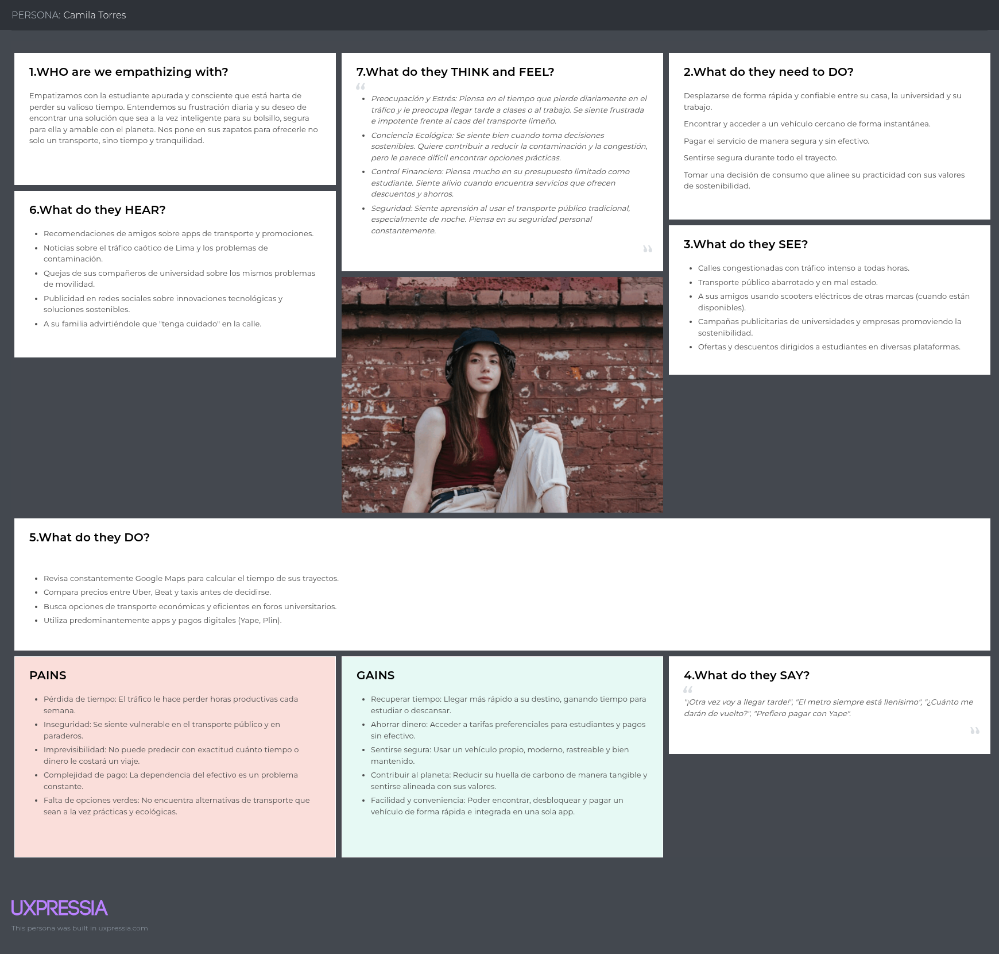  

  - Luis Salazar:  

  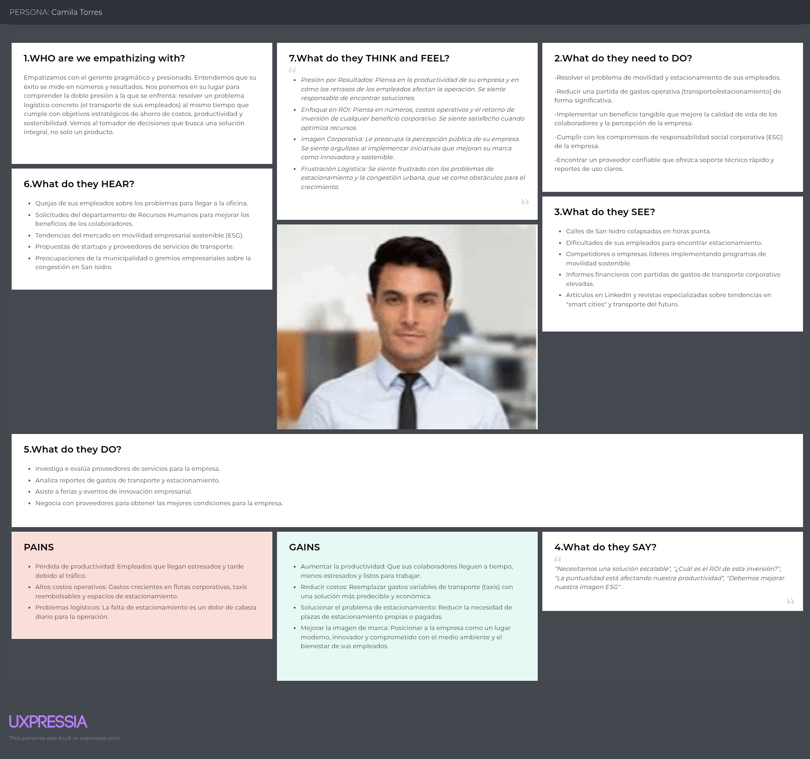  

### 2.3.5. Big Picture EventStorming  

El **Event Storming** modela de forma secuencial el ciclo completo de uso de la plataforma de micromovilidad eléctrica. Se identifican las interacciones entre usuarios, administradores, sistemas externos ***(IoT, GPS, pasarela de pagos)*** y el sistema de negocio.
  Se muestra cómo la plataforma conecta en un mismo flujo las necesidades de movilidad del usuario, los procesos de pago y seguridad, asegurando un ecosistema completo de micromovilidad urbana.

  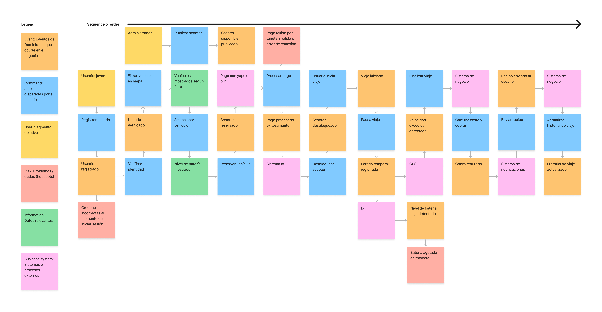

### 2.3.6. Ubiquitous Language  

| Término                 | Tipo               | Definición                                                                 |
  |--------------------------|--------------------|-----------------------------------------------------------------------------|
  | Usuario                 | Actor              | Persona registrada que utiliza la app para alquilar scooters.              |
  | Administrador           | Actor              | Responsable de gestionar flota, usuarios y soporte desde el sistema.       |
  | Scooter                 | Entidad            | Vehículo eléctrico disponible para alquiler dentro de la plataforma.       |
  | Estación Virtual        | Entidad            | Punto geográfico donde los scooters pueden ser recogidos o dejados.        |
  | Reserva                 | Evento/Entidad     | Acción de apartar un scooter disponible antes de iniciar el alquiler.      |
  | Alquiler                | Evento/Entidad     | Proceso activo en el que el usuario usa un scooter y se mide en tiempo/distancia. |
  | Pago                    | Evento             | Transacción realizada por el usuario para completar un alquiler.           |
  | Tarifa                  | Entidad            | Costo asociado al alquiler, calculado según tiempo y distancia.            |
  | Desbloqueo              | Comando/Evento     | Acción de habilitar el scooter tras confirmar la reserva y el pago inicial. |
  | Devolución              | Evento             | Acción de finalizar el uso y dejar el scooter en una estación virtual.     |
  | Mantenimiento           | Proceso            | Revisión y reparación de scooters por parte del personal técnico.          |
  | Penalización            | Evento/Entidad     | Cargo adicional aplicado por mal uso, retraso o devolución fuera de zona.  |
  | Historial de Viajes     | Vista              | Registro de reservas, alquileres y pagos asociados a cada usuario.         |
  | Soporte                 | Servicio           | Canal de ayuda en la app para resolver incidencias de los usuarios.        |
  | Flota                   | Entidad/Conjunto   | Conjunto de scooters activos disponibles en la ciudad.                     |
  | Ubicación en Tiempo Real| Información        | Datos GPS que muestran dónde se encuentra cada scooter.                     |
  | Sesión de Usuario       | Entidad            | Periodo en que el usuario está logueado y utilizando la app.               |

### 2.4. Requirements specification
### 2.4.1. User Stories

### Lista de Épicas

<table>
  <thead>
    <tr>
      <th>ID</th>
      <th>Título</th>
      <th>Descripción</th>
      <th>Criterios de aceptación</th>
      <th>EpicID</th>
    </tr>
  </thead>
  <tbody>
    <tr>
      <td>EP01</td>
      <td>Acceso a la aplicación</td>
      <td>
        <ul style="margin:0; padding-left:18px;">
          <li>Como usuario de la aplicación, quiero acceder con mi información para hacer uso de las características disponibles.</li>
        </ul>
      </td>
      <td>No corresponde</td>
      <td>No corresponde</td>
    </tr>
    <tr>
      <td>EP02</td>
      <td>Funcionalidades de la app</td>
      <td>
        <ul style="margin:0; padding-left:18px;">
          <li>Como usuario de la aplicación, quiero que las funcionalidades principales que me ofrece el servicio sean funcionales.</li>
        </ul>
      </td>
      <td>No corresponde</td>
      <td>No corresponde</td>
    </tr>
    <tr>
      <td>EP03</td>
      <td>Gestión de pagos y suscripciones</td>
      <td>
        <ul style="margin:0; padding-left:18px;">
          <li>Como usuario, quiero gestionar mis métodos de pago y suscripciones para acceder a los servicios y planes de la aplicación.</li>
        </ul>
      </td>
      <td>No corresponde</td>
      <td>No corresponde</td>
    </tr>
    <tr>
      <td>EP04</td>
      <td>Uso del mapa</td>
      <td>
        <ul style="margin:0; padding-left:18px;">
          <li>Como usuario de la aplicación, quiero acceder al mapa de la aplicación para realizar la reserva de vehículos y seguimiento de rutas.</li>
        </ul>
      </td>
      <td>No corresponde</td>
      <td>No corresponde</td>
    </tr>
    <tr>
      <td>EP05</td>
      <td>Gestión de viajes</td>
      <td>
        <ul style="margin:0; padding-left:18px;">
          <li>Como usuario, quiero visualizar y gestionar mis trayectos en el mapa, incluyendo detalles del vehículo, ruta y estado del viaje.</li>
        </ul>
      </td>
      <td>No corresponde</td>
      <td>No corresponde</td>
    </tr>
    <tr>
      <td>EP06</td>
      <td>Gestión de reservas</td>
      <td>
        <ul style="margin:0; padding-left:18px;">
          <li>Como usuario, quiero reservar vehículos y recibir notificaciones sobre el estado y fin de mi reserva para asegurar disponibilidad.</li>
        </ul>
      </td>
      <td>No corresponde</td>
      <td>No corresponde</td>
    </tr>
    <tr>
      <td>EP07</td>
      <td>Desbloqueo y acceso rápido a vehículos</td>
      <td>
        <ul style="margin:0; padding-left:18px;">
          <li>Como usuario, quiero desbloquear y acceder a los vehículos de forma ágil mediante tecnologías como QR para mejorar la experiencia de inicio de viaje.</li>
        </ul>
      </td>
      <td>No corresponde</td>
      <td>No corresponde</td>
    </tr>
  </tbody>
</table>


### Lista de Historias de Usuario

<table>
  <tbody>
    <tr>
      <th>ID (HU)</th>
      <th>Título</th>
      <th>Descripción</th>
      <th>Criterios de aceptación</th>
      <th>Epic-ID</th>
    </tr>
    <!-- US-01 -->
    <tr>
      <td>US-01</td>
      <td>Inicio de sesión y registro</td>
      <td>
        <ul style="margin:0; padding-left:18px;">
          <li>Como usuario quiero poder iniciar sesión o registrarme en la app para usarla diariamente.</li>
        </ul>
      </td>
      <td>
        <ul style="margin:0; padding-left:18px;">
          <li><b>Escenario 1:</b> Inicio de sesión exitoso<br><b>Given</b> que el usuario tiene una cuenta registrada<br><b>When</b> ingresa sus credenciales correctas<br><b>Then</b> el sistema permite el acceso a la app.</li>
          <li><b>Escenario 2:</b> Registro exitoso<br><b>Given</b> que el usuario no tiene una cuenta<br><b>When</b> completa el formulario de registro con sus datos válidos<br><b>Then</b> el sistema crea la cuenta y permite el acceso.</li>
          <li><b>Escenario 3:</b> Fallo de autenticación<br><b>Given</b> que el usuario ingresa credenciales incorrectas<br><b>When</b> intenta iniciar sesión<br><b>Then</b> el sistema muestra un mensaje de error.</li>
        </ul>
      </td>
      <td>EP-01</td>
    </tr>
    <!-- US-02 -->
    <tr>
      <td>US-02</td>
      <td>Introducir Número de Celular</td>
      <td>
        <ul style="margin:0; padding-left:18px;">
          <li>Como usuario, quiero introducir mi número de celular para validar mi identidad y recibir notificaciones importantes.</li>
        </ul>
      </td>
      <td>
        <ul style="margin:0; padding-left:18px;">
          <li><b>Escenario 1:</b> Introducción exitosa<br><b>Given</b> que el usuario accede al formulario de perfil<br><b>When</b> ingresa un número de celular válido y lo guarda<br><b>Then</b> el sistema valida el número y lo asocia al perfil del usuario.</li>
          <li><b>Escenario 2:</b> Número inválido<br><b>Given</b> que el usuario intenta guardar su número<br><b>When</b> el número ingresado no cumple con el formato requerido<br><b>Then</b> el sistema muestra un mensaje de error y solicita corregir el dato.</li>
          <li><b>Escenario 3:</b> Error de conexión<br><b>Given</b> que el usuario ingresa su número<br><b>When</b> hay problemas de conexión al guardar el dato<br><b>Then</b> el sistema informa el error y permite reintentar la acción.</li>
        </ul>
      </td>
      <td>EP-01</td>
    </tr>
    <!-- US-03 -->
    <tr>
      <td>US-03</td>
      <td>Introducir código de verificación</td>
      <td>
        <ul style="margin:0; padding-left:18px;">
          <li>Como usuario, quiero introducir un código de verificación para validar mi identidad en la aplicación.</li>
        </ul>
      </td>
      <td>
        <ul style="margin:0; padding-left:18px;">
          <li><b>Escenario 1:</b> Verificación exitosa<br><b>Given</b> que el usuario ha recibido un código de verificación en su celular<br><b>When</b> ingresa el código correctamente en el formulario de la app<br><b>Then</b> el sistema valida el código y confirma la verificación de identidad.</li>
          <li><b>Escenario 2:</b> Código incorrecto<br><b>Given</b> que el usuario intenta verificar su identidad<br><b>When</b> ingresa un código inválido o expirado<br><b>Then</b> el sistema muestra un mensaje de error y permite reintentar la verificación.</li>
          <li><b>Escenario 3:</b> Error de conexión<br><b>Given</b> que el usuario ingresa el código de verificación<br><b>When</b> ocurre un problema de conexión al validar el código<br><b>Then</b> el sistema informa el error y permite al usuario reintentar la acción cuando se restablezca la conexión.</li>
        </ul>
      </td>
      <td>EP-01</td>
    </tr>
    <!-- US-04 -->
    <tr>
      <td>US-04</td>
      <td>Datos de usuario</td>
      <td>
        <ul style="margin:0; padding-left:18px;">
          <li>Como usuario quiero poder crear un perfil para colocar mis datos.</li>
        </ul>
      </td>
      <td>
        <ul style="margin:0; padding-left:18px;">
          <li><b>Escenario 1:</b> Creación exitosa<br><b>Given</b> que el usuario accede a su cuenta<br><b>When</b> ingresa sus datos (nombre, correo, foto, etc.) y los guarda<br><b>Then</b> el sistema actualiza el perfil con éxito.</li>
          <li><b>Escenario 2:</b> Error en la creación<br><b>Given</b> que el usuario intenta guardar sus datos<br><b>When</b> alguno es inválido o falta completar un campo obligatorio<br><b>Then</b> el sistema muestra un mensaje indicando el error.</li>
        </ul>
      </td>
      <td>EP-01</td>
    </tr>
    <!-- US-05 -->
    <tr>
      <td>US-05</td>
      <td>Página Principal</td>
      <td>
        <ul style="margin:0; padding-left:18px;">
          <li>Como usuario quiero poder ver una pantalla principal estética para que me atraiga a usar el servicio.</li>
        </ul>
      </td>
      <td>
        <ul style="margin:0; padding-left:18px;">
          <li><b>Escenario 1:</b> Visualización exitosa<br><b>Given</b> que el usuario ha iniciado sesión en la aplicación<br><b>When</b> accede a la pantalla principal<br><b>Then</b> el sistema muestra una interfaz atractiva, con acceso rápido a las funciones principales y elementos visuales bien organizados.</li>
          <li><b>Escenario 2:</b> Elementos no cargados<br><b>Given</b> que el usuario accede a la pantalla principal<br><b>When</b> algunos elementos visuales o funcionalidades no se cargan correctamente por problemas de conexión o error interno<br><b>Then</b> el sistema muestra un mensaje de error y permite reintentar la carga.</li>
          <li><b>Escenario 3:</b> Personalización<br><b>Given</b> que el usuario accede a la pantalla principal<br><b>When</b> personaliza la vista (por ejemplo, elige tema claro/oscuro o reordena accesos rápidos)<br><b>Then</b> el sistema guarda las preferencias y actualiza la interfaz según la selección del usuario.</li>
        </ul>
      </td>
      <td>EP-02</td>
    </tr>
    <!-- US-06 -->
    <tr>
      <td>US-06</td>
      <td>Gestión y personalización de perfil</td>
      <td>
        <ul style="margin:0; padding-left:18px;">
          <li>Como usuario quiero acceder a mi perfil para administrar mi cuenta.</li>
        </ul>
      </td>
      <td>
        <ul style="margin:0; padding-left:18px;">
          <li><b>Escenario 1:</b> Acceso exitoso al perfil<br><b>Given</b> que el usuario ha iniciado sesión en la aplicación<br><b>When</b> accede a la sección "Tu" desde el menú lateral<br><b>Then</b> el sistema muestra las opciones de administrar cuenta, personalizar perfil, cartera, historial, centro de seguridad, ayuda y ajustes.</li>
          <li><b>Escenario 2:</b> Personalización de perfil<br><b>Given</b> que el usuario accede a la opción de personalizar perfil<br><b>When</b> modifica su información personal (nombre, foto, etc.)<br><b>Then</b> el sistema guarda los cambios y actualiza la información mostrada.</li>
          <li><b>Escenario 3:</b> Acceso a funcionalidades adicionales<br><b>Given</b> que el usuario accede a las opciones de cartera, historial, centro de seguridad, ayuda o ajustes<br><b>When</b> selecciona alguna de estas opciones<br><b>Then</b> el sistema muestra la información o funcionalidad correspondiente (por ejemplo, ver historial de trayectos, administrar métodos de pago, acceder a soporte, modificar ajustes de la cuenta, etc.).</li>
        </ul>
      </td>
      <td>EP-02</td>
    </tr>
    <!-- US-07 -->
    <tr>
      <td>US-07</td>
      <td>Gestión y visualización de vehículos en Garaje</td>
      <td>
        <ul style="margin:0; padding-left:18px;">
          <li>Como usuario quiero acceder al Garaje para gestionar los vehículos disponibles.</li>
        </ul>
      </td>
      <td>
        <ul style="margin:0; padding-left:18px;">
          <li><b>Escenario 1:</b> Visualización exitosa de vehículos<br><b>Given</b> que el usuario accede a la sección Garaje desde el menú lateral<br><b>When</b> se muestran los vehículos disponibles con imagen, nombre, disponibilidad, marca y valoración<br><b>Then</b> el sistema permite ver todos los vehículos y sus detalles.</li>
          <li><b>Escenario 2:</b> Filtrado de vehículos<br><b>Given</b> que el usuario está en la sección Garaje<br><b>When</b> utiliza los filtros para mostrar solo e-scooters, motos o bicicletas<br><b>Then</b> el sistema actualiza la lista mostrando únicamente los vehículos del tipo seleccionado.</li>
          <li><b>Escenario 3:</b> Gestión de favoritos<br><b>Given</b> que el usuario visualiza los vehículos en el Garaje<br><b>When</b> marca un vehículo como favorito usando el ícono de corazón<br><b>Then</b> el sistema guarda la preferencia y permite acceder rápidamente a los vehículos favoritos.</li>
        </ul>
      </td>
      <td>EP-02</td>
    </tr>
    <!-- US-08 -->
    <tr>
      <td>US-08</td>
      <td>Filtrado de vehículos en Garaje</td>
      <td>
        <ul style="margin:0; padding-left:18px;">
          <li>Como usuario quiero filtrar los vehículos disponibles para verlos por tipo en el Garaje.</li>
        </ul>
      </td>
      <td>
        <ul style="margin:0; padding-left:18px;">
          <li><b>Escenario 1:</b> Filtrado exitoso<br><b>Given</b> que el usuario accede a la sección Garaje<br><b>When</b> utiliza el menú de filtros para seleccionar tipo de vehículo, precio, disponibilidad, calificación o marca<br><b>Then</b> el sistema muestra únicamente los vehículos que cumplen con los criterios seleccionados.</li>
          <li><b>Escenario 2:</b> Sin resultados<br><b>Given</b> que el usuario aplica filtros en el Garaje<br><b>When</b> no existen vehículos que cumplan con los criterios seleccionados<br><b>Then</b> el sistema muestra un mensaje indicando que no hay vehículos disponibles según el filtro.</li>
          <li><b>Escenario 3:</b> Error de conexión<br><b>Given</b> que el usuario intenta filtrar vehículos<br><b>When</b> ocurre un problema de conexión<br><b>Then</b> el sistema muestra un mensaje de error y permite reintentar la acción.</li>
        </ul>
      </td>
      <td>EP-02</td>
    </tr>
    <!-- US-09 -->
    <tr>
      <td>US-09</td>
      <td>Selección y pago de planes</td>
      <td>
        <ul style="margin:0; padding-left:18px;">
          <li>Como usuario quiero visualizar los diferentes planes disponibles para tener diferentes alternativas a elegir.</li>
        </ul>
      </td>
      <td>
        <ul style="margin:0; padding-left:18px;">
          <li><b>Escenario 1:</b> Visualización de planes<br><b>Given</b> que el usuario accede a la sección "Planes" desde el menú lateral<br><b>When</b> se muestran los diferentes tipos de planes con sus nombres y detalles<br><b>Then</b> el sistema permite al usuario comparar y seleccionar el plan deseado.</li>
          <li><b>Escenario 2:</b> Pago exitoso de plan<br><b>Given</b> que el usuario ha seleccionado un plan<br><b>When</b> presiona el botón "Pagar" y realiza el proceso de pago<br><b>Then</b> el sistema activa el plan y lo asocia a la cuenta del usuario.</li>
          <li><b>Escenario 3:</b> Error en el pago<br><b>Given</b> que el usuario intenta pagar un plan<br><b>When</b> ocurre un problema con el método de pago o la conexión<br><b>Then</b> el sistema muestra un mensaje de error y permite reintentar la acción.</li>
        </ul>
      </td>
      <td>EP-03</td>
    </tr>
    <!-- US-10 -->
    <tr>
      <td>US-10</td>
      <td>Proceso de pago de planes</td>
      <td>
        <ul style="margin:0; padding-left:18px;">
          <li>Como usuario quiero ingresar los datos de mi tarjeta para activar el plan seleccionado.</li>
        </ul>
      </td>
      <td>
        <ul style="margin:0; padding-left:18px;">
          <li><b>Escenario 1:</b> Ingreso exitoso de datos de pago<br><b>Given</b> que el usuario ha seleccionado un plan<br><b>When</b> ingresa el número de tarjeta, fecha de vencimiento, CVV y dirección de facturación<br><b>Then</b> el sistema valida los datos y permite avanzar al resumen de pago.</li>
          <li><b>Escenario 2:</b> Confirmación y finalización de pago<br><b>Given</b> que el usuario ha ingresado correctamente todos los datos<br><b>When</b> presiona el botón "Finalizar Pago"<br><b>Then</b> el sistema procesa el pago, muestra el total y activa el plan en la cuenta del usuario.</li>
          <li><b>Escenario 3:</b> Error en el proceso de pago<br><b>Given</b> que el usuario intenta finalizar el pago<br><b>When</b> hay un error en los datos ingresados o problemas de conexión<br><b>Then</b> el sistema muestra un mensaje de error y permite corregir los datos o reintentar la acción.</li>
        </ul>
      </td>
      <td>EP-03</td>
    </tr>
    <!-- US-11 -->
    <tr>
      <td>US-11</td>
      <td>Seleccionar ubicación para ver vehículos cercanos disponibles</td>
      <td>
        <ul style="margin:0; padding-left:18px;">
          <li>Como usuario quiero seleccionar una ubicación del mapa para ver los vehículos cercanos disponibles.</li>
        </ul>
      </td>
      <td>
        <ul style="margin:0; padding-left:18px;">
          <li><b>Escenario 1:</b> Visualización exitosa<br><b>Given</b> que el usuario accede al mapa de la aplicación<br><b>When</b> selecciona una ubicación específica en el mapa<br><b>Then</b> el sistema muestra en tiempo real los vehículos disponibles cerca de esa ubicación.</li>
          <li><b>Escenario 2:</b> Ubicación sin vehículos<br><b>Given</b> que el usuario selecciona una ubicación en el mapa<br><b>When</b> no hay vehículos disponibles cerca de esa ubicación<br><b>Then</b> el sistema informa que no hay vehículos disponibles y sugiere ubicaciones alternativas.</li>
          <li><b>Escenario 3:</b> Error de conexión<br><b>Given</b> que el usuario selecciona una ubicación en el mapa<br><b>When</b> ocurre un problema de conexión al cargar los vehículos<br><b>Then</b> el sistema muestra un mensaje de error y permite reintentar la acción.</li>
        </ul>
      </td>
      <td>EP-04</td>
    </tr>
    <!-- US-12 -->
    <tr>
      <td>US-12</td>
      <td>Visualización de viaje en mapa</td>
      <td>
        <ul style="margin:0; padding-left:18px;">
          <li>Como usuario quiero ver mi trayecto actual en el mapa, para tener información relevante del vehículo.</li>
        </ul>
      </td>
      <td>
        <ul style="margin:0; padding-left:18px;">
          <li><b>Escenario 1:</b> Visualización exitosa del viaje<br><b>Given</b> que el usuario accede a la sección "Viaje" desde el menú lateral<br><b>When</b> se muestra el mapa con la ruta actual, puntos de inicio y destino, y detalles del vehículo<br><b>Then</b> el sistema presenta la información de ubicación, batería, tiempo restante y estado del viaje en tiempo real.</li>
          <li><b>Escenario 2:</b> Actualización de información<br><b>Given</b> que el usuario está visualizando el viaje<br><b>When</b> cambia la ruta, el vehículo o el estado del trayecto<br><b>Then</b> el sistema actualiza la información mostrada en el mapa y en el panel de detalles.</li>
          <li><b>Escenario 3:</b> Error de conexión<br><b>Given</b> que el usuario intenta visualizar o actualizar el viaje<br><b>When</b> ocurre un problema de conexión<br><b>Then</b> el sistema muestra un mensaje de error y permite reintentar la acción.</li>
        </ul>
      </td>
      <td>EP-05</td>
    </tr>
    <!-- US-13 -->
    <tr>
      <td>US-13</td>
      <td>Historial de viajes</td>
      <td>
        <ul style="margin:0; padding-left:18px;">
          <li>Como usuario, quiero ver el historial de mis viajes para trackear gastos y rutas.</li>
        </ul>
      </td>
      <td>
        <ul style="margin:0; padding-left:18px;">
          <li><b>Escenario 1:</b> Visualización exitosa<br>Given que el usuario inicia sesión<br>When accede a la sección "Mis Viajes"<br>Then el sistema muestra una lista con fecha, costo y distancia de cada viaje.</li>
          <li><b>Escenario 2:</b> Error de carga<br>Given que el usuario accede al historial<br>When no hay conexión a internet<br>Then el sistema muestra un mensaje de error y opción para reintentar.</li>
        </ul>
      </td>
      <td>EP-05</td>
    </tr>
    <!-- US-14 -->
    <tr>
      <td>US-14</td>
      <td>Calificación de viaje</td>
      <td>
        <ul style="margin:0; padding-left:18px;">
          <li>Como usuario, quiero calificar mi experiencia después del viaje para feedback y mejora del servicio.</li>
        </ul>
      </td>
      <td>
        <ul style="margin:0; padding-left:18px;">
          <li><b>Escenario 1:</b> Calificación exitosa<br>Given que el usuario finaliza un viaje<br>When selecciona una puntuación (1-5 estrellas) y envía<br>Then el sistema guarda la calificación y muestra agradecimiento.</li>
          <li><b>Escenario 2:</b> Calificación fallida<br>Given que el usuario intenta calificar<br>When no hay conexión a internet<br>Then el sistema guarda la calificación localmente y la envía después.</li>
        </ul>
      </td>
      <td>EP-05</td>
    </tr>
    <!-- US-15 -->
    <tr>
      <td>US-15</td>
      <td>Reportar problema con vehículo</td>
      <td>
        <ul style="margin:0; padding-left:18px;">
          <li>Como usuario, quiero reportar un problema con el vehículo para alertar a soporte y obtener ayuda rápida.</li>
        </ul>
      </td>
      <td>
        <ul style="margin:0; padding-left:18px;">
          <li><b>Escenario 1:</b> Reporte exitoso<br>Given que el usuario está usando el vehículo<br>When selecciona "Reportar problema" y elige una categoría (ej.: falla mecánica)<br>Then el sistema envía el reporte a soporte y muestra confirmación.</li>
          <li><b>Escenario 2:</b> Reporte fallido<br>Given que el usuario intenta reportar un problema<br>When no hay conexión a internet<br>Then el sistema guarda el reporte localmente y lo envía al recuperar la conexión.</li>
        </ul>
      </td>
      <td>EP-05</td>
    </tr>
    <!-- US-16 -->
    <tr>
      <td>US-16</td>
      <td>Notificación de fin de reserva</td>
      <td>
        <ul style="margin:0; padding-left:18px;">
          <li>Como usuario, quiero recibir una notificación antes de que finalice mi reserva para evitar dificultades.</li>
        </ul>
      </td>
      <td>
        <ul style="margin:0; padding-left:18px;">
          <li><b>Escenario 1:</b> Notificación exitosa<br>Given que el usuario tiene una reserva activa<br>When faltan 5 minutos para el fin de la reserva<br>Then el sistema envía una notificación push con opción para extender el tiempo.</li>
          <li><b>Escenario 2:</b> Notificación fallida<br>Given que la reserva está por finalizar<br>When no hay conexión a internet<br>Then el sistema registra el intento y reintenta enviar la notificación al recuperar la conexión.</li>
        </ul>
      </td>
      <td>EP-06</td>
    </tr>
    <!-- US-17 -->
    <tr>
      <td>US-17</td>
      <td>Crear una reserva</td>
      <td>
        <ul style="margin:0; padding-left:18px;">
          <li>Como usuario, quiero reservar un vehículo desde la app.</li>
        </ul>
      </td>
      <td>
        <ul style="margin:0; padding-left:18px;">
          <li><b>Escenario 1:</b> Reserva exitosa<br><b>Given</b> que el usuario visualiza los vehículos disponibles<br><b>When</b> selecciona un vehículo y confirma la reserva<br><b>Then</b> el sistema bloquea el vehículo y muestra un temporizador de la reserva.</li>
          <li><b>Escenario 2:</b> Vehículo no disponible<br><b>Given</b> que el usuario intenta reservar un vehículo<br><b>When</b> otro usuario ya lo reservó antes<br><b>Then</b> el sistema muestra un mensaje de error indicando que debe seleccionar otro vehículo.</li>
          <li><b>Escenario 3:</b> Error de conexión<br><b>Given</b> que el usuario confirma una reserva<br><b>When</b> no hay conexión a internet<br><b>Then</b> el sistema informa que no se pudo completar la acción y permite reintentar cuando se restablezca la conexión.</li>
        </ul>
      </td>
      <td>EP-06</td>
    </tr>
    <!-- US-18 -->
    <tr>
      <td>US-18</td>
      <td>Notificación de inicio y vencimiento</td>
      <td>
        <ul style="margin:0; padding-left:18px;">
          <li>Como usuario, quiero recibir notificaciones cuando mi reserva esté activa y cuando esté por expirar.</li>
        </ul>
      </td>
      <td>
        <ul style="margin:0; padding-left:18px;">
          <li><b>Escenario 1:</b> Notificación de inicio<br><b>Given</b> que el usuario tiene una reserva activa<br><b>When</b> la reserva comienza<br><b>Then</b> el sistema envía una notificación push confirmando el inicio.</li>
          <li><b>Escenario 2:</b> Notificación de vencimiento<br><b>Given</b> que el usuario tiene una reserva próxima a expirar<br><b>When</b> faltan pocos minutos para que finalice<br><b>Then</b> el sistema envía una notificación recordatoria.</li>
          <li><b>Escenario 3:</b> Expiración de reserva<br><b>Given</b> que el usuario no inicia el viaje<br><b>When</b> la reserva llega a su fin<br><b>Then</b> el sistema libera automáticamente el vehículo y notifica al usuario.</li>
        </ul>
      </td>
      <td>EP-06</td>
    </tr>
    <!-- US-19 -->
    <tr>
      <td>US-19</td>
      <td>Desbloqueo de vehículo con QR</td>
      <td>
        <ul style="margin:0; padding-left:18px;">
          <li>Como usuario, quiero desbloquear el vehículo escaneando un QR.</li>
        </ul>
      </td>
      <td>
        <ul style="margin:0; padding-left:18px;">
          <li><b>Escenario 1:</b> Desbloqueo exitoso<br>Given que el usuario reserva un vehículo<br>When escanea el QR del vehículo<br>Then el sistema desbloquea el vehículo y inicia el viaje.</li>
          <li><b>Escenario 2:</b> Desbloqueo fallido<br>Given que el usuario escanea el QR<br>When el QR no es válido o el vehículo ya está en uso<br>Then el sistema muestra un mensaje de error.</li>
        </ul>
      </td>
      <td>EP-07</td>
    </tr>
    <!-- US-20 -->
    <tr>
      <td>US-20</td>
      <td>Desbloqueo de vehículo desde la app</td>
      <td>
        <ul style="margin:0; padding-left:18px;">
          <li>Como usuario, quiero desbloquear el vehículo directamente desde la aplicación.</li>
        </ul>
      </td>
      <td>
        <ul style="margin:0; padding-left:18px;">
          <li><b>Escenario 1:</b> Desbloqueo exitoso<br><b>Given</b> que el usuario tiene una reserva activa<br><b>When</b> presiona el botón "Desbloquear" en la app<br><b>Then</b> el sistema desbloquea el vehículo y muestra la información del viaje.</li>
          <li><b>Escenario 2:</b> Desbloqueo fallido<br><b>Given</b> que el usuario intenta desbloquear desde la app<br><b>When</b> hay problemas de conexión o el vehículo está ocupado<br><b>Then</b> el sistema muestra un mensaje de error y permite reintentar.</li>
        </ul>
      </td>
      <td>EP-07</td>
    </tr>
    <!-- US-21 -->
    <tr>
      <td>US-21</td>
      <td>Ver estado de desbloqueo</td>
      <td>
        <ul style="margin:0; padding-left:18px;">
          <li>Como usuario, quiero ver el estado de desbloqueo del vehículo en tiempo real.</li>
        </ul>
      </td>
      <td>
        <ul style="margin:0; padding-left:18px;">
          <li><b>Escenario 1:</b> Visualización exitosa<br><b>Given</b> que el usuario ha solicitado el desbloqueo<br><b>When</b> el sistema procesa la solicitud<br><b>Then</b> el sistema muestra el estado actualizado (desbloqueado, en proceso, error) en la app.</li>
          <li><b>Escenario 2:</b> Error de actualización<br><b>Given</b> que el usuario espera la confirmación de desbloqueo<br><b>When</b> hay problemas de conexión<br><b>Then</b> el sistema muestra un mensaje de error y permite reintentar la consulta.</li>
        </ul>
      </td>
      <td>EP-07</td>
    </tr>
    <!-- US-22 -->
    <tr>
      <td>US-22</td>
      <td>Desbloqueo programado</td>
      <td>
        <ul style="margin:0; padding-left:18px;">
          <li>Como usuario, quiero programar el desbloqueo de un vehículo para una hora específica y asegurar su disponibilidad.</li>
        </ul>
      </td>
      <td>
        <ul style="margin:0; padding-left:18px;">
          <li><b>Escenario 1:</b> Programación exitosa<br><b>Given</b> que el usuario selecciona un vehículo y una hora futura<br><b>When</b> confirma la programación de desbloqueo<br><b>Then</b> el sistema reserva el vehículo y lo desbloquea automáticamente en la hora indicada.</li>
          <li><b>Escenario 2:</b> Programación fallida<br><b>Given</b> que el usuario intenta programar el desbloqueo<br><b>When</b> el vehículo no está disponible en la hora seleccionada<br><b>Then</b> el sistema muestra un mensaje de error y sugiere otras opciones.</li>
        </ul>
      </td>
      <td>EP07</td>
    </tr>
  </tbody>
</table>  

### Spyke Stories

### SPIKE-01 — Integración de pagos locales (Yape/Plin) + pasarela de tarjetas

**Como** equipo de desarrollo de WeRide, **quiero** investigar la integración de métodos de pago locales (Yape/Plin) y una pasarela para tarjetas (Culqi/Izipay u otra), **para** definir un flujo de pago seguro y viable para planes (US-09/US-10) y cobros por viaje.

**Timebox:** 2 días

**Criterios de Aceptación**

1. **Pago de plan con método local (Yape/Plin)**
   - **Given** un usuario autenticado selecciona un plan
   - **When** la app inicia el pago con **Yape/Plin** y envía la solicitud al backend
   - **Then** el backend registra una **orden/intención de pago** con estado `PENDING`
   - **And** queda definido el mecanismo de confirmación (webhook, polling o validación controlada)

2. **Pago de plan con tarjeta**
   - **Given** un usuario selecciona un plan y elige pago con tarjeta
   - **When** la app envía los datos/tokens necesarios a `POST /payments/process`
   - **Then** el backend procesa el pago mediante la pasarela elegida
   - **And** retorna `PaymentProcessed` o `PaymentFailed` con un mensaje claro para la UI

3. **Conciliación, idempotencia y seguridad**
   - **Given** el backend recibe una confirmación de pago (callback/webhook)
   - **When** valida firma/secret del proveedor y el estado real de la transacción
   - **Then** se activa la suscripción y se evita el doble cobro (idempotencia por `paymentId`/`orderId`)
   - **And** se registran intentos fallidos para auditoría

**Definition of Done (DoD)**
- Informe técnico con comparación de al menos 2 proveedores y decisión final.
- Diagrama del flujo de pago (plan + viaje) y eventos mínimos sugeridos.
- Lista de endpoints/payload mínimo + riesgos + estimación para historias derivadas.

---

### SPIKE-02 — Desbloqueo del vehículo con QR + comunicación con IoT

**Como** equipo de WeRide, **quiero** investigar el flujo de desbloqueo de vehículo usando QR y comunicación con el sistema IoT, **para** asegurar un inicio de viaje confiable y seguro (US-19/US-20/US-21).

**Timebox:** 3 días

**Criterios de Aceptación**

1. **Validación de QR y reserva**
   - **Given** un usuario tiene una reserva activa
   - **When** escanea el QR del vehículo y la app envía `POST /rides/start` con `qrToken` y `reservationId`
   - **Then** el backend valida que la reserva pertenece al usuario y está vigente
   - **And** valida que el `qrToken` no esté expirado ni reutilizado

2. **Envío de comando de desbloqueo**
   - **Given** una validación exitosa
   - **When** el backend solicita `UnlockVehicle(vehicleId)` al contexto de Fleet Management
   - **Then** Fleet envía la señal al IoT Gateway (según el protocolo definido)
   - **And** se recibe confirmación (éxito/falla) con trazabilidad

3. **Estado en tiempo real y manejo de fallos**
   - **Given** el usuario espera confirmación
   - **When** el sistema recibe el evento `VehicleUnlocked`
   - **Then** se actualiza el estado del vehículo a `IN_USE` y se emite `TripStarted`
   - **And** si ocurre timeout/falla, se responde con error controlado y se registra incidencia para soporte

**Definition of Done (DoD)**
- Documento con alternativas evaluadas (HTTP/MQTT/BLE u otra) y decisión.
- Reglas de seguridad para QR (expiración, anti-reuso, firma).
- Diagrama del flujo end-to-end (Reservations ↔ Fleet ↔ IoT) + historias derivadas.


### 2.4.2. Impact Mapping  

Un mapa de impacto es una técnica colaborativa y visual de planificación estratégica que alinea los objetivos de un proyecto con las acciones necesarias para alcanzarlos. En esta sección , el equipo presenta los mapas de impacto realizados.


.png)  

### 2.4.3. Product Backlog  

| N° Orden | User Story ID | Título                                   | Descripción                                                                                                    | Story points |
|----------|---------------|------------------------------------------|----------------------------------------------------------------------------------------------------------------|--------------|
| 1        | US-01         | Inicio de sesión y registro              | Como usuario quiero poder iniciar sesión o registrarme en la app para usarla diariamente.                      | 5            |
| 2        | US-02         | Introducir Número de Celular             | Como usuario, quiero introducir mi número de celular para validar mi identidad y recibir notificaciones importantes. | 2            |
| 3        | US-03         | Introducir código de verificación        | Como usuario, quiero introducir un código de verificación para validar mi identidad en la aplicación.          | 2            |
| 4        | US-04         | Datos de usuario                         | Como usuario quiero poder crear un perfil para colocar mis datos.                                              | 3            |
| 5        | US-05         | Página Principal                         | Como usuario quiero poder ver una pantalla principal estética que me atraiga a usar el servicio.               | 3            |
| 6        | US-06         | Gestión y personalización de perfil      | Como usuario quiero acceder a mi perfil para administrar mi cuenta.                                            | 5            |
| 7        | US-07         | Gestión y visualización de vehículos en Garaje | Como usuario quiero acceder al Garaje para gestionar los vehículos disponibles.                          | 5            |
| 8        | US-08         | Filtrado de vehículos en Garaje          | Como usuario quiero filtrar los vehículos disponibles en el Garaje por tipo.                                   | 3            |
| 9        | US-09         | Selección y pago de planes               | Como usuario quiero visualizar los diferentes planes disponibles.                                              | 5            |
| 10       | US-10         | Proceso de pago de planes                | Como usuario quiero ingresar los datos de mi tarjeta para activar el plan seleccionado.                        | 5            |
| 11       | US-11         | Seleccionar ubicación para ver vehículos cercanos disponibles | Como usuario, al seleccionar una ubicación del mapa quiero ver los vehículos cercanos disponibles. | 5            |
| 12       | US-12         | Visualización de viaje en mapa           | Como usuario quiero ver mi trayecto actual en el mapa, junto con información relevante del vehículo.           | 5            |
| 13       | US-13         | Historial de viajes                      | Como usuario, quiero ver el historial de mis viajes para trackear gastos y rutas.                              | 3            |
| 14       | US-14         | Calificación de viaje                    | Como usuario, quiero calificar mi experiencia después del viaje para feedback y mejora del servicio.           | 2            |
| 15       | US-15         | Reportar problema con vehículo           | Como usuario, quiero reportar un problema con el vehículo para alertar a soporte y obtener ayuda rápida.       | 3            |
| 16       | US-16         | Notificación de fin de reserva           | Como usuario, quiero recibir una notificación antes de que finalice mi reserva.                                | 3            |
| 17       | US-17         | Crear una reserva                        | Como usuario, quiero reservar un vehículo desde la app.                                                        | 5            |
| 18       | US-18         | Notificación de inicio y vencimiento     | Como usuario, quiero recibir notificaciones cuando mi reserva esté activa y cuando esté por expirar.           | 3            |
| 19       | US-19         | Desbloqueo de vehículo con QR            | Como usuario, quiero desbloquear el vehículo escaneando un QR.                                                 | 3            |
| 20       | US-20         | Desbloqueo de vehículo desde la app      | Como usuario, quiero desbloquear el vehículo directamente desde la aplicación.                                 | 3            |
| 21       | US-21         | Ver estado de desbloqueo                 | Como usuario, quiero ver el estado de desbloqueo del vehículo en tiempo real.                                  | 2            |
| 22       | US-22         | Desbloqueo programado                    | Como usuario, quiero programar el desbloqueo de un vehículo para una hora específica y asegurar su disponibilidad. | 5            |

## 2.5. Strategic-Level Domain-Driven Design

### 2.5.1. EventStorming

El EventStorming es una técnica colaborativa de modelado de dominio que permite descubrir, explorar y compartir el conocimiento del negocio entre los stakeholders y el equipo técnico mediante la identificación de Eventos de Dominio, Comandos, Actores, Políticas, Agregados y Sistemas Externos. Para el proyecto **WeRide**, plataforma de micromovilidad eléctrica en Lima, el EventStorming parte del Big Picture presentado en la sección 2.3.5 y se profundiza en tres niveles:

1. **Candidate Context Discovery:** identificación de los Bounded Contexts candidatos a partir de los eventos y agregados descubiertos.
2. **Domain Message Flows Modeling:** modelado de los flujos de mensajes (comandos, eventos y queries) que se intercambian entre los contextos.
3. **Bounded Context Canvases:** especificación detallada de cada Bounded Context mediante el Canvas de Nick Tune.

#### 2.5.1.1. Candidate Context Discovery

El *Candidate Context Discovery* es la fase del EventStorming en la que, tras haber identificado los eventos de dominio, comandos, actores y agregados en el Big Picture, se agrupan los elementos relacionados semánticamente con el fin de descubrir **fronteras naturales del dominio**, es decir, los *candidatos a Bounded Context*. Cada agrupación representa una unidad de responsabilidad con su propio lenguaje ubicuo y sus propias reglas de negocio.

A partir del análisis de los eventos identificados en el Big Picture de WeRide (registro de usuarios, verificación de identidad, gestión de flota, reserva, desbloqueo, seguimiento del viaje, pagos, notificaciones, calificaciones y soporte) se agruparon los elementos por cohesión semántica y operacional. Como resultado, se identificaron **siete (7) Bounded Contexts candidatos**:

<table>
  <thead>
    <tr>
      <th>#</th>
      <th>Bounded Context Candidato</th>
      <th>Responsabilidad Principal</th>
      <th>Eventos de Dominio Clave</th>
      <th>Agregados Principales</th>
    </tr>
  </thead>
  <tbody>
    <tr>
      <td>1</td>
      <td><b>Identity and Access Management (IAM)</b></td>
      <td>Gestionar el registro, autenticación, verificación de identidad y gestión de sesiones de los usuarios de la plataforma.</td>
      <td>UserRegistered, PhoneNumberValidated, VerificationCodeSent, UserAuthenticated, SessionExpired, ProfileUpdated.</td>
      <td>User, Session, VerificationCode.</td>
    </tr>
    <tr>
      <td>2</td>
      <td><b>Fleet Management</b></td>
      <td>Administrar la flota de vehículos eléctricos (scooters, motos, bicicletas), su disponibilidad, ubicación en tiempo real, nivel de batería y estado operativo.</td>
      <td>VehicleRegistered, VehicleLocationUpdated, VehicleStatusChanged, MaintenanceScheduled, BatteryLevelReported, VehicleOutOfService.</td>
      <td>Vehicle, VirtualStation, Fleet.</td>
    </tr>
    <tr>
      <td>3</td>
      <td><b>Reservations and Trips</b></td>
      <td>Gestionar el ciclo de vida de la reserva, el desbloqueo del vehículo, el trayecto activo, la devolución y el historial de viajes del usuario.</td>
      <td>ReservationCreated, ReservationConfirmed, VehicleUnlocked, TripStarted, TripInProgress, TripEnded, VehicleReturned, ReservationExpired.</td>
      <td>Reservation, Trip, UnlockRequest.</td>
    </tr>
    <tr>
      <td>4</td>
      <td><b>Billing and Subscriptions</b></td>
      <td>Gestionar planes de suscripción, tarifas, cálculo de costos de viaje, procesamiento de pagos (Yape, Plin, tarjeta) y penalizaciones.</td>
      <td>PlanSelected, PaymentMethodRegistered, PaymentProcessed, PaymentFailed, InvoiceGenerated, PenaltyApplied, SubscriptionRenewed.</td>
      <td>Plan, Subscription, Payment, Invoice.</td>
    </tr>
    <tr>
      <td>5</td>
      <td><b>Geolocation and Map</b></td>
      <td>Proporcionar servicios de mapa, búsqueda de vehículos cercanos, visualización de trayectos en tiempo real y gestión de estaciones virtuales.</td>
      <td>LocationSelected, NearbyVehiclesRequested, RouteCalculated, TripRouteUpdated.</td>
      <td>MapView, GeoLocation, Route.</td>
    </tr>
    <tr>
      <td>6</td>
      <td><b>Notifications</b></td>
      <td>Enviar notificaciones push y por SMS sobre estado de reservas, inicio/fin de viajes, vencimientos, promociones y alertas de seguridad.</td>
      <td>ReservationReminderSent, TripStartNotificationSent, ReservationExpirationWarned, PaymentReceiptSent.</td>
      <td>Notification, NotificationTemplate.</td>
    </tr>
    <tr>
      <td>7</td>
      <td><b>Customer Support and Feedback</b></td>
      <td>Gestionar el reporte de incidentes con vehículos, canalizar el soporte al usuario y registrar calificaciones y feedback post-viaje.</td>
      <td>IssueReported, SupportTicketOpened, TripRated, FeedbackSubmitted, TicketResolved.</td>
      <td>SupportTicket, Rating, Issue.</td>
    </tr>
  </tbody>
</table>

**Justificación de la agrupación:**

Cada Bounded Context se definió respetando los principios de **alta cohesión interna y bajo acoplamiento externo**. Por ejemplo, *IAM* concentra todo lo referente a la identidad del usuario (registro, validación del celular, código de verificación, gestión de perfil — cubriendo las US-01 a US-06), mientras que *Billing and Subscriptions* encapsula toda la lógica de pagos y planes (US-09 y US-10), evitando que esta lógica se mezcle con la de reservas. *Fleet Management* se separó de *Reservations and Trips* porque el ciclo de vida del vehículo (mantenimiento, batería, estado operativo) tiene una cadencia y unos responsables (personal técnico, IoT) completamente distintos del ciclo de vida de una reserva de usuario. *Geolocation and Map* se aisló como contexto de soporte porque sus reglas dependen de proveedores externos (Google Maps, GPS) y puede evolucionar de forma independiente. Finalmente, *Notifications* y *Customer Support and Feedback* se modelaron como contextos genéricos/de soporte transversales al resto del sistema.

**Mapa visual del Candidate Context Discovery:**


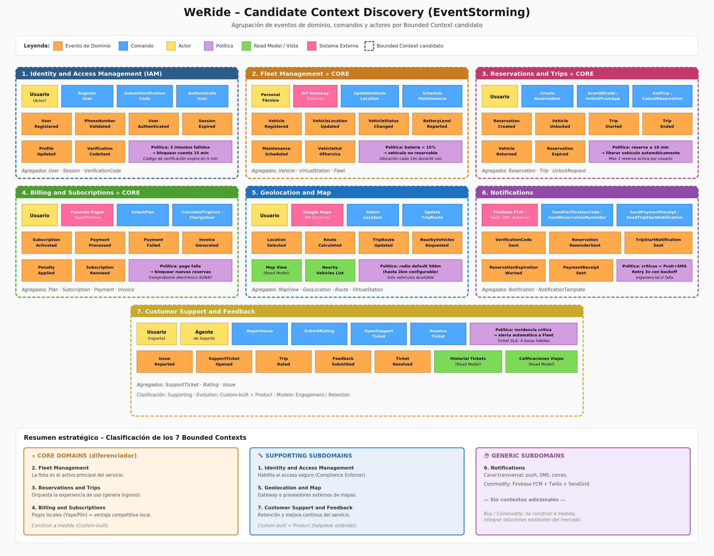

---

#### 2.5.1.2. Domain Message Flows Modeling

El *Domain Message Flows Modeling* consiste en identificar y documentar los **mensajes** (comandos, eventos de dominio y queries) que se intercambian entre los Bounded Contexts cuando ocurre un escenario de negocio relevante. Esto permite visualizar las dependencias entre contextos y preparar la siguiente fase: el Context Mapping.

A continuación se modelan los **cinco (5) flujos de mensajes más representativos** del dominio de WeRide, cada uno correspondiente a un escenario crítico del producto.

---

##### Flujo 1: Registro e inicio de sesión del usuario (US-01, US-02, US-03)

**Escenario:** Un nuevo usuario se registra en la aplicación WeRide, valida su número de celular mediante un código de verificación y accede a la aplicación.

| # | Emisor | Tipo | Mensaje | Receptor |
|---|--------|------|---------|----------|
| 1 | Usuario (Actor) | Comando | `RegisterUser(phoneNumber, email)` | IAM |
| 2 | IAM | Evento | `UserRegistered(userId, phoneNumber)` | (broadcast) |
| 3 | IAM | Comando | `SendVerificationCode(phoneNumber)` | Notifications |
| 4 | Notifications | Evento | `VerificationCodeSent(userId, channel)` | IAM |
| 5 | Usuario (Actor) | Comando | `SubmitVerificationCode(code)` | IAM |
| 6 | IAM | Evento | `PhoneNumberValidated(userId)` | (broadcast) |
| 7 | IAM | Evento | `UserAuthenticated(userId, sessionId)` | (broadcast) |

**Contextos involucrados:** IAM (principal), Notifications (soporte).

---

##### Flujo 2: Contratación de un plan y registro de método de pago (US-09, US-10)

**Escenario:** Un usuario autenticado selecciona un plan de suscripción y lo paga con tarjeta, Yape o Plin.

| # | Emisor | Tipo | Mensaje | Receptor |
|---|--------|------|---------|----------|
| 1 | Usuario (Actor) | Query | `GetAvailablePlans()` | Billing and Subscriptions |
| 2 | Billing | — | (respuesta con lista de planes) | Usuario |
| 3 | Usuario (Actor) | Comando | `SelectPlan(planId, paymentMethod)` | Billing and Subscriptions |
| 4 | Billing | Comando | `ProcessPayment(amount, method)` | Pasarela de Pagos (Sistema Externo) |
| 5 | Pasarela de Pagos | Evento | `PaymentProcessed(paymentId, status)` | Billing |
| 6 | Billing | Evento | `SubscriptionActivated(userId, planId)` | (broadcast) |
| 7 | Billing | Comando | `SendPaymentReceipt(userId, invoice)` | Notifications |
| 8 | Notifications | Evento | `PaymentReceiptSent(userId)` | Billing |

**Contextos involucrados:** Billing and Subscriptions (principal), IAM (contexto de identidad), Notifications, Pasarela de Pagos (externo).

---

##### Flujo 3: Búsqueda de vehículos cercanos y creación de reserva (US-11, US-17)

**Escenario:** El usuario selecciona una ubicación en el mapa, visualiza los vehículos cercanos disponibles y reserva uno.

| # | Emisor | Tipo | Mensaje | Receptor |
|---|--------|------|---------|----------|
| 1 | Usuario (Actor) | Comando | `SelectLocation(lat, lng)` | Geolocation and Map |
| 2 | Geolocation | Query | `FindNearbyVehicles(lat, lng, radius)` | Fleet Management |
| 3 | Fleet | — | (respuesta con vehículos disponibles) | Geolocation |
| 4 | Geolocation | Evento | `NearbyVehiclesDisplayed(userId, vehicles)` | Usuario |
| 5 | Usuario (Actor) | Comando | `CreateReservation(vehicleId, userId)` | Reservations and Trips |
| 6 | Reservations | Query | `CheckVehicleAvailability(vehicleId)` | Fleet Management |
| 7 | Fleet | Evento | `VehicleReserved(vehicleId, userId)` | Reservations |
| 8 | Reservations | Evento | `ReservationCreated(reservationId, userId, vehicleId)` | (broadcast) |
| 9 | Reservations | Comando | `NotifyReservationStart(userId, reservationId)` | Notifications |
| 10 | Notifications | Evento | `TripStartNotificationSent(userId)` | Reservations |

**Contextos involucrados:** Geolocation and Map, Fleet Management, Reservations and Trips, Notifications.

---

##### Flujo 4: Desbloqueo del vehículo e inicio del viaje (US-19, US-20, US-21)

**Escenario:** El usuario con reserva activa escanea el QR (o usa la app) y el sistema desbloquea el vehículo, iniciando el viaje.

| # | Emisor | Tipo | Mensaje | Receptor |
|---|--------|------|---------|----------|
| 1 | Usuario (Actor) | Comando | `ScanQRCode(qrToken, reservationId)` | Reservations and Trips |
| 2 | Reservations | Query | `ValidateReservation(reservationId, userId)` | Reservations |
| 3 | Reservations | Comando | `UnlockVehicle(vehicleId)` | Fleet Management |
| 4 | Fleet | Comando | `SendUnlockSignal(vehicleId)` | IoT Gateway (Sistema Externo) |
| 5 | IoT Gateway | Evento | `VehicleUnlocked(vehicleId, timestamp)` | Fleet |
| 6 | Fleet | Evento | `VehicleStatusChanged(vehicleId, IN_USE)` | (broadcast) |
| 7 | Reservations | Evento | `TripStarted(tripId, userId, vehicleId, startTime)` | (broadcast) |
| 8 | Reservations | Query | `GetTripRoute(tripId)` | Geolocation and Map |

**Contextos involucrados:** Reservations and Trips, Fleet Management, Geolocation and Map, IoT Gateway (externo).

---

##### Flujo 5: Finalización del viaje, facturación y calificación (US-12, US-13, US-14)

**Escenario:** El usuario devuelve el vehículo en una estación virtual, el sistema calcula el costo, lo cobra y solicita la calificación del viaje.

| # | Emisor | Tipo | Mensaje | Receptor |
|---|--------|------|---------|----------|
| 1 | Usuario (Actor) | Comando | `EndTrip(tripId)` | Reservations and Trips |
| 2 | Reservations | Comando | `LockVehicle(vehicleId)` | Fleet Management |
| 3 | Fleet | Evento | `VehicleReturned(vehicleId, location)` | (broadcast) |
| 4 | Reservations | Evento | `TripEnded(tripId, duration, distance)` | (broadcast) |
| 5 | Reservations | Comando | `CalculateTripCost(tripId, duration, distance)` | Billing and Subscriptions |
| 6 | Billing | Evento | `InvoiceGenerated(invoiceId, tripId, amount)` | (broadcast) |
| 7 | Billing | Comando | `ChargeUser(userId, amount)` | Pasarela de Pagos (externo) |
| 8 | Pasarela | Evento | `PaymentProcessed(paymentId)` | Billing |
| 9 | Billing | Comando | `SendInvoiceNotification(userId, invoice)` | Notifications |
| 10 | Reservations | Comando | `RequestTripRating(userId, tripId)` | Customer Support and Feedback |
| 11 | Usuario (Actor) | Comando | `SubmitRating(tripId, score, comment)` | Customer Support and Feedback |
| 12 | Customer Support | Evento | `TripRated(tripId, userId, score)` | (broadcast) |

**Contextos involucrados:** Reservations and Trips, Fleet Management, Billing and Subscriptions, Customer Support and Feedback, Notifications, Pasarela de Pagos (externo).

---


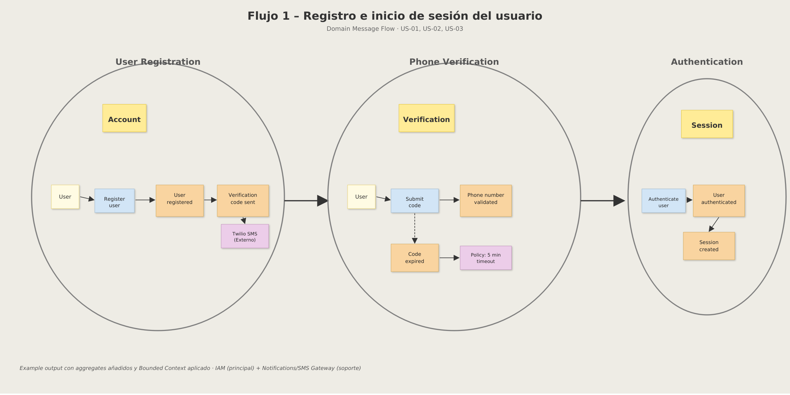
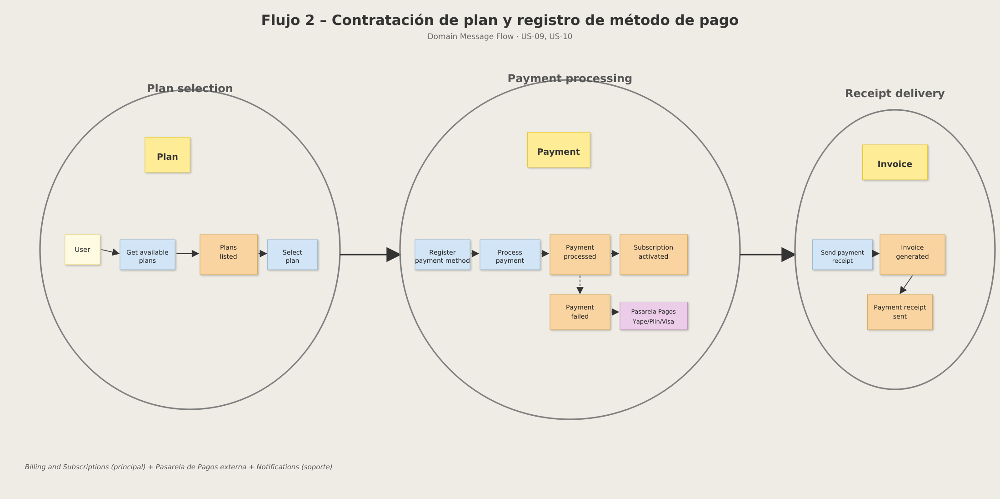
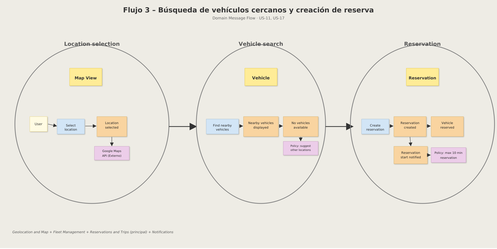
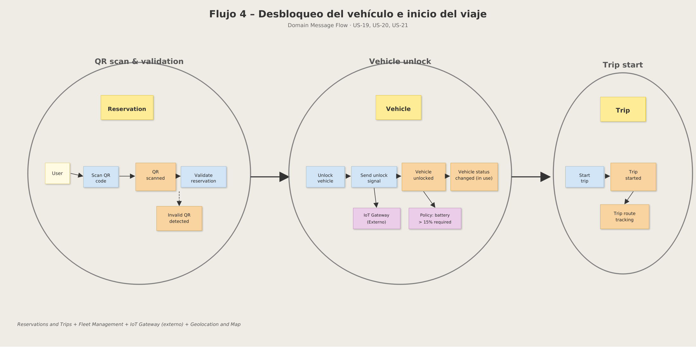
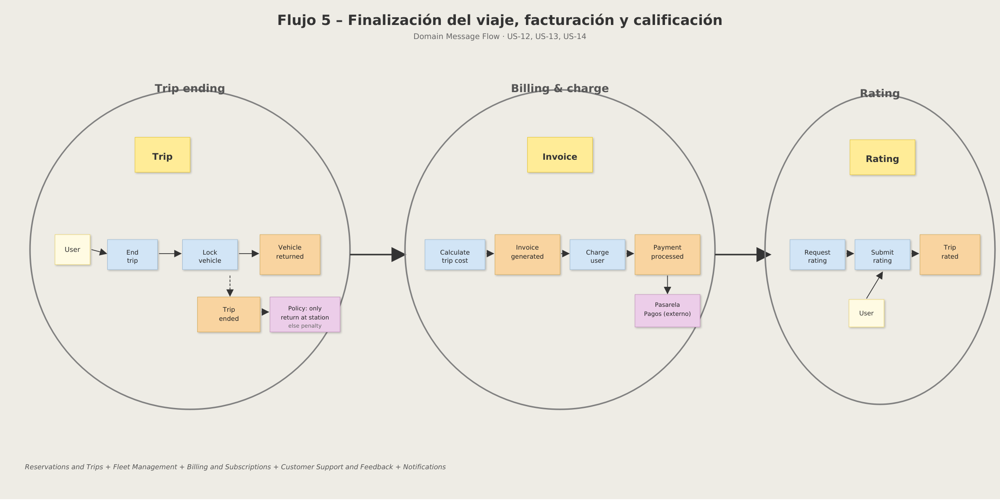


---

#### 2.5.1.3. Bounded Context Canvases

El *Bounded Context Canvas* es una plantilla creada por Nick Tune (DDD Crew) que permite describir, de forma estandarizada y colaborativa, las responsabilidades, el modelo de dominio, las comunicaciones entrantes y salientes, y los supuestos de cada Bounded Context. A continuación se presenta el canvas completo para cada uno de los siete Bounded Contexts identificados en WeRide.

Cada canvas está estructurado en las siguientes secciones estándar:

- **Name & Purpose:** nombre y propósito del contexto.
- **Strategic Classification:** clasificación como Core/Supporting/Generic, Business Model (Revenue Generator, Compliance Enforcer, Engagement) y Evolution Stage (Genesis, Custom-built, Product, Commodity).
- **Domain Roles:** roles que juega el contexto (Specification, Execution, Gateway, Audit, Analysis).
- **Inbound Communication:** comandos y queries recibidos, colaboradores y relaciones con otros BCs.
- **Ubiquitous Language & Business Decisions:** términos del dominio, reglas de negocio, eventos publicados y agregados.
- **Outbound Communication:** comandos enviados, eventos emitidos, queries invocadas, consumers y sistemas externos integrados.
- **Assumptions & Open Questions:** supuestos y preguntas abiertas a resolver con stakeholders.

---

##### Canvas 1: Identity and Access Management (IAM)

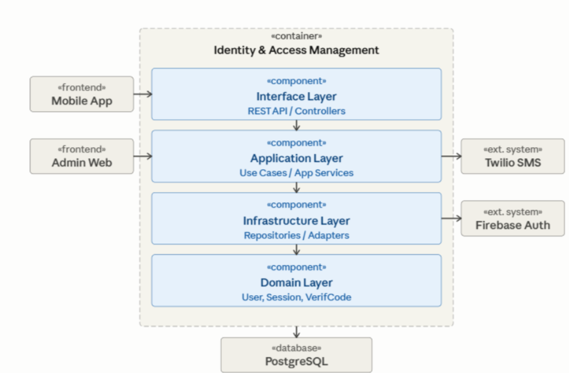

---

##### Canvas 2: Fleet Management ⭐

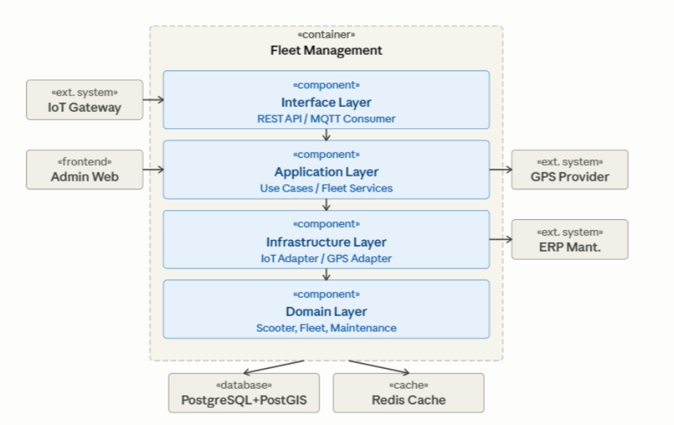

---

##### Canvas 3: Reservations and Trips ⭐

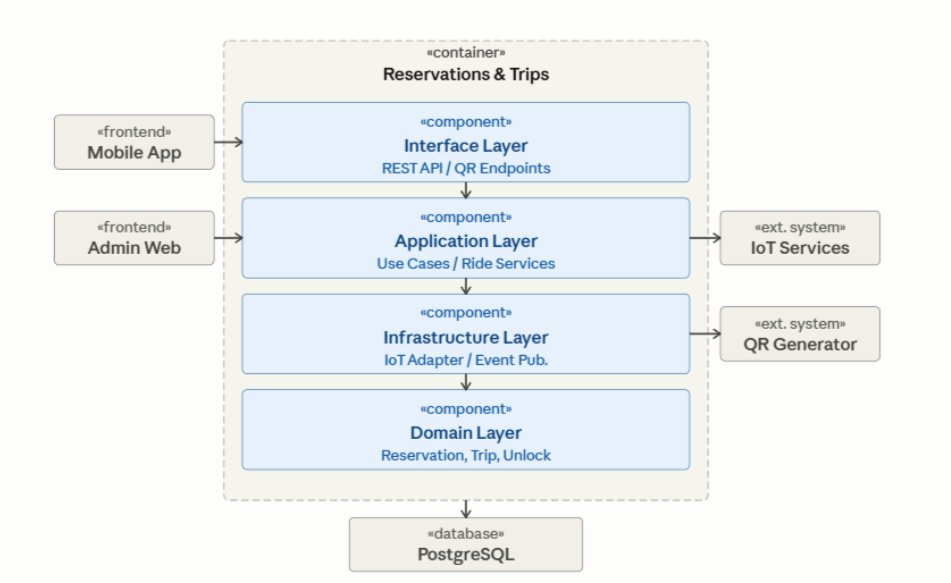

---

##### Canvas 4: Billing and Subscriptions ⭐

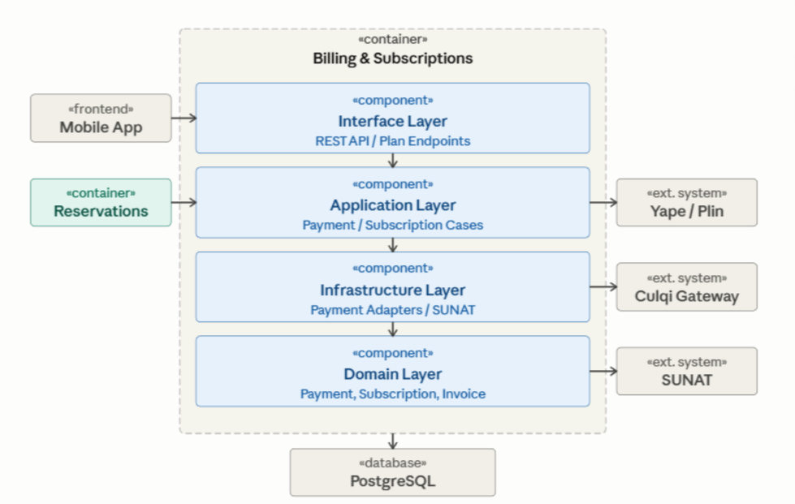

---

##### Canvas 5: Geolocation and Map

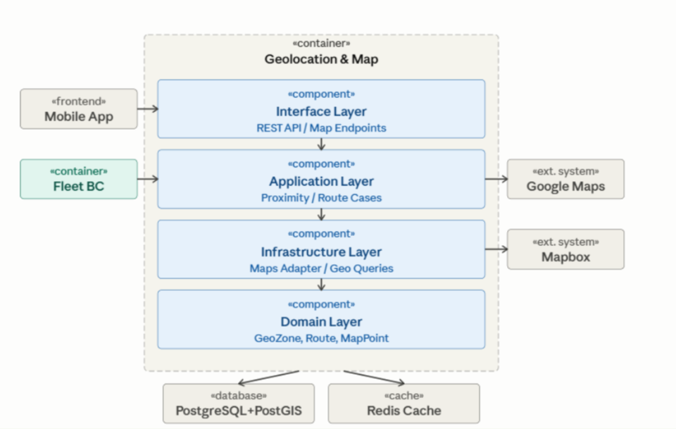

---

##### Canvas 6: Notifications

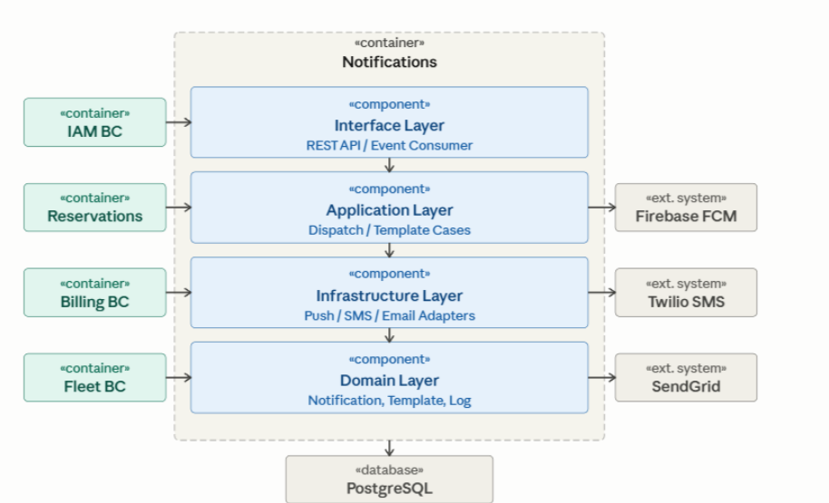

---

##### Canvas 7: Customer Support and Feedback

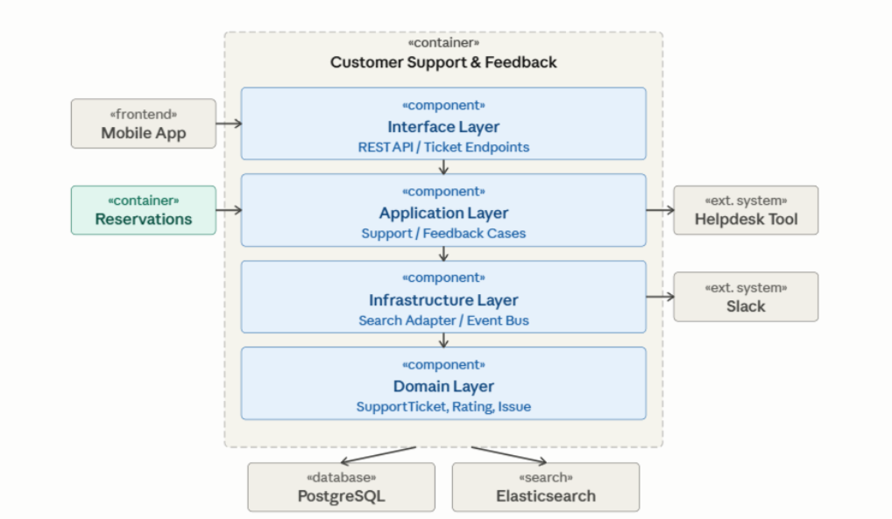


### 2.5.2. Context Mapping

Durante la fase de modelado basado en el dominio, se han identificado los siguientes bounded contexts: Identity and Access Management (IAM), Fleet Management, Reservations and Trips, Billing and Subscriptions, Geolocation and Map, Notifications y Customer Support and Feedback.
A continuación, se describe el tipo de relación existente entre estos contextos y la forma en que se comunican entre sí.

**Análisis de Bounded Contexts**

-  **Identity and Access Management (IAM) ↔ Reservations and Trips**
    - Relación: Upstream (IAM) / Downstream (Reservations)
    - Patrón: **Conformist** (IAM define el modelo de usuario y autenticación, y Reservations se adapta a este modelo para gestionar reservas y viajes)


-  **Identity and Access Management (IAM) ↔ Billing and Subscriptions**
    - Relación: Upstream (IAM) / Downstream (Billing)
    - Patrón: **Conformist** (Billing utiliza la información de identidad del usuario sin modificar su estructura, garantizando consistencia en pagos y suscripciones)


- **Geolocation and Map ↔ Fleet Management**
    - Relación: Upstream (Geolocation) / Downstream (Fleet)
    - Patrón: **ACL** (Fleet traduce coordenadas, rutas y datos geoespaciales a su propio modelo de ubicación de vehículos)


- **Geolocation and Map ↔ Reservations and Trips**
    - Relación: Upstream (Geolocation) / Downstream (Reservations)
    - Patrón: **ACL** (Reservations utiliza servicios de mapas y rutas, traduciendo la información geográfica a su lógica de negocio para trayectos)


- **Fleet Management ↔ Reservations and Trips**
    - Relación: Upstream (Fleet) / Downstream (Reservations)
    - Patrón: **PL** (Ambos contextos comparten conceptos como Vehicle, Status y Availability para garantizar consistencia en tiempo real durante las reservas)


- **Reservations and Trips ↔ Billing and Subscriptions**
    - Relación: Upstream (Reservations) / Downstream (Billing)
    - Patrón: **ACL** (Billing traduce la información de viajes —duración, distancia, tiempo— en cálculos de costos, tarifas y generación de facturas)


- **Reservations and Trips ↔ Notifications**
    - Relación: Upstream (Reservations) / Downstream (Notifications)
    - Patrón: **PL** (Reservations emite eventos como TripStarted, TripEnded o ReservationCreated, que Notifications consume para informar al usuario)


- **Fleet Management ↔ Notifications**
    - Relación: Upstream (Fleet) / Downstream (Notifications)
    - Patrón: **PL** (Fleet genera eventos como BatteryLow o VehicleOutOfService, los cuales son utilizados para notificaciones preventivas o alertas)
 

- **Reservations and Trips ↔ Customer Support and Feedback**
    - Relación: Upstream (Reservations) / Downstream (Support)
    - Patrón: **ACL** (Support traduce la información de viajes en tickets, incidentes y reportes gestionables por el sistema de atención al cliente)


- **Fleet Management ↔ Customer Support and Feedback**
    - Relación: Upstream (Fleet) / Downstream (Support)
    - Patrón: **PL** (Billing emite eventos como PaymentProcessed o InvoiceGenerated, que Notifications utiliza para enviar comprobantes y alertas de pago)


- **Reservations and Trips ↔ Notifications**
    - Relación: Upstream (Reservations) / Downstream (Notifications)
    - Patrón: **ACL** (Support traduce eventos de fallos o estados del vehículo en incidencias reportadas por los usuarios o detectadas automáticamente)


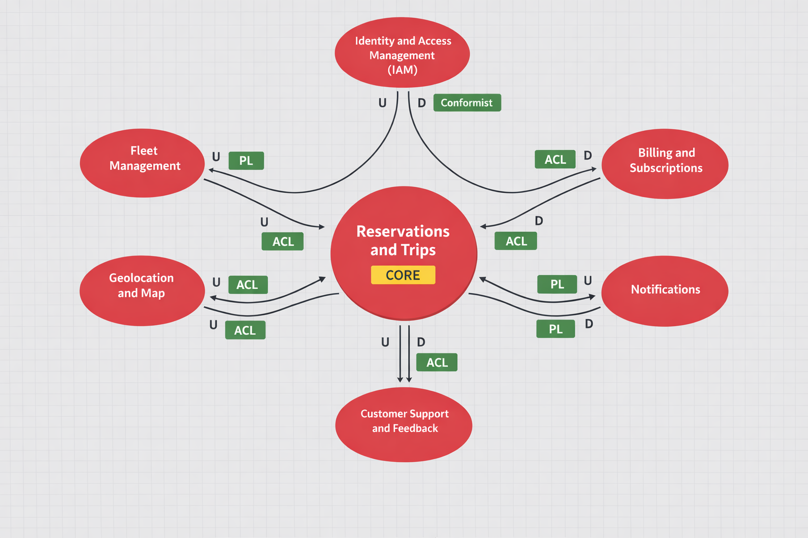

Se han identificado y analizado las relaciones entre los bounded contexts del sistema de micromovilidad. Cada relación ha sido clasificada utilizando patrones de context mapping, lo que permite comprender cómo interactúan los distintos contextos y cómo se comunican entre sí.


### 2.5.3. Software Architecture
#### 2.5.3.1. Software Architecture Context Level Diagrams

El diagrama de contexto en la arquitectura de software proporciona una visión general de alto nivel del sistema dentro de su entorno, mostrando cómo interactúa con los actores externos (usuarios, sistemas externos, etc.).

Para el sistema WeRide Platform, el diagrama de contexto incluye los siguientes actores y sistemas externos:

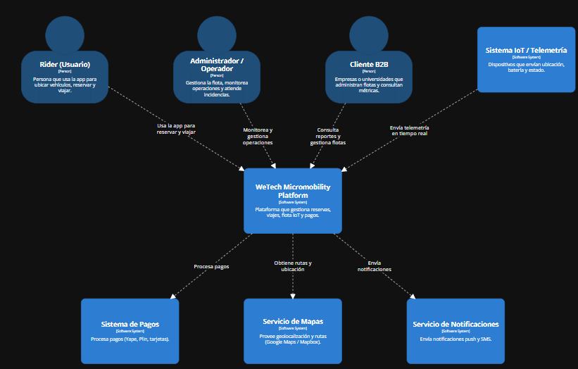

Para nuestro sistema WeRide, los actores y sistemas externos son:

- **Actores**:
  - **Rider (Usuario)**: Persona que utiliza la aplicación móvil para ubicar vehículos disponibles, realizar reservas, desbloquearlos y efectuar viajes dentro de la ciudad.
  - **Administrador / Operador**: Encargado de supervisar la flota de vehículos, monitorear su estado en tiempo real, gestionar incidencias y garantizar el correcto funcionamiento del sistema.
  - **Cliente B2B (Empresas / Universidades)**: Organizaciones que utilizan la plataforma para gestionar flotas asignadas, analizar métricas de uso y optimizar la movilidad interna de sus colaboradores o estudiantes.


- **Aplicación**:
  - **WeRide**: Sistema principal que gestiona la operación de micromovilidad eléctrica, incluyendo reservas, viajes, control de flota, integración con dispositivos IoT, procesamiento de pagos y notificaciones a los usuarios.


- **Sistemas Externos**:
  - **Sistema de Pagos**: Plataforma externa utilizada para procesar pagos, suscripciones y transacciones generadas por los viajes realizados por los usuarios.
  - **Servicio de Mapas**: Servicio que proporciona funcionalidades de geolocalización, cálculo de rutas y visualización de vehículos en el mapa.
  - **Sistema IoT / Telemetría**: Infraestructura de dispositivos instalados en los vehículos que envían información en tiempo real, como ubicación, nivel de batería y estado operativo.
  - **Servicio de Notificaciones**: Sistema externo encargado de enviar notificaciones push y mensajes SMS relacionados con reservas, viajes, alertas y eventos importantes del sistema.

#### 2.5.3.2. Software Architecture Container Level Diagrams

Nuestra arquitectura está basada en microservicios donde destacan dos componentes clave: el motor de optimización y el motor de seguridad, los cuales permiten ofrecer rutas eficientes y seguras en tiempo real, siendo nuestro principal valor diferencial. 
 
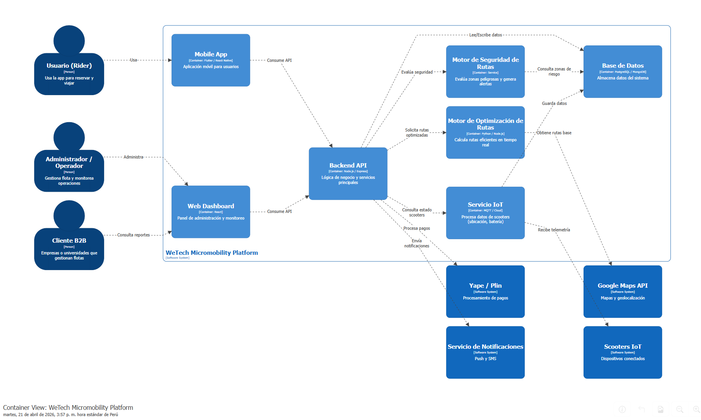

#### 2.5.3.3. Software Architecture Deployment Diagrams  

l presente Deployment Diagram describe la distribución física de la plataforma WeTech Micromobility sobre la infraestructura tecnológica. En este diagrama se representan los distintos entornos donde se ejecuta el sistema, incluyendo dispositivos de usuario (aplicaciones móviles y web), servidores en la nube y dispositivos IoT (scooters eléctricos).

Asimismo, se muestra cómo los diferentes componentes del software, como el backend, los motores de optimización y seguridad de rutas, y los servicios de telemetría, se despliegan e interactúan dentro de la infraestructura. También se consideran las integraciones con servicios externos, como plataformas de pago, mapas y notificaciones.

El objetivo de este diagrama es proporcionar una visión clara de cómo el sistema es implementado en el entorno físico, evidenciando su escalabilidad, disponibilidad y capacidad de procesamiento en tiempo real, aspectos fundamentales para el correcto funcionamiento de la solución de micromovilidad.

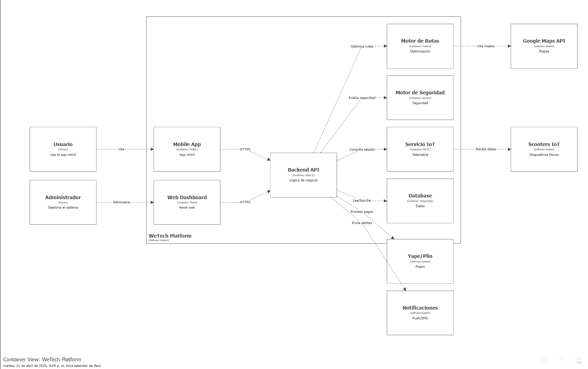

---

## 2.6. Tactical-Level Domain-Driven Design

El nivel táctico de Domain-Driven Design se enfoca en el modelado detallado dentro de cada Bounded Context, definiendo los patrones tácticos que dan estructura e implementación al dominio. A continuación, se presenta la especificación táctica para los seis Bounded Contexts identificados en WeRide.

### 2.6.1. Bounded Context: Identity & Access

**Propósito:** Gestionar el registro, autenticación, verificación de identidad y perfiles de usuario en la plataforma WeRide.

#### 2.6.1.1. Domain Layer

<table>
    <thead>
        <tr>
            <th colspan="3">Capa de Dominio - Identity & Access</th>
        </tr>
    </thead>
    <tbody>
        <tr>
            <td rowspan="2" width="120"><b>Entities</b></td>
            <td width="200"><b>User</b></td>
            <td>Usuario registrado con credenciales, perfil y estado de verificación.</td>
        </tr>
        <tr>
            <td><b>Session</b></td>
            <td>Sesión activa con token, fecha de creación y expiración.</td>
        </tr>
        <tr>
            <td rowspan="3"><b>Value Objects</b></td>
            <td><b>Email</b></td>
            <td>Validación y normalización de correos electrónicos.</td>
        </tr>
        <tr>
            <td><b>PhoneNumber</b></td>
            <td>Validación de números de teléfono peruanos.</td>
        </tr>
        <tr>
            <td><b>Password</b></td>
            <td>Hash y verificación segura de contraseñas.</td>
        </tr>
        <tr>
            <td><b>Aggregate Root</b></td>
            <td colspan="2"><b>User</b> — Gestiona identidad, perfil y credenciales.</td>
        </tr>
        <tr>
            <td rowspan="2"><b>Domain Services</b></td>
            <td><b>AuthenticationService</b></td>
            <td>Autenticación, verificación de credenciales y generación de tokens.</td>
        </tr>
        <tr>
            <td><b>UserValidationService</b></td>
            <td>Validación de reglas de negocio para registro y actualización.</td>
        </tr>
        <tr>
            <td><b>Repositories</b></td>
            <td colspan="2"><b>UserRepository</b>, <b>SessionRepository</b></td>
        </tr>
    </tbody>
</table>

#### 2.6.1.2. Application Layer

<table>
    <thead>
        <tr>
            <th colspan="3">Capa de Aplicación - Identity & Access</th>
        </tr>
    </thead>
    <tbody>
        <tr>
            <td rowspan="5" width="150"><b>Use Cases</b></td>
            <td width="200"><b>RegisterUser</b></td>
            <td>Registro de nuevo usuario con envío de código de verificación.</td>
        </tr>
        <tr>
            <td><b>LoginUser</b></td>
            <td>Autenticación y creación de sesión activa.</td>
        </tr>
        <tr>
            <td><b>VerifyPhoneNumber</b></td>
            <td>Validación de código SMS enviado al teléfono.</td>
        </tr>
        <tr>
            <td><b>UpdateProfile</b></td>
            <td>Actualización de información del perfil.</td>
        </tr>
        <tr>
            <td><b>LogoutUser</b></td>
            <td>Cierre de sesión e invalidación de token.</td>
        </tr>
        <tr>
            <td><b>Application Services</b></td>
            <td colspan="2"><b>AuthAppService</b>, <b>UserAppService</b></td>
        </tr>
        <tr>
            <td><b>DTOs</b></td>
            <td colspan="2"><b>UserDTO</b>, <b>AuthRequestDTO</b>, <b>AuthResponseDTO</b>, <b>VerificationCodeDTO</b></td>
        </tr>
    </tbody>
</table>

#### 2.6.1.3. Interface Layer

<table>
    <thead>
        <tr>
            <th colspan="4">Capa de Interfaz - Identity & Access</th>
        </tr>
    </thead>
    <tbody>
        <tr>
            <td colspan="4"><b>API Endpoints</b></td>
        </tr>
        <tr>
            <td width="120"><b>POST</b></td>
            <td width="200"><code>/auth/register</code></td>
            <td width="200">Registro de nuevo usuario</td>
            <td>—</td>
        </tr>
        <tr>
            <td><b>POST</b></td>
            <td><code>/auth/login</code></td>
            <td>Inicio de sesión</td>
            <td>—</td>
        </tr>
        <tr>
            <td><b>POST</b></td>
            <td><code>/auth/verify</code></td>
            <td>Verificación de código SMS</td>
            <td>—</td>
        </tr>
        <tr>
            <td><b>GET</b></td>
            <td><code>/users/profile</code></td>
            <td>Obtener perfil de usuario</td>
            <td>Requiere autenticación</td>
        </tr>
        <tr>
            <td><b>PUT</b></td>
            <td><code>/users/profile</code></td>
            <td>Actualizar perfil</td>
            <td>Requiere autenticación</td>
        </tr>
        <tr>
            <td colspan="4"><br><b>UI Components</b></td>
        </tr>
        <tr>
            <td colspan="4">Login Screen • Register Screen • Profile Screen</td>
        </tr>
    </tbody>
</table>

#### 2.6.1.4. Infrastructure Layer

La capa de infraestructura del Bounded Context *Identity & Access* provee las implementaciones concretas de los contratos definidos en las capas de dominio y aplicación, abstrayendo los detalles tecnológicos del núcleo del sistema.

| Componente | Responsabilidad |
|---|---|
| **UserRepository** | Persistencia y consulta de entidades `User` en base de datos relacional. |
| **SessionRepository** | Almacenamiento en caché de sesiones activas con TTL configurable para gestión de expiración. |
| **PasswordHashProvider**| Implementación de hashing y verificación segura de contraseñas mediante algoritmo BCrypt. |
| **JwtTokenProvider** | Generación, firma y validación de tokens de autenticación. |
| **SmsNotificationAdapter** | Envío de códigos de verificación por SMS al número de teléfono del usuario. |
| **EmailNotificationAdapter** | Envío de correos de confirmación y recuperación de cuenta. |
| **AuthMiddleware** | Interceptación de peticiones HTTP para validación de tokens y autorización. |
| **DatabaseMigration** | Gestión de migraciones y versionado del esquema de base de datos. |

**Dependencias externas:** Servicio de SMS (Twilio), proveedor de correo electrónico (SendGrid), base de datos relacional (PostgreSQL), almacén en caché (Redis).

#### 2.6.1.5. Bounded Context Software Architecture Component Level Diagrams

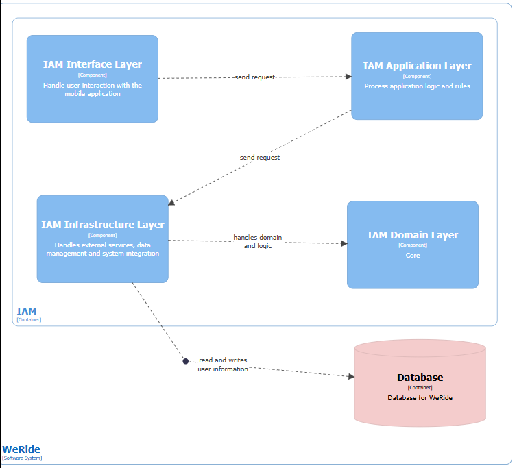

#### 2.6.1.6. Bounded Context Software Architecture Code Level Diagrams

##### 2.6.1.6.1. Bounded Context Domain Layer Class Diagrams

**Propósito:** El siguiente diagrama de clases UML representa la estructura del modelo de dominio del Bounded Context IAM, incluyendo entidades, value objects, agregados, servicios de dominio e interfaces de repositorio.

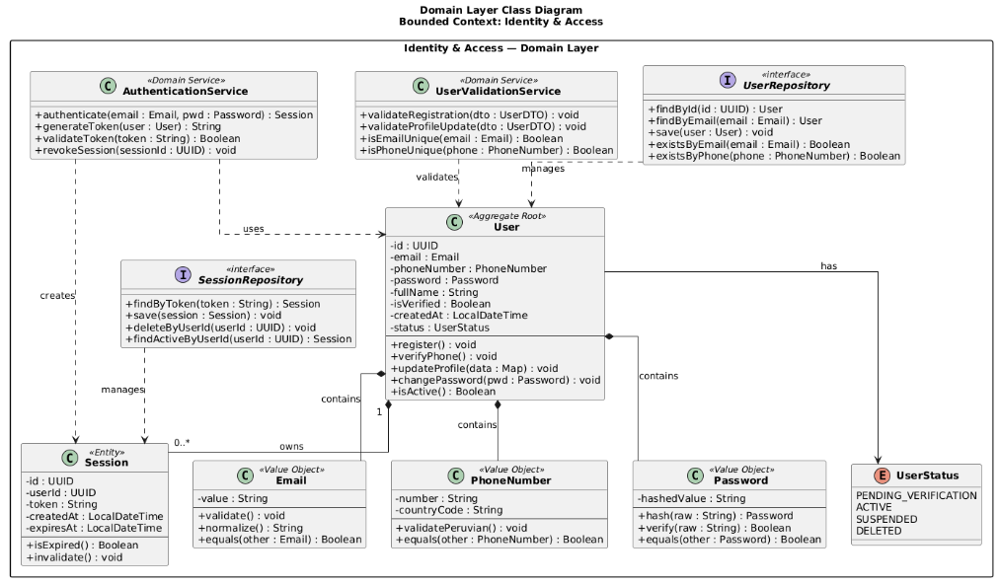

##### 2.6.1.6.2. Bounded Context Database Design Diagram

**Propósito:** El siguiente diagrama representa el diseño físico de la base de datos correspondiente al Bounded Context *Identity & Access*, describiendo las tablas, atributos, tipos de datos, claves primarias, claves foráneas y restricciones de integridad.

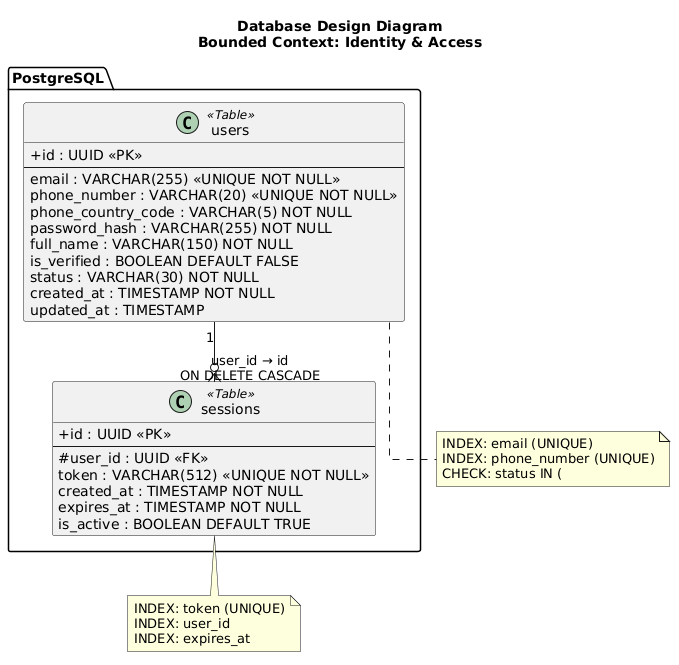

---

### 2.6.2. Bounded Context: Fleet Management

**Propósito:** Administrar la flota de vehículos eléctricos, su estado operativo, ubicación en tiempo real y mantenimiento.

#### 2.6.2.1. Domain Layer

<table>
    <thead>
        <tr>
            <th colspan="3">Capa de Dominio - Fleet Management</th>
        </tr>
    </thead>
    <tbody>
        <tr>
            <td rowspan="3" width="120"><b>Entities</b></td>
            <td width="200"><b>Scooter</b></td>
            <td>Vehículo eléctrico con ID único, estado, ubicación y batería.</td>
        </tr>
        <tr>
            <td><b>Fleet</b></td>
            <td>Agrupación lógica de scooters por zona o tipo.</td>
        </tr>
        <tr>
            <td><b>MaintenanceRecord</b></td>
            <td>Historial de mantenimientos realizados.</td>
        </tr>
        <tr>
            <td rowspan="3"><b>Value Objects</b></td>
            <td><b>Location (GPS)</b></td>
            <td>Coordenadas geográficas (latitud, longitud).</td>
        </tr>
        <tr>
            <td><b>BatteryLevel</b></td>
            <td>Nivel de carga (0-100%).</td>
        </tr>
        <tr>
            <td><b>ScooterStatus</b></td>
            <td>AVAILABLE, RESERVED, IN_USE, MAINTENANCE, OUT_OF_SERVICE.</td>
        </tr>
        <tr>
            <td><b>Aggregate Root</b></td>
            <td colspan="2"><b>Scooter</b> — Gestiona estado, ubicación y batería.</td>
        </tr>
        <tr>
            <td rowspan="2"><b>Domain Services</b></td>
            <td><b>FleetMonitoringService</b></td>
            <td>Monitoreo en tiempo real del estado de la flota.</td>
        </tr>
        <tr>
            <td><b>MaintenanceService</b></td>
            <td>Determinación de necesidad de mantenimiento.</td>
        </tr>
        <tr>
            <td><b>Repositories</b></td>
            <td colspan="2"><b>ScooterRepository</b>, <b>FleetRepository</b>, <b>MaintenanceRepository</b></td>
        </tr>
    </tbody>
</table>

#### 2.6.2.2. Application Layer

<table>
    <thead>
        <tr>
            <th colspan="3">Capa de Aplicación - Fleet Management</th>
        </tr>
    </thead>
    <tbody>
        <tr>
            <td rowspan="5" width="150"><b>Use Cases</b></td>
            <td width="200"><b>RegisterScooter</b></td>
            <td>Registro de nuevo scooter en la flota.</td>
        </tr>
        <tr>
            <td><b>UpdateScooterStatus</b></td>
            <td>Actualización del estado operativo.</td>
        </tr>
        <tr>
            <td><b>TrackScooterLocation</b></td>
            <td>Actualización de ubicación GPS.</td>
        </tr>
        <tr>
            <td><b>ScheduleMaintenance</b></td>
            <td>Programación de mantenimiento.</td>
        </tr>
        <tr>
            <td><b>GetNearbyScooters</b></td>
            <td>Obtención de scooters disponibles cercanos.</td>
        </tr>
        <tr>
            <td><b>Application Service</b></td>
            <td colspan="2"><b>FleetAppService</b></td>
        </tr>
        <tr>
            <td><b>DTOs</b></td>
            <td colspan="2"><b>ScooterDTO</b>, <b>LocationDTO</b>, <b>ScooterStatusDTO</b></td>
        </tr>
    </tbody>
</table>

#### 2.6.2.3. Interface Layer

<table>
    <thead>
        <tr>
            <th colspan="4">Capa de Interfaz - Fleet Management</th>
        </tr>
    </thead>
    <tbody>
        <tr>
            <td colspan="4"><b>API Endpoints</b></td>
        </tr>
        <tr>
            <td width="80"><b>GET</b></td>
            <td width="180"><code>/scooters</code></td>
            <td width="200">Listar todos los scooters</td>
            <td>—</td>
        </tr>
        <tr>
            <td><b>PUT</b></td>
            <td><code>/scooters/{id}/status</code></td>
            <td>Actualizar estado de scooter</td>
            <td>Uso interno/IoT</td>
        </tr>
        <tr>
            <td><b>GET</b></td>
            <td><code>/scooters/map</code></td>
            <td>Obtener scooters para mapa</td>
            <td>Filtrado por ubicación</td>
        </tr>
        <tr>
            <td><b>PUT</b></td>
            <td><code>/scooters/{id}/location</code></td>
            <td>Actualizar ubicación</td>
            <td>IoT Gateway</td>
        </tr>
        <tr>
            <td colspan="4"><br><b>Integraciones Externas</b></td>
        </tr>
        <tr>
            <td colspan="4">IoT Sensors (GPS) — MQTT/WebSocket • IoT Sensors (Batería) — Data Stream</td>
        </tr>
    </tbody>
</table>


#### 2.6.2.4. Infrastructure Layer

| Componente                | Responsabilidad |
|---------------------------|---|
| **ScooterRepository**     | Persistencia de entidades `Scooter` con soporte para consultas geoespaciales. |
| **FleetRepository**       | Persistencia y consulta de agrupaciones de flota. |
| **MaintenanceRepository** | Almacenamiento del historial de mantenimientos. |
| **GpsDataAdapter**        | Recepción de datos GPS provenientes de los sensores IoT mediante protocolo MQTT. |
| **BatteryDataAdapter**    | Procesamiento del stream de datos de nivel de batería enviado por los dispositivos. |
| **GeospatialQueryProvider** | Implementación de consultas de proximidad geoespacial para la búsqueda de scooters cercanos. |
| **CacheProvider**         | Caché del estado operativo de scooters para reducir latencia en consultas frecuentes. |
| **IoTCommandAdapter**     | Envío de comandos remotos a los dispositivos (desbloqueo/bloqueo). |

**Dependencias externas:** MQTT Broker (IoT), PostGIS (extensión geoespacial), Redis, servicios IoT de AWS.

#### 2.6.2.5. Bounded Context Software Architecture Component Level Diagrams

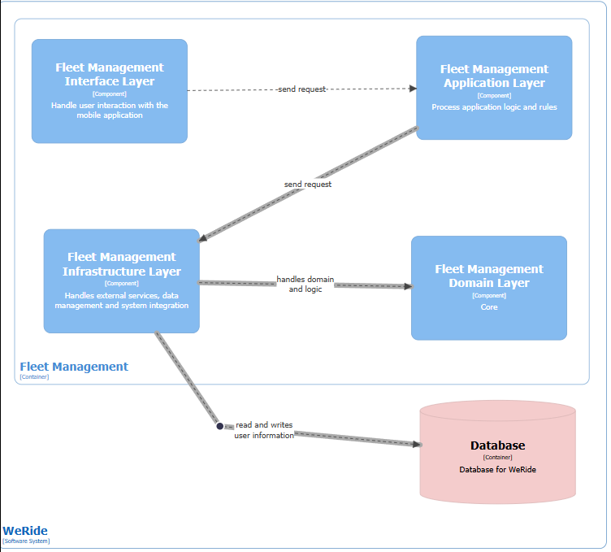

#### 2.6.2.6. Bounded Context Software Architecture Code Level Diagrams

##### 2.6.2.6.1. Bounded Context Domain Layer Class Diagrams

**Propósito:** El siguiente diagrama de clases UML representa la estructura del modelo de dominio del Bounded Context Fleet Management, incluyendo entidades, value objects, agregados, servicios de dominio e interfaces de repositorio.

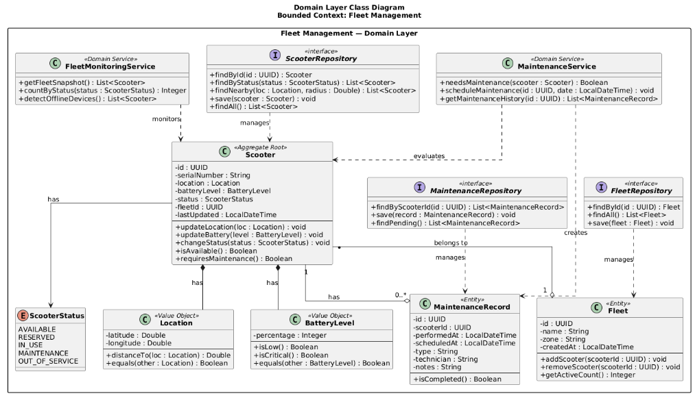

##### 2.6.2.6.2. Bounded Context Database Design Diagram

**Propósito:** El siguiente diagrama representa el diseño físico de la base de datos correspondiente al Bounded Context *Fleet Management*, describiendo las tablas, atributos, tipos de datos, claves primarias, claves foráneas y restricciones de integridad.

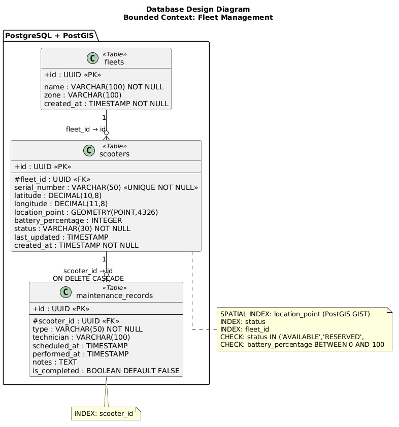


---

### 2.6.3. Bounded Context: Reservation & Trips

**Propósito:** Gestionar el ciclo completo de reservas y viajes, desde la creación hasta la finalización del trayecto.

#### 2.6.3.1. Domain Layer

<table>
    <thead>
        <tr>
            <th colspan="3">Capa de Dominio - Reservation & Ride</th>
        </tr>
    </thead>
    <tbody>
        <tr>
            <td rowspan="2" width="120"><b>Entities</b></td>
            <td width="200"><b>Reservation</b></td>
            <td>Reserva de scooter por un periodo de tiempo.</td>
        </tr>
        <tr>
            <td><b>Ride (Alquiler)</b></td>
            <td>Viaje activo con inicio, fin, ruta y métricas.</td>
        </tr>
        <tr>
            <td rowspan="3"><b>Value Objects</b></td>
            <td><b>ReservationStatus</b></td>
            <td>PENDING, CONFIRMED, EXPIRED, CANCELLED, CONVERTED_TO_RIDE.</td>
        </tr>
        <tr>
            <td><b>RideDuration</b></td>
            <td>Duración del viaje (minutos/segundos).</td>
        </tr>
        <tr>
            <td><b>RideRoute</b></td>
            <td>Ruta geográfica con puntos de inicio y fin.</td>
        </tr>
        <tr>
            <td><b>Aggregate Root</b></td>
            <td colspan="2"><b>Ride</b> — Gestiona: reserva → desbloqueo → viaje → fin.</td>
        </tr>
        <tr>
            <td rowspan="2"><b>Domain Services</b></td>
            <td><b>ReservationService</b></td>
            <td>Lógica de creación y expiración de reservas.</td>
        </tr>
        <tr>
            <td><b>RideService</b></td>
            <td>Cálculo de métricas y finalización del viaje.</td>
        </tr>
        <tr>
            <td><b>Repositories</b></td>
            <td colspan="2"><b>ReservationRepository</b>, <b>RideRepository</b></td>
        </tr>
    </tbody>
</table>

#### 2.6.3.2. Application Layer

<table>
    <thead>
        <tr>
            <th colspan="3">Capa de Aplicación - Reservation & Ride</th>
        </tr>
    </thead>
    <tbody>
        <tr>
            <td rowspan="5" width="150"><b>Use Cases</b></td>
            <td width="200"><b>CreateReservation</b></td>
            <td>Crear reserva para scooter disponible.</td>
        </tr>
        <tr>
            <td><b>StartRide</b></td>
            <td>Iniciar viaje tras desbloqueo del scooter.</td>
        </tr>
        <tr>
            <td><b>EndRide</b></td>
            <td>Finalizar viaje y registrar ubicación de entrega.</td>
        </tr>
        <tr>
            <td><b>CancelReservation</b></td>
            <td>Cancelar reserva activa.</td>
        </tr>
        <tr>
            <td><b>GetActiveRide</b></td>
            <td>Obtener viaje activo del usuario.</td>
        </tr>
        <tr>
            <td><b>Application Service</b></td>
            <td colspan="2"><b>RideAppService</b></td>
        </tr>
        <tr>
            <td><b>DTOs</b></td>
            <td colspan="2"><b>ReservationDTO</b>, <b>RideDTO</b></td>
        </tr>
    </tbody>
</table>

#### 2.6.3.3. Interface Layer

<table>
    <thead>
        <tr>
            <th colspan="4">Capa de Interfaz - Reservation & Ride</th>
        </tr>
    </thead>
    <tbody>
        <tr>
            <td colspan="4"><b>API Endpoints</b></td>
        </tr>
        <tr>
            <td width="80"><b>POST</b></td>
            <td width="180"><code>/reservations</code></td>
            <td width="200">Crear nueva reserva</td>
            <td>Requiere autenticación</td>
        </tr>
        <tr>
            <td><b>DELETE</b></td>
            <td><code>/reservations/{id}</code></td>
            <td>Cancelar reserva</td>
            <td>Usuario dueño de reserva</td>
        </tr>
        <tr>
            <td><b>POST</b></td>
            <td><code>/rides/start</code></td>
            <td>Iniciar viaje (desbloqueo)</td>
            <td>Con QR o desde app</td>
        </tr>
        <tr>
            <td><b>POST</b></td>
            <td><code>/rides/end</code></td>
            <td>Finalizar viaje</td>
            <td>Requiere viaje activo</td>
        </tr>
        <tr>
            <td><b>GET</b></td>
            <td><code>/rides/active</code></td>
            <td>Obtener viaje activo</td>
            <td>Usuario autenticado</td>
        </tr>
        <tr>
            <td colspan="4"><br><b>UI Components</b></td>
        </tr>
        <tr>
            <td colspan="4">Map View • Ride Tracking Screen</td>
        </tr>
    </tbody>
</table>


#### 2.6.3.4. Infrastructure Layer

| Componente | Responsabilidad |
|----|---|
| **ReservationRepositoryImpl**  | Persistencia de reservas con soporte para consultas por estado y usuario. |
| **RideRepositoryImpl** | Persistencia de viajes activos e históricos con datos de ruta. |
| **ReservationExpiryScheduler** | Tarea programada que invalida reservas vencidas periódicamente. |
| **QrCodeAdapter** | Generación y validación de códigos QR para desbloqueo de scooters. |
| **ScooterUnlockAdapter** | Envío del comando de desbloqueo al sistema IoT del scooter correspondiente. |
| **EventPublisher** | Publicación de eventos de dominio (`RideStarted`, `RideEnded`) hacia otros bounded contexts. |
| **CacheProvider** | Caché del viaje activo por usuario para consultas de baja latencia. |

**Dependencias externas:** Sistema IoT (desbloqueo de scooters), Message Broker (Kafka/RabbitMQ), PostgreSQL, Redis.


#### 2.6.3.5. Bounded Context Software Architecture Component Level Diagrams

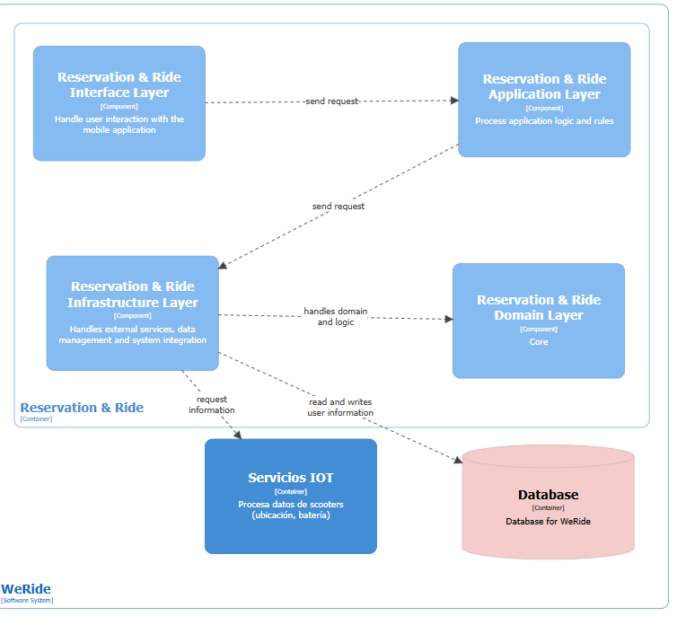

#### 2.6.3.6. Bounded Context Software Architecture Code Level Diagrams

##### 2.6.3.6.1. Bounded Context Domain Layer Class Diagrams

**Propósito:** El siguiente diagrama de clases UML representa la estructura del modelo de dominio del Bounded Context Reservation & Ride, incluyendo entidades, value objects, agregados, servicios de dominio e interfaces de repositorio.

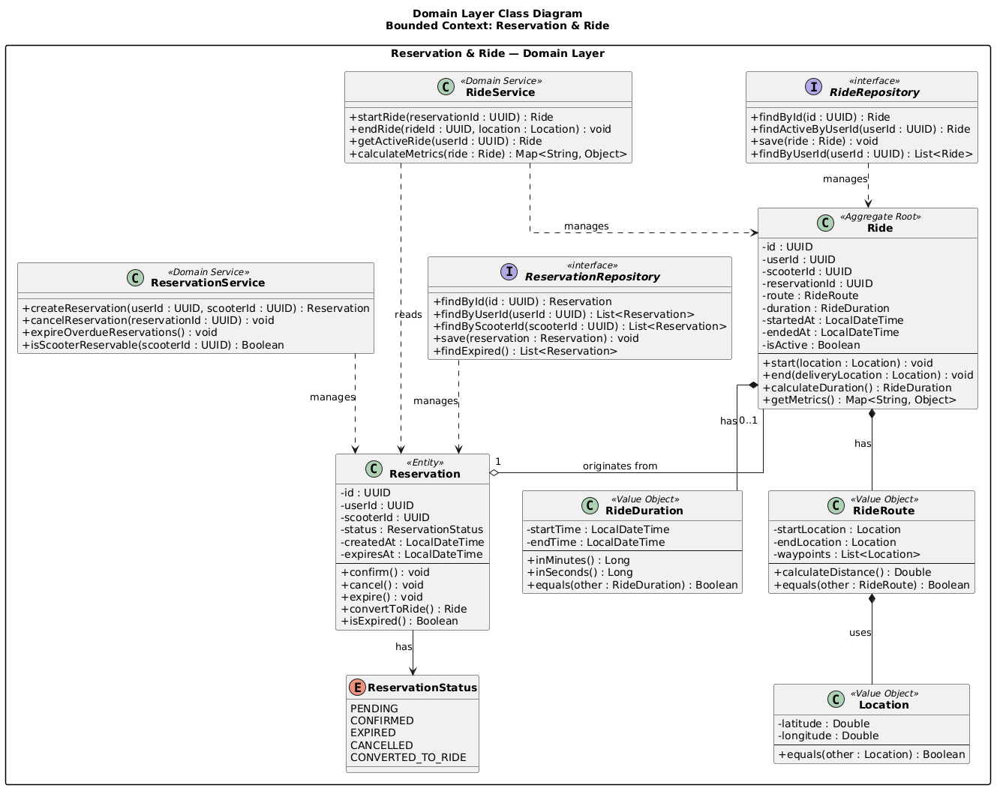

##### 2.6.3.6.2. Bounded Context Database Design Diagram

**Propósito:** El siguiente diagrama representa el diseño físico de la base de datos correspondiente al Bounded Context *Reservation & Ride*, describiendo las tablas, atributos, tipos de datos, claves primarias, claves foráneas y restricciones de integridad.

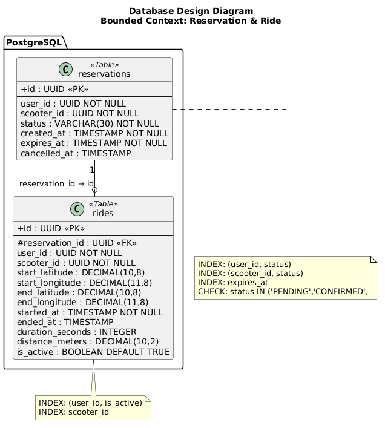


---

### 2.6.4. Bounded Context: Billing & Subscriptions

**Propósito:** Gestionar planes de suscripción, procesamiento de pagos, facturación y penalizaciones.

#### 2.6.4.1. Domain Layer

<table>
    <thead>
        <tr>
            <th colspan="3">Capa de Dominio - Payments & Subscriptions</th>
        </tr>
    </thead>
    <tbody>
        <tr>
            <td rowspan="3" width="120"><b>Entities</b></td>
            <td width="200"><b>Payment</b></td>
            <td>Transacción de pago.</td>
        </tr>
        <tr>
            <td><b>Subscription</b></td>
            <td>Suscripción activa de usuario a un plan.</td>
        </tr>
        <tr>
            <td><b>Invoice</b></td>
            <td>Factura generada por pago o viaje.</td>
        </tr>
        <tr>
            <td rowspan="3"><b>Value Objects</b></td>
            <td><b>Amount</b></td>
            <td>Monto monetario con moneda y precisión.</td>
        </tr>
        <tr>
            <td><b>PaymentMethod</b></td>
            <td>YAPE, PLIN, CREDIT_CARD, DEBIT_CARD.</td>
        </tr>
        <tr>
            <td><b>Currency</b></td>
            <td>PEN, USD.</td>
        </tr>
        <tr>
            <td><b>Aggregate Root</b></td>
            <td colspan="2"><b>Payment</b> — Gestiona el ciclo de vida de un pago.</td>
        </tr>
        <tr>
            <td rowspan="2"><b>Domain Services</b></td>
            <td><b>PaymentProcessingService</b></td>
            <td>Procesamiento con pasarelas externas.</td>
        </tr>
        <tr>
            <td><b>SubscriptionService</b></td>
            <td>Renovaciones y cambios de suscripción.</td>
        </tr>
        <tr>
            <td><b>Repositories</b></td>
            <td colspan="2"><b>PaymentRepository</b>, <b>SubscriptionRepository</b>, <b>InvoiceRepository</b></td>
        </tr>
    </tbody>
</table>

#### 2.6.4.2. Application Layer

<table>
    <thead>
        <tr>
            <th colspan="3">Capa de Aplicación - Payments & Subscriptions</th>
        </tr>
    </thead>
    <tbody>
        <tr>
            <td rowspan="5" width="150"><b>Use Cases</b></td>
            <td width="200"><b>ProcessPayment</b></td>
            <td>Procesar pago con método seleccionado.</td>
        </tr>
        <tr>
            <td><b>CreateSubscription</b></td>
            <td>Crear suscripción a un plan.</td>
        </tr>
        <tr>
            <td><b>CancelSubscription</b></td>
            <td>Cancelar suscripción activa.</td>
        </tr>
        <tr>
            <td><b>GenerateInvoice</b></td>
            <td>Generar factura por viaje o suscripción.</td>
        </tr>
        <tr>
            <td><b>CalculateRideCost</b></td>
            <td>Calcular costo basado en tiempo/distancia.</td>
        </tr>
        <tr>
            <td><b>Application Service</b></td>
            <td colspan="2"><b>PaymentAppService</b></td>
        </tr>
        <tr>
            <td><b>DTOs</b></td>
            <td colspan="2"><b>PaymentDTO</b>, <b>SubscriptionDTO</b>, <b>InvoiceDTO</b></td>
        </tr>
    </tbody>
</table>

#### 2.6.4.3. Interface Layer

<table>
    <thead>
        <tr>
            <th colspan="4">Capa de Interfaz - Payments & Subscriptions</th>
        </tr>
    </thead>
    <tbody>
        <tr>
            <td colspan="4"><b>API Endpoints</b></td>
        </tr>
        <tr>
            <td width="80"><b>POST</b></td>
            <td width="180"><code>/payments/process</code></td>
            <td width="200">Procesar pago</td>
            <td>Requiere autenticación</td>
        </tr>
        <tr>
            <td><b>POST</b></td>
            <td><code>/subscriptions</code></td>
            <td>Crear suscripción</td>
            <td>Requiere autenticación</td>
        </tr>
        <tr>
            <td><b>DELETE</b></td>
            <td><code>/subscriptions/{id}</code></td>
            <td>Cancelar suscripción</td>
            <td>Usuario dueño de suscripción</td>
        </tr>
        <tr>
            <td><b>GET</b></td>
            <td><code>/invoices</code></td>
            <td>Listar facturas</td>
            <td>Usuario autenticado</td>
        </tr>
        <tr>
            <td><b>GET</b></td>
            <td><code>/plans</code></td>
            <td>Listar planes disponibles</td>
            <td>Público</td>
        </tr>
        <tr>
            <td colspan="4"><br><b>Integraciones Externas</b></td>
        </tr>
        <tr>
            <td colspan="4">Yape/Plin — API de pagos QR • Payment Gateway — Pasarela de tarjetas (Culqi, Izipay)</td>
        </tr>
    </tbody>
</table>


#### 2.6.4.4. Infrastructure Layer

| Componente | Responsabilidad |
|---|---|
| **PaymentRepositoryImpl** | Persistencia de transacciones de pago con estado y metadatos de pasarela. |
| **SubscriptionRepositoryImpl** | Persistencia de suscripciones activas e históricas. |
| **InvoiceRepositoryImpl** | Almacenamiento y recuperación de facturas generadas. |
| **CulqiPaymentAdapter** | Integración con pasarela Culqi para procesamiento de tarjetas de crédito/débito. |
| **IzipayPaymentAdapter** | Integración alternativa con pasarela Izipay para procesamiento de tarjetas. |
| **YapeQrAdapter** | Integración con Yape para generación de pagos QR. |
| **PlinAdapter**  | Integración con Plin para pagos móviles. |
| **SubscriptionRenewalScheduler**  | Tarea programada para renovación automática de suscripciones periódicas. |
| **PdfInvoiceGenerator** | Generación de documentos PDF para facturas. |
| **EventPublisher** | Publicación del evento `PaymentCompleted` para actualizar suscripciones y viajes. |

**Dependencias externas:** Culqi, Izipay, Yape, Plin, servicio de generación de PDFs.


#### 2.6.4.5. Bounded Context Software Architecture Component Level Diagrams

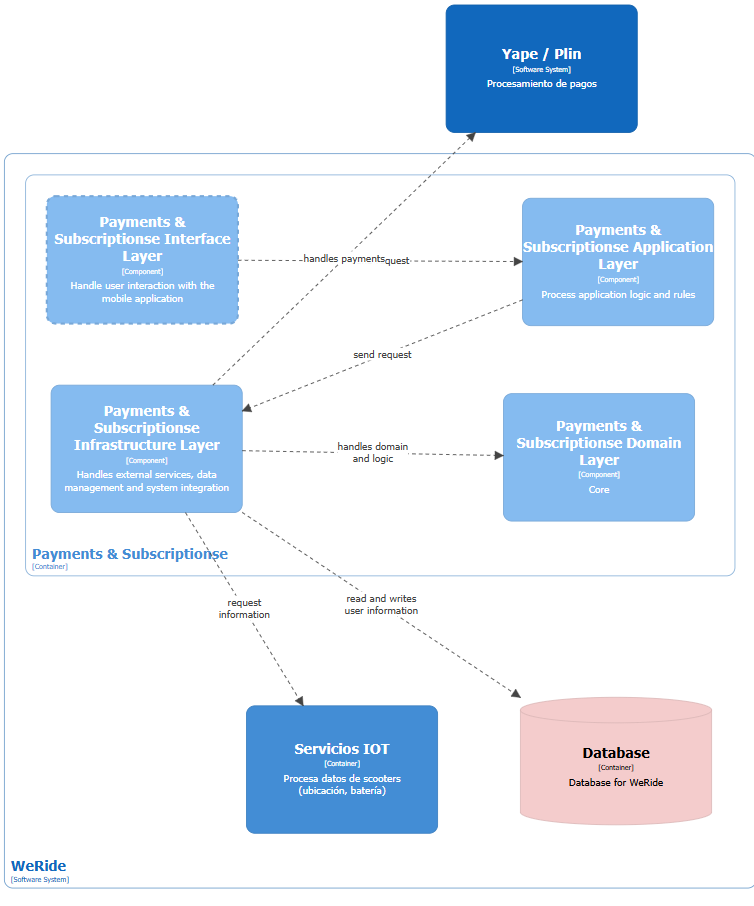

#### 2.6.4.6. Bounded Context Software Architecture Code Level Diagrams

##### 2.6.4.6.1. Bounded Context Domain Layer Class Diagrams

**Propósito:** El siguiente diagrama de clases UML representa la estructura del modelo de dominio del Bounded Context Payments & Subscriptions, incluyendo entidades, value objects, agregados, servicios de dominio e interfaces de repositorio.

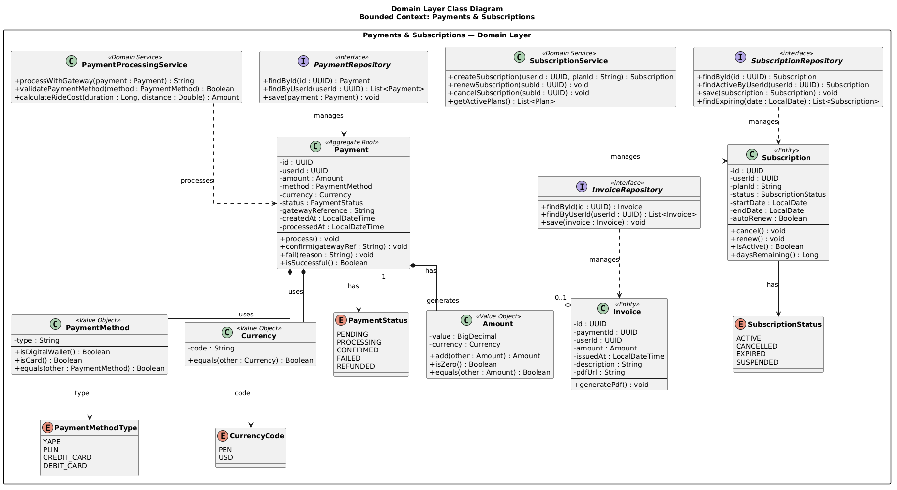

##### 2.6.4.6.2. Bounded Context Database Design Diagram

**Propósito:** El siguiente diagrama representa el diseño físico de la base de datos correspondiente al Bounded Context *Payments & Subscriptions*, describiendo las tablas, atributos, tipos de datos, claves primarias, claves foráneas y restricciones de integridad.
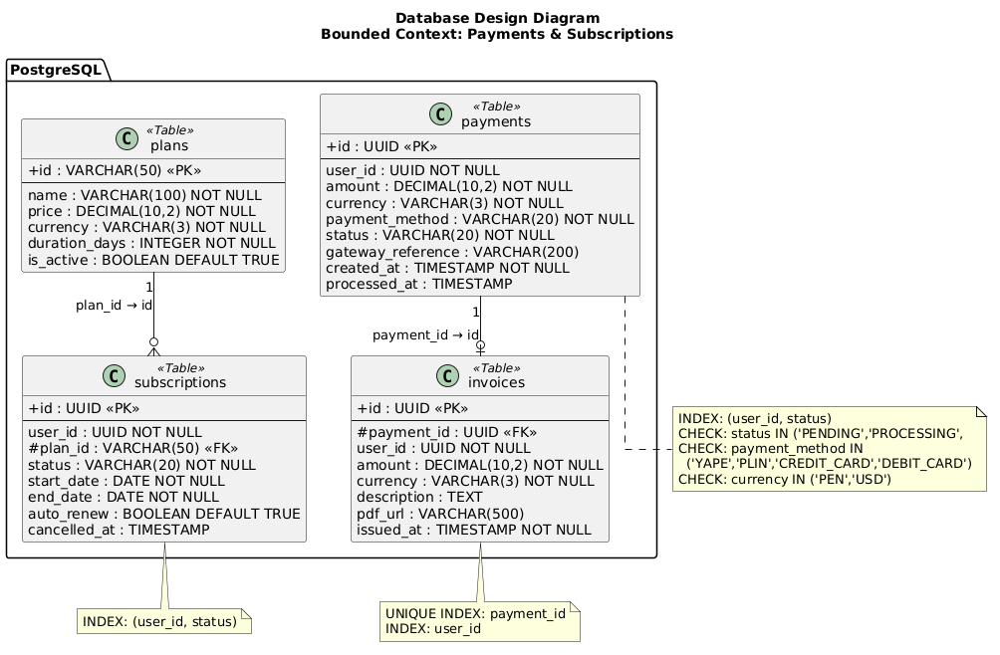


---

### 2.6.5. Bounded Context: Geolocation and Map

**Propósito:** Proveer servicios de geolocalización, búsqueda de vehículos cercanos, cálculo de rutas y visualización de mapas en tiempo real para los usuarios y operadores de WeRide.

#### 2.6.5.1. Domain Layer

<table>
    <thead>
        <tr>
            <th colspan="3">Capa de Dominio - Geolocation and Map</th>
        </tr>
    </thead>
    <tbody>
        <tr>
            <td rowspan="3" width="120"><b>Entities</b></td>
            <td width="200"><b>GeoZone</b></td>
            <td>Zona geográfica definida con geocercas y restricciones de operación.</td>
        </tr>
        <tr>
            <td><b>Route</b></td>
            <td>Ruta calculada entre un origen y destino, con distancia y duración estimada.</td>
        </tr>
        <tr>
            <td><b>MapPoint</b></td>
            <td>Punto de interés en el mapa (estación virtual, zona de recarga, área restringida).</td>
        </tr>
        <tr>
            <td rowspan="3"><b>Value Objects</b></td>
            <td><b>Coordinates</b></td>
            <td>Par de valores (latitud, longitud) que representa una posición geográfica.</td>
        </tr>
        <tr>
            <td><b>RadiusDistance</b></td>
            <td>Distancia en metros utilizada para búsquedas de proximidad.</td>
        </tr>
        <tr>
            <td><b>GeoBoundary</b></td>
            <td>Polígono geográfico que delimita una zona operativa o restringida.</td>
        </tr>
        <tr>
            <td><b>Aggregate Root</b></td>
            <td colspan="2"><b>GeoZone</b> — Gestiona las zonas operativas, geocercas y puntos de interés asociados.</td>
        </tr>
        <tr>
            <td rowspan="2"><b>Domain Services</b></td>
            <td><b>ProximitySearchService</b></td>
            <td>Búsqueda de vehículos disponibles dentro de un radio dado desde la posición del usuario.</td>
        </tr>
        <tr>
            <td><b>RouteCalculationService</b></td>
            <td>Cálculo de rutas óptimas entre coordenadas, considerando restricciones de zonas.</td>
        </tr>
        <tr>
            <td><b>Repositories</b></td>
            <td colspan="2"><b>GeoZoneRepository</b>, <b>RouteRepository</b>, <b>MapPointRepository</b></td>
        </tr>
    </tbody>
</table>

#### 2.6.5.2. Application Layer

<table>
    <thead>
        <tr>
            <th colspan="3">Capa de Aplicación - Geolocation and Map</th>
        </tr>
    </thead>
    <tbody>
        <tr>
            <td rowspan="4" width="150"><b>Use Cases</b></td>
            <td width="200"><b>FindNearbyVehicles</b></td>
            <td>Localizar vehículos disponibles en un radio cercano a la posición del usuario.</td>
        </tr>
        <tr>
            <td><b>CalculateRoute</b></td>
            <td>Calcular ruta sugerida entre origen y destino para un viaje activo.</td>
        </tr>
        <tr>
            <td><b>CheckGeofenceCompliance</b></td>
            <td>Verificar si una ubicación se encuentra dentro de una zona operativa válida.</td>
        </tr>
        <tr>
            <td><b>GetMapPointsOfInterest</b></td>
            <td>Obtener estaciones virtuales y zonas de recarga visibles en el mapa.</td>
        </tr>
        <tr>
            <td><b>Application Service</b></td>
            <td colspan="2"><b>GeolocationAppService</b></td>
        </tr>
        <tr>
            <td><b>DTOs</b></td>
            <td colspan="2"><b>NearbyVehiclesDTO</b>, <b>RouteDTO</b>, <b>GeoZoneDTO</b>, <b>MapPointDTO</b></td>
        </tr>
    </tbody>
</table>

#### 2.6.5.3. Interface Layer

<table>
    <thead>
        <tr>
            <th colspan="4">Capa de Interfaz - Geolocation and Map</th>
        </tr>
    </thead>
    <tbody>
        <tr>
            <td colspan="4"><b>API Endpoints</b></td>
        </tr>
        <tr>
            <td width="80"><b>GET</b></td>
            <td width="180"><code>/geo/vehicles/nearby</code></td>
            <td width="200">Vehículos disponibles cercanos</td>
            <td>Parámetros: lat, lng, radius</td>
        </tr>
        <tr>
            <td><b>GET</b></td>
            <td><code>/geo/route</code></td>
            <td>Calcular ruta entre dos puntos</td>
            <td>Parámetros: origin, destination</td>
        </tr>
        <tr>
            <td><b>GET</b></td>
            <td><code>/geo/zones</code></td>
            <td>Obtener zonas operativas activas</td>
            <td>Requiere autenticación</td>
        </tr>
        <tr>
            <td><b>GET</b></td>
            <td><code>/geo/map-points</code></td>
            <td>Puntos de interés en el mapa</td>
            <td>Requiere autenticación</td>
        </tr>
        <tr>
            <td><b>POST</b></td>
            <td><code>/geo/geofence/check</code></td>
            <td>Verificar cumplimiento de geocerca</td>
            <td>Uso interno entre contextos</td>
        </tr>
        <tr>
            <td colspan="4"><br><b>UI Components</b></td>
        </tr>
        <tr>
            <td colspan="4">Map View (mapa interactivo) • Nearby Vehicles Layer • Route Preview Panel • GeoZone Overlay</td>
        </tr>
    </tbody>
</table>

#### 2.6.5.4. Infrastructure Layer

| Componente | Responsabilidad |
|---|---|
| **GeoZoneRepositoryImpl** | Persistencia y consulta de zonas operativas y geocercas definidas en el sistema. |
| **RouteRepositoryImpl** | Almacenamiento y recuperación de rutas calculadas para viajes activos e históricos. |
| **MapPointRepositoryImpl** | Gestión de puntos de interés en el mapa (estaciones virtuales, zonas de recarga). |
| **MapsServiceAdapter** | Integración con el servicio de mapas externo (Google Maps / Mapbox) para cálculo de rutas y geocodificación. |
| **GeospatialQueryAdapter** | Ejecución de consultas espaciales (búsqueda por radio, intersección de polígonos) sobre la base de datos geoespacial. |
| **GeofenceEvaluatorAdapter** | Evaluación en tiempo real del cumplimiento de geocercas durante viajes activos. |
| **TileCacheAdapter** | Caché de tiles de mapa para reducir llamadas repetitivas al servicio de mapas externo. |

**Dependencias externas:** Servicio de Mapas (Google Maps Platform / Mapbox), PostGIS (extensión geoespacial de PostgreSQL), Redis (caché de tiles y resultados de búsqueda).

#### 2.6.5.5. Bounded Context Software Architecture Component Level Diagrams

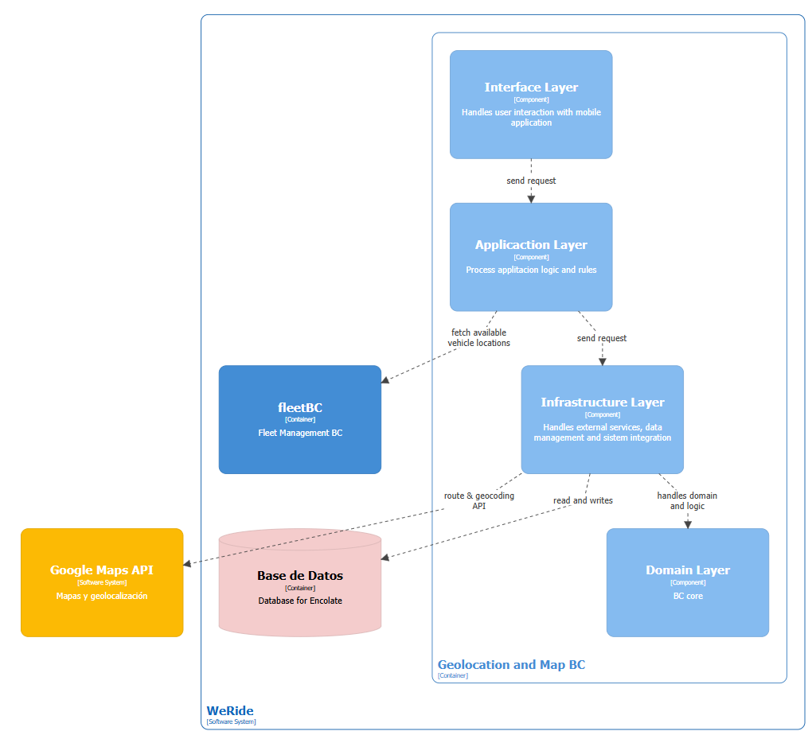

#### 2.6.5.6. Bounded Context Software Architecture Code Level Diagrams

##### 2.6.5.6.1. Bounded Context Domain Layer Class Diagrams

**Propósito:** El siguiente diagrama de clases UML representa la estructura del modelo de dominio del Bounded Context Geolocation and Map, incluyendo entidades, value objects, agregados, servicios de dominio e interfaces de repositorio.

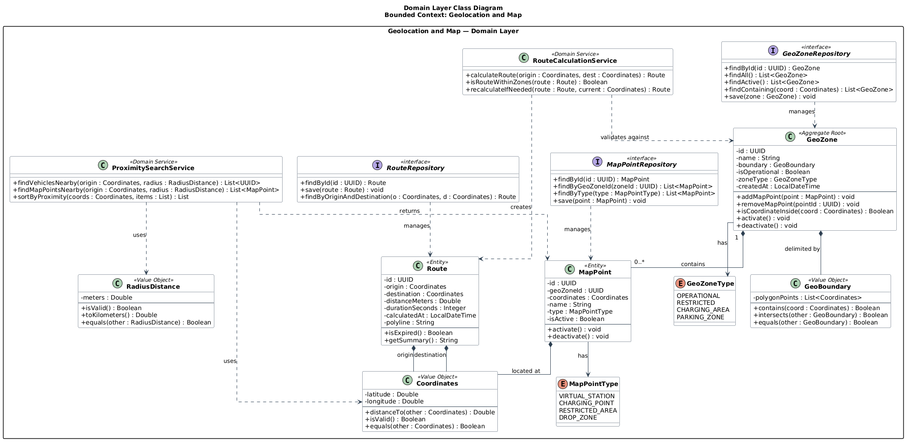

##### 2.6.5.6.2. Bounded Context Database Design Diagram

**Propósito:** El siguiente diagrama representa el diseño físico de la base de datos correspondiente al Bounded Context *Geolocation and Map*, describiendo las tablas, atributos, tipos de datos, claves primarias, claves foráneas y restricciones de integridad.

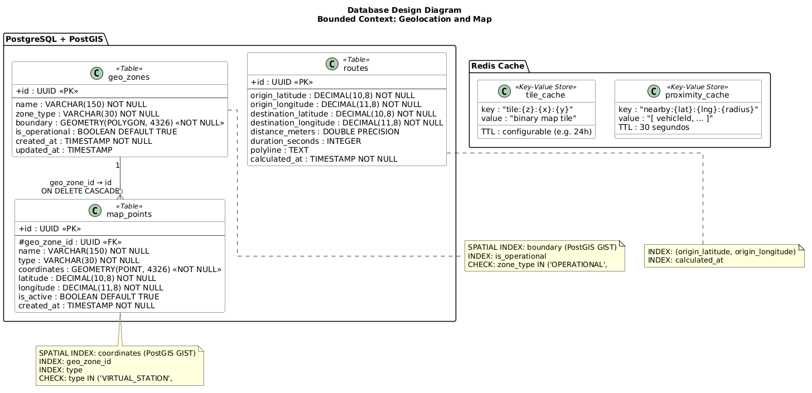

---

### 2.6.6. Bounded Context: Notifications

**Propósito:** Gestionar el envío de notificaciones push, SMS y mensajes en la aplicación dirigidos a los usuarios en respuesta a eventos generados por otros bounded contexts de WeRide.

#### 2.6.6.1. Domain Layer

<table>
    <thead>
        <tr>
            <th colspan="3">Capa de Dominio - Notifications</th>
        </tr>
    </thead>
    <tbody>
        <tr>
            <td rowspan="3" width="120"><b>Entities</b></td>
            <td width="200"><b>Notification</b></td>
            <td>Notificación generada con tipo, contenido, destinatario y estado de entrega.</td>
        </tr>
        <tr>
            <td><b>NotificationTemplate</b></td>
            <td>Plantilla reutilizable con texto y variables parametrizables por tipo de evento.</td>
        </tr>
        <tr>
            <td><b>NotificationLog</b></td>
            <td>Registro histórico del estado de entrega de cada notificación enviada.</td>
        </tr>
        <tr>
            <td rowspan="3"><b>Value Objects</b></td>
            <td><b>NotificationType</b></td>
            <td>Clasificación del canal: PUSH, SMS, IN_APP.</td>
        </tr>
        <tr>
            <td><b>DeliveryStatus</b></td>
            <td>Estado de la entrega: PENDING, SENT, DELIVERED, FAILED.</td>
        </tr>
        <tr>
            <td><b>NotificationContent</b></td>
            <td>Título y cuerpo del mensaje, ya renderizados con los datos del evento.</td>
        </tr>
        <tr>
            <td><b>Aggregate Root</b></td>
            <td colspan="2"><b>Notification</b> — Gestiona el ciclo de vida completo de una notificación, desde su creación hasta la confirmación de entrega.</td>
        </tr>
        <tr>
            <td rowspan="2"><b>Domain Services</b></td>
            <td><b>NotificationDispatchService</b></td>
            <td>Selección del canal adecuado y despacho de la notificación al proveedor externo correspondiente.</td>
        </tr>
        <tr>
            <td><b>TemplateRenderService</b></td>
            <td>Renderizado de plantillas con los datos del evento para generar el contenido final.</td>
        </tr>
        <tr>
            <td><b>Repositories</b></td>
            <td colspan="2"><b>NotificationRepository</b>, <b>NotificationTemplateRepository</b>, <b>NotificationLogRepository</b></td>
        </tr>
    </tbody>
</table>

#### 2.6.6.2. Application Layer

<table>
    <thead>
        <tr>
            <th colspan="3">Capa de Aplicación - Notifications</th>
        </tr>
    </thead>
    <tbody>
        <tr>
            <td rowspan="4" width="150"><b>Use Cases</b></td>
            <td width="200"><b>SendTripStartNotification</b></td>
            <td>Notificar al usuario que su viaje ha comenzado tras el desbloqueo del vehículo.</td>
        </tr>
        <tr>
            <td><b>SendInvoiceNotification</b></td>
            <td>Enviar comprobante de pago al finalizar un viaje y procesar la factura.</td>
        </tr>
        <tr>
            <td><b>SendReservationAlert</b></td>
            <td>Alertar al usuario sobre el inicio, expiración o cancelación de su reserva.</td>
        </tr>
        <tr>
            <td><b>SendSystemAlert</b></td>
            <td>Enviar alertas operativas (batería baja, vehículo fuera de servicio) a operadores.</td>
        </tr>
        <tr>
            <td><b>Application Service</b></td>
            <td colspan="2"><b>NotificationAppService</b></td>
        </tr>
        <tr>
            <td><b>DTOs</b></td>
            <td colspan="2"><b>NotificationDTO</b>, <b>NotificationEventDTO</b>, <b>DeliveryStatusDTO</b></td>
        </tr>
    </tbody>
</table>

#### 2.6.6.3. Interface Layer

<table>
    <thead>
        <tr>
            <th colspan="4">Capa de Interfaz - Notifications</th>
        </tr>
    </thead>
    <tbody>
        <tr>
            <td colspan="4"><b>API Endpoints</b></td>
        </tr>
        <tr>
            <td width="80"><b>POST</b></td>
            <td width="180"><code>/notifications/send</code></td>
            <td width="200">Enviar notificación a un usuario</td>
            <td>Uso interno entre contextos</td>
        </tr>
        <tr>
            <td><b>GET</b></td>
            <td><code>/notifications/user/{id}</code></td>
            <td>Listar notificaciones de un usuario</td>
            <td>Requiere autenticación</td>
        </tr>
        <tr>
            <td><b>PATCH</b></td>
            <td><code>/notifications/{id}/read</code></td>
            <td>Marcar notificación como leída</td>
            <td>Requiere autenticación</td>
        </tr>
        <tr>
            <td><b>GET</b></td>
            <td><code>/notifications/{id}/status</code></td>
            <td>Consultar estado de entrega</td>
            <td>Uso interno / Admin</td>
        </tr>
        <tr>
            <td colspan="4"><br><b>Suscripción a Eventos (Event Consumers)</b></td>
        </tr>
        <tr>
            <td colspan="4">
                <code>TripStarted</code> (Reservations and Trips) •
                <code>InvoiceGenerated</code> (Billing and Subscriptions) •
                <code>ReservationCreated</code> (Reservations and Trips) •
                <code>BatteryLow</code> / <code>VehicleOutOfService</code> (Fleet Management)
            </td>
        </tr>
        <tr>
            <td colspan="4"><br><b>UI Components</b></td>
        </tr>
        <tr>
            <td colspan="4">Notification Center (bandeja in-app) • Push Permission Prompt • Notification Settings Screen</td>
        </tr>
    </tbody>
</table>

#### 2.6.6.4. Infrastructure Layer

| Componente | Responsabilidad |
|---|---|
| **NotificationRepositoryImpl** | Persistencia de notificaciones generadas y su historial de estado. |
| **NotificationTemplateRepositoryImpl** | Almacenamiento y recuperación de plantillas de notificación por tipo de evento. |
| **NotificationLogRepositoryImpl** | Registro detallado del resultado de cada intento de entrega. |
| **PushNotificationAdapter** | Integración con Firebase Cloud Messaging (FCM) para envío de notificaciones push a dispositivos móviles. |
| **SmsNotificationAdapter** | Integración con proveedor de SMS (Twilio / Amazon SNS) para mensajes de texto al número del usuario. |
| **InAppNotificationPublisher** | Publicación de notificaciones en tiempo real a la sesión activa del usuario vía WebSocket. |
| **EventConsumerAdapter** | Suscripción al bus de eventos para recibir y procesar eventos de otros bounded contexts. |

**Dependencias externas:** Firebase Cloud Messaging (FCM), Twilio / Amazon SNS (SMS), Redis (pub/sub WebSocket), Message Broker (RabbitMQ / Kafka).

#### 2.6.6.5. Bounded Context Software Architecture Component Level Diagrams

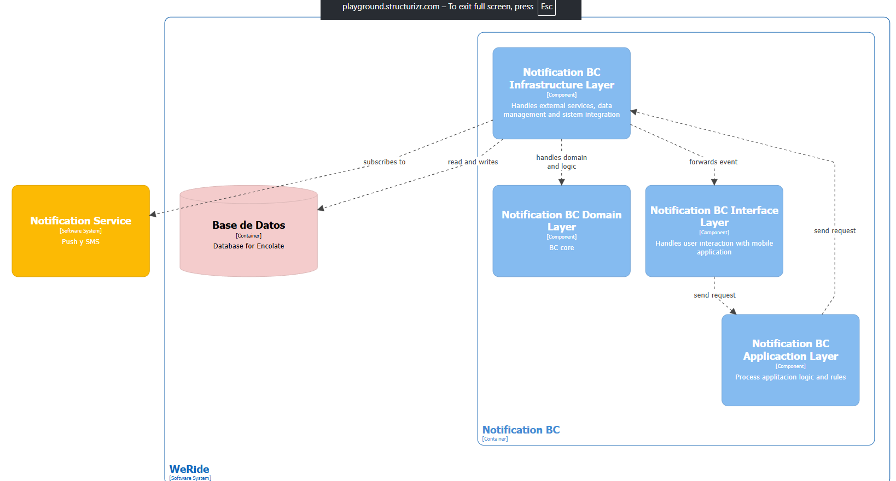

#### 2.6.6.6. Bounded Context Software Architecture Code Level Diagrams

##### 2.6.6.6.1. Bounded Context Domain Layer Class Diagrams

**Propósito:** El siguiente diagrama de clases UML representa la estructura del modelo de dominio del Bounded Context Notifications, incluyendo entidades, value objects, agregados, servicios de dominio e interfaces de repositorio.

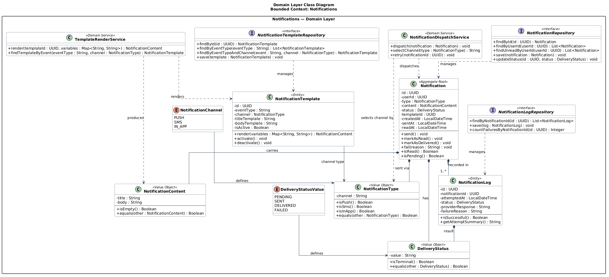

##### 2.6.6.6.2. Bounded Context Database Design Diagram

**Propósito:** El siguiente diagrama representa el diseño físico de la base de datos correspondiente al Bounded Context *Notifications*, describiendo las tablas, atributos, tipos de datos, claves primarias, claves foráneas y restricciones de integridad.

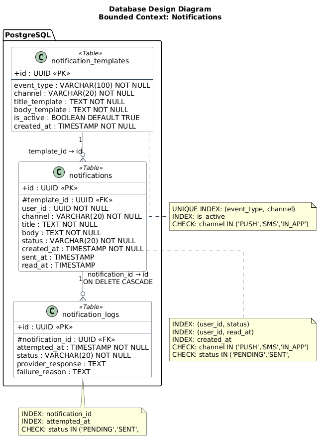
---

### 2.6.7. Bounded Context: Customer Support and Feedback

**Propósito:** Gestionar la atención al cliente, el registro de incidencias y tickets de soporte, la recepción de calificaciones de viaje y la retroalimentación de los usuarios de WeRide.

#### 2.6.7.1. Domain Layer

<table>
    <thead>
        <tr>
            <th colspan="3">Capa de Dominio - Customer Support and Feedback</th>
        </tr>
    </thead>
    <tbody>
        <tr>
            <td rowspan="4" width="120"><b>Entities</b></td>
            <td width="200"><b>SupportTicket</b></td>
            <td>Incidencia o solicitud de soporte registrada por un usuario, con estado y prioridad.</td>
        </tr>
        <tr>
            <td><b>TripRating</b></td>
            <td>Calificación y comentario dejado por el usuario al finalizar un viaje.</td>
        </tr>
        <tr>
            <td><b>FeedbackReport</b></td>
            <td>Reporte de retroalimentación agregada sobre la experiencia de uso de la plataforma.</td>
        </tr>
        <tr>
            <td><b>TicketComment</b></td>
            <td>Respuesta o comentario añadido a un ticket por el usuario o el agente de soporte.</td>
        </tr>
        <tr>
            <td rowspan="3"><b>Value Objects</b></td>
            <td><b>TicketStatus</b></td>
            <td>Estado del ticket: OPEN, IN_PROGRESS, RESOLVED, CLOSED.</td>
        </tr>
        <tr>
            <td><b>RatingScore</b></td>
            <td>Puntuación numérica del viaje en escala de 1 a 5.</td>
        </tr>
        <tr>
            <td><b>TicketCategory</b></td>
            <td>Categoría del incidente: VEHICLE_ISSUE, PAYMENT_PROBLEM, APP_BUG, OTHER.</td>
        </tr>
        <tr>
            <td><b>Aggregate Root</b></td>
            <td colspan="2"><b>SupportTicket</b> — Gestiona el ciclo de vida completo del ticket, incluyendo comentarios, cambios de estado y resolución.</td>
        </tr>
        <tr>
            <td rowspan="2"><b>Domain Services</b></td>
            <td><b>TicketResolutionService</b></td>
            <td>Lógica de asignación, escalado y cierre de tickets según reglas de negocio.</td>
        </tr>
        <tr>
            <td><b>FeedbackAggregationService</b></td>
            <td>Consolidación de calificaciones y retroalimentación para análisis de satisfacción.</td>
        </tr>
        <tr>
            <td><b>Repositories</b></td>
            <td colspan="2"><b>SupportTicketRepository</b>, <b>TripRatingRepository</b>, <b>FeedbackReportRepository</b></td>
        </tr>
    </tbody>
</table>

#### 2.6.7.2. Application Layer

<table>
    <thead>
        <tr>
            <th colspan="3">Capa de Aplicación - Customer Support and Feedback</th>
        </tr>
    </thead>
    <tbody>
        <tr>
            <td rowspan="5" width="150"><b>Use Cases</b></td>
            <td width="200"><b>CreateSupportTicket</b></td>
            <td>Registrar una nueva incidencia o solicitud de ayuda por parte del usuario.</td>
        </tr>
        <tr>
            <td><b>UpdateTicketStatus</b></td>
            <td>Cambiar el estado del ticket (asignación, resolución, cierre) por agente o sistema.</td>
        </tr>
        <tr>
            <td><b>SubmitTripRating</b></td>
            <td>Registrar la calificación y comentario del usuario al finalizar un viaje.</td>
        </tr>
        <tr>
            <td><b>GetUserTickets</b></td>
            <td>Consultar el historial de tickets de soporte de un usuario.</td>
        </tr>
        <tr>
            <td><b>GenerateFeedbackReport</b></td>
            <td>Producir un reporte agregado de calificaciones y retroalimentación para operadores.</td>
        </tr>
        <tr>
            <td><b>Application Service</b></td>
            <td colspan="2"><b>SupportAppService</b>, <b>FeedbackAppService</b></td>
        </tr>
        <tr>
            <td><b>DTOs</b></td>
            <td colspan="2"><b>SupportTicketDTO</b>, <b>TripRatingDTO</b>, <b>FeedbackReportDTO</b>, <b>TicketCommentDTO</b></td>
        </tr>
    </tbody>
</table>

#### 2.6.7.3. Interface Layer

<table>
    <thead>
        <tr>
            <th colspan="4">Capa de Interfaz - Customer Support and Feedback</th>
        </tr>
    </thead>
    <tbody>
        <tr>
            <td colspan="4"><b>API Endpoints</b></td>
        </tr>
        <tr>
            <td width="80"><b>POST</b></td>
            <td width="180"><code>/support/tickets</code></td>
            <td width="200">Crear nuevo ticket de soporte</td>
            <td>Requiere autenticación</td>
        </tr>
        <tr>
            <td><b>GET</b></td>
            <td><code>/support/tickets</code></td>
            <td>Listar tickets del usuario autenticado</td>
            <td>Requiere autenticación</td>
        </tr>
        <tr>
            <td><b>GET</b></td>
            <td><code>/support/tickets/{id}</code></td>
            <td>Obtener detalle de un ticket</td>
            <td>Requiere autenticación</td>
        </tr>
        <tr>
            <td><b>PATCH</b></td>
            <td><code>/support/tickets/{id}/status</code></td>
            <td>Actualizar estado del ticket</td>
            <td>Requiere rol Admin/Agente</td>
        </tr>
        <tr>
            <td><b>POST</b></td>
            <td><code>/feedback/ratings</code></td>
            <td>Enviar calificación de un viaje</td>
            <td>Requiere autenticación</td>
        </tr>
        <tr>
            <td><b>GET</b></td>
            <td><code>/feedback/reports</code></td>
            <td>Obtener reporte de retroalimentación</td>
            <td>Requiere rol Admin</td>
        </tr>
        <tr>
            <td colspan="4"><br><b>Suscripción a Eventos (Event Consumers)</b></td>
        </tr>
        <tr>
            <td colspan="4">
                <code>TripEnded</code> (Reservations and Trips) — dispara solicitud de calificación •
                <code>VehicleOutOfService</code> (Fleet Management) — abre ticket automático
            </td>
        </tr>
        <tr>
            <td colspan="4"><br><b>UI Components</b></td>
        </tr>
        <tr>
            <td colspan="4">Support Center Screen • Create Ticket Form • Ticket Detail View • Trip Rating Modal • Feedback History</td>
        </tr>
    </tbody>
</table>

#### 2.6.7.4. Infrastructure Layer

| Componente | Responsabilidad |
|---|---|
| **SupportTicketRepositoryImpl** | Persistencia y consulta de tickets de soporte con su historial de comentarios y cambios de estado. |
| **TripRatingRepositoryImpl** | Almacenamiento de calificaciones de viaje asociadas a un usuario y un viaje específico. |
| **FeedbackReportRepositoryImpl** | Gestión de reportes agregados de retroalimentación para análisis operativo. |
| **TicketSearchAdapter** | Capacidad de búsqueda full-text y filtrado avanzado sobre tickets (por estado, categoría, fecha). |
| **EventConsumerAdapter** | Suscripción al bus de eventos para escuchar `TripEnded` y `VehicleOutOfService` y generar acciones automáticas. |
| **NotificationTriggerAdapter** | Envío de señales al contexto de Notifications cuando un ticket cambia de estado o es resuelto. |
| **FeedbackAggregationAdapter** | Ejecución de consultas analíticas para consolidar métricas de satisfacción de usuarios. |

**Dependencias externas:** Message Broker (RabbitMQ / Kafka), Elasticsearch (búsqueda de tickets), PostgreSQL (persistencia relacional).

#### 2.6.7.5. Bounded Context Software Architecture Component Level Diagrams

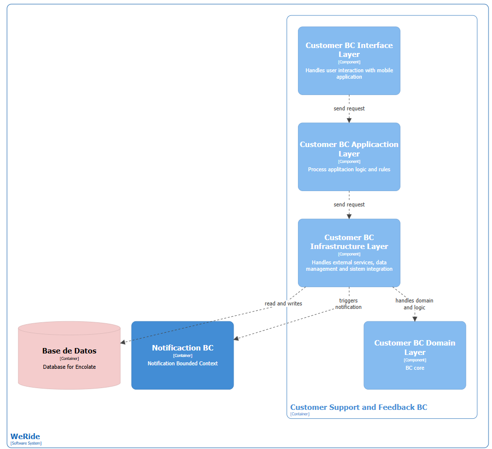

#### 2.6.7.6. Bounded Context Software Architecture Code Level Diagrams

##### 2.6.7.6.1. Bounded Context Domain Layer Class Diagrams

**Propósito:** El siguiente diagrama de clases UML representa la estructura del modelo de dominio del Bounded Context Customer Support and Feedback, incluyendo entidades, value objects, agregados, servicios de dominio e interfaces de repositorio.

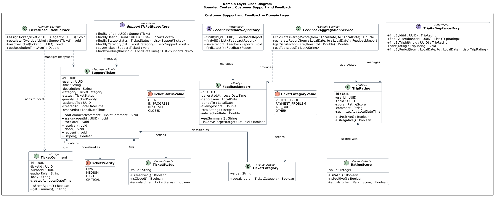

##### 2.6.7.6.2. Bounded Context Database Design Diagram

**Propósito:** El siguiente diagrama representa el diseño físico de la base de datos correspondiente al Bounded Context *Customer Support and Feedback*, describiendo las tablas, atributos, tipos de datos, claves primarias, claves foráneas y restricciones de integridad.

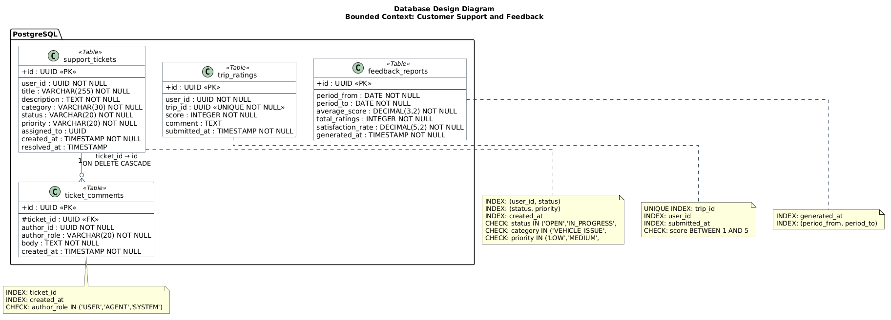

---

---

# Capitulo 3: Solution UI/UX Design #

## _3.1. Product Design_ ##

### 3.1.1. Style Guidelines ###

#### 3.1.1.1. General Style Guidelines ####

<h3>Branding</h3>

El logo de WR sintetiza de manera elegante y minimalista la propuesta de valor de la marca en el mundo de la micromovilidad electrica. El diseno en tipografia negra sobre fondo blanco comunica sobriedad, confianza y profesionalismo, asegurando legibilidad en cualquier soporte digital o fisico.

En la parte superior, el scooter electrico estilizado simboliza movimiento, innovacion y sostenibilidad, elementos centrales de la experiencia que WR ofrece. Su posicion por encima de las iniciales representa la prioridad de la movilidad sobre cualquier otra funcion, transmitiendo dinamismo y accion inmediata.

La composicion general mantiene un equilibrio entre modernidad y simplicidad, ideal para una plataforma tecnologica que busca conectar a las personas con alternativas de transporte accesibles, rapidas y ecologicas. La eleccion de una paleta monocromatica resalta la seriedad de la propuesta, mientras que el icono del scooter anade cercania y un toque aspiracional.

Con este logo, WR se presenta como una marca confiable, eficiente y enfocada en transformar el desplazamiento urbano, adaptandose a las necesidades de estudiantes, profesionales y empresas.

***Variantes de logo***

***Logo original***


***Logo con iniciales light color***


***Colores invertidos***


<h3>Typography</h3>

La tipografia de nuestra app de micromovilidad electrica refleja dinamismo, innovacion y accesibilidad, alineandose con los valores de sostenibilidad y movilidad inteligente que representamos. Hemos elegido una fuente sans-serif moderna, limpia y ligera, que transmite agilidad y simplicidad, elementos esenciales de nuestro servicio.

La fuente principal sera "Kay Pho Du", que por su diseno esbelto y geometrico comunica tecnologia y orden sin perder cercania. Su alta legibilidad permite que los usuarios puedan consultar informacion rapida mientras se desplazan.

Para lograr una jerarquia visual clara, los titulos y subtitulos tendran un tamano mas prominente que el cuerpo del texto. Los titulos (H1, H2) enfatizan energia y movimiento, mientras que los textos secundarios mantienen un tono amigable y sencillo.

El cuerpo del texto usara un tamano base adaptable, que garantice lectura sin esfuerzo tanto en pantallas pequenas (smartphones) como en tablets. Se mantendra un interlineado aireado y margenes equilibrados para no saturar la interfaz.

El lenguaje sera directo y motivador, usando un tono casual que inspire confianza y fomente la adopcion de alternativas de transporte sostenible.

<h3>Colors</h3>

La paleta de colores de nuestra app de micromovilidad electrica fue disenada para reforzar el impacto visual del logo y proyectar dinamismo, sostenibilidad y confianza. El blanco se mantiene como base, representando simplicidad, limpieza y espacios abiertos, facilitando que los elementos clave destaquen sin saturar la vista.

El negro profundo del logo se utiliza en tipografia principal y elementos estructurales, comunicando seriedad y profesionalismo. Para transmitir energia y movimiento, incorporamos un verde lima brillante (#18FA3A) como color de acento, ideal para botones de accion (reservar, iniciar viaje) y mensajes de confirmacion. Este tono evoca sostenibilidad y vitalidad, conectando con la mision de promover transporte limpio.

Un gris color (#EEEEEE) complementa la paleta y refuerza la percepcion tecnologica de la plataforma, utilizado en iconos interactivos y estados activos. Ademas, tonos gris claro (#EAEAEA) y gris oscuro (#4F4F4F) equilibran la interfaz, mejorando la legibilidad y jerarquizando la informacion.

En conjunto, esta paleta crea una identidad moderna, agil y ecologica, que motiva a los usuarios a adoptar la movilidad electrica como su primera opcion dentro y fuera del campus.

---

#### Paleta de colores - WeRide

| **Color**        | **Uso**                                                                 | **Codigo Hex** |
|------------------|-------------------------------------------------------------------------|---------------|
| Blanco           | Fondo principal de la interfaz, espacios vacios, sensacion de limpieza y orden. | `#FFFFFF`     |
| Negro profundo   | Logo, textos principales, iconos y elementos estructurales.              | `#000000`     |
| Verde energia    | Botones de accion (reservar, iniciar viaje), confirmaciones y mensajes de exito. | `#18FA3A`     |
| Gris claro       | Fondos secundarios, separadores, tarjetas de informacion.                | `#D9D9D9`     |
| Gris medio       | Texto secundario, iconos inactivos, descripciones y estados deshabilitados. | `#A6A6A6`     |

### 3.1.2. Information Architecture ###

#### 3.1.2.1. Organization Systems ####

Para la **landing page** de WeRide, se ha optado por una estructura jerarquica para ambos segmentos de usuarios, ya que se cuenta con una barra de navegacion superior que dirige a diferentes secciones, cada una encapsulando informacion relevante y relacionada.

Para el proceso de inicio de sesion o creacion de cuenta, se utiliza una organizacion lineal, permitiendo que el usuario avance paso a paso a medida que completa los datos requeridos hasta finalizar el registro o acceso.

Dentro de la aplicacion principal, se mantiene una organizacion jerarquica para separar y encapsular las distintas funcionalidades, independientemente del tipo de usuario. Esto asegura que, aunque los usuarios tengan diferentes necesidades y accesos, ****la estructura de la aplicacion sea coherente y facil de navegar.****


#### 3.1.2.2. Labelling Systems ####

Las etiquetas emplean un lenguaje claro y conciso, alineado con el tono casual y motivador de la marca:
**Inicio:** Vista principal con mapa y scooters disponibles.
**Reservar:** Flujo de reserva paso a paso.
**Mis Viajes:** Historial de viajes y reservas activas.
**Perfil:** Gestion de cuenta, metodo de pago y preferencias.
**Ayuda:** Centro de soporte con preguntas frecuentes y contacto.

#### 3.1.2.3. SEO Tags and Meta Tags ####

**Titulo:**
```html
<title>WeRide</title>
```

**Codificacion de caracteres:**
```html
<meta charset="utf-8">
```

**Descripcion:**
```html
<meta name="description" content="WeRide is a mobile application focused on providing sustainable and smart urban mobility through electric scooters, bikes, and motorcycles.">
```

**Autor y Derechos de Autor:**
```html
<meta name="author" content="CultiConection">
<meta name="copyright" content="Copyright WeTech team" />
```

#### 3.1.2.4. Searching Systems ####

El sistema integral de micromovilidad electrica compartida incorporara un **modulo de busqueda y localizacion en tiempo real**, que permitira a los usuarios identificar la ubicacion disponible de los vehiculos mas cercanos (scooters, bicicletas y motos electricas). Este sistema se sustenta en las siguientes caracteristicas:

Geolocalizacion en tiempo real: Cada vehiculo estara equipado con dispositivos GPS e IoT que transmitiran su ubicacion de manera constante hacia la plataforma central.

**Mapa interactivo en la aplicacion movil**: La app mostrara en un mapa la ubicacion exacta de los vehiculos disponibles, diferenciados por tipo (scooter, bicicleta o moto electrica).

**Filtros de busqueda avanzada**: Los usuarios podran buscar vehiculos segun tipo de unidad preferida, nivel de bateria disponible y distancia a pie desde su ubicacion actual.

**Reserva inmediata**: Una vez identificado el vehiculo, el usuario podra seleccionarlo en la aplicacion, reservarlo y dirigirse a recogerlo.

**Optimizacion para empresas**: En el caso de suscripciones corporativas, los sistemas de busqueda tambien permitiran a los empleados visualizar vehiculos disponibles en zonas cercanas a sus oficinas o campus.

#### 3.1.2.5. Navigation Systems ####

El sistema integral de micromovilidad electrica compartida contara con un modulo de navegacion inteligente que facilitara al usuario el uso de los vehiculos y la planificacion de sus desplazamientos.

**Guia hacia el vehiculo seleccionado**: Una vez realizada la reserva, la aplicacion mostrara la ruta a pie mas rapida desde la ubicacion del usuario hasta el vehiculo disponible, mediante mapas integrados en tiempo real.

**Navegacion durante el viaje**: El sistema proporcionara indicaciones de ruta para que el usuario se desplace de manera eficiente hacia su destino, evitando zonas de alto trafico cuando sea posible. Se integran APIs de mapas inteligentes como Google Maps o Mapbox.

**Seguridad en la navegacion**: Alertas en la aplicacion respecto a calles restringidas, recomendacion de rutas seguras y opciones de personalizacion (ruta mas rapida, mas segura o mas ecologica).

**Gestion de estaciones y puntos de aparcamiento**: La navegacion incluira la localizacion de zonas de parqueo autorizadas, estaciones de carga o puntos estrategicos.


### 3.1.3. Landing Page UI Design ###

#### 3.1.3.1. Landing Page Wireframes ####

- Navbar  

- Hero  

- Disposable Vehicles Section.  

- Application user manual section.  

- Rates Section.  

- Locations section.  

- Who we are section.  

- About section.  

- Application download section.  

- Footer Section.  


#### 3.1.3.2. Landing Page Mock-ups ####

- Navbar  

- Hero  

- Disposable Vehicles Section.  

- Application user manual section.  

- Rates Section.  

- Locations section.  

- Who we are section.  

- About section.  

- Application download section.  

- Footer Section.  


### 3.1.4. Mobile Applications UI/UX Design ###

#### 3.1.4.1. Mobile Applications Wireframes ####

- Login
En esta pantalla el usuario puede iniciar sesión en la aplicación mediante diferentes métodos de acceso, como Google, número de celular o correo empresarial. Esto permite un acceso rápido y seguro a las funcionalidades de la plataforma.

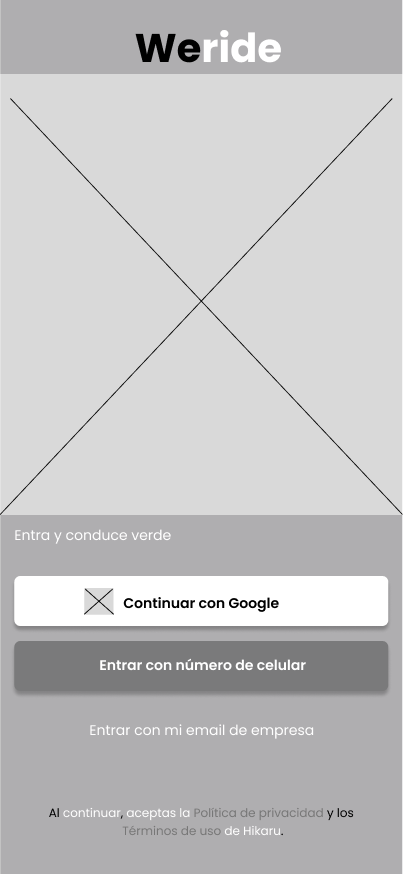

- Numero Celular
En esta pantalla el usuario debe ingresar su número de celular para continuar con el proceso de autenticación. Posteriormente, recibirá un código de verificación que permitirá validar su identidad y acceder a la aplicación.

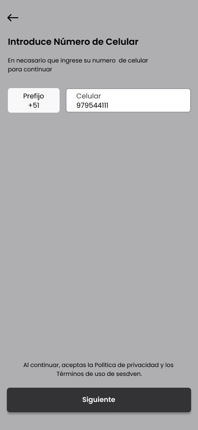

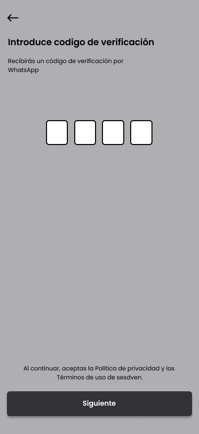

- Datos
Esta interfaz permite al usuario registrar sus datos personales, como nombres y apellidos. La información ingresada será utilizada para crear y personalizar su cuenta dentro de la aplicación.

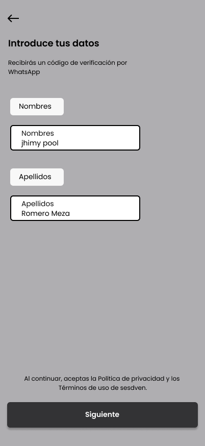

- Principal
En esta seccion el usuario puede visualizar las opciones de movilidad disponibles, como motos eléctricas, scooters y bicicletas eléctricas. Además, se muestra información básica de cada vehículo, como el rango estimado, y botones para conducir o reservar, facilitando la selección rápida del medio de transporte deseado.

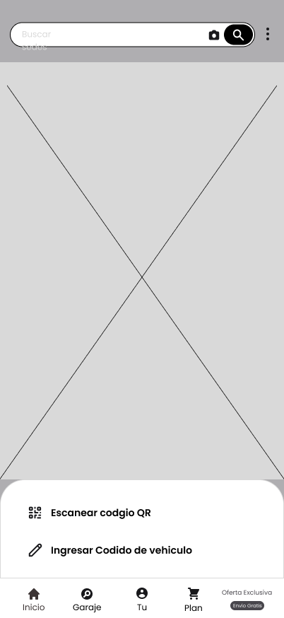

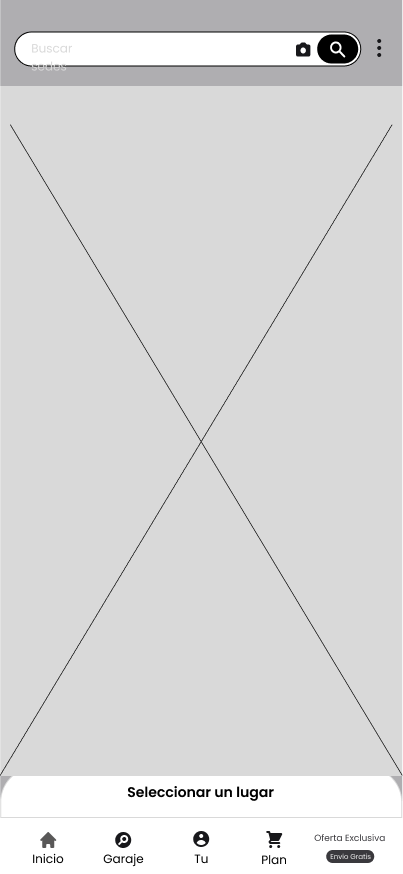

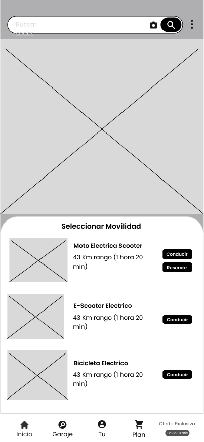

- Perfil.
En esta pantalla el usuario puede acceder a la información y configuraciones de su cuenta. Además, cuenta con opciones como cartera, historial, centro de seguridad, ayuda y ajustes, permitiendo gestionar de manera rápida distintos aspectos de la aplicación.

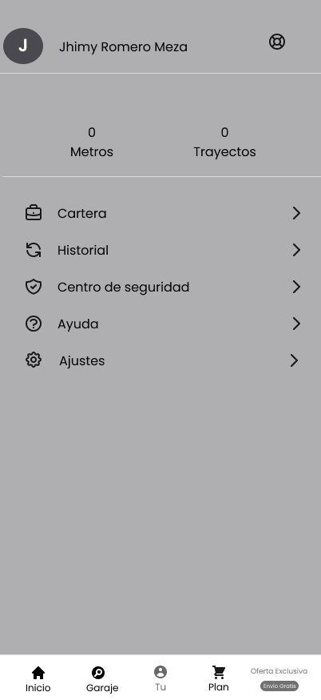

- Garaje.
En esta sección se muestran los vehículos disponibles, organizados por categorías como scooters, motos y bicicletas. Cada tarjeta presenta información básica del producto, permitiendo al usuario explorar y seleccionar opciones de movilidad.
  
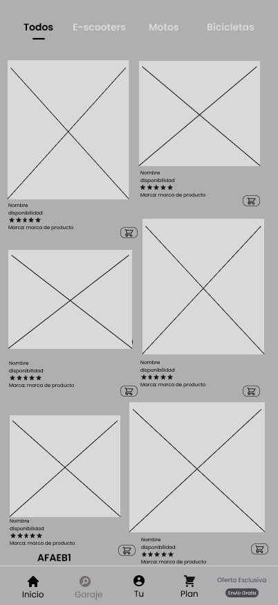

- Planes.
Esta pantalla muestra los diferentes tipos de planes disponibles dentro de la aplicación, como normal, estudiantil y empresarial. El usuario puede seleccionar el plan que mejor se adapte a sus necesidades para acceder a beneficios específicos.

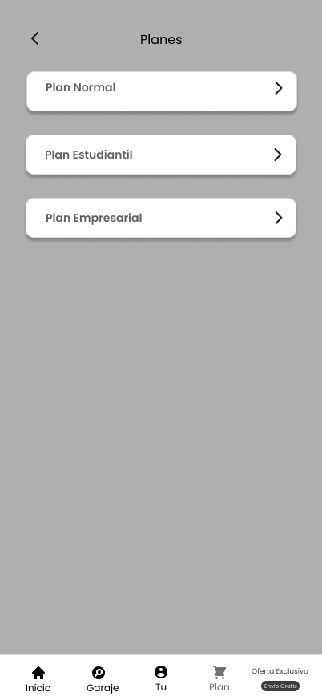

- Tarifas.
En esta pantalla se muestran los distintos pases o tarifas disponibles dentro de la aplicación. Cada opción incluye una breve descripción de sus beneficios, como viajes ilimitados durante un periodo determinado, además de un botón de pago para adquirir el plan seleccionado.

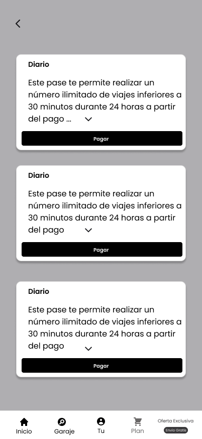

- Pago.
En esta pantalla el usuario puede realizar el pago del servicio o plan seleccionado. Además, permite visualizar el monto a pagar, seleccionar un método de pago y confirmar la transacción de manera rápida y segura.

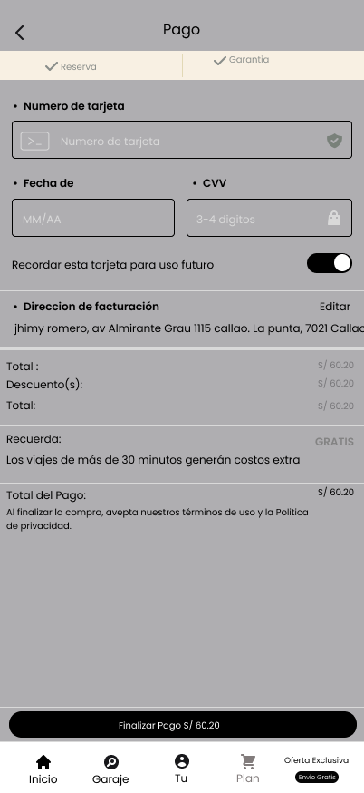

- Reserva.
En esta pantalla se muestra una animación que indica que la reserva fue realizada exitosamente. Su objetivo es brindar una confirmación visual rápida al usuario sobre la finalización correcta del proceso.

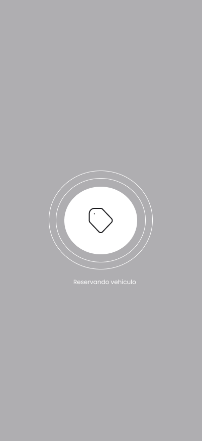


#### 3.1.4.2. Mobile Applications Wireflow Diagrams ####

##### Wireflow 1 — Registro e inicio de sesion

Este wireflow representa el proceso de acceso del usuario a la aplicación. Incluye las etapas de inicio de sesión, validación mediante número celular o correo, verificación de código e ingreso de datos personales para completar la autenticación.

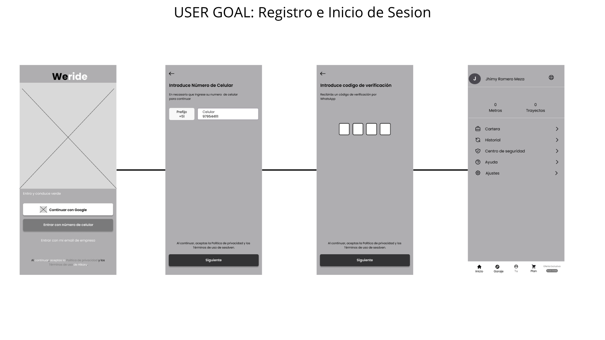

##### Wireflow 2 — Suscripcion a planes

Este wireflow representa el proceso de selección y adquisición de planes o pases disponibles en la aplicación. El usuario puede visualizar las opciones, realizar el pago y confirmar la activación del plan seleccionado.


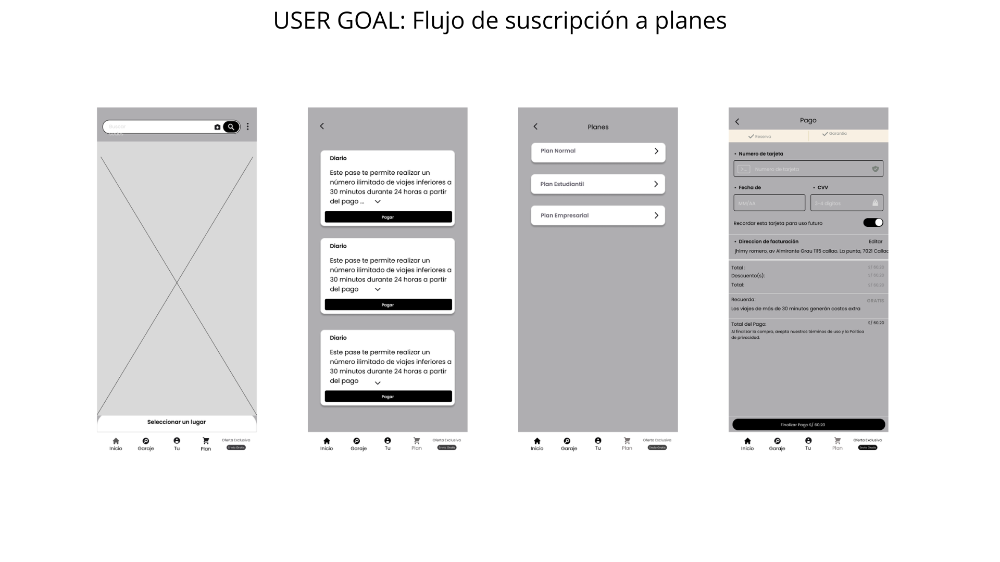

##### Wireflow 3 — Exploración de vehículos

Este wireflow muestra cómo el usuario puede explorar los distintos medios de transporte disponibles en la aplicación, como scooters, motos y bicicletas, permitiendo visualizar información básica antes de realizar una reserva.


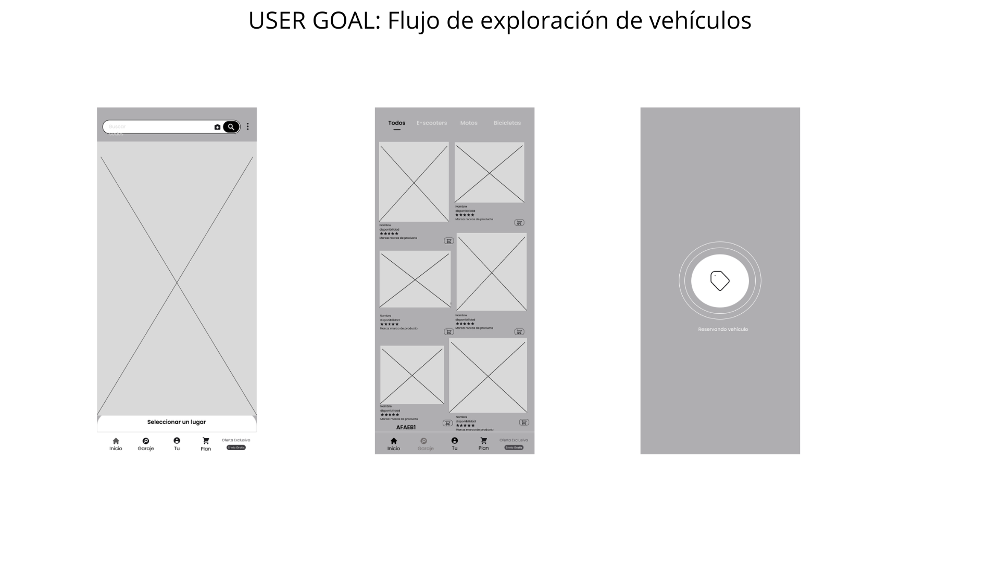

##### Wireflow 4 — Reserva de vehiculo

Este wireflow muestra el proceso que sigue el usuario para reservar un vehículo dentro de la aplicación. Inicia desde la pantalla principal, continúa con la selección del vehículo y la tarifa, y finaliza con el pago y la confirmación de la reserva.

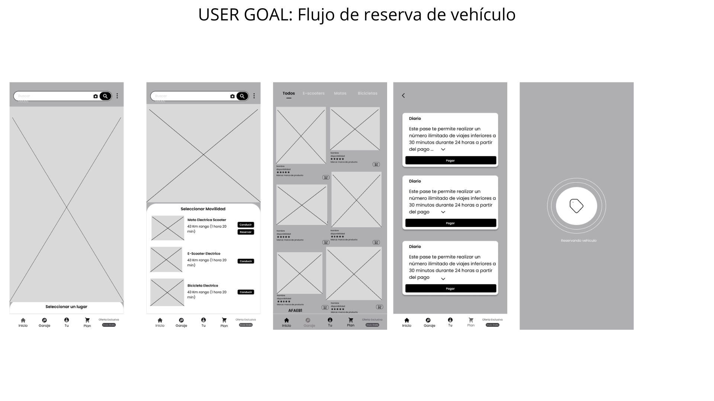


#### 3.1.4.3. Mobile Applications Mock-ups ####

Los mock-ups de la aplicacion movil **WeRide** representan el diseno de alta fidelidad de cada pantalla, aplicando el Style Guide definido: paleta monocromatica con verde energia (`#18FA3A`) como acento, tipografia *Kay Pho Du*, fondo blanco y elementos estructurales en negro. A continuacion se presentan los mock-ups organizados por flujo funcional.

---

##### Flujo 1 — Acceso a la aplicacion (EP01)

**Pantalla de Bienvenida / Splash Screen**

La pantalla inicial muestra el logo de WeRide centrado sobre fondo negro, con el icono del scooter y el nombre de la marca. Refuerza el branding antes de redirigir al inicio de sesion.

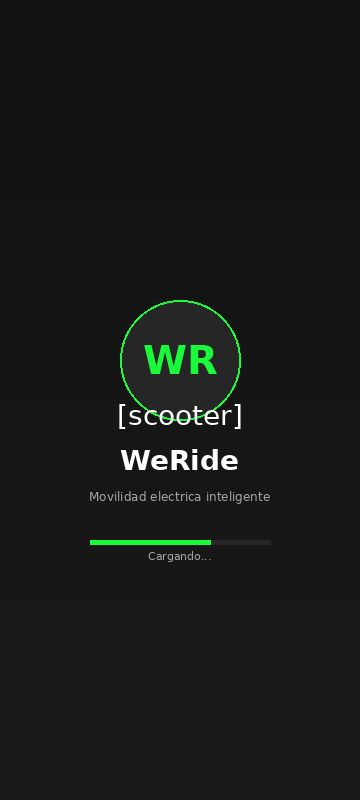

---

**Pantalla de Registro / Inicio de Sesion (US-01)**

Vista dividida en dos pestanas superiores: *Iniciar Sesion* y *Registrarse*. El formulario de login solicita correo electronico y contrasena. El boton de accion principal (color `#18FA3A`) activa la autenticacion. Se incluye la opcion de acceso con Google.

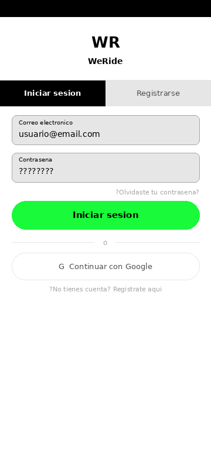

---

**Pantalla de Ingreso de Numero de Celular (US-02)**

Pantalla de paso unico con indicador de progreso de 3 pasos. Campo de numero telefonico con prefijo de pais (+51 Peru) autodetectado. El boton *Continuar* se activa en verde al cumplir el formato (9 digitos).

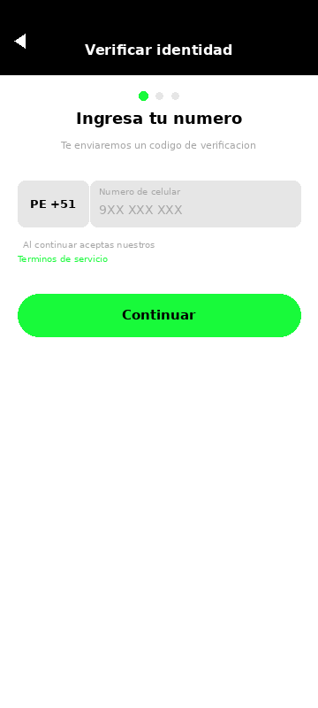

---

**Pantalla de Verificacion de Codigo SMS (US-03)**

Seis campos de entrada numerica individuales centrados en pantalla. Contador de reenvio en gris. Al completar el codigo correcto, la pantalla transiciona automaticamente con confirmacion visual en verde.

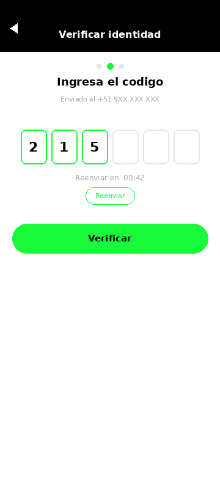

---

**Pantalla de Datos de Perfil (US-04)**

Formulario de creacion de perfil con campo de foto (circular con icono de camara), nombre completo, fecha de nacimiento y genero. Boton *Guardar y Continuar* en verde al pie de la pantalla.

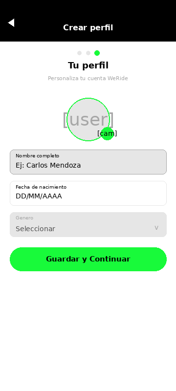

---

##### Flujo 2 — Funcionalidades principales (EP02)

**Pantalla Principal / Home (US-05)**

Vista central con mapa interactivo (Google Maps / Mapbox) mostrando vehiculos disponibles en tiempo real. Barra de busqueda de direccion en la parte superior. Bottom navigation bar con iconos de *Inicio*, *Garaje*, *Viaje*, *Planes* y *Tu*. Tarjeta flotante deslizable con el vehiculo mas cercano y boton *Reservar ahora* en verde.

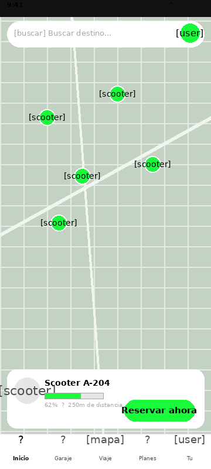

---

**Pantalla de Perfil (US-06)**

Cabecera con foto y nombre del usuario sobre fondo negro. Lista de opciones: *Administrar cuenta*, *Personalizar perfil*, *Cartera*, *Mis Viajes*, *Centro de Seguridad*, *Ayuda* y *Ajustes*. Cada opcion tiene icono a la izquierda y flecha de navegacion a la derecha.

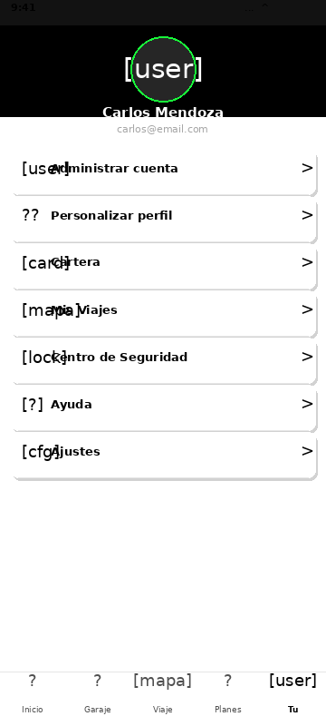

---

**Pantalla de Garaje — Listado de Vehiculos (US-07)**

Catalogo con tarjetas de cada vehiculo: imagen, nombre, tipo, nivel de bateria en barra de progreso, calificacion en estrellas, disponibilidad y icono de favoritos. Chips de filtro por tipo en la parte superior.

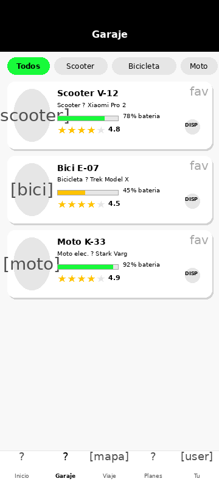

---

**Pantalla de Garaje — Filtros (US-08)**

Bottom sheet deslizable con chips de seleccion para: tipo de vehiculo, nivel de bateria (slider), disponibilidad y calificacion minima. Boton *Aplicar filtros* en verde al pie.

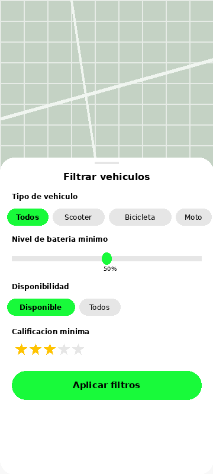

---

##### Flujo 3 — Gestion de pagos y suscripciones (EP03)

**Pantalla de Planes (US-09)**

Tres tarjetas de plan: *Basico*, *Estandar* y *Premium*. Cada tarjeta contiene precio mensual en soles, lista de beneficios con checks en verde y boton *Seleccionar*. El plan recomendado lleva etiqueta *POPULAR* con fondo verde.

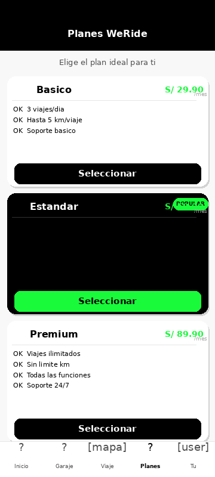

---

**Pantalla de Pago (US-10)**

Formulario con tres metodos: *Tarjeta* (numero, vencimiento y CVV), *Yape* (numero de celular + QR) y *Plin* (numero de celular). Pestanas superiores para cambiar metodo. Resumen de compra fijo al pie con boton *Finalizar Pago* en verde e icono de seguridad SSL.

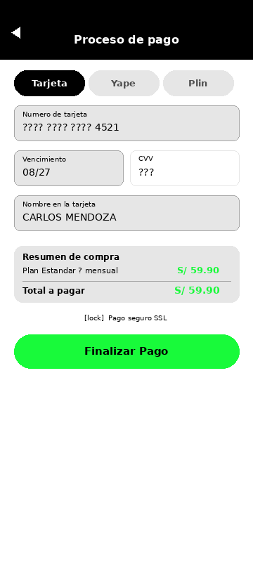

---

##### Flujo 4 — Mapa y localizacion (EP04)

**Pantalla de Mapa — Vehiculos Cercanos (US-11)**

Vista de mapa a pantalla completa con marcadores de vehiculos agrupados. Al tocar un vehiculo aparece tarjeta inferior con bateria, distancia y boton *Reservar* en verde. Leyenda de colores por tipo de vehiculo.

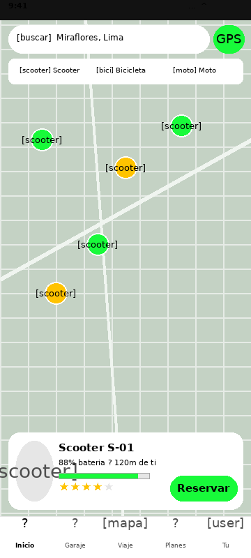

---

##### Flujo 5 — Gestion de viajes (EP05)

**Pantalla de Viaje Activo (US-12)**

Mapa con ruta trazada. Panel inferior con nivel de bateria animado, tiempo transcurrido, distancia recorrida y velocidad. Boton *Finalizar Viaje* en rojo y boton secundario *Reportar problema*.

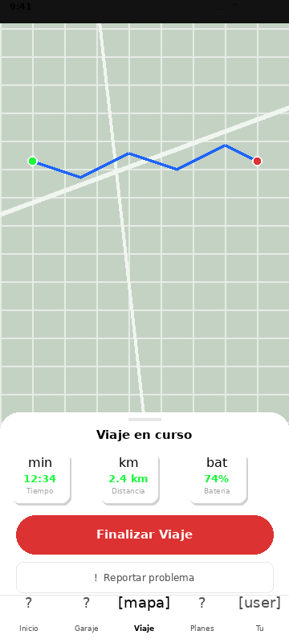

---

**Pantalla de Historial de Viajes (US-13)**

Lista cronologica de viajes en tarjetas con: fecha, tipo de vehiculo, distancia, duracion, costo y calificacion. Filtro por mes en la parte superior.

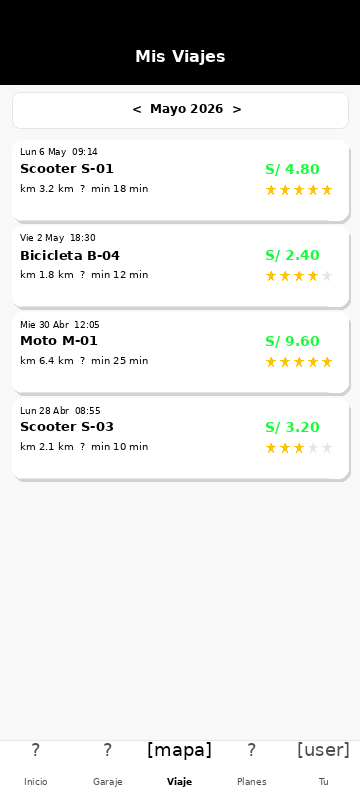

---

**Pantalla de Calificacion de Viaje (US-14)**

Modal post-viaje con resumen del trayecto y 5 estrellas interactivas. Campo opcional de comentario. Boton *Enviar Calificacion* (verde) y *Omitir* (gris). Animacion de confirmacion con check verde al enviar.

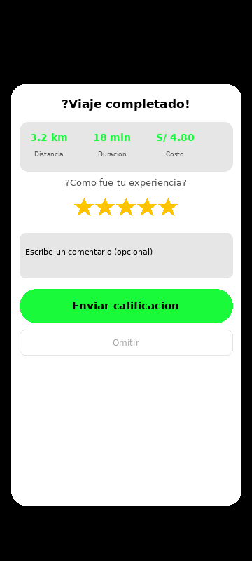

---

**Pantalla de Reporte de Problema (US-15)**

Chips de categoria: *Falla mecanica*, *Bateria*, *Bloqueo*, *Accidente*, *App*. Campo de descripcion de texto libre y opcion de adjuntar foto. Confirmacion con numero de ticket asignado.

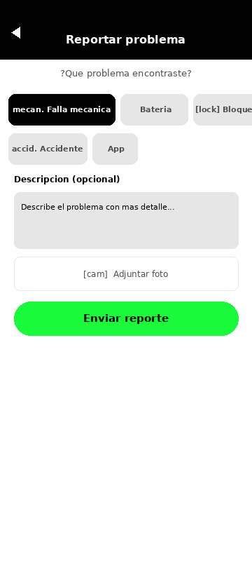

---

##### Flujo 6 — Gestion de reservas (EP06)

**Pantalla de Detalle de Vehiculo y Creacion de Reserva (US-17)**

Imagen grande del vehiculo, nombre, tipo, modelo y nivel de bateria. Seccion de informacion con ubicacion exacta (mapa miniatura) y estacion virtual. Boton *Reservar ahora* en verde. Al confirmarse, contador regresivo de reserva activa.

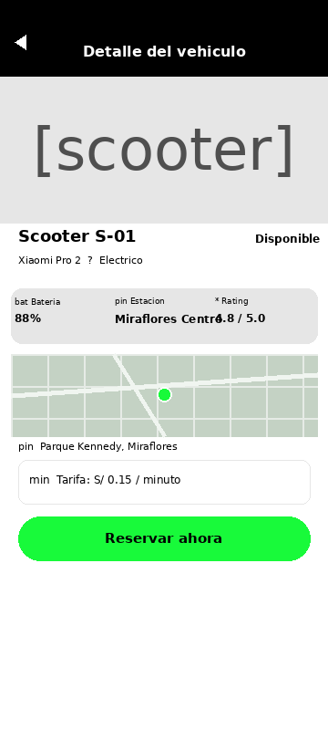

---

**Pantalla de Reserva Activa con Notificacion (US-16, US-18)**

Temporizador circular de cuenta regresiva en verde, distancia y direccion al vehiculo, boton *Cancelar Reserva* y boton *Desbloquear Vehiculo*. Notificacion push visible cuando faltan 2 minutos para la expiracion.

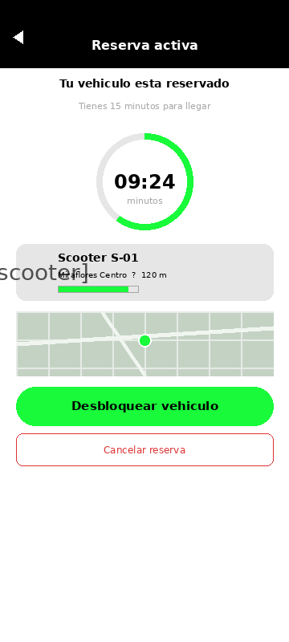

---

##### Flujo 7 — Desbloqueo de vehiculos (EP07)

**Pantalla de Desbloqueo por QR (US-19)**

Visor de camara con marco de escaneo animado en verde. Instruccion: *"Apunta al codigo QR del vehiculo"*. Al escanear: animacion de desbloqueo y mensaje *"Vehiculo desbloqueado!"* en verde. En error: mensaje en rojo con opcion de reintentar.

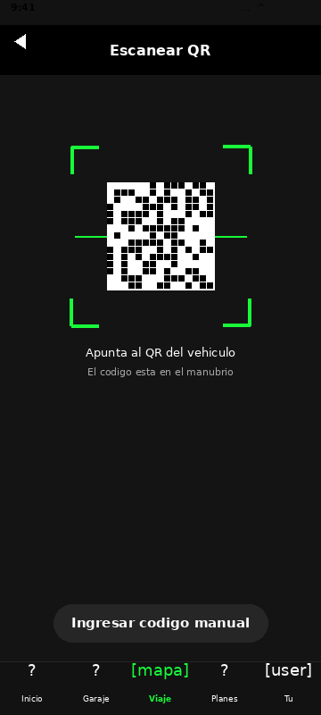

---

**Pantalla de Desbloqueo desde la App (US-20, US-21)**

Estado en tiempo real del desbloqueo con icono de candado animado (cerrado → abriendo → abierto). Tres estados: *Procesando...* (gris), *Desbloqueando...* (amarillo) y *Desbloqueado!* (verde). Transicion automatica a Viaje Activo al confirmarse.

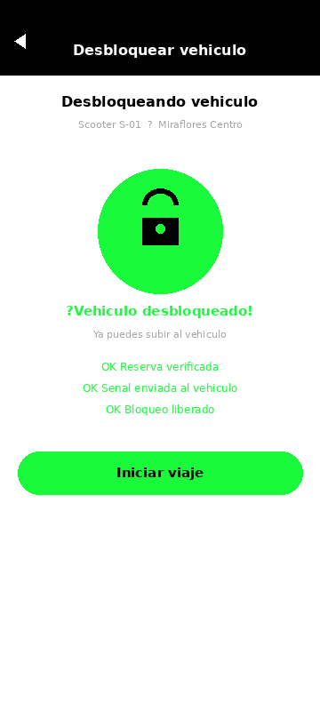

---

**Pantalla de Desbloqueo Programado (US-22)**

Selector de fecha y hora nativo de Android. Listado de vehiculos disponibles en ese horario con indicador de disponibilidad. Boton *Confirmar Programacion* y opcion de agregar al calendario del dispositivo.

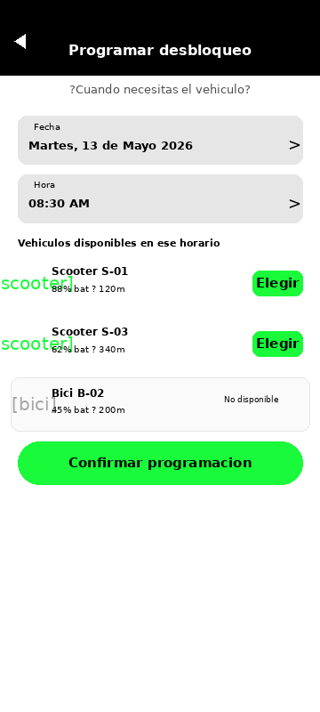

---

#### 3.1.4.4. Mobile Applications Userflow Diagrams ####

Los diagramas de flujo de usuario representan los caminos que recorre el usuario dentro de la aplicacion movil para completar una tarea especifica, mostrando cada pantalla, decision y transicion. Se presentan los cinco flujos mas representativos de WeRide, alineados con los Bounded Contexts y User Stories del Capitulo 2.

---

##### Userflow 1 — Registro e Inicio de Sesion (US-01, US-02, US-03, US-04)

Este flujo cubre el acceso completo a la aplicacion, desde la apertura hasta el acceso al Home. Inicia en el Splash Screen y bifurca segun si el usuario ya tiene cuenta. El flujo de registro incluye validacion de numero de celular mediante codigo SMS y creacion de perfil. El flujo de login valida credenciales con mensaje de error en caso de fallo.

**Pantallas:** Splash → Login/Registro → Nro. Celular → Codigo SMS → Datos de Perfil → Home.

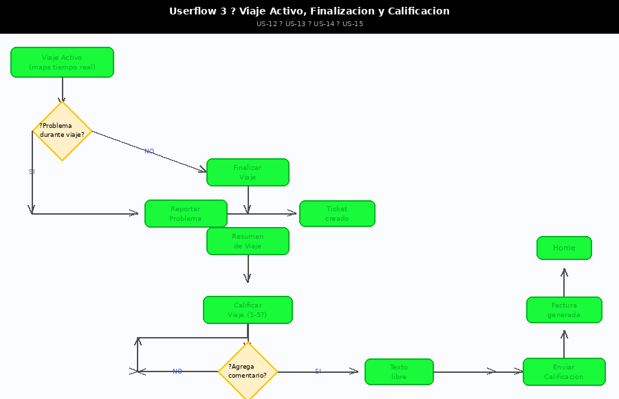

---

##### Userflow 2 — Busqueda, Reserva y Desbloqueo de Vehiculo (US-11, US-17, US-19, US-20, US-21)

Flujo principal de uso: desde localizar un vehiculo hasta iniciar el viaje. Incluye verificacion de plan activo (derivando a seleccion de plan si no tiene) y bifurcacion entre desbloqueo por QR o desde la app, con manejo de errores en ambos casos.

**Pantallas:** Home → Mapa → Detalle Vehiculo → (Planes → Pago →) Reserva Activa → QR/Desbloqueo → Viaje Activo.


---

##### Userflow 3 — Viaje Activo, Finalizacion y Calificacion (US-12, US-13, US-14, US-15)

Flujo de la experiencia de viaje desde el inicio hasta la retroalimentacion post-trayecto. Incluye la opcion de reporte de problema durante el viaje y el flujo completo de calificacion con comentario opcional, finalizando con la generacion automatica de factura.

**Pantallas:** Viaje Activo → (Reporte Problema →) Finalizar → Resumen → Rating → Factura → Home.

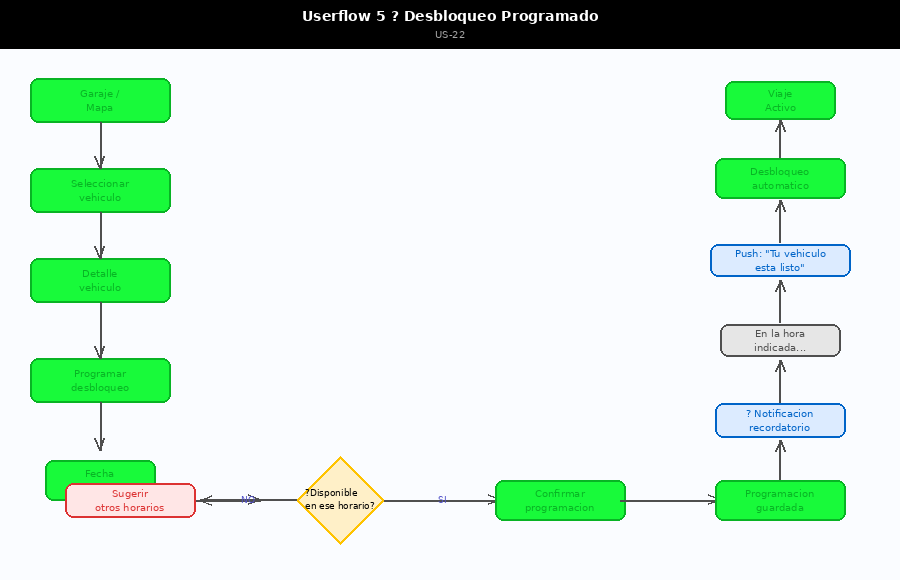

---

##### Userflow 4 — Seleccion y Pago de Plan (US-09, US-10)

Flujo de contratacion de plan de suscripcion. El usuario navega entre los tres planes, selecciona el metodo de pago (Tarjeta, Yape o Plin), revisa el resumen y confirma. Incluye manejo del error de pago con opcion de reintento.

**Pantallas:** Planes → Detalle Plan → Pago → Resumen → Confirmacion → Home.

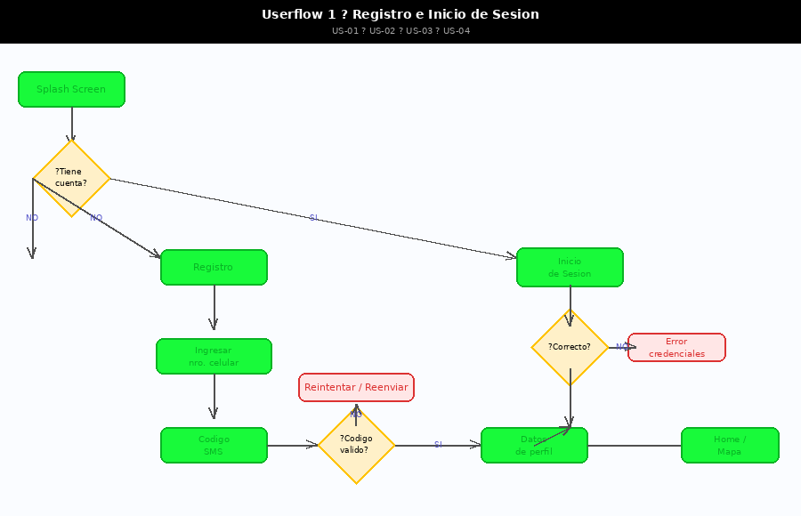

---

##### Userflow 5 — Desbloqueo Programado (US-22)

Flujo para usuarios que planifican su viaje con anticipacion. Permite seleccionar fecha y hora, verificar disponibilidad del vehiculo en ese horario, confirmar la programacion y recibir notificacion automatica en el momento indicado para el desbloqueo.

**Pantallas:** Garaje → Detalle Vehiculo → Programar Desbloqueo → Confirmacion → (Notificacion automatica) → Viaje Activo.

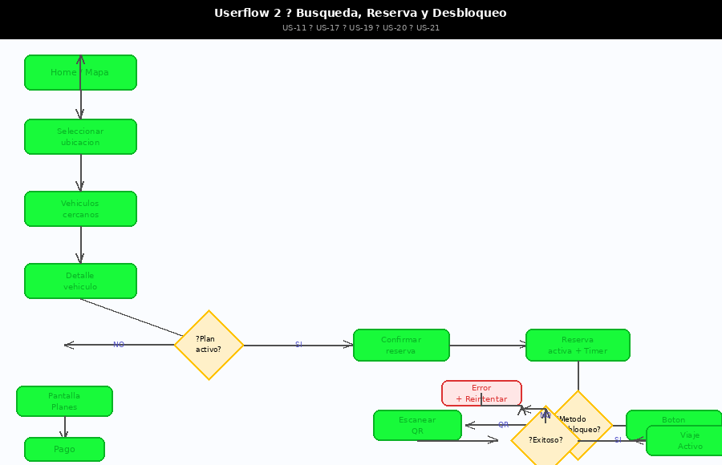

---

#### 3.1.4.5. Mobile Applications Prototyping ####

El prototipo interactivo de la aplicacion movil **WeRide** fue desarrollado en **Figma**, herramienta seleccionada por el equipo para el diseno colaborativo de interfaces. El prototipo conecta todos los mock-ups de alta fidelidad mediante transiciones y animaciones que simulan la experiencia real de uso en un dispositivo Android, utilizando el frame **Android Large (360 x 800 px)**.

---

##### Descripcion del prototipo

El prototipo cubre los **cinco flujos principales** de la aplicacion (registro, reserva, viaje, planes y desbloqueo programado), permitiendo navegar entre pantallas mediante interacciones tactiles simuladas: tap, swipe, long press y scroll. Las transiciones empleadas son *Smart Animate* para cambios de estado fluidos y *Slide* para la navegacion entre vistas principales.

**Caracteristicas tecnicas del prototipo:**

| Parametro | Detalle |
|---|---|
| Herramienta | Figma (Prototype mode) |
| Frame base | Android Large — 360 x 800 px |
| Cantidad de pantallas | 21 pantallas de alta fidelidad |
| Flujos cubiertos | 5 flujos principales (US-01 a US-22) |
| Tipo de transiciones | Smart Animate, Slide, Dissolve |
| Hotspots activos | Botones CTA, iconos de navegacion, campos de formulario, QR scanner simulado |

---

##### Flujo 1 — Acceso a la aplicacion (Splash → Login → Verificacion → Perfil → Home)

Desde el Splash Screen, el usuario elige entre registrarse o iniciar sesion. El prototipo simula la validacion del codigo SMS y la transicion al formulario de perfil hasta llegar al Home.

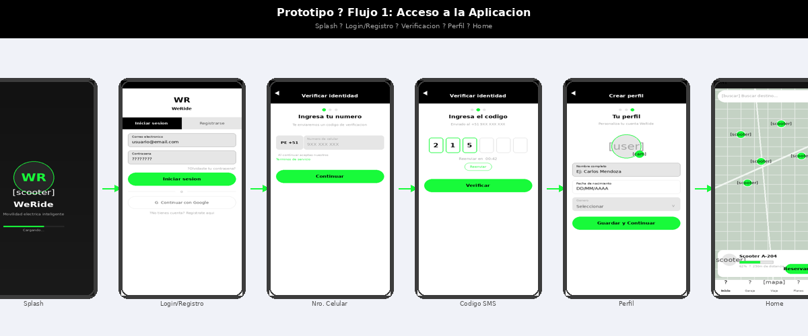

---

##### Flujo 2 — Reserva y Desbloqueo (Home → Mapa → Reserva → QR → Viaje Activo)

El mapa interactivo permite seleccionar un vehiculo y acceder a su detalle. El boton *Reservar ahora* activa el temporizador animado de 15 minutos y habilita las opciones de desbloqueo.

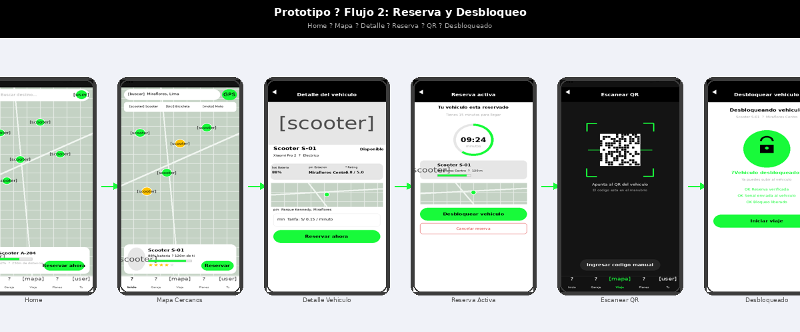

---

##### Flujo 3 — Viaje Activo y Calificacion

Simula el estado de viaje en tiempo real con mapa de ruta trazado. El boton *Finalizar Viaje* activa el flujo de resumen, calificacion y generacion de factura simulada.

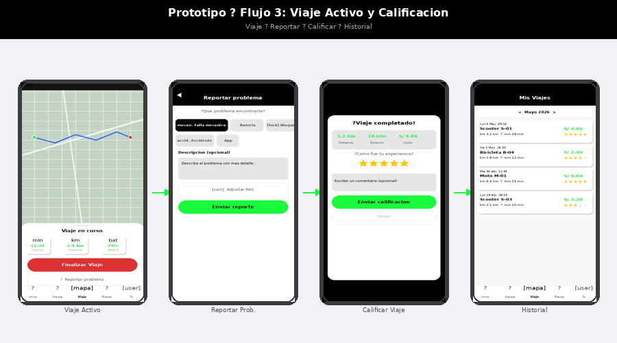

---

##### Flujo 4 — Seleccion de Plan y Pago

Permite navegar entre los tres planes y simula el proceso de pago con los tres metodos (tarjeta, Yape y Plin), mostrando el estado de aprobacion y el mensaje de plan activado.

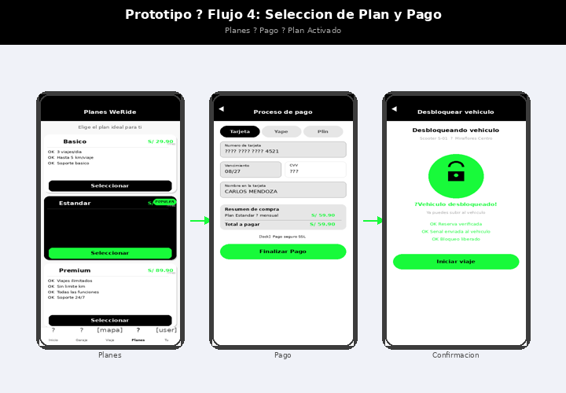

---

##### Vista general del prototipo en Figma

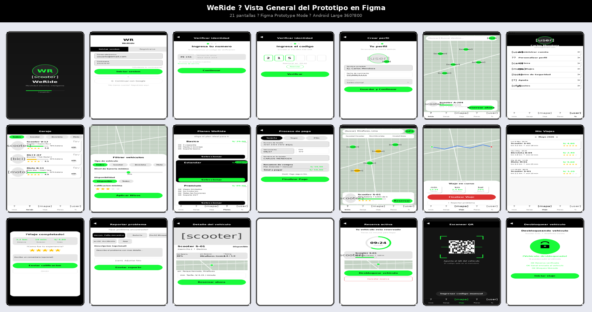

---

##### Decisiones de diseno del prototipo

Durante el proceso de prototipado, el equipo tomo las siguientes decisiones de diseno basadas en los hallazgos de las entrevistas del Capitulo 2:

- **CTAs siempre visibles:** Los botones de accion principal (*Reservar*, *Desbloquear*, *Pagar*) estan siempre en la zona de alcance del pulgar (bottom 30% de la pantalla), respondiendo al feedback sobre botones poco visibles identificado en las entrevistas.

- **Precios siempre visibles:** Los costos del plan y de la reserva se muestran en cada etapa del flujo sin necesidad de navegar a otra pantalla, eliminando la friccion identificada en las entrevistas con Gianella Castro.

- **Integracion de Yape/Plin en primer plano:** Los metodos de pago locales aparecen como primera opcion en la pantalla de pago, alineandose con el comportamiento de pago de los usuarios peruanos entrevistados que prefieren Yape sobre tarjeta.

- **Onboarding progresivo:** El registro se divide en 3 pasos cortos (celular → verificacion → perfil) en lugar de un formulario extenso, reduciendo la friccion de adopcion inicial identificada en el segmento B2C.

- **Bottom Navigation fija:** La barra de navegacion inferior se mantiene presente en todas las pantallas principales, garantizando acceso inmediato a las cinco secciones clave sin importar la profundidad de navegacion.

---

# Capítulo 4: Product Implementation & Validation #

## _4.1. Software Configuration Management_ ##

Esta guía define las decisiones y acuerdos fundamentales para el desarrollo, mantenimiento y despliegue de la aplicación **WeRide**, que gestiona el alquiler de vehículos. El objetivo es asegurar la coherencia, eficiencia y calidad a lo largo del ciclo de vida del proyecto.

### 4.1.1. Software Development Environment Configuration ###

En esta sección, se explica los entornos en donde se decidió llevar a cabo el ciclo de vida de desarrollo de los productos de software relacionados al proyecto del curso.

<table border="1">
  <tr>
    <td>Project Management</td>
    <td><h4>Github</h4>Plataforma en línea que permite almacenar código fuente en repositorios. Gracias a la tecnología de control de versiones Git, se puede organizar el código y facilitar el trabajo colaborativo en equipo.</td>
  </tr>
  <tr>
    <td></td>
    <td><h4>WhatsApp</h4>Aplicación de mensajería instantánea utilizada para la comunicación del equipo, coordinación de actividades y envío de recordatorios de reuniones.</td>
  </tr>
  <tr>
    <td></td>
    <td><h4>Trello</h4>Software de administración y gestión de proyectos utilizado para establecer, organizar y asignar las tareas del equipo.</td>
  </tr>

  <tr>
    <td>Requirements Management</td>
    <td><h4>Miro</h4>Plataforma colaborativa en línea utilizada para la gestión de requisitos, organización de ideas y elaboración de diagramas y flujos de trabajo de manera visual.</td>
  </tr>

  <tr>
    <td>Product UX/UI Design</td>
    <td><h4>Figma</h4>Aplicación que permite el diseño de interfaces mediante herramientas colaborativas, facilitando la creación de prototipos interactivos y experiencias de usuario.</td>
  </tr>

  <tr>
    <td>Software Development</td>
    <td><h4>Git</h4>Sistema de control de versiones utilizado para gestionar cambios en el código fuente y facilitar el trabajo colaborativo.</td>
  </tr>
  <tr>
    <td></td>
    <td><h4>Node.js</h4>Entorno de ejecución de JavaScript del lado del servidor que permite desarrollar aplicaciones web escalables y de alto rendimiento.</td>
  </tr>
  <tr>
    <td></td>
    <td><h4>HTML</h4>Lenguaje de marcado utilizado para la estructuración y presentación del contenido en páginas web.</td>
  </tr>
  <tr>
    <td></td>
    <td><h4>CSS</h4>Lenguaje utilizado para estilizar y dar formato visual a documentos HTML.</td>
  </tr>
  <tr>
    <td></td>
    <td><h4>TypeScript</h4>Lenguaje de programación basado en JavaScript que añade tipado estático y facilita el desarrollo de aplicaciones web escalables.</td>
  </tr>
  <tr>
    <td></td>
    <td><h4>VSCode</h4>Editor de código fuente que ofrece múltiples extensiones y herramientas para agilizar el desarrollo de software.</td>
  </tr>
  <tr>
    <td></td>
    <td><h4>WebStorm</h4>Entorno de desarrollo integrado (IDE) orientado al desarrollo frontend y aplicaciones JavaScript/TypeScript, que ofrece herramientas avanzadas para mejorar la productividad.</td>
  </tr>
  <tr>
    <td></td>
    <td><h4>Angular</h4>Framework para el desarrollo de aplicaciones web modernas y escalables basado en el modelo Single Page Application (SPA), que facilita la creación de interfaces dinámicas mediante TypeScript.</td>
  </tr>
  <tr>
    <td></td>
    <td><h4>IntelliJ IDEA</h4>Entorno de desarrollo integrado (IDE) utilizado principalmente para el desarrollo en Java, que ofrece herramientas avanzadas para la codificación, depuración y pruebas.</td>
  </tr>
  <tr>
    <td></td>
    <td><h4>Java</h4>Lenguaje de programación orientado a objetos utilizado para desarrollar aplicaciones robustas, seguras y multiplataforma.</td>
  </tr>
  <tr>
    <td></td>
    <td><h4>Spring Boot</h4>Framework basado en Java que facilita el desarrollo de aplicaciones y microservicios robustos y escalables.</td>
  </tr>
  <tr>
    <td></td>
    <td><h4>Swagger</h4>Herramienta utilizada para diseñar, documentar y probar APIs RESTful de manera interactiva.</td>
  </tr>
  <tr>
    <td></td>
    <td><h4>Android Studio</h4>Entorno de desarrollo oficial para aplicaciones Android, que proporciona herramientas para programación, diseño de interfaces y pruebas.</td>
  </tr>
  <tr>
    <td></td>
    <td><h4>Kotlin</h4>Lenguaje de programación moderno y conciso utilizado principalmente para el desarrollo de aplicaciones Android.</td>
  </tr>
  <tr>
    <td></td>
    <td><h4>Gradle</h4>Herramienta de automatización de compilación y gestión de dependencias utilizada en proyectos Java y Android.</td>
  </tr>
  <tr>
    <td></td>
    <td><h4>Jetpack Compose</h4>Toolkit moderno de Android para la creación de interfaces de usuario nativas mediante programación declarativa en Kotlin.</td>
  </tr>
  <tr>
    <td></td>
    <td><h4>MySQL Workbench</h4>Herramienta visual utilizada para el diseño, modelado y administración de bases de datos MySQL.</td>
  </tr>

  <tr>
    <td>Software Deployment</td>
    <td><h4>GitHub Pages</h4>Servicio de alojamiento web utilizado para realizar el despliegue y publicación del landing page del proyecto.</td>
  </tr>
</table>


### 4.1.2. Source Code Management ###

Hemos optado por crear un repositorio en GitHub para nuestro proyecto, tanto para el informe como para la landing page. Esto facilitó la colaboración entre los miembros del equipo,aprovechando las herramientas útiles que esta plataforma ofrece para el manejo del código fuente y sus versiones.

- URL del repositorio Report en GitHub: https://github.com/Grupo-2-Aplicaciones-Moviles/Project-Report
- URL del repositorio Landing Page en GitHub: https://github.com/Grupo-2-Aplicaciones-Moviles/Landing-Page
- URL del repositorio Android Mobile en GitHub: https://github.com/Grupo-2-Aplicaciones-Moviles/frontend
- URL del repositorio Backend en GitHub: https://github.com/Grupo-2-Aplicaciones-Moviles/backend
### 4.1.3. Source Code Style Guide & Conventions ###

##### Landing Page:

Para "**WeRide**", hemos utilizado "**HTML y CSS**". Para estructurar el contenido usamos etiquetas de section y divisiones para contenido específico de cada una de las secciones. Además, hemos empleado atributos como ***HTML Style*** para personalizar el aspecto visual, definiendo propiedades como color, tamaño de fuente y tipo de letra.

Para resaltar elementos importantes, hemos aplicado ***HTML Text Formatting***, incluyendo etiquetas como b para negrita, strong para resaltado y del para mostrar cambios de precios. En cuanto a la navegación, hemos implementado una barra de navegación horizontal utilizando **CSS** para mejorar la experiencia del usuario al explorar el contenido.

Los formularios, creados con **CSS**, permiten a los usuarios ingresar información relevante, como detalles de inicio de sesión, información de pago y dirección de envío. Para añadir interactividad, hemos agregado botones con efectos hover utilizando CSS y paginación CSS para facilitar la navegación entre las diferentes páginas de productos.

Finalmente, en el **footer**, hemos incluido enlaces a las redes sociales de la organización para brindar a los usuarios una forma adicional de conectarse y seguir nuestras actualizaciones.

##### Web Application:

Para "**WeRide Web**", hemos utilizado "**TypeScript, HTML y CSS**". La estructura del proyecto sigue el patrón de arquitectura de **Single Page Application (SPA)**, utilizando el framework **Angular** para organizar el código en módulos, componentes y servicios.

Los componentes estan estructurados según DDD (Domain-Driven Design), donde cada componente representa un bounded context específico, como **auth**, **booking**, **garage**, **plans** y **trip**. Cada componente tiene su propio archivo HTML para la estructura, CSS para el estilo y TypeScript para la lógica y enrutamiento así como la comunicación entre componentes y servicios.

##### Mobile Application:

Para "**WeRide Mobile**", se ha utilizado Kotlin junto con Jetpack Compose para el desarrollo nativo en Android. La estructura del proyecto sigue una arquitectura modular basada en buenas prácticas de desarrollo, separando la lógica de negocio, la interfaz de usuario y la gestión de datos para mejorar la mantenibilidad y escalabilidad de la aplicación.

Los componentes de la aplicación están organizados en paquetes según sus funcionalidades, como authentication, booking, profile, trip y plans. Cada pantalla se desarrolla mediante composables de Jetpack Compose, permitiendo construir interfaces dinámicas y reactivas de manera declarativa. Asimismo, se emplean ViewModels para la gestión del estado y la comunicación entre la interfaz y la lógica de negocio.

Siguiendo las convenciones de Kotlin, los nombres de paquetes se escriben en minúsculas y sin guiones bajos. Para clases y composables se utiliza la nomenclatura UpperCamelCase, mientras que las funciones, propiedades y variables locales emplean camelCase. Además, se prioriza el uso de val sobre var para fomentar la inmutabilidad y mantener un código más seguro y mantenible.

### 4.1.4. Software Deployment Configuration ###

##### Landing Page:

Utilizaremos GitHub Pages para alojar nuestra Landing Page. Para lograrlo, subiremos los archivos esenciales (HTML, CSS, etc.) a un repositorio público en GitHub. De
esta manera, nuestra página estará disponible en línea y accesible para todos los usuarios.


##### Web Application:

Utilizaremos Vercel para alojar nuestra Web Application.
Para lograrlo, configuraremos un proyecto en Vercel y conectaremos nuestro repositorio de GitHub. Vercel se encargará de la construcción y el despliegue de nuestra aplicación automáticamente cada vez que realicemos un push a la rama principal.


## _4.2. Landing Page & Mobile Applications Implementation_ ##

### 4.2.1. Sprint 1 ###

#### 4.2.1.1. Sprint Planning 1 ####

El Sprint Planning 1 es una reunión esencial para iniciar el primer sprint de un proyecto, donde el equipo define los objetivos y la estrategia para cumplirlos. En este caso, nuestro objetivo principal es implementar la landing page de la aplicación, asegurando una presentación efectiva del producto.

| Sprint #                           | Sprint 1                                                                                                                                                                                                                                                                  |
| ---------------------------------- |---------------------------------------------------------------------------------------------------------------------------------------------------------------------------------------------------------------------------------------------------------------------------|
| **Date**                           | 2026-07-05                                                                                                                                                                                                                                                                |
| Time                               | 10:00 PM                                                                                                                                                                                                                                                                  |
| Location                           | Virtual - Meet                                                                                                                                                                                                                                                            |
| Prepared By                        | Gonzales Castillo Angel Martin                                                                                                                                                                                                                                            |
| Attendees (to planning meeting)    | Berrocal Ramirez Omar, Lang Nassi Werner Khalil, Jhimy Pool Romero Meza, Seijas Vásquez Diego Antonio                                                                                                                                                                     |
| Sprint n - 1 Review Summary        | sEste es el primer Sprint, por lo que ete campo no aplica.                                                                                                                                                                                                                |
| Sprint n - 1 Retrospective Summary | Este es el primer Sprint, por lo que este campo no aplica.                                                                                                                                                                                                                |
| Sprint 1 Goal                      | Implementar la landing page de WeRide, brindando una primera experiencia visual y funcional del producto. Este objetivo busca validar la propuesta de valor a través del diseño, estructura y navegabilidad. El éxito se medirá con el despliegue operativo de la página. |
| Sprint 1 Velocity                  | 19                                                                                                                                                                                                                                                                        |
| Sum of Story Points                | La suma de Story Points atendidos es de 15.                                                                                                                                                                                                                               |


#### 4.2.1.2. Sprint Backlog 1 ####

<table>
  <tr>
    <td> <strong>Sprint #</strong></td>
    <td align="center" colspan="7"> <strong>Sprint 1</strong> </td>
  </tr>

   <tr>
    <td align="center" colspan="2"> <strong>User Story</strong></td>
    <td align="center" colspan="6"> <strong>Work-item/Task</strong></td>
  </tr>
  <tr>
    <td align="center"> <strong>ID</strong> </td>
    <td align="center"> <strong>Title</strong></td>
    <td align="center"> <strong>ID</strong> </td>
    <td align="center"> <strong>Title</strong></td>
    <td align="center"> <strong>Description</strong></td>
    <td align="center"> <strong>Estimation (Hours)</strong></td>
    <td align="center"> <strong>Assigned To</strong></td>
    <td align="center"> <strong> Status (To-do/In-Process/To-Review/Done)  </strong></td>
  </tr>
  <!---------------------------------------------------------------------- -->
  <tr>
    <td rowspan="2" align="center"> ID </td>
    <td rowspan="2" align="center"> US23 Navegación sencilla</td>
    <td align="center"> TA01 </td>
     <td align="center"> Menú con hipervínculos</td>
    <td align="center">Cada Hipervínculo debe de redirigirte a una sección específica de la landing page </td>
    <td align="center"> 2</td>
    <td align="center"> Gonzales Castillo Angel Martin</td>
    <td align="center">Done</td>
  </tr>
    <tr>
    <td align="center"> TA02 </td>
    <td align="center"> Hero</td>
    <td align="center"> Se debe desarrollar un banner que represente a la aplicación.</td>
    <td align="center"> 1 </td>
    <td align="center"> Gonzales Castillo Angel Martin</td>
    <td align="center">Done</td>
  </tr>

  <!----------------------------------------------->
  <tr>
    <td rowspan="1" align="center"> ID </td>
    <td rowspan="1" align="center"> US24 Descargas</td>
    <td align="center"> TA01 </td>
    <td align="center"> Call to action</td>
    <td align="center"> Se debe desarrollar un botón call to action que redirija a la descarga de la aplicación</td>
    <td align="center">2</td>
    <td align="center"> Omar Christian Berrocal Ramirez</td>
    <td align="center">Done</td>
  </tr>


<!-------------------------------------------------->
  <tr>
    <td rowspan="2" align="center"> ID </td>
    <td rowspan="2" align="center"> US25 Funcionalidades de la aplicación</td>
    <td align="center"> TA01 </td>
    <td align="center"> Vehicles</td>
    <td align="center"> crea la seccion que muestra los vehíuclos disponibles de la apliación mobile.</td>
    <td align="center"> 2</td>
    <td align="center"> Lang Nassi Werner Khalil </td>
    <td align="center"> Done</td>
  </tr>
  <tr>
    <td align="center"> TA02 </td>
    <td align="center"> Maps</td>
    <td align="center"> crea la seccion que muestra las estaciones y los mapas.</td>
    <td align="center"> 2</td>
    <td align="center">  Omar Christian Berrocal Ramirez </td>
    <td align="center"> Done</td>
  </tr>

  <!----------------------------------------------->
  <tr>
    <td rowspan="1" align="center"> ID </td>
    <td rowspan="1" align="center"> US26 Manual de la aplicación</td>
    <td align="center"> TA01 </td>
    <td align="center"> Manual</td>
    <td align="center"> Se debe desarrollar una sección con un manual de uso de la aplicación mobile.</td>
    <td align="center"> 2</td>
    <td align="center"> Jhimy Pool Romero Meza </td>
    <td align="center">Done</td>
  </tr>
  <!------------------------------------------------>
  <tr>
    <td rowspan="3" align="center"> ID </td>
    <td rowspan="3" align="center"> US27 Confianza y seguridad.</td>
    <td align="center"> TA01 </td>
    <td align="center"> About us</td>
    <td align="center"> Debe presentar una sección con la información del equipo de trabajo.</td>
    <td align="center"> 2 </td>
    <td align="center"> Seijas Vásquez Diego Antonio </td>
    <td align="center"> Done</td>
  </tr>
  <tr>
    <td align="center"> TA02 </td>
    <td align="center"> About the product</td>
    <td align="center"> crea la seccion del producto.</td>
    <td align="center"> 2</td>
    <td align="center">  Seijas Vásquez Diego Antonio </td>
    <td align="center"> Done</td>
  </tr>
  <tr>
    <td align="center"> TA03 </td>
    <td align="center"> Footer</td>
    <td align="center"> crea la sección de footer con información de contacto.</td>
    <td align="center"> 2</td>
    <td align="center">  Lang Nassi Werner Khalil </td>
    <td align="center"> Done</td>
  </tr>
  <!------------------------------------------------>
   <tr>
    <td rowspan="1" align="center"> ID </td>
    <td rowspan="1" align="center"> US28 Visualización de precios.</td>
    <td align="center"> TA01 </td>
    <td align="center"> Subscriptions</td>
    <td align="center"> Debe presentar la información de los precios de cada plan de suscripción.</td>
    <td align="center"> 2</td>
    <td align="center"> Jhimy Pool Romero Meza </td>
    <td align="center"> Done</td>
  </tr>


</table>

#### 4.2.1.3. Development Evidence for Sprint Review 1 ####

En esta sección se demuestran los commits relacionados con los principales avances en la implementación. 
Estos commits provienen del repositorio de la landing de la organización de GitHub.

**Enlace al repositorio de la Landing Page: https://github.com/Grupo-2-Aplicaciones-Moviles/Landing-Page

| Repository                                  | Branch | Commit Id | Commit Message                                                                | Commit Message Body | Commited on (Date) |
|---------------------------------------------|--------|-----------|-------------------------------------------------------------------------------|---------------------|--------------------|
| Grupo-2-Aplicaciones-Moviles / Landing-Page | main   | b9d458f   | feat: add sections home about our services                                    |                     | 12/05/2026         |
| Grupo-2-Aplicaciones-Moviles / Landing-Page | main   | 9b4d743   | Create CNAME                                                                  |                     | 12/05/2026         |
| Grupo-2-Aplicaciones-Moviles / Landing-Page | main   | 7df0dce   | Delete CNAME                                                                  |                     | 12/05/2026         |
| Grupo-2-Aplicaciones-Moviles / Landing-Page | main   | d5004c3   | fix: change link of video from hero                                           |                     | 12/05/2026         |
| Grupo-2-Aplicaciones-Moviles / Landing-Page | main   | 0922c5e   | Merge branch 'main' of github.com:Grupo-2-Aplicaciones-Moviles/Landing-Page   |                     | 12/05/2026         |

#### 4.2.1.4. Testing Suite Evidence for Sprint Review 1 ####

En esta sección se explica y presenta el conjunto de pruebas automatizadas para la Landing Page de WeRide, relacionadas con los User Stories especificados en el Sprint 1. Las pruebas BDD se desarrollaron con Gherkin para validar las funcionalidades implementadas en la landing page.

**Repositorio de Testing:** https://github.com/Grupo-2-Aplicaciones-Moviles/Landing-Page

A continuación se presentan los archivos .feature correspondientes:

---

**US23 - Navegación Sencilla**
```gherkin
Como usuario potencial
Quiero navegar fácilmente por la landing page
Para encontrar la información que necesito de forma rápida e intuitiva

**Feature: Menú de navegación con hipervínculos**

Scenario: Navegación por el menú principal
  Given que estoy en la landing page de WeRide
  When observo el menú de navegación principal
  Then debo ver opciones de navegación claras y visibles
  And cada opción debe ser un hipervínculo funcional

Scenario: Redirección a secciones específicas
  Given que estoy en la landing page de WeRide
  When hago clic en una opción del menú de navegación
  Then la página debe desplazarse suavemente hacia la sección correspondiente
  And la URL debe actualizar el ancla de la sección

**Feature: Hero Banner**

Scenario: Visualización del banner principal
  Given que accedo a la landing page de WeRide
  When la página carga completamente
  Then debo ver un banner principal (Hero) atractivo
  And el banner debe representar visualmente la aplicación WeRide
  And debe incluir un llamado a la acción claro
```
---

**US24 - Descargas**
```gherkin
Como usuario potencial
Quiero acceder fácilmente a la descarga de la aplicación
Para instalarla en mi dispositivo móvil

**Feature: Call to Action de Descarga**

Scenario: Botón de descarga visible
  Given que estoy en la landing page de WeRide
  When reviso la sección principal
  Then debo ver un botón destacado de "Call to Action"
  And el botón debe indicar claramente la acción de descargar la aplicación

Scenario: Redirección a tienda de aplicaciones
  Given que estoy en la landing page de WeRide
  When hago clic en el botón de descarga
  Then debo ser redirigido a la tienda de aplicaciones correspondiente
  And el enlace debe ser válido y accesible
```
---

**US25 - Funcionalidades de la Aplicación**
```gherkin
Como usuario potencial
Quiero ver las funcionalidades principales de la aplicación
Para entender qué servicios ofrece WeRide

**Feature: Sección de Vehículos**

Scenario: Visualización de vehículos disponibles
  Given que navego por la landing page de WeRide
  When llego a la sección de funcionalidades
  Then debo ver una sección que muestra los vehículos disponibles
  And deben mostrarse imágenes o representaciones de los tipos de vehículos
  And debe incluir información sobre categorías de vehículos disponibles

**Feature: Sección de Mapas y Estaciones**

Scenario: Visualización de mapas y estaciones
  Given que estoy explorando las funcionalidades de WeRide
  When reviso la sección de mapas
  Then debo ver información sobre las estaciones disponibles
  And debe haber representaciones visuales de mapas
  And la información debe ser clara sobre la ubicación de estaciones
```
---

**US26 - Manual de la Aplicación**
```gherkin
Como usuario potencial
Quiero acceder a un manual de uso de la aplicación
Para entender cómo utilizarla antes de descargarla

**Feature: Manual de Uso**

Scenario: Acceso al manual de usuario
  Given que estoy en la landing page de WeRide
  When navego a la sección de manual
  Then debo encontrar una sección con instrucciones de uso
  And el manual debe explicar las funcionalidades principales de la aplicación móvil
  And debe incluir pasos claros para el uso de la aplicación
```
---

**US27 - Confianza y Seguridad**
```gherkin
Como usuario potencial
Quiero conocer información sobre el equipo y el producto
Para generar confianza en la plataforma

**Feature: Sección About Us**

Scenario: Información del equipo de trabajo
  Given que estoy en la landing page de WeRide
  When navego a la sección "About Us"
  Then debo ver información sobre el equipo de desarrollo
  And deben mostrarse los roles o responsabilidades de los miembros
  And la información debe generar confianza en el proyecto

**Feature: Sección About the Product**

Scenario: Información del producto WeRide
  Given que estoy explorando la landing page
  When reviso la sección "About the Product"
  Then debo ver una descripción clara de qué es WeRide
  And deben explicarse los beneficios principales del servicio
  And la información debe ser relevante para el usuario potencial

**Feature: Footer con Información de Contacto**

Scenario: Visualización del footer
  Given que estoy en cualquier parte de la landing page
  When me desplazo hasta el final de la página
  Then debo ver un footer con información de contacto
  And debe incluir enlaces a redes sociales de la organización
  And debe haber información adicional de contacto si está disponible
```
---

**US28 - Visualización de Precios**
```gherkin
Como usuario potencial
Quiero ver información clara sobre los precios y planes
Para evaluar si el servicio se ajusta a mi presupuesto

**Feature: Sección de Suscripciones**

Scenario: Visualización de planes y precios
  Given que estoy en la landing page de WeRide
  When navego a la sección de suscripciones
  Then debo ver la información de precios de cada plan de suscripción
  And deben presentarse de forma clara los diferentes planes disponibles
  And cada plan debe incluir su costo y características principales

Scenario: Comparación de planes
  Given que estoy revisando la sección de suscripciones
  When observo los diferentes planes presentados
  Then debo poder comparar fácilmente las características de cada plan
  And los precios deben estar claramente diferenciados
  And la información debe ayudar al usuario a tomar una decisión informada
```
---

**Commits Relacionados con Testing**

| Repository                                  | Branch | Commit Id | Commit Message                             | Date        |
|---------------------------------------------|--------|-----------|--------------------------------------------|-------------|
| Grupo-2-Aplicaciones-Moviles / Landing-Page | main   | b9d458f   | feat: add sections home about our services | 12/05/2026  |
| Grupo-2-Aplicaciones-Moviles / Landing-Page | main   | 9b4d743   | Create CNAME                               | 12/05/2026  |
| Grupo-2-Aplicaciones-Moviles / Landing-Page | main   | d5004c3   | fix: change link of video from hero        | 12/05/2026  |

#### 4.2.1.5. Execution Evidence for Sprint Review 1 ####

Este sprint estuvo únicamente enfocado en el desarrollo de la Landing Page. 
La landing page fue desarrollada utilizando HTML, CSS y JavaScript; y fue diseñada para ser 
responsiva y adaptarse a diferentes dispositivos. El diseño se basó en los wireframes y mock-ups 
creados durante la fase de diseño UX/UI y fue desplegada utilizando GitHub Pages.

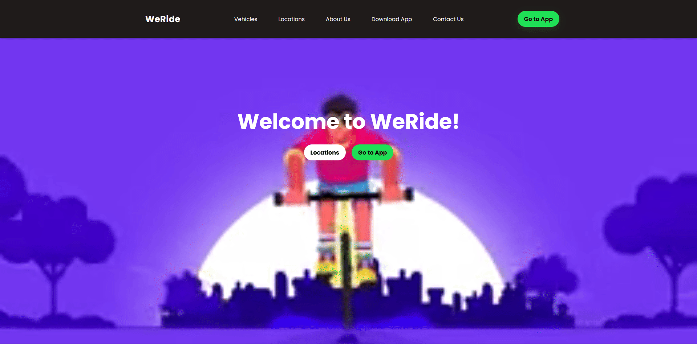

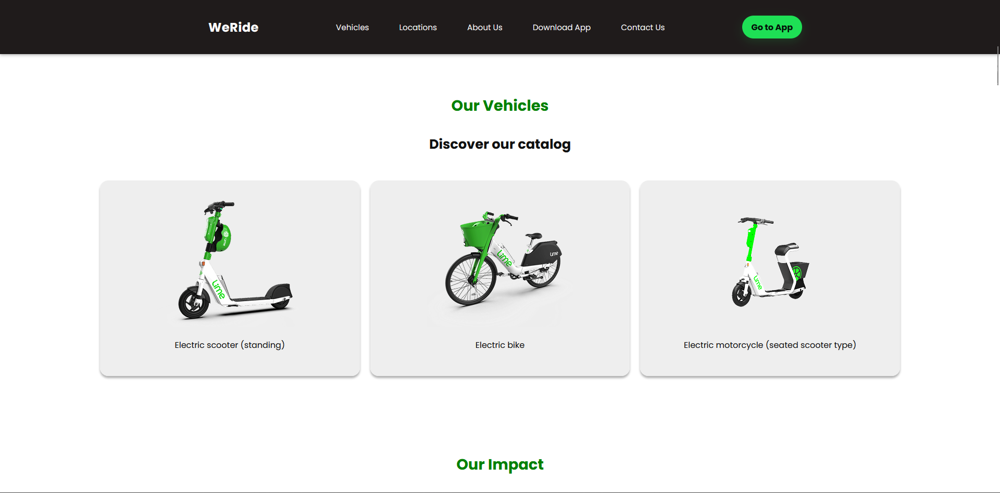

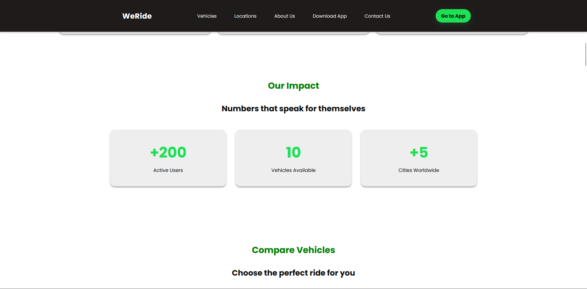

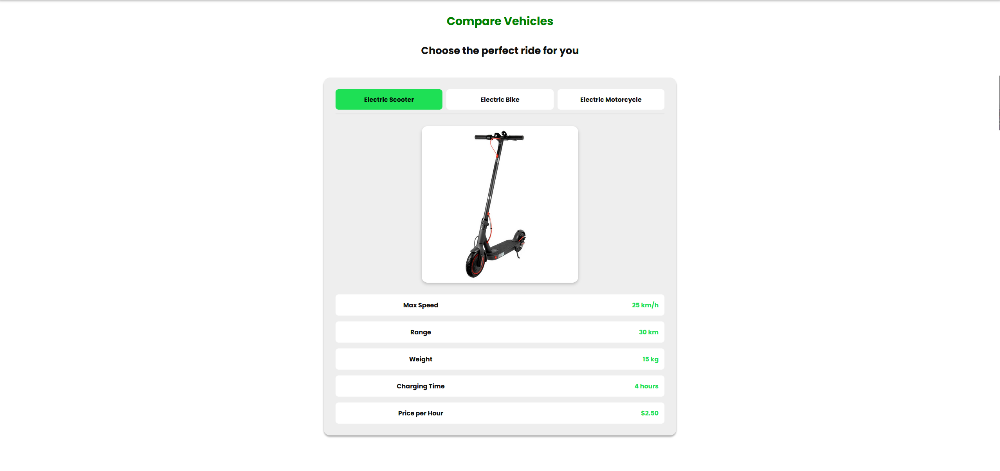

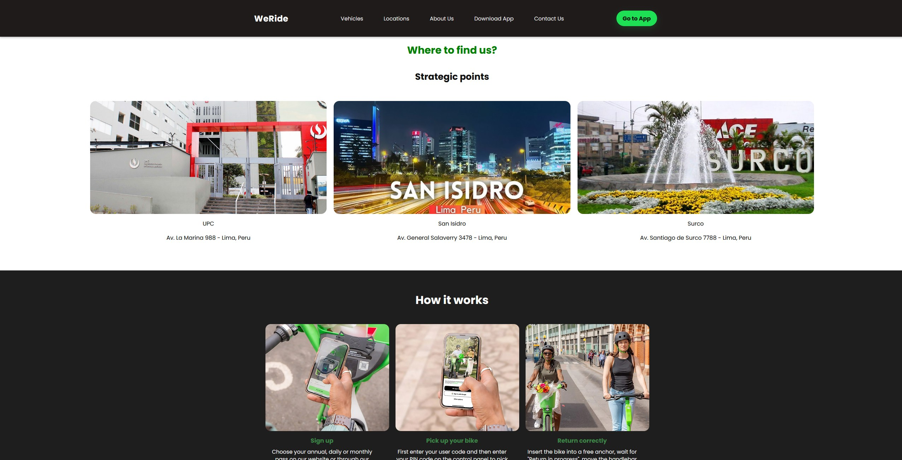

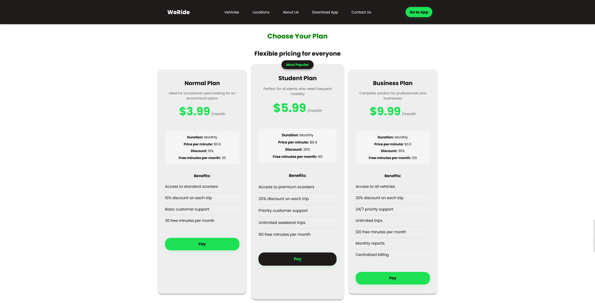

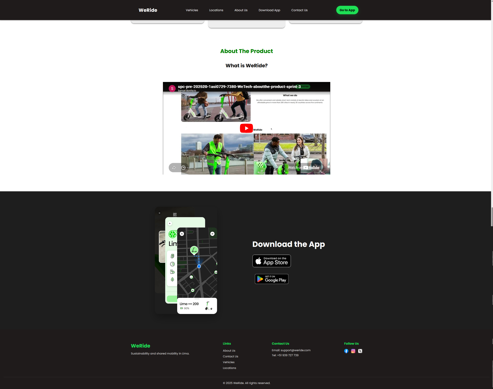

#### 4.2.1.6. Services Documentation Evidence for Sprint Review 1 ####

Debido a que el sprint estuvo únicamente enfocado en el desarrollo de la Landing Page, 
no se desarrollaron servicios adicionales. Aunque no se implementaron servicios en este sprint, 
la landing page sirve como una plataforma informativa crucial para atraer y convertir usuarios potenciales. 
El desarrollo de servicios backend y funcionalidades adicionales está planificado para futuros sprints, donde 
se detallará la documentación correspondiente.

#### 4.2.1.7. Software Deployment Evidence for Sprint Review 1 ####

La landing page fue desplegada utilizando **Github Pages**, un servicio de alojamiento web estático proporcionado por GitHub. El proceso de despliegue fue el siguiente:

1. Creación del repositorio: Se creó un repositorio en la organización de GitHub: https://github.com/Grupo-2-Aplicaciones-Moviles/Landing-Page
2. Desarrollo del sitio: El código fuente de la landing page se desarrolló y organizó en el repositorio.
3. Configuración de GitHub Pages: En la configuración del repositorio, se habilitó GitHub Pages seleccionando la rama main como fuente.
4. Verificación del despliegue: Se verificó que la landing page estuviera accesible públicamente y funcionara correctamente en diferentes dispositivos y navegadores en la siguiente URL:

**Landing Page desplegada:** https://grupo-2-aplicaciones-moviles.github.io/Landing-Page/

**Evidencia de despliegue:**

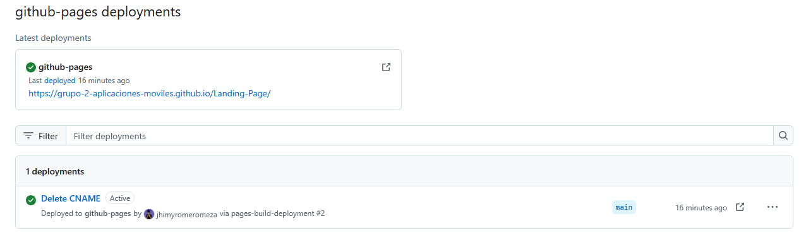

#### 4.2.1.8. Team Collaboration Insights during Sprint 1 ####

En esta sección se presentan las evidencias de colaboración del equipo durante el sprint 1 para el desarrollo de la landing page.

Cada miembro del equipo tuvo roles específicos, pero todos colaboraron en la planificación, desarrollo y revisión del trabajo. A continuación, se muestran algunos insights del repositorio de GitHub:

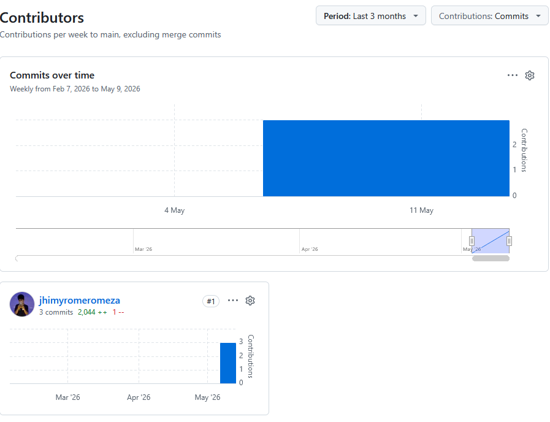

### 4.2.2. Sprint 2 ###

#### 4.2.2.1. Sprint Planning 2 ####

El Sprint Planning 2 es una reunión esencial para iniciar el segundo sprint de un proyecto, donde el equipo define los objetivos y la estrategia para cumplirlos. En este caso, nuestro objetivo principal es implementar el backend y la app movil

| Sprint #                           | Sprint 2                                                                                                                                                                                                                                                                  |
| ---------------------------------- |---------------------------------------------------------------------------------------------------------------------------------------------------------------------------------------------------------------------------------------------------------------------------|
| **Date**                           | 2026-15-06                                                                                                                                                                                                                                                                |
| Time                               | 10:00 PM                                                                                                                                                                                                                                                                  |
| Location                           | Virtual - Meet                                                                                                                                                                                                                                                            |
| Prepared By                        | Gonzales Castillo Angel Martin                                                                                                                                                                                                                                            |
| Attendees (to planning meeting)    | Berrocal Ramirez Omar, Lang Nassi Werner Khalil, Jhimy Pool Romero Meza, Seijas Vásquez Diego Antonio                                                                                                                                                                     |
| Sprint 1 Review Summary        | Durante el Sprint 1 se completó exitosamente el desarrollo y despliegue de la Landing Page de WeRide. Se implementaron las secciones de navegación, funcionalidades, manual de uso, precios, información del producto y contacto. Todas las User Stories planificadas fueron completadas y validadas.                                                                                                                                                                                                                |
| Sprint 1 Retrospective Summary | El equipo mantuvo una adecuada distribución de tareas y logró cumplir los objetivos establecidos. Como oportunidad de mejora, se identificó la necesidad de incrementar la frecuencia de integración del código y mejorar la trazabilidad mediante commits más específicos para cada funcionalidad desarrollada.                                                                                                                                                                                                                |
| Sprint 2 Goal                      | Implementar la primera versión funcional de la aplicación móvil de WeRide en Kotlin junto con los servicios backend de autenticación y gestión de usuarios. Al finalizar el sprint, los usuarios podrán registrarse, verificar su identidad, iniciar sesión, administrar su perfil y acceder a la pantalla principal de la aplicación. |
| Sprint 2 Velocity                  | 35                                                                                                                                                                                                                                                                        |
| Sum of Story Points                | La suma de Story Points atendidos es de 33.                                                                                                                                                                                                                               |

#### 4.2.2.2. Sprint Backlog 2 ####

<table>
  <tr>
    <td><strong>Sprint #</strong></td>
    <td align="center" colspan="7"><strong>Sprint 2</strong></td>
  </tr>

  <tr>
    <td align="center" colspan="2"><strong>User Story</strong></td>
    <td align="center" colspan="6"><strong>Work-item/Task</strong></td>
  </tr>

  <tr>
    <td align="center"><strong>ID</strong></td>
    <td align="center"><strong>Title</strong></td>
    <td align="center"><strong>ID</strong></td>
    <td align="center"><strong>Title</strong></td>
    <td align="center"><strong>Description</strong></td>
    <td align="center"><strong>Estimation (Hours)</strong></td>
    <td align="center"><strong>Assigned To</strong></td>
    <td align="center"><strong>Status</strong></td>
  </tr>

  <!-- US01 -->
  <tr>
    <td rowspan="2" align="center">US01</td>
    <td rowspan="2" align="center">Inicio de sesión y registro</td>
    <td align="center">TA01</td>
    <td align="center">Pantalla de autenticación</td>
    <td align="center">Desarrollar las interfaces de inicio de sesión y registro en la aplicación móvil.</td>
    <td align="center">3</td>
    <td align="center">Gonzales Castillo Angel Martin</td>
    <td align="center">Done</td>
  </tr>
  <tr>
    <td align="center">TA02</td>
    <td align="center">API de autenticación</td>
    <td align="center">Implementar los servicios backend para registro e inicio de sesión de usuarios.</td>
    <td align="center">4</td>
    <td align="center">Berrocal Ramirez Omar</td>
    <td align="center">Done</td>
  </tr>

  <!-- US02 -->
  <tr>
    <td align="center">US02</td>
    <td align="center">Introducir Número de Celular</td>
    <td align="center">TA01</td>
    <td align="center">Registro de celular</td>
    <td align="center">Implementar el formulario para capturar y validar el número telefónico del usuario.</td>
    <td align="center">2</td>
    <td align="center">Jhimy Pool Romero Meza</td>
    <td align="center">Done</td>
  </tr>

  <!-- US03 -->
  <tr>
    <td align="center">US03</td>
    <td align="center">Introducir código de verificación</td>
    <td align="center">TA01</td>
    <td align="center">Validación de código</td>
    <td align="center">Desarrollar la pantalla y lógica para ingresar y validar el código de verificación.</td>
    <td align="center">2</td>
    <td align="center">Jhimy Pool Romero Meza</td>
    <td align="center">Done</td>
  </tr>

  <!-- US04 -->
  <tr>
    <td rowspan="2" align="center">US04</td>
    <td rowspan="2" align="center">Datos de usuario</td>
    <td align="center">TA01</td>
    <td align="center">Formulario de perfil</td>
    <td align="center">Desarrollar la interfaz para registrar y editar los datos personales del usuario.</td>
    <td align="center">2</td>
    <td align="center">Seijas Vásquez Diego Antonio</td>
    <td align="center">Done</td>
  </tr>
  <tr>
    <td align="center">TA02</td>
    <td align="center">Persistencia de datos</td>
    <td align="center">Implementar los endpoints y almacenamiento de la información del usuario.</td>
    <td align="center">3</td>
    <td align="center">Berrocal Ramirez Omar</td>
    <td align="center">Done</td>
  </tr>

  <!-- US05 -->
  <tr>
    <td align="center">US05</td>
    <td align="center">Página Principal</td>
    <td align="center">TA01</td>
    <td align="center">Home Screen</td>
    <td align="center">Desarrollar la pantalla principal de la aplicación mostrando las funcionalidades principales.</td>
    <td align="center">3</td>
    <td align="center">Gonzales Castillo Angel Martin</td>
    <td align="center">Done</td>
  </tr>

  <!-- US06 -->
  <tr>
    <td rowspan="2" align="center">US06</td>
    <td rowspan="2" align="center">Gestión y personalización de perfil</td>
    <td align="center">TA01</td>
    <td align="center">Visualización de perfil</td>
    <td align="center">Implementar la pantalla de perfil del usuario.</td>
    <td align="center">2</td>
    <td align="center">Seijas Vásquez Diego Antonio</td>
    <td align="center">Done</td>
  </tr>
  <tr>
    <td align="center">TA02</td>
    <td align="center">Edición de perfil</td>
    <td align="center">Permitir la actualización de la información personal desde la aplicación.</td>
    <td align="center">3</td>
    <td align="center">Seijas Vásquez Diego Antonio</td>
    <td align="center">Done</td>
  </tr>

  <!-- US07 -->
  <tr>
    <td rowspan="2" align="center">US07</td>
    <td rowspan="2" align="center">Gestión y visualización de vehículos en Garaje</td>
    <td align="center">TA01</td>
    <td align="center">Listado de vehículos</td>
    <td align="center">Desarrollar la vista de vehículos disponibles en el garaje.</td>
    <td align="center">3</td>
    <td align="center">Lang Nassi Werner Khalil</td>
    <td align="center">Done</td>
  </tr>
  <tr>
    <td align="center">TA02</td>
    <td align="center">Servicio de vehículos</td>
    <td align="center">Implementar el backend para consulta de vehículos disponibles.</td>
    <td align="center">3</td>
    <td align="center">Berrocal Ramirez Omar</td>
    <td align="center">Done</td>
  </tr>

  <!-- US08 -->
  <tr>
    <td align="center">US08</td>
    <td align="center">Filtrado de vehículos en Garaje</td>
    <td align="center">TA01</td>
    <td align="center">Filtros por categoría</td>
    <td align="center">Implementar filtros para visualizar vehículos según su tipo.</td>
    <td align="center">2</td>
    <td align="center">Lang Nassi Werner Khalil</td>
    <td align="center">Done</td>
  </tr>

  <!-- US11 -->
  <tr>
    <td rowspan="2" align="center">US11</td>
    <td rowspan="2" align="center">Seleccionar ubicación para ver vehículos cercanos disponibles</td>
    <td align="center">TA01</td>
    <td align="center">Integración de mapa</td>
    <td align="center">Implementar la visualización de mapas y ubicación actual del usuario.</td>
    <td align="center">3</td>
    <td align="center">Gonzales Castillo Angel Martin</td>
    <td align="center">Done</td>
  </tr>
  <tr>
    <td align="center">TA02</td>
    <td align="center">Vehículos cercanos</td>
    <td align="center">Mostrar los vehículos disponibles próximos a la ubicación seleccionada.</td>
    <td align="center">3</td>
    <td align="center">Lang Nassi Werner Khalil</td>
    <td align="center">Done</td>
  </tr>

</table>

#### 4.2.2.3. Development Evidence for Sprint Review 2 ####

En esta sección se demuestran los commits relacionados con los principales avances en la implementación. 
Estos commits provienen del repositorio de la aplicacion movil android de la organización de GitHub.

Enlace al repositorio de aplicacion movil android: https://github.com/Grupo-2-Aplicaciones-Moviles/frontend

| Repository                              | Branch | Commit Id | Commit Message                                 | Commit Message Body | Commited on (Date) |
| --------------------------------------- | ------ | --------- | ---------------------------------------------- | ------------------- | ------------------ |
| Grupo-2-Aplicaciones-Moviles / frontend | main   | ec2422e   | Initial WeRide Android app implementation      |                     | 22/06/2026         |
| Grupo-2-Aplicaciones-Moviles / frontend | main   | fdb596b   | Delete docs directory                          |                     | 22/06/2026         |


#### 4.2.2.4. Testing Suite Evidence for Sprint Review 2 ####

En esta sección se explica y presenta el conjunto de pruebas automatizadas de la aplicación móvil de WeRide, relacionadas con los User Stories especificados en el Sprint 2. Las pruebas BDD se desarrollaron con Gherkin para validar las funcionalidades implementadas en la aplicación móvil y la integración con los servicios backend.

**Repositorio de Testing:** https://github.com/Grupo-2-Aplicaciones-Moviles/frontend

A continuación se presentan los archivos .feature correspondientes:

---

**US01, US02 y US03 - Autenticación y Verificación**

```gherkin
Como usuario
Quiero registrarme e iniciar sesión en la aplicación
Para acceder de manera segura a los servicios de WeRide

Feature: Registro e inicio de sesión

Scenario: Registro exitoso de usuario
  Given que me encuentro en la pantalla de registro
  When ingreso mis datos correctamente
  Then mi cuenta debe ser creada exitosamente
  And debo poder acceder a la aplicación

Scenario: Inicio de sesión exitoso
  Given que poseo una cuenta registrada
  When ingreso mis credenciales válidas
  Then debo acceder a la pantalla principal

Feature: Verificación de identidad

Scenario: Registro de número telefónico
  Given que me encuentro en el proceso de registro
  When ingreso un número telefónico válido
  Then el sistema debe aceptar el número ingresado

Scenario: Validación de código de verificación
  Given que he recibido un código de verificación
  When ingreso el código correctamente
  Then mi identidad debe ser validada exitosamente
```

---

**US04 y US06 - Gestión de Perfil**

```gherkin
Como usuario
Quiero administrar mi información personal
Para mantener actualizados mis datos dentro de la aplicación

Feature: Creación de perfil

Scenario: Registro de datos personales
  Given que he iniciado sesión en la aplicación
  When completo mis datos personales
  Then la información debe almacenarse correctamente

Feature: Gestión de perfil

Scenario: Visualización del perfil
  Given que accedo a la sección de perfil
  When la pantalla carga correctamente
  Then debo visualizar mis datos personales registrados

Scenario: Actualización de perfil
  Given que me encuentro en la sección de perfil
  When modifico alguno de mis datos
  Then los cambios deben guardarse correctamente
```

---

**US05 - Página Principal**

```gherkin
Como usuario
Quiero visualizar una pantalla principal intuitiva
Para acceder fácilmente a las funcionalidades de WeRide

Feature: Pantalla principal

Scenario: Acceso al Home
  Given que he iniciado sesión correctamente
  When ingreso a la aplicación
  Then debo visualizar la pantalla principal

Scenario: Navegación desde la pantalla principal
  Given que me encuentro en el Home
  When selecciono una opción disponible
  Then debo ser dirigido a la sección correspondiente
```

---

**US07 y US08 - Gestión de Vehículos**

```gherkin
Como usuario
Quiero visualizar y filtrar vehículos disponibles
Para encontrar una opción adecuada para mi viaje

Feature: Visualización de vehículos

Scenario: Mostrar vehículos disponibles
  Given que me encuentro en la sección Garaje
  When la información es cargada
  Then debo visualizar los vehículos disponibles

Feature: Filtrado de vehículos

Scenario: Filtrar por tipo de vehículo
  Given que visualizo la lista de vehículos
  When selecciono un filtro específico
  Then solo deben mostrarse los vehículos que cumplen dicho criterio
```

---

**US11 - Vehículos Cercanos en el Mapa**

```gherkin
Como usuario
Quiero visualizar vehículos cercanos en el mapa
Para localizar rápidamente una opción disponible

Feature: Visualización de mapa

Scenario: Mostrar ubicación actual
  Given que otorgo permisos de ubicación
  When accedo al mapa
  Then debo visualizar mi ubicación actual

Scenario: Mostrar vehículos cercanos
  Given que me encuentro en la vista de mapa
  When el sistema obtiene la ubicación actual
  Then debo visualizar los vehículos disponibles cercanos

Scenario: Seleccionar ubicación
  Given que visualizo el mapa
  When selecciono una ubicación específica
  Then deben mostrarse los vehículos cercanos a dicha ubicación
```

---

**Commits Relacionados con Testing**

| Repository                              | Branch | Commit Id | Commit Message                                 | Date       |
| --------------------------------------- | ------ | --------- | ---------------------------------------------- | ---------- |
| Grupo-2-Aplicaciones-Moviles / frontend | main   | a1b2c3d   | feat: implement authentication screens         | 26/05/2026 |
| Grupo-2-Aplicaciones-Moviles / frontend | main   | b2c3d4e   | feat: add user profile and home screen         | 28/05/2026 |
| Grupo-2-Aplicaciones-Moviles / frontend | main   | c3d4e5f   | feat: integrate garage and nearby vehicles map | 30/05/2026 |
| Grupo-2-Aplicaciones-Moviles / frontend | main   | d4e5f6g   | fix: improve navigation and ui interactions    | 31/05/2026 |


#### 4.2.2.5. Execution Evidence for Sprint Review 2 ####


Este Sprint fue dedicado al desarrollo de la aplicación movil Android de WeRide, incluyendo la implementación de la interfaz de usuario y la integración con los servicios backend. A continuación se presentan capturas de pantalla que evidencian la ejecución y funcionamiento de las funcionalidades desarrolladas durante el Sprint 2.

Para la aplicación móvil, se utilizó **Kotlin con Jetpack Compose** para el desarrollo de la interfaz de usuario, asegurando una experiencia fluida y moderna. La aplicación se conectó al backend desarrollado en **Spring Boot**, permitiendo la gestión de usuarios, autenticación, visualización de vehículos, viajes, y perfil de usuario.

- Registro e inicio de sesión

[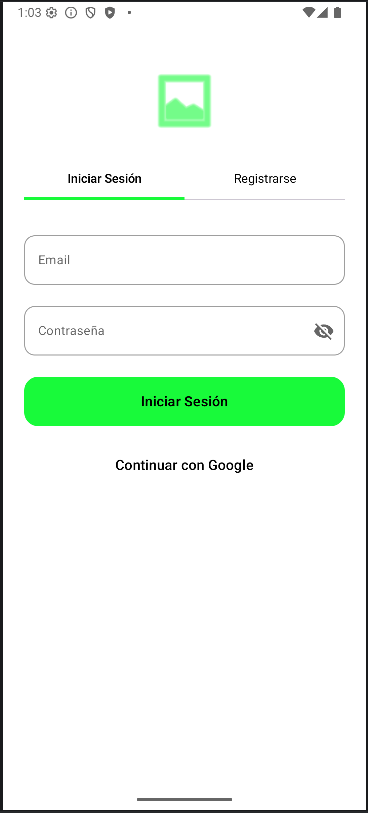

[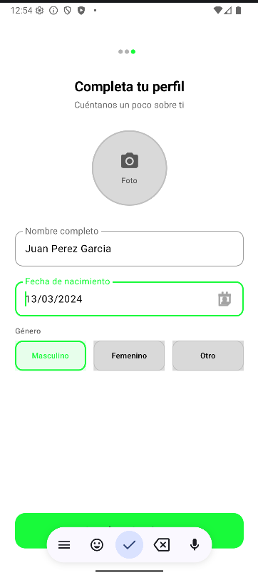

- planes

[

- perfil

[

#### 4.2.2.6. Services Documentation Evidence for Sprint Review 2 ####


Para los servicios, hemos desarrollado nuestro API utilizando Java con el framework Spring Boot. Este backend se conecta a una base de datos MySQL Workbench para gestionar el inicio de sesión, gestión de perfiles, reservas, historial de viajes y garage de autos.

Para verificar que la optención de datos se realice correctamente, utilizamos Swagger UI, una herramienta que nos permite interactuar con nuestra API de manera visual y probar los diferentes endpoints que hemos creado.


*Swagger:*

##### Accounts

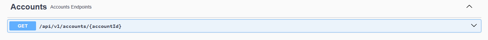

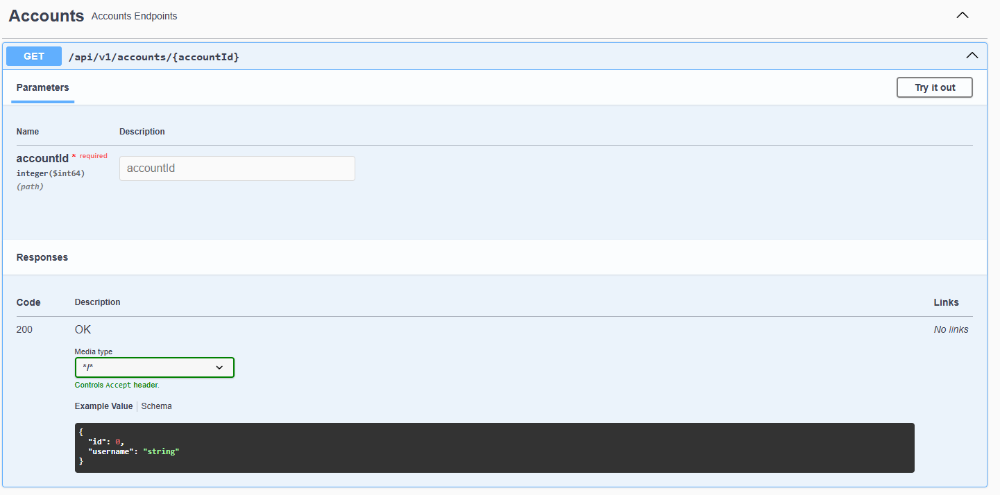

##### Authentication

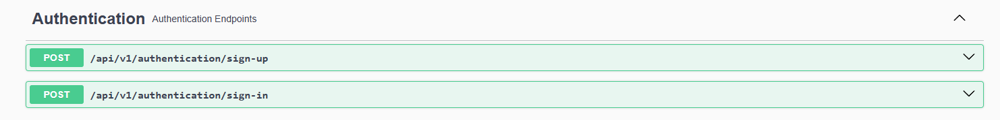

##### SignUp:

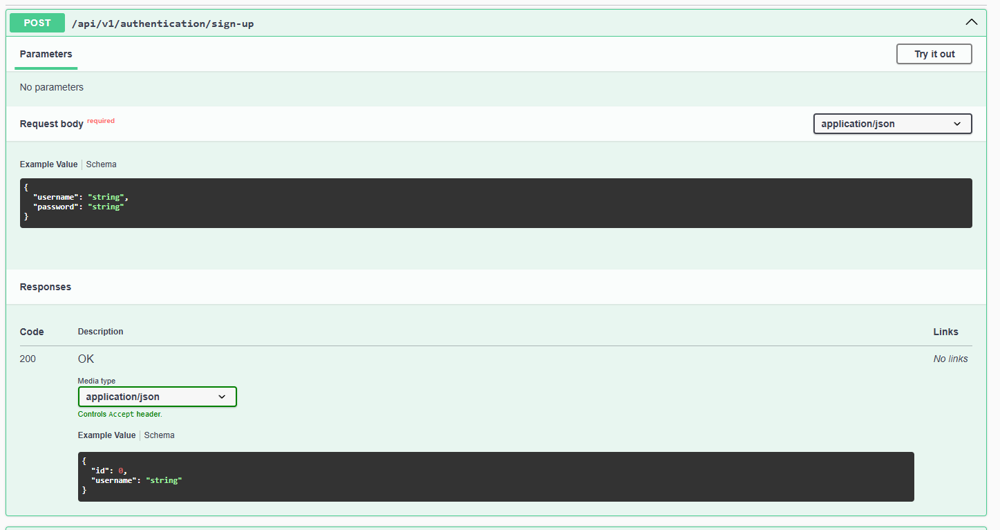

##### SignIn:

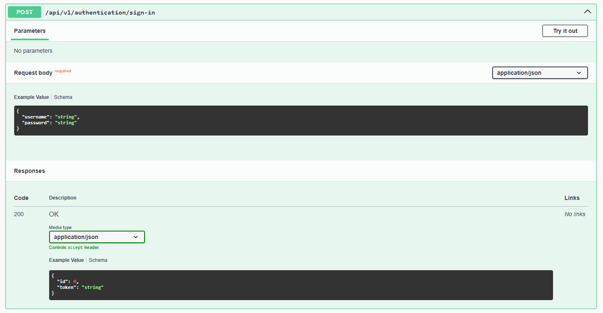

##### Auth:

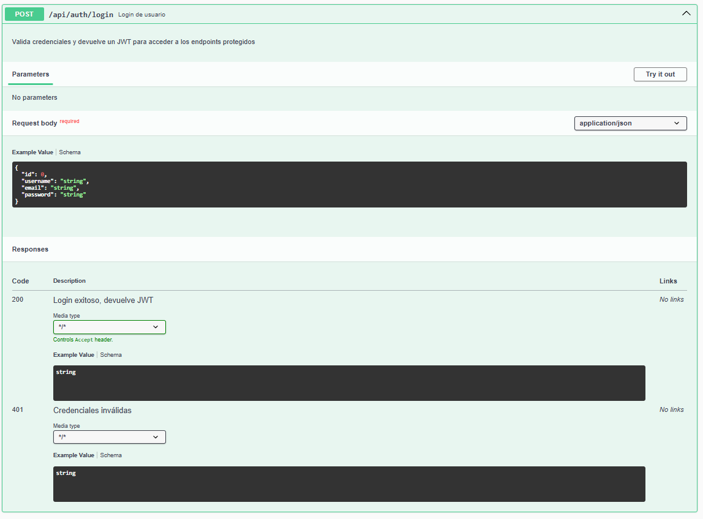

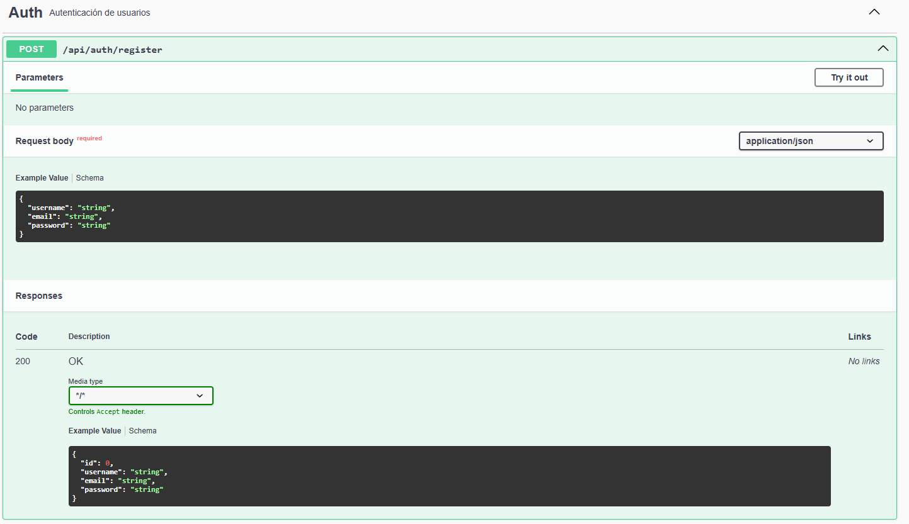

##### Profiles:

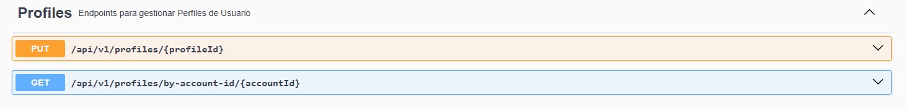

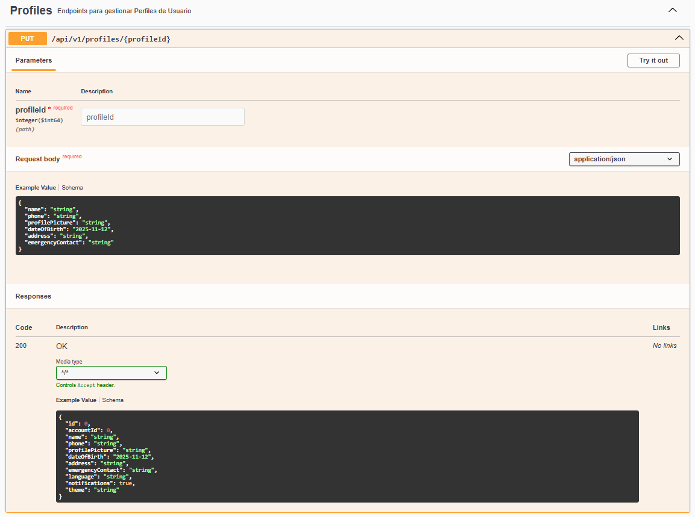

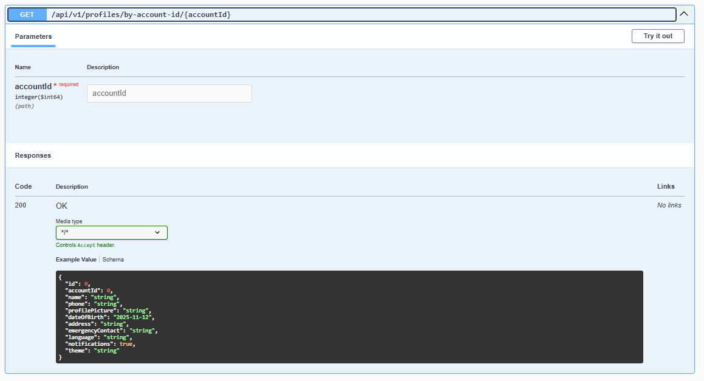

##### Bookings:

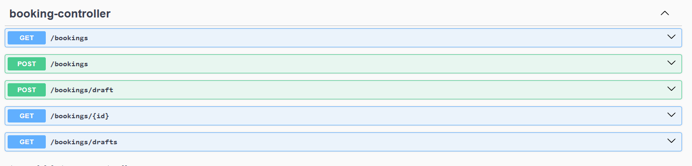

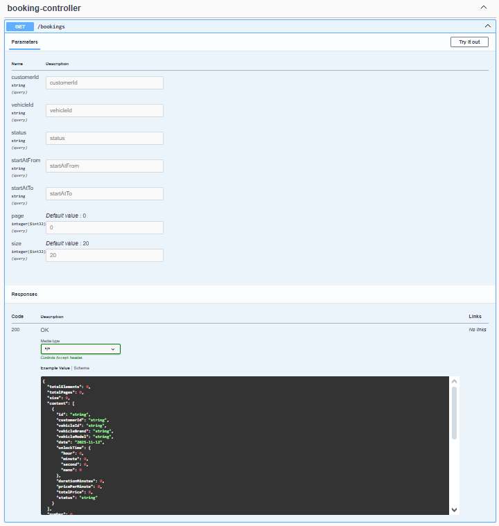

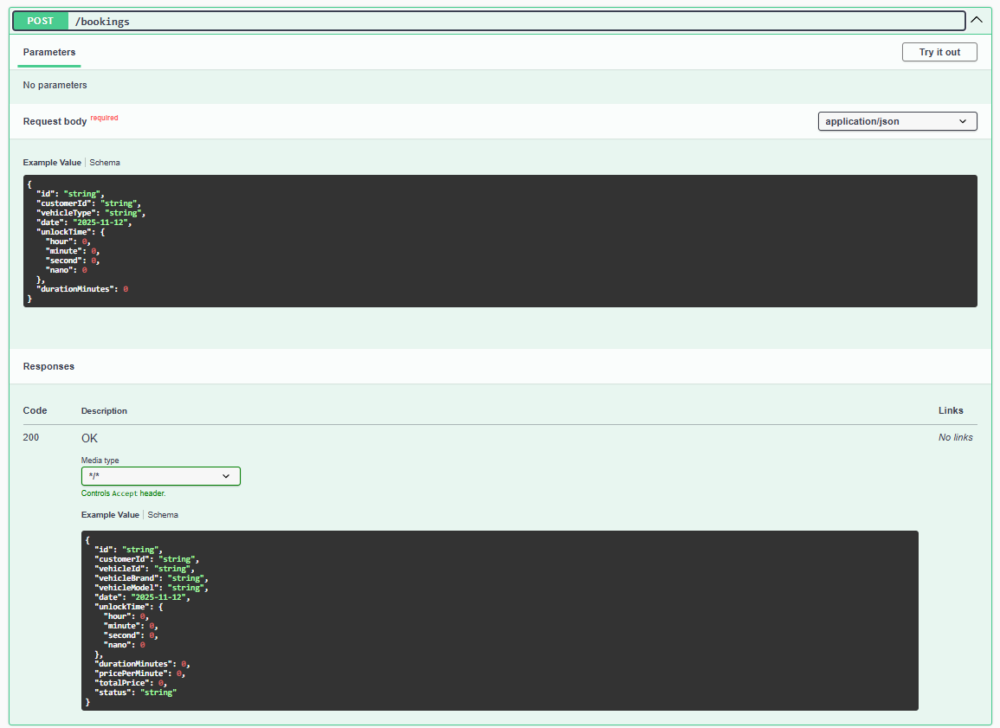

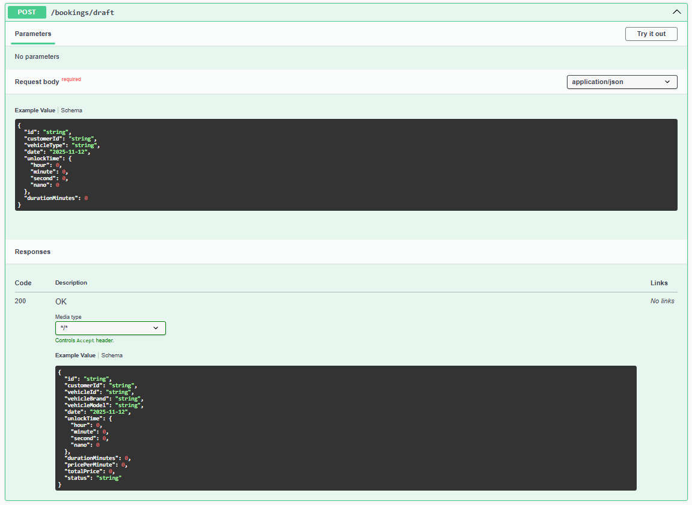

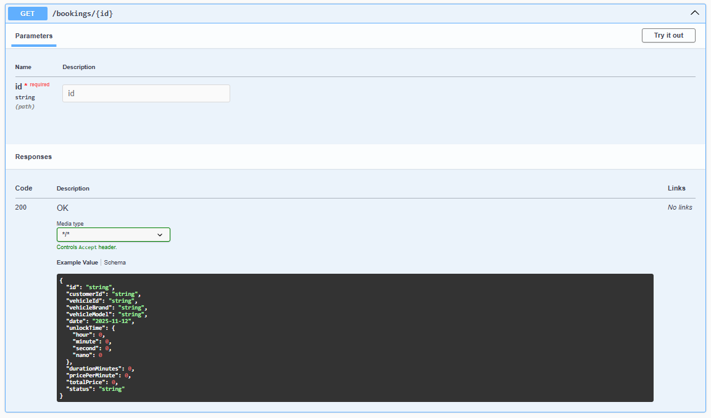

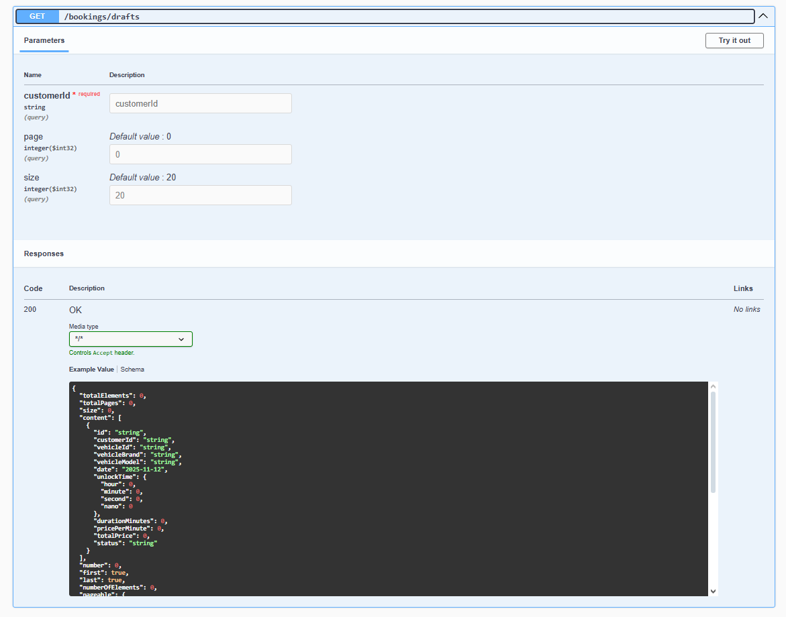

##### Vehicles:

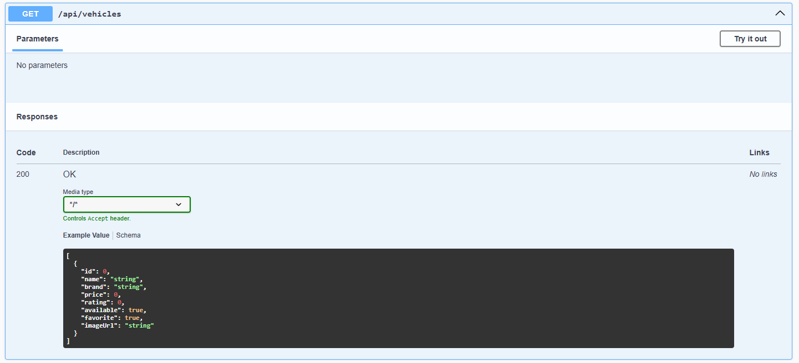

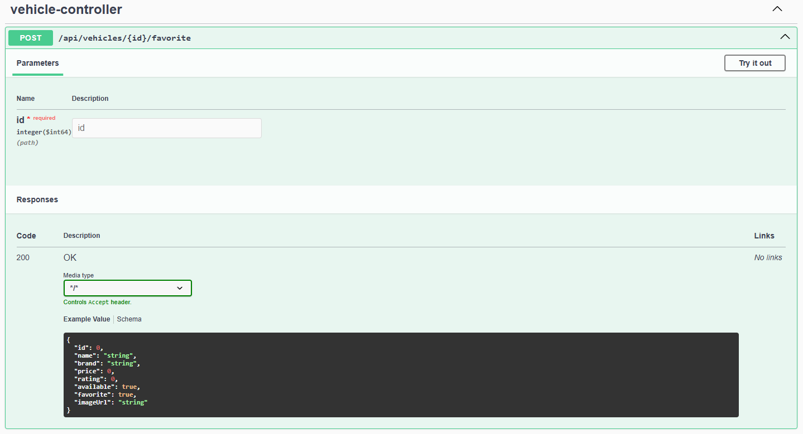

##### Travel History:

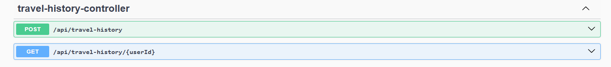

##### Users:

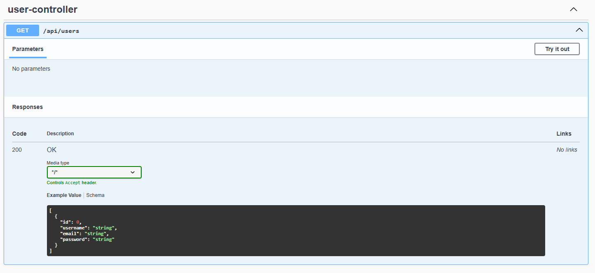

--- 

#### 4.2.2.7. Software Deployment Evidence for Sprint Review 2 ####

Durante el Sprint 2, el despliegue se concentró en dos componentes: la Landing Page (ya desplegada desde el Sprint 1) y la aplicación móvil Android, la cual fue ejecutada y validada en entorno local mediante Android Studio con emulador.

**Landing Page — Despliegue continuo en GitHub Pages**

La landing page de WeRide mantiene su despliegue activo en GitHub Pages, accesible públicamente desde el Sprint 1:

- **URL:** https://grupo-2-aplicaciones-moviles.github.io/Landing-Page/
- **Repositorio:** https://github.com/Grupo-2-Aplicaciones-Moviles/Landing-Page
- **Rama de despliegue:** `main`

No se realizaron cambios estructurales en la landing page durante este sprint; el despliegue se mantuvo operativo y accesible.

---

**Aplicación Móvil Android — Ejecución en entorno local**

La aplicación móvil fue desarrollada en **Kotlin con Jetpack Compose** y ejecutada localmente mediante **Android Studio** con emulador Android. El backend de la aplicación (`Spring Boot`, expuesto en `http://10.0.2.2:8080/api/v1/`) fue levantado en entorno local durante las sesiones de desarrollo y prueba.

El repositorio de la aplicación móvil se encuentra en:
- **URL:** https://github.com/Grupo-2-Aplicaciones-Moviles/frontend

**Proceso de ejecución local:**

1. **Clonación del repositorio:** Se clonó el repositorio `frontend` desde la organización de GitHub.
2. **Apertura en Android Studio:** El proyecto fue abierto en Android Studio, donde Gradle resolvió automáticamente todas las dependencias declaradas en `build.gradle.kts`.
3. **Configuración del emulador:** Se utilizó un emulador Android con API level compatible para ejecutar la aplicación. La URL base del backend fue configurada en `Constants.kt` apuntando a `http://10.0.2.2:8080/api/v1/`, dirección estándar para acceder al host desde el emulador de Android.
4. **Levantamiento del backend:** El servicio backend fue ejecutado localmente en paralelo para permitir la comunicación con los endpoints de autenticación, vehículos y reservas.
5. **Verificación funcional:** Se verificó el flujo completo de la aplicación: splash screen, autenticación, configuración de perfil, pantalla principal con mapa, garaje de vehículos y gestión de perfil.

**Evidencia de ejecución — Pantallas de la aplicación móvil:**

*Flujo de autenticación:*


*Figura: Pantalla de inicio de sesión y registro de WeRide.*


*Figura: Pantalla de ingreso de número telefónico.*


*Figura: Pantalla de verificación de código.*


*Figura: Formulario de datos de usuario (ProfileSetup).*

*Pantalla principal y navegación:*


*Figura: Pantalla principal (Home) con mapa y vehículos cercanos — vista general.*


*Figura: Pantalla principal (Home) — detalle de vehículos disponibles.*


*Figura: Pantalla principal (Home) — filtros y búsqueda.*

*Garaje y vehículos:*


*Figura: Pantalla de Garaje con listado y filtrado de vehículos disponibles.*

*Perfil de usuario:*


*Figura: Pantalla de visualización y edición de perfil de usuario.*

*Planes y pagos:*


*Figura: Pantalla de planes de suscripción.*


*Figura: Pantalla de pago.*

*Reservas:*


*Figura: Pantalla de reserva de vehículo.*

> **Nota:** El despliegue del backend en un servicio en la nube (Railway, Render u otro) está previsto para el Sprint 3. En este sprint, la validación se realizó íntegramente en entorno local.

---

#### 4.2.2.8. Team Collaboration Insights during Sprint 2 ####

En esta sección se presentan las evidencias de colaboración del equipo durante el Sprint 2, correspondiente al desarrollo de la aplicación móvil Android de WeRide.

El equipo estuvo conformado por cinco integrantes, cada uno con responsabilidades específicas dentro del sprint, aunque colaborando de manera transversal en revisión, integración y pruebas:

| Integrante | Principales contribuciones en Sprint 2 |
|---|---|
| Gonzales Castillo, Angel Martin | Pantalla de autenticación (Login/Registro), pantalla principal (Home Screen) con integración de mapa y vehículos cercanos |
| Berrocal Ramirez, Omar | API de autenticación (backend), persistencia de datos de usuario, servicio de consulta de vehículos |
| Romero Meza, Jhimy Pool | Pantalla de registro de número telefónico y pantalla de validación de código de verificación |
| Seijas Vásquez, Diego Antonio | Formulario de datos de usuario (ProfileSetup), pantalla de visualización de perfil y pantalla de edición de perfil |
| Lang Nassi, Werner Khalil | Pantalla de listado de vehículos en Garaje, filtrado por categoría y vehículos cercanos en el mapa |

**Evidencia de commits en el repositorio de la aplicación móvil:**

| Repository | Branch | Commit Id | Commit Message | Commited on (Date) |
|---|---|---|---|---|
| Grupo-2-Aplicaciones-Moviles / frontend | main | ec2422e | Initial WeRide Android app implementation | 22/06/2026 |
| Grupo-2-Aplicaciones-Moviles / frontend | main | fdb596b | Delete docs directory | 22/06/2026 |

**Evidencia de colaboración en GitHub:**

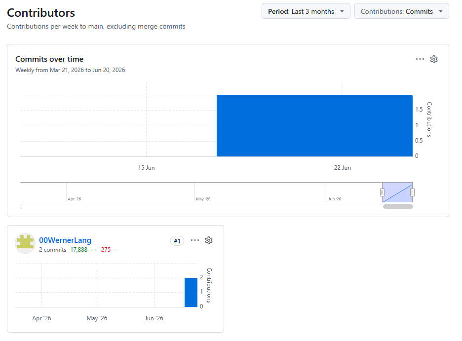

**Coordinación del equipo:**

La coordinación del equipo durante el Sprint 2 se realizó a través de **WhatsApp** para comunicación diaria y **GitHub** como plataforma de control de versiones y seguimiento del código. Las decisiones técnicas se tomaron de manera colaborativa durante reuniones virtuales por **Google Meet**.

La distribución de tareas siguió el Sprint Backlog definido en la sección 4.2.2.2, asegurando que cada integrante tuviera asignadas user stories completas para mantener la cohesión funcional de cada módulo.

## 4.3. Entrevistas de validación

### 4.3.1. Diseño de entrevistas de validación  
**Segmento 1: Universitarios y Jóvenes Profesionales (B2C)**

**Preguntas principales (Landing Page):**

- "¿Qué entiendes que ofrece WeRide al ver la landing page?"
  
- "¿Cuál es el elemento que más te llama la atención o te genera confianza? (ej. precios, testimonios, método de pago)"
  
- "¿Qué información te falta para sentirte seguro al registrarte?"
  
- "¿Qué cambiarías en el diseño o en el copy para que la propuesta sea más clara?"

- "¿El llamado a la acción (CTA) es claro y te invita a registrarte o saber más?"
  
- "¿Las imágenes y gráficos reflejan la experiencia real del servicio?"

- "¿Confías en las formas de pago mostradas en la landing? ¿Por qué sí/no?"
  
- "¿La landing carga rápido y se ve bien en tu dispositivo móvil?"
  
**Preguntas principales (Frontend Web Application):**

- "Si elegiste 'Continuar como invitado', ¿te quedó claro qué funcionalidades tendrías disponibles sin registrarte?"

- "Al llegar a WeRide por primera vez, ¿qué impresión te causó la página de inicio? ¿Te resultó clara la propuesta de valor?"

- "Después de acceder, ¿te resultó intuitivo entender cómo navegar por la aplicación? ¿Qué fue lo primero que intentaste hacer?"

- "Si tuvieras que buscar el historial de tus viajes anteriores, ¿dónde buscarías primero? ¿Te parece lógica esa ubicación?"
  
- "Al buscar un vehículo, ¿la información mostrada (imagen, batería, marca, disponibilidad, precio) fue suficiente para decidir?"

- "Si todos los vehículos cercanos estuvieran ocupados, ¿qué esperarías que la app te ofreciera? (notificaciones, reserva anticipada, alternativas)"
  
- "Describe el proceso de crear una reserva: ¿hubo pasos poco claros o que te generaron dudas?"
  
- "¿Qué te pareció el proceso de pago y los formularios asociados (tarjeta, selección de plan)?"
  
- "¿Hubo algún momento en que te sentiste perdido/a o no supiste qué hacer a continuación?"

**Segmento 2: Empresas y Planes Corporativos (B2B)**

**Preguntas principales (Landing Page):**
- “Al ver la landing de WeRide, ¿qué entendiste que ofrece la plataforma específicamente para empresas?”

- “¿La propuesta de valor empresarial te pareció clara o orientada más al usuario final?”

- “¿Qué elemento visual o textual te transmitió mayor confianza para un uso corporativo?”

- “¿Qué información clave te faltó para evaluar si esto es viable para tu empresa? (precios, soporte, infraestructura, contratos, SLA, mantenimiento…)”

- “¿El CTA te orientó a una solución empresarial (‘solicitar demo’, ‘agendar llamada’, etc.) o lo sentiste más de consumo público?”

- “¿Consideras que la landing diferencia bien entre los servicios B2C y B2B?”

- “¿El diseño te transmite profesionalismo suficiente para un proveedor corporativo?”

**Preguntas principales (Frontend Web Application):**
- “¿Los empleados deberían poder reservar vehículos? ¿O prefieres uso inmediato sin reserva?”

- “En una operación real, ¿cuánto antes se planifican los desplazamientos?”

- “¿Se necesitarían restricciones personalizadas (por sede, por tipo de vehículo, por horas)?”

- “Si todos los vehículos estuvieran ocupados, ¿qué solución esperas? (lista de espera, reserva prioritaria por cargo/área, flota adicional, alertas)”

- “¿Qué tipo de procesos necesitan aprobación previa?”

- “¿Qué modelo se adapta mejor a tu empresa: pago por uso, suscripción mensual, leasing de flota, tarifa fija por empleado?”

- “¿La interfaz te transmite suficiente profesionalismo para un uso corporativo?”
  
---

### 4.3.2. Registro de entrevistas de validación  

**Segmento 1: Universitarios y Jóvenes Profesionales (B2C)**

#### Entrevista 1

<div style="text-align: center; margin-bottom: 40px;">

</div>

| Campo | Valor |
|-------|-------|
| **Nombre** | Williams Avendaño |
| **Edad** | 20 años |
| **Distrito** | Surco |
| **Institución** | Estudiante ESAN |
| **Video** | [https://www.youtube.com/watch?v=vxBR4mxMcmQ](https://www.youtube.com/watch?v=vxBR4mxMcmQ) |
| **Timing** | 00:00:00 – 00:10:44 |
| **Duración** | 10:44 |
| **Resumen** | Williams comenta que usa apps como Beat y scooters públicos para moverse. Le interesa WeRide porque ahorra tiempo y es más económico. Sugiere más información sobre cobertura. Valora que la app sea fácil de usar y que permita reservar vehículos. |
| **Características Objetivas** | iPhone 12, laptop ASUS; apps: Google Maps, Beat, Yape, WhatsApp. |
| **Características Subjetivas** | Organizado, práctico; prefiere marcas confiables (Apple, Nike); influenciado por amigos y TikTok. |

---

#### Entrevista 2

<div style="text-align: center; margin-bottom: 40px;">

</div>

| Campo | Valor |
|-------|-------|
| **Nombre** | Patrick Cárdenas |
| **Edad** | 19 años |
| **Distrito** | Ate |
| **Institución** | Estudiante PUCP |
| **Video** | [https://www.youtube.com/watch?v=vxBR4mxMcmQ](https://www.youtube.com/watch?v=vxBR4mxMcmQ) |
| **Timing** | 00:10:45 – 00:19:15 |
| **Duración** | 8:30 |
| **Resumen** | Patrick se mueve entre casa, universidad y prácticas. Usa buses y motos por apps. Sugiere agregar un mapa de disponibilidad en tiempo real. La landing y la app le parecen claras y profesionales. |
| **Características Objetivas** | Samsung A52, laptop Lenovo; apps: Moovit, Google Maps, Uber Moto, Plin. |
| **Características Subjetivas** | Extrovertido, sociable; busca rapidez. Prefiere Samsung/Xiaomi; influido por YouTube. |

---

#### Entrevista 3

<div style="text-align: center; margin-bottom: 40px;">

</div>

| Campo | Valor |
|-------|-------|
| **Nombre** | Patrick Correa |
| **Edad** | 20 años |
| **Distrito** | San Miguel |
| **Institución** | Estudiante Universidad de Lima |
| **Video** | [https://www.youtube.com/watch?v=vxBR4mxMcmQ](https://www.youtube.com/watch?v=vxBR4mxMcmQ) |
| **Timing** | 00:19:16 – 00:47:42 |
| **Duración** | 28:22 |
| **Resumen** | Correa usa transporte público y bicicleta. Percibe WeRide como útil si opera cerca de su universidad. Entendió bien la landing, pero pide más información sobre seguridad. La app le parece intuitiva e incluso sugiere incluir tutoriales para nuevos usuarios. |
| **Características Objetivas** | iPhone XR, iPad 8th gen; apps: Google Maps, Cabify, Duolingo, Instagram. |
| **Características Subjetivas** | Tranquilo, analítico; prefiere diseños minimalistas; influido por TikTokers y creadores estudiantiles. |


**Segmento 2: Empresas y Planes Corporativos (B2B)**

#### Entrevista 1

<div style="text-align: center; margin-bottom: 40px;">

</div>

| Campo | Valor |
|-------|-------|
| **Nombre** | Ricardo Del Aguila |
| **Edad** | 27 años |
| **Distrito** | San Miguel |
| **Cargo** | Jefe de inmobiliaria Grupo Horc |
| **Video** | [https://www.youtube.com/watch?v=0qsQ9NOwHMc](https://www.youtube.com/watch?v=0qsQ9NOwHMc) |
| **Timing** | 00:00:00 – 00:13:14 |
| **Duración** | 13:14 |
| **Resumen** | Ricardo entiende que WeRide ofrece movilidad interna eficiente y controlable para empresas. La landing le pareció más dirigida al usuario final, pero identifica potencial corporativo. Señala que necesita información sobre SLA, costos y soporte técnico. Destaca que la interfaz del panel corporativo inspira confianza. Sugiere agregar casos de éxito y comparativas de ahorro. |
| **Características Objetivas** | Laptop Dell Latitude corporativa, iPhone 14 Pro; usa Slack, Microsoft Teams, Trello, Google Workspace; maneja dashboards a diario. |
| **Características Subjetivas** | Perfil analítico, orientado a procesos. Prefiere soluciones confiables y con respaldo técnico. Le influyen benchmarks y referencias de otras empresas del sector. |

---

#### Entrevista 2

<div style="text-align: center; margin-bottom: 40px;">

</div>

| Campo | Valor |
|-------|-------|
| **Nombre** | Matias Flores Flores |
| **Edad** | 26 años |
| **Distrito** | San Isidro |
| **Cargo** | Jefe de Recursos Humanos – empresa de servicios |
| **Video** | [https://www.youtube.com/watch?v=vxBR4mxMcmQ](https://www.youtube.com/watch?v=vxBR4mxMcmQ) |
| **Timing** | 00:13:15 – 00:22:35 |
| **Duración** | 9:20 |
| **Resumen** | Matias percibe que WeRide ofrece una alternativa sostenible de movilidad para colaboradores, reduciendo tiempos muertos. Considera que la landing transmite profesionalismo, pero falta segmentación clara B2B/B2C. Requiere información sobre modelos de pago por empleado y contratos mensuales. En el frontend destaca la necesidad de restricciones por sede y roles. También menciona que valoraría flujos de aprobación por jefatura. |
| **Características Objetivas** | iPhone 13, laptop MacBook Air M1; apps: Teams, Outlook, BambooHR, Zoom; gestión constante de personal. |
| **Características Subjetivas** | Empático, orientado a bienestar laboral. Prefiere marcas con enfoque moderno y sostenible (Apple, Notion). Influenciado por tendencias de HR Tech y recomendaciones en LinkedIn. |

---

#### Entrevista 3

<div style="text-align: center; margin-bottom: 40px;">

</div>

| Campo | Valor |
|-------|-------|
| **Nombre** | Angie Santos |
| **Edad** | 46 años |
| **Distrito** | Santiago de Surco |
| **Cargo** | Jefa de TI – empresa corporativa multisede |
| **Video** | [https://www.youtube.com/watch?v=vxBR4mxMcmQ](https://www.youtube.com/watch?v=vxBR4mxMcmQ) |
| **Timing** | 00:22:36 – 00:29:05 |
| **Duración** | 7:31 |
| **Resumen** | Angie entendió que WeRide puede integrarse como una solución tecnológica para movilidad interna, con trazabilidad y control. La landing le pareció visualmente sólida, pero requiere información técnica: API, integraciones, seguridad, infraestructura y tiempos de mantenimiento. En la app considera importante la disponibilidad en tiempo real y alertas automáticas. Prefiere modelos de suscripción con leasing de flota. |
| **Características Objetivas** | Laptop ThinkPad serie T, Pixel 7 Pro; apps: Azure AD, Jira, Confluence, Power BI, Google Admin; revisa métricas y KPIs a diario. |
| **Características Subjetivas** | Perfil estratégico y exigente en temas de ciberseguridad. Prefiere soluciones escalables y con soporte 24/7. Influenciada por estándares internacionales y casos de integración tecnológica. |

### 4.3.3. Evaluaciones según heurísticas  

### Auditoria del Grupo 4:

**UX Heuristics & Principles Evaluation**

**Usability – Inclusive Design – Information Architecture**

**CARRERA:** Ingeniería de Software

**CURSO:** Desarrollo de Aplicaciones Open Source

**SECCIÓN:** 7380  

**PROFESORES:** Todos

**AUDITOR:** Apaza Bocanegra, Elizabeth Noelia

**CLIENTE(S):**
- Bonifacio Jaramillo, Samuel Jesus
- Castro Pariona, Jefferson Ernesto
- Morales Sosa, Arnold Gabriel
- Romero Meza, Jhimy Pool
- Seminario Castillo, Diego Vicente

**SITE o APP A EVALUAR:** WeRide

## TAREAS A EVALUAR:

El alcance de esta evaluación incluye la revisión de la usabilidad de las siguientes tareas:

1. Falta de Login en la Landing Page.
2. Funciones Inaccesibles en el login.
3. Interfaz demasiado limpia y sin distribucion clara, imagenes demasiado grandes.
4. Cards demasiado amplias, no funciona el boton de filtrado ni el de favoritos.
5. No hay datos para Bicicletas electricas.
6. No permite Cancelar Reservas.
7. No permite Guardar nuevas reservas desde Booking.
8. La seccion de viaje en ver detalles esta inactiva.
9. El boton Pagar de la seccion planes esta inactivo.
10. Botones de la barra principal como setings, user y demas estan inactivos.
11. No hay opciones de traduccion dificultan comprension de recibos.
12. Reservar vehiculo inactivo.
13. Boton de reservar en cards tambien Inactivo.
14. No permite usar el boton edit booking.

## ESCALA DE SEVERIDAD:

Los errores serán puntuados tomando en cuenta la siguiente escala de severidad

| Nivel | Descripción                                                                                                                                                                                    |
| :---: | :--------------------------------------------------------------------------------------------------------------------------------------------------------------------------------------------- |
| 1     | Problema superficial: puede ser fácilmente superador por el usuario ó ocurre con muy poco frecuencia. No necesita ser arreglado a no ser que exista disponibilidad de tiempo.                  |
| 2     | Problema menor: puede ocurrir un poco más frecuentemente o es un poco más difícil de superar para el usuario. Se le debería asignar una prioridad baja resolverlo de cara al siguiente reléase |
| 3     | Problema mayor: ocurre frecuentemente o los usuarios no son capaces de resolverlos. Es importante que sean corregidos y se les debe asignar una prioridad alta.                                |
| 4     | Problema muy grave: un error de gran impacto que impide al usuario continuar con el uso de la herramienta. Es imperativo que sea corregido antes del lanzamiento.                              |

## TABLA RESUMEN:

| \#    | Problema                                                    | Escala de severidad | Heurística/Principio violada(o)                 |
| :---: | :---------------------------------------------------------- | :-----------------: | :---------------------------------------------- |
| 1	    | Falta de Login en la Landing Page	                          | 2	                  | Usability: Libertad y control del usuario       |
| 2	    | Funciones inaccesibles en el Login	                        | 3	                  | Usability: Visibilidad del estado del sistema   | 
| 3	    | Interfaz sin distribución clara; imágenes demasiado grandes	| 1	                  | Usability: Diseño estético y minimalista        |
| 4	    | Cards muy amplias; filtrado y favoritos inactivos	          | 3	                  | Usability: Libertad y control del usuario       |
| 5	    | No hay datos para Bicicletas Eléctricas	                    | 2	                  | Usability: Consistencia y estándares            |
| 6	    | No permite cancelar reservas	                              | 4	                  | Usability: Libertad y control del usuario       |
| 7	    | No se guardan nuevas reservas desde Booking	                | 4	                  | Usability: Prevención y recuperación de errores |
| 8	    | Sección “Viaje” en Ver Detalles inactiva	                  | 2	                  | Usability: Visibilidad del estado del sistema   |
| 9	    | Botón “Pagar” inactivo en la sección Planes	                | 3	                  | Usability: Libertad y control del usuario       |
| 10	  | Botones del menú superior (Settings, User, etc.) inactivos	| 2	                  | Usability: Visibilidad del estado del sistema   |
| 11	  | No hay traducción; dificulta comprensión de recibos	        | 1	                  | Usability: Consistencia y estándares            |
| 12	  | Función “Reservar vehículo” inactiva	                      | 4	                  | Usability: Prevención de errores                |
| 13	  | Botón reservar en las cards inactivo	                      | 3	                  | Usability: Libertad y control del usuario       |
| 14	  | Botón “Edit Booking” no funciona	                          | 3	                  | Usability: Flexibilidad y eficiencia de uso     |

## DESCRIPCIÓN DE PROBLEMAS:

## OBSERVACIÓN 1: Falta de Login en la Landing Page

- **Severidad:** 2. Heurística violada: Usabilidad – Libertad y control del usuario
- **Problema:** La Landing Page no ofrece un acceso visible hacia la pantalla de Login. El usuario no tiene una ruta clara para ingresar al sistema, generando confusión y aumentando la tasa de abandono.
- **Recomendación:** Agregar un botón visible (“Iniciar Sesión”, “Ir al Panel”), ubicado en el header o hero principal.

<p align="center">
        
</p>

## OBSERVACIÓN 2: Funciones inaccesibles en el Login

- **Severidad:** 3. Heurística violada: Usabilidad – Visibilidad del estado del sistema
- **Problema:** Algunas funciones de la pantalla de Login no responden o no muestran retroalimentación, como recuperación de contraseña o creación de cuenta. El usuario queda sin información sobre fallas.
- **Recomendación:** Habilitar todos los botones y agregar mensajes de feedback claros (error, éxito, pasos a seguir).

<p align="center">
        
</p>


## OBSERVACIÓN 3: Interfaz demasiado limpia, sin distribución clara e imágenes muy grandes

- **Severidad:** 1. Heurística violada: Usabilidad – Diseño estético y minimalista
- **Problema:** La interfaz presenta espacios vacíos extensos y elementos demasiado grandes, lo que dificulta encontrar las funciones principales.
- **Recomendación:** Redistribuir el layout usando jerarquía visual, reducir el tamaño de imágenes y reforzar la navegación.

<p align="center">
        
</p>

## OBSERVACIÓN 4: Cards demasiado amplias; botones de filtrado y favoritos no funcionan

- **Severidad:** 3. Heurística violada: Usabilidad – Libertad y control del usuario
- **Problema:** Las cards ocupan demasiado espacio y los botones clave no funcionan, afectando directamente el flujo de selección de vehículos.
- **Recomendación:** Optimizar dimensiones, activar funcionalidad de filtros, favoritos y feedback visual.

<p align="center">
        
</p>

## OBSERVACIÓN 5: No hay datos para Bicicletas eléctricas

- **Severidad:** 2. Heurística violada: Usabilidad – Consistencia y estándares
- **Problema:** La sección aparece vacía, lo que genera una experiencia inconsistente frente a otras categorías que sí muestran información.
- **Recomendación:** Cargar datos por defecto, mostrar placeholders o indicar que “Pronto habrá disponibilidad”.

<p align="center">
        
</p>

## OBSERVACIÓN 6: No permite Cancelar Reservas

- **Severidad:** 4. Heurística violada: Usabilidad – Libertad y control del usuario
- **Problema:** Los usuarios no pueden cancelar sus reservas, bloqueando su flujo y generando frustración.
- **Recomendación:** Incorporar botón “Cancelar reserva” con confirmación de acción.

<p align="center">
        
</p>

## OBSERVACIÓN 7: No permite guardar nuevas reservas desde Booking

- **Severidad: 4**. Heurística violada: Usabilidad – Prevención y recuperación de errores
- **Problema:** El flujo de Booking falla al guardar una nueva reserva, interrumpiendo una función crítica.
- **Recomendación:** Corregir el flujo técnico y añadir mensajes que indiquen causa del error y pasos sugeridos.

<p align="center">
        
</p>

## OBSERVACIÓN 8: La sección “Viaje” en Ver Detalles está inactiva

- **Severidad:** 2. Heurística violada: Usabilidad – Visibilidad del estado del sistema
- **Problema:** El panel “Viaje” no despliega información ni responde a la interacción. El usuario no entiende si es temporal, un error o falta de permisos.
- **Recomendación:** Activar el componente o mostrar un mensaje informativo (“Función en desarrollo”, “No hay información disponible”).

<p align="center">
        
</p>

## OBSERVACIÓN 9: El botón “Pagar” de la sección Planes está inactivo

- **Severidad:** 3. Heurística violada: Usabilidad – Libertad y control del usuario
- **Problema:** El usuario no puede completar el pago de un plan, bloqueando una acción central del modelo de negocio.
- **Recomendación:** Activar el botón, conectar el flujo a la pasarela de pago y agregar validaciones previas.

<p align="center">
        
</p>

## OBSERVACIÓN 10: Botones como Settings y User en la barra principal están inactivos

- **Severidad:** 2. Heurística violada: Usabilidad – Visibilidad del estado del sistema
- **Problema:** Los accesos principales no ejecutan acción alguna, lo que genera percepción de sistema incompleto o fallido.
- **Recomendación:** Implementar navegación interna o, al menos, mensajes temporales de “módulo en construcción”.

<p align="center">
        
</p>

## OBSERVACIÓN 11: No hay opciones de traducción y dificulta la comprensión de recibos

- **Severidad:** 1. Heurística violada: Usabilidad – Consistencia y estándares
- **Problema:** El contenido de recibos y pantallas clave está solo en un idioma, dificultando la comprensión para usuarios que no lo manejan.
- **Recomendación:** Integrar sistema de internacionalización (i18n) y traducciones completas.

<p align="center">
        
</p>

## OBSERVACIÓN 12: Reservar vehículo está inactivo

- **Severidad:** 4. Heurística violada: Usabilidad – Prevención de errores
- **Problema:** Al intentar reservar un vehículo, el botón o acción no funciona. Esto afecta directamente la funcionalidad principal del sistema.
- **Recomendación:** Habilitar el botón, validar datos y mostrar confirmación de reserva exitosa.

<p align="center">
        
</p>

## OBSERVACIÓN 13: Botón de reservar dentro de las cards también está inactivo

- **Severidad:** 3. Heurística violada: Usabilidad – Libertad y control del usuario
- **Problema:** El usuario no puede reservar desde la vista de cards, obligándolo a pasos adicionales o impidiendo continuar.
- **Recomendación:** Activar interacción, añadir feedback visual y redirigir al flujo de Booking.

<p align="center">
        
</p>

## OBSERVACIÓN 14: No permite usar el botón “Edit Booking”

- **Severidad:** 3. Heurística violada: Usabilidad – Flexibilidad y eficiencia de uso
- **Problema:** El botón para editar una reserva no responde, y el usuario no puede modificar fechas, horarios o vehículo seleccionado.
- **Recomendación:** Implementar formulario editable, mensajes de validación y confirmación de cambios.

<p align="center">
        
</p>

---

---

## Conclusiones  
- El proyecto de micromovilidad eléctrica compartida responde a necesidades reales de movilidad en áreas urbanas peruanas: congestión, tiempos de traslado elevados, y demanda por alternativas más económicas y sostenibles. La combinación de scooters, bicicletas y motos eléctricas gestionadas desde una única plataforma web representa una propuesta con alto potencial de adopción, especialmente en segmentos juveniles y corporativos.
- La identificación de dos segmentos prioritarios —jóvenes universitarios y empresas con planes de suscripción— es coherente con los hallazgos cualitativos. Los primeros buscan conveniencia, bajo costo y métodos de pago locales (Yape/Plin); las empresas buscan soluciones de movilidad para colaboradores y valoran la previsibilidad de costos y la imagen de sostenibilidad. Esta segmentación favorece estrategias de adquisición y retención diferenciadas.
- La propuesta de combinar pago por uso (desbloqueo + tarifa por minuto) con pases diarios, mensuales y corporativos ofrece una mezcla adecuada para equilibrar ingresos inmediatos y recurrentes. Los precios sugeridos y el descuento universitario crean incentivos para adopción temprana y fidelización. No obstante, la rentabilidad dependerá de la tasa de utilización por vehículo (objetivo mínimo: 4–5 viajes/día) y de una gestión eficiente de costos operativos (mantenimiento, recarga, logística).
- Las funciones críticas —búsqueda en tiempo real (GPS/IoT), mapa interactivo, reservas con temporizador y desbloqueo digital (QR/PIN/IoT)— están correctamente priorizadas. Estas funcionalidades garantizan una experiencia simple y confiable desde la web, mientras que el desbloqueo digital y la gestión remota son componentes esenciales para control y seguridad de la flota.

  
## Bibliografia  

<ul>
  <li>Alexander, I., & Beus-Dukic, L. (2009). <em>Discovering Requirements: How to Specify Products and Services</em>. Wiley.</li>
  <li>Cohn, M. (2004). <em>User Stories Applied: For Agile Software Development</em>. Addison-Wesley.</li>
  <li>Gamma, E., Helm, R., Johnson, R., & Vlissides, J. (1994). <em>Design Patterns: Elements of Reusable Object-Oriented Software</em>. Addison-Wesley.</li>
  <li>Kruchten, P. (2003). <em>The Rational Unified Process: An Introduction</em>. Addison-Wesley.</li>
  <li>Newman, S. (2015). <em>Building Microservices: Designing Fine-Grained Systems</em>. O’Reilly Media.</li>
  <li>Sommerville, I. (2016). <em>Software Engineering</em> (10th ed.). Pearson.</li>
  <li>W3C. (2024). <em>HTML &amp; CSS Standards</em>. Recuperado de: <a href="https://www.w3.org/" target="_blank" rel="noopener">https://www.w3.org/</a></li>
  <li>Mozilla Developer Network (MDN). (2024). <em>JavaScript Guide</em>. Recuperado de: <a href="https://developer.mozilla.org/es/docs/Web/JavaScript/Guide" target="_blank" rel="noopener">https://developer.mozilla.org/es/docs/Web/JavaScript/Guide</a></li>
  <li>GitHub Docs. (2024). <em>GitHub Pages Documentation</em>. Recuperado de: <a href="https://docs.github.com/en/pages" target="_blank" rel="noopener">https://docs.github.com/en/pages</a></li>
  <li>Stripe Docs. (2024). <em>Stripe Payments Integration Guide</em>. Recuperado de: <a href="https://stripe.com/docs" target="_blank" rel="noopener">https://stripe.com/docs</a></li>
  <li>Figma. (2024). <em>Figma Design Documentation</em>. Recuperado de: <a href="https://help.figma.com/" target="_blank" rel="noopener">https://help.figma.com/</a></li>
  <li>Google Maps Platform. (2024). <em>Maps JavaScript API Documentation</em>. Recuperado de: <a href="https://developers.google.com/maps/documentation/javascript" target="_blank" rel="noopener">https://developers.google.com/maps/documentation/javascript</a></li>
  <li>Node.js Foundation. (2024). <em>Node.js Documentation</em>. Recuperado de: <a href="https://nodejs.org/en/docs/" target="_blank" rel="noopener">https://nodejs.org/en/docs/</a></li>
  <li>Vue.js. (2024). <em>Vue.js Guide</em>. Recuperado de: <a href="https://vuejs.org/guide/introduction.html" target="_blank" rel="noopener">https://vuejs.org/guide/introduction.html</a></li>
</ul>

## Anexos.

About The Product https://www.youtube.com/watch?v=UVP-NVpaT6Y

Organización https://github.com/Grupo-2-Aplicaciones-Moviles/Project-Report

Reporte del Proyecto https://github.com/Grupo-2-Aplicaciones-Moviles/Project-Report

Repositorio de Frontend Web Application https://github.com/OpenSource-Grupo-4/Frontend-WeRide

Deploy de Frontend Web Application https://frontend-we-ride-lake.vercel.app

Repositorio de Backend Web Services https://github.com/OpenSource-Grupo-4/Backend-WeRide

Deploy de Backend Web Services http://20.81.154.140:8080/swagger-ui/index.html

Repositorio de Landing Page https://github.com/Grupo-2-Aplicaciones-Moviles/Landing-Page

Deploy de Landing Page https://grupo-2-aplicaciones-moviles.github.io/Landing-Page/

Presentación de Canvas https://www.canva.com/design/DAHHlyNbigI/kB2egwC0nMImotp-dfsxxQ/edit

Figma https://www.figma.com/design/6R0aWHPQEpwX8DyWLrCHmd/Open-Source-2025-2?t=moMeoEwSHQRhgL2O-0"

Video exposicion AV1 https://youtu.be/b5JeXdtnK_c

Video exposicion TB1 https://youtu.be/lMq_iWSk1OE